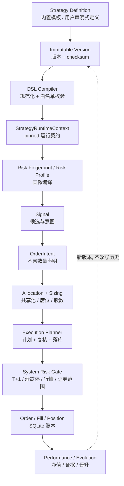

# Architecture notes

本项目是 A 股模拟交易系统（paper-only），核心路径应保持为：

```text
HTTP API / scheduler
        ↓
application services
        ↓
deterministic domain rules
        ↓
paper ledger / read models
```

## 运行时总图

下面这张图是当前仓库的实际调用边界；浏览器和定时器都只能进入 API/应用服务，不能绕过纸盘账本直接写交易数据。

```text
浏览器 Web 看板
      │ HTTP / JSON
      ▼
backend/main.py  FastAPI 应用与生命周期
      ├── /api/paper/*
      │      ▼
      │  backend/api_paper.py  纸盘 HTTP 契约
      │      ▼
      │  backend/paper_trading.py  交易编排、slot、账本写入
      │      ├── strategies / decision_engine / decision_rules
      │      ├── paper_quote_policy / paper_trading_rules
      │      ├── paper_allocation / paper_sizing
      │      ├── risk_center / entry_timing
      │      └── paper_storage / paper_repository / schema_migrations
      │
      ├── /api/adaptive/*
      │      ▼
      │  backend/api_adaptive.py  研究与人工确认 HTTP 契约
      │      ▼
      │  adaptive_engine / adaptive_* / news_learning
      │      └── 只读纸盘或写入独立影子证据；不能提交订单
      │
      └── /api/select、/api/stock_detail、/api/backtest 等
             ▼
         data_fetcher → marketdata_transport/providers/normalizers/cache
             ▼
         universe / factors / strategies / backtest / optimizer

外部调度器（服务器 cron 或容器内可选兜底线程）
      ▼
paper_runner.py --slot <slot>
      ▼
paper_trading.run_slot()
      ▼
SQLite 纸盘账本（订单、成交、持仓、NAV、审计、租约）
      ├── dashboard / risk_dashboard / audit read models
      └── 前端策略模拟、委托记录、风控审计页面
```

### 一次盘中扫描的顺序

```text
调度触发
  → 获取并校验当轮行情（覆盖率、时间戳、双源一致性）
  → 读取当前周期全部 active 账户（由策略注册表界定）
  → 逐策略生成候选车道并做风控退出检查
  → 先执行风险退出，再做入场与盘中事件
  → 共享资金池、席位、行业/单票权重、T+1、整手、涨跌停门禁
  → SQLite 事务写入订单/成交/NAV/审计
  → 前端按缓存代次读取最新只读投影
```

`strategy_registry` 是**下一周期资格**的单一事实来源（`active` ∧ `supports_new_cycle`），注册表里同时存在内置模板（`origin=builtin`，当前五套：`tq_breakout`、`trend_pullback`、`sector_rotation`、`reported_profit_breakout`、`main_force_top10`）与用户自建声明式策略（`origin=user`）。**执行层不再看 Registry**：某一轮实际参与的策略由**周期快照**决定（`paper_cycles.enabled_strategies` ∩ 当期账户，再减去生命周期 `paused`），因此"注册表里仍是 active"不会把策略偷偷拉回一个已经把它摘掉的周期（PR-38）。策略模型与生命周期语义见 [`docs/STRATEGY_PLATFORM.md`](docs/STRATEGY_PLATFORM.md)。

## 领域边界（domain boundaries）

| 领域 | 代码范围 | 拥有什么 | 不拥有什么 |
| --- | --- | --- | --- |
| Strategy Domain | `strategy_registry`、`strategy_service`、`strategy_dsl_*`、`strategy_runtime`、`strategy_risk_*`、`strategy_policies`、`strategy_clusters`、`strategy_champion` | 策略身份、不可变版本、DSL 编译、运行时就绪、生命周期、风险/执行画像 | 订单、成交、资金池、周期账本 |
| Paper / Cycle Domain | `paper_trading`、`paper_storage`、`paper_repository`、`paper_schema_migrations`、`db_migrate` | 周期生命周期、账本、撮合、NAV、审计、租约与幂等 | 策略规则本身、行情抓取 |
| Allocation | `paper_allocation`、`paper_sizing`、`strategy_clusters`、`portfolio_coordinator` | 共享池席位/预算分配、股数计算、同构归簇与组合协调 | 不放宽系统门禁、不决定方向 |
| Execution | `execution_planner`、`execution_dispatch`、`entry_lifecycle`、`entry_timing`、`order_intent`、`manual_orders` | 能不能下、怎么下（计划/复核/落库）、订单意图契约、分批与 TTL | 不决定买什么（候选来自策略/决策层） |
| Risk | `risk_center`、`paper_trading_rules`、`paper_quote_policy`、`asymmetric_risk`、`strategy_risk_enforcement`、`adaptive_shadow_risk` | 系统硬边界、行情/证券门禁、分层风控状态机、非对称风险门 | 不写订单、不抓行情 |
| Market Data | `data_fetcher`、`marketdata_*`、`universe`、`factors` | 多源抓取、重试/熔断、标准化、缓存、覆盖率与新鲜度 | 不伪造实时价、不写账本 |
| Evolution | `evolution_loop`、`evolution_apply`、`evolution_validation`、`self_evolution`、`strategy_champion`、`adaptive_*` | 证据→提案→验证→晋升、影子账本、参数落地通道 | 不直接改正式账本、不绕过风险门 |
| Web / API | `main.py`、`api_paper`、`api_adaptive`、`api_settings`、`api_strategies`、`*_runner.py` | HTTP 契约、调度入口、静态产物下发 | 不打开数据库、不复刻业务规则 |
| Frontend | `frontend/src/**`、`frontend/styles/**`、`frontend/dist/**` | 只读投影的展示与交互、策略工坊、设置中心 | 不在浏览器决定成交、不实现第二套业务规则 |

依赖方向：`Web/API → Application Service → Domain ← Infrastructure Adapter`。Domain 不直接依赖 FastAPI、SQLite 或具体行情/LLM SDK；`adaptive_*` 属于影子路径，只能读行情与账本，不能进入订单执行入口。

## 策略平台数据流



## 风险层次（risk hierarchy）

```text
System Risk（平台全局，策略不可触碰）
    T+1 · 证券范围 · 涨跌停/停牌 · 行情新鲜度 · 全池敞口 · 系统回撤
        ↓
Portfolio / Strategy Risk（策略画像，只能收紧）
    max_exposure · max_positions · max_weight · industry cap · risk_per_trade
        ↓
Position Risk（单笔，执行前复核）
    hard stop · trailing stop · staged take-profit · holding limit · pyramiding cap
```

- **System Risk 不能被策略削弱**：策略画像里不含系统键，合并与门禁都在平台侧；`strategy_risk_enforcement` 只做 `min(生产现值, 模板值)` 方向的收紧。
- 影子/研究层（`adaptive_*`、`evolution_*`）只能产生证据与候选，不能修改上述任何一层。

## 周期所有权与执行资格（PR-48）

运行时的两条口径必须分开理解：

| | Cycle Ledger Ownership | Execution Participation |
| --- | --- | --- |
| 含义 | 策略在当前周期账本中的资金/净值归属 | 还能否产生新信号与新委托 |
| 依据 | 周期创建时冻结的快照与分配 | 周期快照 ∩ 生命周期未 pause |
| `pause` 后 | **保留**（仍计入共享池合计与 NAV） | **剔除**（不再新开仓） |
| `resume` 后 | 不变（不会凭空放大资本） | 恢复 |

因此"暂停一个策略"不是把它从周期里删掉，而是关闭它的执行资格；经济所有权仍留在周期账本里，直到周期结束归档。回归见 `backend/test_cycle_ledger_ownership.py` 与 `backend/test_cycle_participant_resolver.py`。

## 模块职责速查

| 区域 | 文件/模块 | 负责什么 | 不负责什么 |
| --- | --- | --- | --- |
| 应用入口 | `backend/main.py` | 组装 FastAPI、挂载前端、健康检查、数据更新、选股/回测/个股查询、启动时初始化账本 | 不直接绕过交易服务写订单 |
| 纸盘 API | `backend/api_paper.py` | 纸盘概览、风险概览/审计、委托预览/提交/撤单、周期启停、手动运行 slot | 不实现策略规则和 SQL 账本细节 |
| 影子研究 API | `backend/api_adaptive.py` | 自适应、新闻、AI 顾问、再平衡和人工确认接口 | 不直接下单、不自动放宽风控 |
| 交易编排 | `backend/paper_trading.py` | 周期/账户、候选、开仓、盘中、收盘、风控、NAV、审计和 slot 幂等编排 | 不把研究建议当成成交授权 |
| 纸盘只读查询 | `backend/dashboard_queries.py` | dashboard 工作区只读投影（含 activity 门控与防呆分支）；`paper_trading.dashboard` 仅保留转发 facade | 不写订单、不改变交易结论 |
| 手动下单链 | `backend/manual_orders.py` | 手动交易垂直链：风险状态 → 订单计划 → 预览 → 执行/提交（两段确认）→ 撤单 → 待处理单清扫；`paper_trading` 内同名 facade 转发 | 不做周期生命周期管理，不直接暴露 HTTP |
| 调度边界 | `backend/paper_runner.py` | 把一个 slot 运行成一次性进程，并用退出码告诉 cron 是否应重试 | 不常驻、不拥有第二套账本 |
| 策略与决策 | `strategies.py`, `strategy_registry.py`, `strategy_service.py`, `strategy_api_models.py`, `strategy_dsl_schema.py`, `strategy_dsl_evaluator.py`, `strategy_runtime.py`, `strategy_risk_fingerprint.py`, `strategy_risk_profiles.py`, `strategy_risk_enforcement.py`, `strategy_parameter_schema.py`, `strategy_policies.py`, `strategy_clusters.py`, `strategy_champion.py`, `user_strategy_participation.py`, `decision_engine.py`, `decision_context.py`, `decision_rules.py` | 策略身份与不可变版本、DSL 编译、运行时就绪与 RuntimeContext、风险/执行画像、生命周期与治理、候选车道与纯规则评分 | 不读取真实券商账户，不写订单/成交 |
| 订单意图与执行计划 | `order_intent.py`, `execution_planner.py`, `execution_dispatch.py`, `entry_lifecycle.py` | 策略→执行器的意图契约（拒绝数量越权）、计划/复核/落库统一口径、分批与 TTL | 不决定买什么，不计算资金池分配 |
| 行情基础设施 | `data_fetcher.py`, `marketdata_transport.py`, `marketdata_providers.py`, `marketdata_normalizers.py`, `marketdata_cache.py` | 多源请求、重试/熔断、解析标准化、缓存、覆盖率和新鲜度元数据 | 不在缓存陈旧时伪造实时价 |
| 交易门禁 | `paper_trading_rules.py`, `paper_quote_policy.py`, `entry_timing.py` | 交易日、费用、证券权限、T+1、整手、涨跌停、行情新鲜度和入场时机 | 不负责持久化订单 |
| 资金与仓位 | `paper_allocation.py`, `paper_sizing.py`, `paper_portfolio.py`, `paper_performance.py` | 共享池预算、席位、下单股数、持仓 lot 聚合、今日盈亏纯计算 | 不调用外部行情源 |
| 账本与迁移 | `paper_storage.py`, `paper_repository.py`, `paper_schema_migrations.py`, `paper_ledger_reader.py`, `paper_archive_projection.py` | SQLite 连接/WAL/重试、通用行读写、幂等迁移、只读读取端口、历史快照投影 | 不改变交易策略结论 |
| 风控与审计 | `risk_center.py`, `adaptive_risk.py`, `adaptive_shadow_risk.py` | 风险状态机、下行保护、风险仪表盘、影子风控和结构化审计原因 | 影子层不能越权提交订单 |
| 自适应/新闻 | `adaptive_engine.py`, `adaptive_runner.py`, `adaptive_learning_*`, `news_learning.py`, `news_runner.py` | 研究样本、奖励、新闻证据和参数候选；通过 outbox/人工确认与正式路径隔离 | 不直接修改正式成交规则 |
| 研究工具 | `backtest.py`, `optimizer.py`, `selection_tracking.py`, `selection_runner.py` | 回测、参数比较、选股跟踪和盘后候选固化 | 不替代正式纸盘撮合 |
| 前端 | `frontend/src/**`（ESM 模块）, `frontend/styles/**`（CSS 片段）, `frontend/build.mjs` | 单页看板、策略模拟、委托、风控审计、数据有效性和研究页面；esbuild 打包到已提交的 `frontend/dist/`（运行时只伺服产物 `/app.js`、`/app.css`） | 不在浏览器本地决定最终成交 |
| 部署 | `Dockerfile`, `docker-compose.yml`, `docker-compose.server.yml`, `deploy/*` | 镜像、数据卷、健康检查、锁、cron/systemd/nginx 部署边界 | 不把运行时数据库、密钥或历史账本提交进仓库 |

## 调度与并发边界

- 服务器 Docker profile 使用宿主机 cron 调 `deploy/run_paper_slot.sh`，脚本先用锁串行化 paper runner，再在 worker 容器中执行单个 slot。
- 单机 clone 可将 `ASTOCK_ENABLE_FALLBACK_THREADS=1` 交给应用内置线程；生产环境应在 cron 与内置线程之间二选一，避免重复扫描。
- `run_slot()` 使用数据库 runtime lease、heartbeat 和 fencing token；`paper_runner.py` 对 `failed`/`blocked`/`partial` 返回非零退出码，使调度器可以重试。
- API 读取模型带短 TTL、账本 generation 和 single-flight；缓存只优化读取，不改变账本事实。

行情提供方、SQLite 和 LLM 属于基础设施，不应被纯决策规则隐式调用。`adaptive_*` 模块是影子学习与审阅路径，只能读取行情和模拟账本，不能依赖订单执行入口。

## 当前边界

- `backend/main.py` 负责 FastAPI 组装、只读查询和生命周期。
- `backend/api_paper.py`、`backend/api_adaptive.py` 负责 HTTP 契约；`confirmed=true` 是防误触确认，不是身份认证。
- `backend/paper_trading.py` 仍是主要交易编排与账本实现，后续按小步拆出 Execution、Portfolio、Risk 和 Scheduler；dashboard 工作区只读投影已迁至 `backend/dashboard_queries.py`，手动下单垂直链已迁至 `backend/manual_orders.py`（两者在 `paper_trading` 内保留兼容 facade，公开导入路径不变）。
- `backend/decision_context.py` 集中定义决策证据快照与兼容加载适配器；`decision_engine.py` 的公开入口暂时保持不变。
- `backend/decision_rules.py` 承载不依赖数据源的评分、买入时机、止盈和止损规则；规则模块不联网、不读缓存、不写账本。
- `backend/marketdata_transport.py` 负责共享 HTTP 连接、重试和源熔断状态；`data_fetcher.py` 继续兼容性导出旧名称，解析与缓存逻辑暂不改变。
- `backend/marketdata_cache.py` 负责可注入的 TTL 内存缓存、全市场快照 single-flight 文件锁和数据源健康文件读写；`data_fetcher.py` 保留旧 `_cached`/锁/健康状态入口。
- `backend/marketdata_providers.py` 负责东财 `clist`、概念成员分页/板块引用解析以及腾讯/新浪实时行情与 K 线响应解析；HTTP 会话、重试和可变主机健康状态由 `data_fetcher.py` 注入，确保完整性元数据和旧入口兼容。
- `backend/marketdata_normalizers.py` 承载行情行、证券代码、时间戳和 K 线 DataFrame 的无副作用标准化；`data_fetcher.py` 保留旧函数包装以兼容现有 provider 调用。
- `backend/paper_trading_rules.py` 承载交易日、费用、证券类型与证券权限等无账本副作用规则；`paper_trading.py` 继续兼容导出旧的下划线函数名。
- `backend/paper_quote_policy.py` 承载行情新鲜度、活跃度和成交核验门禁；`paper_trading.py` 保留 `_quote_is_fresh`、`_is_trading_active`、`_execution_quote_status` 兼容包装。
- `backend/paper_allocation.py` 承载共享池席位分配和策略预算的纯计算；`paper_trading.py` 只负责读取风险/持仓/预约数据并注入常量。
- `backend/paper_sizing.py` 承载按风险、权重、资金、行业和共享池约束计算下单股数；`paper_trading.py` 保留 `_price_aware_qty` 兼容包装。
- `backend/paper_storage.py` 负责 SQLite 连接生命周期、只读连接、WAL 检查点和锁重试；`paper_trading.py` 只保留兼容包装，不把业务查询迁入存储层。
- `backend/paper_portfolio.py` 负责将已读取的持仓 lot 聚合为兼容读模型；数据库查询与交易结算仍由 `paper_trading.py` 编排。
- `backend/paper_archive_projection.py` 负责把不可变历史周期快照投影为只读订单行；损坏快照隔离在投影边界内，不影响当前账本。
- `backend/paper_ledger_reader.py` 是 adaptive 读取 paper ledger 的只读端口；使用 SQLite `mode=ro` 与 `query_only`，补偿恢复等明确写路径不经过该端口。
- `backend/strategy_registry.py` 集中策略 ID、展示名称和 active/legacy 状态；adaptive、adaptive risk、research、selection 和 strategy-center 展示从这里读取，暂不改变交易调度或账户范围。
- `backend/paper_repository.py` 提供通用 ledger 行读取、审计写入、dashboard 账户批量投影和活动订单轻量投影；`paper_trading.py` 保留旧 `_rows`/`_audit`/`_account_metric_inputs` 包装，后续再迁移对象级 SQL。
- `backend/paper_performance.py` 负责今日报价新鲜度、持仓今日盈亏和卖出贡献的纯计算；`paper_trading.py` 保留 `_today_*` 兼容包装。
- `backend/paper_schema_migrations.py` 集中 paper ledger 的增量字段、运行时租约字段和点火影子表迁移；`db_migrate.py` 通过版本号调用这些幂等操作，应用前使用 SQLite backup API 创建一致性副本，运行引擎不再内联 `ALTER TABLE`。
- `backend/adaptive_risk.py` 使用 outbox（跨数据库操作意图表）保证纸盘提交后，adaptive 账本可重放收敛。
- `backend/test_adaptive_dependency_boundary.py` 以 AST（源码语法树）守护 adaptive 不直接导入纸盘订单 API，也不出现订单提交/取消调用。
- `backend/adaptive_genetics.py` 承载 alpha 实验室的基因归一化、交叉、变异和适应度纯计算；`adaptive_engine.py` 保留数据集/训练编排和兼容包装。
- `backend/adaptive_shadow_risk.py` 承载 adaptive 组合影子风控的历史归一化、波动率、集中度和压力测试纯计算；不读账本、不联网、不提交订单。
- `.github/workflows/ci.yml` 覆盖后端测试、编译/前端语法与镜像一致性，并新增独立 Docker 构建和健康端点冒烟检查。
- 前端运行时的 canonical source 是 `frontend/src/`（入口 `src/app.js`：build id + `bridge.js` 全局兼容桥 + `boot.js` 顶层语句），样式是 `frontend/styles/`（`styles/index.css` 按原顺序 `@import`）；模块地图与依赖概览见 `frontend/src/README.md`。

## 不变量

1. 不连接真实券商、不产生真实订单。
2. 证据缺失、行情过期或跨源核验失败时，决策 fail-closed。
3. adaptive 自动流程只能 shadow-only；风控放宽必须人工确认。
4. 迁移和跨账本恢复必须可重复、可审计、可回滚。
5. 任何拆分必须保持公开 API、审计事件和既有交易规则兼容。
6. 学习/研究数据集就绪不授予任何执行权限：不能下单、不能放宽风控、不能自我晋升。

## 学习/研究数据契约（PR-8）

研究层不是训练管线，而是给现有 learning / shadow / research 系统建立一层统一、可复现的证据契约。实现落在 `backend/learning_dataset.py`（小型纯研究模块），并由 `adaptive_engine` 在 learning cycle 中作为一个只读、确定性的阶段调用，`neural_shadow` 的 readiness 消费其审计结论。

```text
raw evidence → PIT eligibility → canonical samples → mature labels
             → chronological split + purge → manifest + SHA-256 fingerprint
             → offline / shadow research consumers
```

契约条文（全部由 `backend/test_learning_dataset.py` 断言）：

- **Learning / research data is read-only evidence.** 数据集层只读已持久化的证据：构建期间不访问行情快照、K 线、HTTP 或任何 LLM 提供方，也不写交易状态、持仓、风控参数或订单。
- **PIT availability is distinct from report/event period.** `feature_asof`（特征描述的时点）与 `feature_available_at`（能证明该特征对研究者可见的时间）绝不混为一个概念；可用性无法证明时记 `legacy_unproven` / `unproven`，严格数据集一律排除，且不 clamp、不回填、不用报告期冒充公告时间。判断逻辑复用 `backend/financial_point_in_time.py`，不另写一套 PIT 引擎。
- **PIT instants share one canonical clock (UTC).** 所有可用性 / cutoff 比较都在**同一个 canonical UTC instant** 上进行，绝不把 UTC 时间去掉 tzinfo 后与交易所本地 naive cutoff 直接比字符串。带 offset 的 ISO8601（`+08:00` / `+00:00` / `Z`）先归一到同一 instant；不带 offset 的历史 `availability` 按**交易所本地时区 Asia/Shanghai（UTC+08:00）**解释，**绝不读运行机器的 local timezone**（否则数据集会依赖在哪台机器上重建）。date-only cutoff 明确表示"中国市场自然日结束"：`2026-09-12` → `2026-09-12T23:59:59+08:00` = UTC `2026-09-12T15:59:59+00:00`，**不是** UTC 日终。provenance 字段 `availability_clock = canonical_utc` 表明存储值已是 canonical UTC（该字段进入 fingerprint，属契约变更，仍满足"同数据 + 同 cutoff ⇒ 同 SHA-256"）。Canonical dataset reserved provenance fields are authoritative and cannot be overridden by raw evidence provenance.
- **Cutoff precision is part of the dataset identity and is never silently widened.** `cutoff` 的精度由调用方决定，`_normalize_cutoff`（公开别名 `normalize_cutoff`）是唯一归一化入口，`_DAY_PRECISION` 用来区分"整串就是一天"与"一天 + 盘中时刻"：**date-only**（`2026-09-12` 或 `2026/09/12`）保持日期精度，语义仍是交易所本地**日末**（`2026-09-12T23:59:59+08:00` = UTC `2026-09-12T15:59:59+00:00`），PR-8 行为不变——日精度调用方的身份不变，日期**不会**被 canonical 化成 timestamp 字符串；**完整时间戳**（`2026-09-12T10:00:00+08:00`）归一到精确 canonical UTC instant（`2026-09-12T02:00:00+00:00`），**绝不回退成它所在自然日的日末**，否则冻结线被悄悄放宽，把 cutoff 之后才产生的证据放进数据集。`Z` / `+08:00` / 不带 offset（按交易所本地 UTC+08:00 解释，不读宿主机时区）/ 已是 canonical 的四种写法折叠为同一字符串，因而 `DatasetBuild.cutoff`、manifest `cutoff`、dataset fingerprint、准入行集合与排除计数完全一致；不同的 instant（`2026-09-12T09:59:59+08:00` vs `2026-09-12T10:00:00+08:00`）必须产生**不同**指纹。时间戳 cutoff 是材料字段，进入 fingerprint；date-only 保持日期精度身份。显式传入但不可解析的 cutoff **fail closed**：`build_dataset` 抛 `ValueError`，`contract_status` 记 `dataset_cutoff_unprovable` 并直接返回，**不**回退到 `_latest_provable_cutoff`（只有完全不传 cutoff 时才使用最新可证日期）；**细于 canonical 时钟秒粒度**的 cutoff 同样被拒绝，绝不四舍五入 / 截断到秒——否则两个不同瞬间会塌成同一 dataset identity 与同一指纹。该判定是**语义的**：先用 `datetime.fromisoformat` 解析（它合法接受的写法远多于任何手写正则，例如 basic ISO `20260102T100000.100000+0800`），再要求「解析结果自身的 `microsecond`」与「经 `_utc_instant` 折算出的**绝对 UTC instant** 的 `microsecond`」**都**为零。亚秒精度可以藏在 **wall clock**（`10:00:00.5+08:00`），也可以藏在 **UTC offset**（`10:00:00+08:00:00.5`：此写法令 `parsed.microsecond == 0`，只有绝对瞬间才暴露它偏离整秒，两个这样的瞬间原本会一起被截断到同一秒 ⇒ 同一指纹）；两处都查是为了 **fail closed**——wall clock 的小数还可能被带小数的 offset **抵消**成整秒（`10:00:00.5-08:00:00.5`），只查绝对瞬间会把它放行。但**纯语义校验仍有一个盲区**：`datetime.fromisoformat` 会把**零小时 / 零分钟** offset 的小数部分**直接丢弃**（`10:00:00+00:00:00.100000` 被解析成普通 `timezone.utc`），于是 wall clock 与绝对瞬间**都**读成整秒 —— 语义层再也看不见调用方写下的那个小数，两个编码了**不同**小数 offset 的写法会被当成同一个整秒 cutoff 接受（同一 dataset identity）。因此再加一道**窄的拼写门禁** `_ZERO_OFFSET_FRACTION = re.compile(r"[+-](?:00|00:?00|00:?00:?00)[.,]\d*[1-9]\d*$")`，在**解析之前**专门拒绝「**零** offset + 小数秒」这一种语法 —— 该门禁覆盖零 offset 的**全部三种 ISO 8601 语法**：小时（`±00`）、小时+分钟（`±0000` / `±00:00`）、小时+分钟+秒（`±000000` / `±00:00:00`），`.` 或 `,` 皆可，`$` 锚定在末尾的 offset 上；早期只写了带秒的那一种（`00:?00:?00`），于是 `+00.5` / `+0000.5` / `+00:00.5` 这类**缩写**零 offset 被解析器同样丢数后仍会塌成同一整秒身份，故放宽到整个零 offset 语法。实测只有**零** offset 会被解析器丢数（`+00:00:01.5` / `+00:30:00.5` / `+08:00:00.5` 等非零 offset 都**保留**小数、仍交给语义校验）；它键在**该语法结构**上，而不是像早期 `_SUBSECOND = re.compile(r":\d{2}[.,]\d+")` 那样键在**冒号**上 —— 后者只能匹配 extended 形式（basic ISO 亚秒会漏过去），故已删除。整秒的零 offset（`Z` / `+00:00` / `+00:00:00`）不带小数，不受影响；**全零小数**（`+00:00:00.000000`）同样表示整秒，照常接受（门禁要求小数中至少有**一个非零数字**）。语义校验（覆盖所有**被保留**的小数）+ 窄拼写门禁（覆盖唯一**被丢弃**的小数，且覆盖零 offset 的全部三种书写语法）**合起来**，才使**没有任何 ISO 8601 拼写**能绕过它。`_classify` 对 `feature_asof` 的边界比较改走 canonical instant 时钟（`_instant(feature_asof) > _cutoff_instant(cutoff)`）；`feature_asof` 本身仍是**日精度**，因为它是逻辑 sample 身份（`source + feature_asof + code + horizon`）的一部分，绝不携带盘中细节。
- **Forward labels are unavailable until their observed end date.** 未成熟的标签不生成 0 收益、中性标签或部分前向收益来代替。一个前向标签只有在同时满足下列全部条件时才可进入数据集（`backend/learning_dataset.py::_classify` 是唯一裁决点）：
  1. `label_end_date` 已发生在数据集 cutoff 之前（`label_end_date <= cutoff`）；
  2. 其可用时间戳不晚于 cutoff（`label_available_at <= cutoff`）；
  3. 其可用性被独立证明：`pit_status = verified`（时间戳存在 ≠ provenance 已证明；`legacy_unproven` / `unproven` / `unknown` / `future` / 缺失 / 非法值一律排除）；
  4. 同一逻辑样本身份（`source` + `feature_asof` + `code` + `horizon`）存在多个不同 label endpoint 时全部 fail closed，不按 first / last / MIN / MAX / rowid 任选其一。
  由 `adaptive_engine._mature_alpha_returns` 生成的标签只从**已验证**（`feature_available_at` 非空且 `pit_status='verified'`）的终点样本继承 provenance；未证明的终点只能产出 `legacy_unproven` 标签，绝不升级为 `verified`。cutoff 之后才成熟或才可用的标签一律判为 `future_label` 排除，不 clamp、不回填。
- **Legacy horizon values represent observed profile/close steps unless an exchange-session calendar has independently proven otherwise.** `adaptive_alpha_returns.horizon` 显式记为 `observed_profile_steps`；`paper_research` / `selection_tracking` 的 `holding_days` 在 read model 中显式记为 `recorded_close_observation_count`。历史数值不重写、不删除。
- **Dataset manifests are content-addressed and reproducible.** 同源数据 + 同 cutoff + 同契约 + 同切分 ⇒ 同一个 SHA-256；`created_at` 不属于内容指纹，重复构建走 `INSERT OR IGNORE`，永不改写前一次的记录。有界读取用 `LIMIT max_evidence_rows + 1` 判定截断（恰好等于上限不算截断），截断结论作为显式字段传给 `contract_status()`；截断时追加 `dataset_evidence_read_truncated` blocker。
- **Chronological splits purge overlapping forward labels.** 按 `label_start_date` 时间切分，且 train 中任何 `label_end_date` 触及 validation 起点的样本一律 purge，validation → test 同理。
- **A dataset becoming research-ready grants zero execution authority.** 行数达标不再是科研就绪的充分条件：`neural_shadow.readiness` 还必须通过数据集契约门禁，未通过时 `admitted = false`，但 `mode` 始终 `shadow_only`、`trading_impact` 始终 `none`。

## 学习评估契约（PR-9）

数据集就绪只说明"**能评估**"，不说明"**评估通过了**"。PR-9 在 PR-8 之上再加一层**模型无关、可复现的样本外评估门禁**：实现落在 `backend/learning_evaluation.py`（小型纯研究模块，不做训练，不引入任何 ML 依赖：无 numpy / pandas / scikit-learn / torch），由 `neural_shadow` 的 readiness 消费其结论。当前契约为 **v2**（`learning-evaluation-v2`）：v1 只要求"结论有据可依"，v2 进一步要求**证据完整、来源可证、边界可证**。

```text
availability-proven prediction evidence → dataset-fingerprint + model-artifact binding
    → provable train/test separation → 100% canonical held-out coverage（不许挑样本）
    → per-date cross-sectional Spearman rank IC → confidence lower bound over *date* units
    → chronological tail robustness（tail 取自 canonical held-out 日历） → append-only manifest + SHA-256
    → shadow admission gate（永不赋予执行权）
```

v2 的证据表：`learning_prediction_evidence`（预测证据，含 `model_version` / `model_artifact_fingerprint`）、`learning_model_provenance`（每个模型一行的训练溯源）、`learning_evaluation_manifests`（评估结论）。三者都是主键 + `INSERT OR IGNORE` 的只追加表；`ensure_schema` 只做 `CREATE IF NOT EXISTS` + `ALTER TABLE ADD COLUMN`，绝不删列改列。

契约条文（全部由 `backend/test_learning_evaluation.py` 断言）：

- **An evaluation is bound to exactly one dataset fingerprint.** 预测证据只对构建它的那个数据集成立：fingerprint 缺失或与数据集不一致的行一律记 `unbound_prediction` 并拒绝，绝不因为"分数看起来合理"而接受。数据集绑定进入评估指纹。
- **Prediction evidence is immutable and content-addressed.** `prediction_id = sha256(canonical material evidence)`：绑定 `evaluation contract/schema version`、`dataset_fingerprint`、`model_id`、`model_version`、`model_artifact_fingerprint`、`sample_key`、`code`、`partition`、`label_start_date`、`score`、`prediction_asof`、`source` 全量字段（不再只是 `fingerprint|model|sample|score`）。主键 + `INSERT OR IGNORE`，重放同一预测是幂等 no-op，永不改写既有事实。**逻辑身份 = `(dataset_fingerprint, model_artifact_fingerprint, sample_key)`**；同一逻辑身份出现两个不同的 `prediction_id`（即任一材料字段不同）时，两行**全部** fail closed（不按 first / last / MIN / MAX / rowid 任选其一），保证结论与插入顺序无关。预测自带的 `model_artifact_fingerprint` 必须与已声明溯源中的产物一致，否则记 `unattributed_model_artifact` 并排除——拿着一份溯源去给另一个产物的分数背书是不允许的。
- **Only the chronological held-out partition may be scored — and only `test`.** `SUPPORTED_HOLDOUT_PARTITIONS = ("test",)` 是**闭集**：`train` / `validation` / 任何未知名字（含拼写错误）一律直接记 `evaluation_holdout_partition_unsupported` 并拒绝，不许"train 分区 IC 很漂亮"就变成 contract_ok（那是样本内拟合，不是样本外能力）。预测自称的分区与数据集分区不一致记 `partition_mismatch`；不在 held-out 分区的行记 `not_held_out`。
- **Prediction availability is fail-closed and proven on the exchange clock.** `prediction_asof` 缺失 / 不可解析 ⇒ 该行不可参与（`unproven_prediction_availability`），进而造成覆盖缺口并使整次评估失败——"没写时间"不等于"时间没问题"。可解析时必须在**同一 PIT 时钟**上（naive 输入按交易所本地 UTC+8 解释，与 PR-8 完全一致，不随宿主机时区漂移）证明 `prediction_asof < sample.label_available_at`：分数出现在它所预测的标签可知之后，就是看了答案，记 `future_prediction`；标签自身可用性不可证明时同样 fail closed。
- **A dataset cutoff keeps PR-8's freeze semantics — day-end, not day-start.** 可用时刻与 cutoff 走**两台不同的时钟**，绝不混用：普通 availability 时刻按上述规则解释（date-only = 交易所本地**日首** `00:00`），而 `prediction_asof` 晚于数据集 cutoff 同样记 `future_prediction` 时，date-only cutoff 必须解释为交易所本地**日末** `23:59:59+08:00`（PR-8 `learning_dataset._cutoff_instant` 的定义）。若把 cutoff 也按普通 availability 解读，冻结线会悄悄提前到 cutoff 当日 `00:00`，把当天盘中产生的全部预测误判为 lookahead —— 那是在收紧 PR-8 从未声明过的冻结语义。评估层镜像同一规则，并由 `NormalizationAgreementTests` 断言两者永远一致。在此基础上，**精度本身也不得被放宽**：`contract_status` 解析出的 cutoff 会被评估层按**原精度**重新读出（走数据集层的 `normalize_cutoff`，不再截断为日期），因此 intraday cutoff 在数据层与评估层是同一个冻结 instant——数据集指纹、`future_prediction` 判定与评估结论三者一致；`build_evaluation` 也把 `dataset.cutoff` 读成精确 instant，绝不重新解释成"那一天"。把 cutoff 重新截断成日期会使评估悄悄评判一个**更宽**的数据集，那是同一类泄漏。更进一步，`build_evaluation` 是**公开 API**，不能假设传入的数据集来自正常构造器：当 `dataset.cutoff` **缺失**、不可解析或细于秒粒度时，数据集层已判定该冻结边界不可证明，评估层必须 **fail closed**（记 `evaluation_dataset_cutoff_unprovable` + `evaluation_dataset_contract_failed`），**绝不**把归一化失败退化成 `cutoff=None` —— 那等于"没有冻结边界"，会让冻结之后打分的预测被当成可采信证据，即"不可证明的边界"伪装成"没有边界"。
- **Coverage is 100% — no cherry-picking.** 规范期望集合 `expected_test_keys` 取自数据集自身的 held-out 分区，实际集合 `observed_test_keys` 取自被采纳的预测；两者必须**完全相等**，`coverage_ratio == 1.0`。漏一个样本（更不用说整个日期、或"分数最低的那只"）⇒ `evaluation_missing_predictions`；覆盖率随结论一并记录（`expected_prediction_rows` / `observed_prediction_rows` / `missing_prediction_rows` / `coverage_ratio`）。出现在规范集合之外的行 ⇒ `evaluation_unexpected_predictions`。IC 再完美也不能抵消覆盖缺口。
- **Train/test separation must be provable.** 评估必须携带模型溯源：`model_version`、`model_artifact_fingerprint`、`training_dataset_fingerprint`、`trained_through`、`selection_partition`、`hyperparameters_fingerprint`、`random_seed`。要求 `trained_through < test 分区起点`（违反 ⇒ `evaluation_training_overlaps_test`）；`selection_partition` 只允许 `validation`（选在 held-out 上 ⇒ `evaluation_test_used_for_selection`，其它 ⇒ `evaluation_selection_partition_unproven`）；`trained_through` 缺失/不可解析或产物三要素不全 ⇒ `evaluation_training_boundary_unproven`。**溯源由生产方声明，绝不由评估方从被判数据集里反推**——否则就是自己给自己判卷。同一模型出现两份互不相同的溯源 ⇒ `evaluation_model_ambiguous`；溯源读取触顶截断 ⇒ `evaluation_model_provenance_truncated`。以上字段全部进入评估指纹，因此**换一个产物就不可能继承旧结论**。
- **The recent chronological tail must still carry the edge — and is cut from the canonical calendar.** 尾部窗口先由**数据集自身**的 canonical held-out 日期集合（`sorted({sample.label_start_date})`）切出，**再**检查这段里的每个日期是否都产生了有效 IC；`tail_count = max(MIN_HOLDOUT_DATES, ceil(HOLDOUT_FRACTION × canonical 日数))`。绝不从"产生过 IC 的日期"反推尾部：否则模型可以在真正最近的日期上把预测打成常数（或让标签退化为常数），让尾部窗口自动向过去滑到自己表现更好的日子——那是门禁在改写自己的观测窗口。任何 canonical held-out 日期有预测却形成不了 IC（分数全常数 / 标签全常数 / 截面不足）⇒ 记 `evaluation_undefined_ic_dates`（整窗）与 `evaluation_holdout_incomplete`（尾部之内），**fail closed**，而不是"丢掉这天继续算"。记录 `holdout_start_date` / `holdout_end_date` / `holdout_date_count` / `holdout_valid_date_count` / `holdout_undefined_date_count` / `holdout_undefined_dates`，以及全窗审计 `canonical_test_date_count` / `valid_ic_date_count` / `undefined_ic_date_count` / `undefined_ic_dates`。尾部日期不足 ⇒ `evaluation_holdout_insufficient`；尾部均值非正 ⇒ `evaluation_holdout_mean_not_positive`；尾部只留住了样本均值不到 `HOLDOUT_RETENTION_FLOOR`，或正 IC 日期占比低于 `MIN_HOLDOUT_POSITIVE_RATIO` ⇒ `evaluation_holdout_deterioration`。"早期很强、近期衰减"不能被全样本均值洗白，也**不能靠跳过最近日期来规避**。
- **Rank IC is cross-sectional, per date.** 每个交易日独立计算截面 Spearman rank IC（并列值用**平均秩**，与输入顺序无关）；每日子样本数低于下限的日期丢弃；秩方差为零的退化截面判为 **undefined 并丢弃，绝不记 0**。缺失 / 非有限 / 不可解析的分数一律 `invalid_prediction_score` 审计并排除，不做 0 插补。
- **Rows on the same date are NOT independent.** 置信区间以**日期**为单位：`mean_ic − z · (std / √n_dates)`，其中 n 是有效**日数**而非行数。同一个交易日里的 500 只股票是"该策略截面能力"的**一个**观测，不是 500 个；因此给同日增加标的不会缩小标准误，`min_dates`（默认 5）是纯日期门槛。**正值点估计不构成证据**：下界必须为正（默认 `> 0`）；有效日期不足 2 天时区间不存在，门禁保持关闭，而不是用一个数编出区间。
- **Evaluation manifests are content-addressed and reproducible.** 同一数据集 + 同一预测证据 + 同一评分参数 + 同一模型溯源 ⇒ 同一个 SHA-256；`created_at` 不属于内容指纹，重复评估走 `INSERT OR IGNORE`。指纹显式包含 `prediction_digest`（所判证据的内容摘要）、`model_provenance`（产物与训练边界）、`coverage` 与 `holdout`（尾部稳健性 + **canonical test / tail 审计身份**）五组材料：rank IC 对分数做单调变换不变，若不含证据摘要，两个不同的预测集会共用一个审计记录；若不含溯源，两个不同的产物会共用一个结论；若不含尾部审计身份，"某个最近日期由 valid 变 undefined"这种科学事实变化就无法体现在指纹里。manifest 同时落库这些字段（含 `provenance_fingerprint`、`coverage_ratio`、`holdout_date_count`、`canonical_test_date_count`、`undefined_ic_dates` 等），其中 `undefined_ic_dates` / `holdout_undefined_dates` 以**具体日期数组**落库，便于人工审计直接点名。
- **Scientific readiness grants zero execution authority.** `neural_shadow` 落到 `approved_bounded_shadow` 必须**同时**满足 `dataset_contract_ok AND evaluation_contract_ok AND human_approved`；数据集就绪但样本外证据未达标时停在新增状态 `approval_waiting_evaluation`（缺数据则仍是 `approval_waiting_data`）。任何状态下 `mode` 始终 `shadow_only`、`trading_impact` 与 `execution_authority` 始终 `none`，硬门禁不变。

## 目标依赖方向

```text
API → Service → Domain
                 ↑
        Infrastructure adapters
```

Domain 不直接依赖 FastAPI、SQLite、Eastmoney、Tencent、Sina 或具体 LLM SDK。这个目标会通过渐进拆分实现，不做一次性重写。

## 架构演进记录（历史批次：模块化与边界固化）

> 下面这段是**当时**的变更记录，保留原样以追溯判断依据；当前领域边界与策略平台视图见本文上半部分与 [`docs/STRATEGY_PLATFORM.md`](docs/STRATEGY_PLATFORM.md)。

本次先同步服务器工作区并修复三个可验证边界：前端缓存版本/运行时镜像一致性、活动页风控审计请求上限，以及风险 outbox 在纸盘已提交后的 adaptive 侧重放收敛。随后新增 `decision_context.py` 集中证据读取、`decision_rules.py` 承载纯规则、`marketdata_transport.py` 承载 HTTP 传输、`marketdata_cache.py` 承载缓存与快照锁、`marketdata_providers.py` 承载东财分页与概念成员适配及腾讯/新浪实时与 K 线响应解析、`marketdata_normalizers.py` 承载行情标准化、`paper_trading_rules.py` 承载交易日/费用/证券权限规则、`paper_quote_policy.py` 承载行情新鲜度/活跃度/成交核验门禁、`paper_allocation.py` 承载共享池席位与策略预算纯计算、`paper_sizing.py` 承载下单股数纯计算、`paper_storage.py` 隔离 SQLite 连接生命周期、`paper_portfolio.py` 承载持仓 lot 聚合、`paper_archive_projection.py` 承载历史归档订单只读投影、`paper_performance.py` 承载今日盈亏纯计算、`adaptive_genetics.py` 承载 adaptive alpha 纯遗传计算、`adaptive_shadow_risk.py` 承载影子组合风控纯计算、`paper_ledger_reader.py` 为 adaptive 提供只读 paper ledger 端口、`strategy_registry.py` 集中策略身份口径，并以 `paper_repository.py` 建立 ledger 通用仓储薄接口和 dashboard 账户批量投影；本阶段再以 `paper_schema_migrations.py` 集中增量 schema 变更，`db_migrate.py` 提供事务化、可回滚的 v1-v4 迁移入口。兼容导出和回归测试守住现有行为。更大范围的对象级仓储、provider 分层和模块拆分仍按 `docs/PRD-architecture-hardening.md` 分阶段推进。
