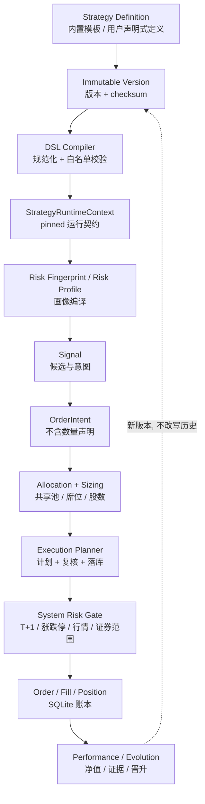

# Architecture notes

本项目是 A 股模拟交易系统（paper-only），核心路径应保持为：

```text
HTTP API / scheduler
        ↓
application services
        ↓
deterministic domain rules
        ↓
paper ledger / read models
```

## 运行时总图

下面这张图是当前仓库的实际调用边界；浏览器和定时器都只能进入 API/应用服务，不能绕过纸盘账本直接写交易数据。

```text
浏览器 Web 看板
      │ HTTP / JSON
      ▼
backend/main.py  FastAPI 应用与生命周期
      ├── /api/paper/*
      │      ▼
      │  backend/api_paper.py  纸盘 HTTP 契约
      │      ▼
      │  backend/paper_trading.py  交易编排、slot、账本写入
      │      ├── strategies / decision_engine / decision_rules
      │      ├── paper_quote_policy / paper_trading_rules
      │      ├── paper_allocation / paper_sizing
      │      ├── risk_center / entry_timing
      │      └── paper_storage / paper_repository / schema_migrations
      │
      ├── /api/adaptive/*
      │      ▼
      │  backend/api_adaptive.py  研究与人工确认 HTTP 契约
      │      ▼
      │  adaptive_engine / adaptive_* / news_learning
      │      └── 只读纸盘或写入独立影子证据；不能提交订单
      │
      └── /api/select、/api/stock_detail、/api/backtest 等
             ▼
         data_fetcher → marketdata_transport/providers/normalizers/cache
             ▼
         universe / factors / strategies / backtest / optimizer

外部调度器（服务器 cron 或容器内可选兜底线程）
      ▼
paper_runner.py --slot <slot>
      ▼
paper_trading.run_slot()
      ▼
SQLite 纸盘账本（订单、成交、持仓、NAV、审计、租约）
      ├── dashboard / risk_dashboard / audit read models
      └── 前端策略模拟、委托记录、风控审计页面
```

### 一次盘中扫描的顺序

```text
调度触发
  → 获取并校验当轮行情（覆盖率、时间戳、双源一致性）
  → 读取当前周期全部 active 账户（由策略注册表界定）
  → 逐策略生成候选车道并做风控退出检查
  → 先执行风险退出，再做入场与盘中事件
  → 共享资金池、席位、行业/单票权重、T+1、整手、涨跌停门禁
  → SQLite 事务写入订单/成交/NAV/审计
  → 前端按缓存代次读取最新只读投影
```

`strategy_registry` 是**下一周期资格**的单一事实来源（`active` ∧ `supports_new_cycle`），注册表里同时存在内置模板（`origin=builtin`，当前五套：`tq_breakout`、`trend_pullback`、`sector_rotation`、`reported_profit_breakout`、`main_force_top10`）与用户自建声明式策略（`origin=user`）。**执行层不再看 Registry**：某一轮实际参与的策略由**周期快照**决定（`paper_cycles.enabled_strategies` ∩ 当期账户，再减去生命周期 `paused`），因此"注册表里仍是 active"不会把策略偷偷拉回一个已经把它摘掉的周期（PR-38）。策略模型与生命周期语义见 [`docs/STRATEGY_PLATFORM.md`](docs/STRATEGY_PLATFORM.md)。

## 领域边界（domain boundaries）

### 执行真实性证据边界

`backend/execution_evidence.py`、`backend/execution_lifecycle.py`、`backend/execution_outcome.py`
共同构成"选出来 ≠ 能成交 ≠ 成交价格可信"的执行真实性层。它建立在 PR149 的
`selection_tradability`（点时可成交性契约）**之上**，不修改后者的任何判定口径：

```text
selection_score        策略认为股票有多好              （决策层）
tradability            那个历史时点能不能执行           （selection_tradability)
execution_evidence     实际有没有成交、成交价是否可信    （execution_evidence）
```

三个模块的职责是分开的：

| 模块 | 负责 | 不负责 |
| --- | --- | --- |
| `execution_evidence` | 12 个执行证据字段的三态契约（`known` / `unknown` / `not_applicable`）、`fill_verdict` 六分类、从 `paper_orders` + `paper_fills` 只读投影证据 | 不撮合、不写账本、不决定买什么、不重建仓库没有的历史数据 |
| `execution_lifecycle` | 九个成交状态与合法边表、非法跳转拒绝、成交数量/价格/时段不变式、stored status → 权威状态的唯一映射 | 不读数据库、不碰资金、不导入 `execution_evidence` |
| `execution_outcome` | `selection_executable` 与 `execution_verified` 两个正交概念、`market_return` / `selection_return` / `execution_return` 三层收益、执行真实性审计报告 | 不改写 selection outcome、不把市场标签当执行收益 |

关键不变量：

- **`None` 不等于零**：`EvidenceField.known` 必须携带非 `None` 值，`unknown` / `not_applicable`
  必须不携带值，构造期即拒绝。"未知"、"已知零"、"没有成交"、"被拒绝"、
  "从未提交"是五种互不相同的表示。
- **没有 submit/accept 证据不能成交**：`CREATED -> FILLED`、`SUBMITTED -> FILLED`
  一律非法。`REJECTED -> FILLED` 只能在**新的**委托生命周期（新 order_id +
  `retry_of_order_id`）里发生，与仓库"终态 order row 永不原地改写"的口径一致。
- **部分成交不得提升为全部成交**：`PARTIAL_FILLED` 要求 `0 < filled_qty < requested_qty`，
  `FILLED` 要求两者相等**且**成交价为正、成交时段非空。
- **`ACCEPTED_STORED_STATUSES` 是空集**：仓库没有券商/交易所客户端，也就没有独立的
  场所受理回报，任何 stored status 都不允许自称受理过。`shadow_q3` 这类影子记录映射到
  `CREATED`，因此永远不能走到 `FILLED`。
- **没有成交就没有执行收益**：`execution_return` 在无成交证据时为 `not_applicable`，
  `market_label_value`（反事实标签）**不得**顶替它；`execution_return` 一旦为
  `known`，来源必须是 `realized_fill_round_trip` 且 `execution_verified` 为真。
- **往返必须被证明**：两腿必须是**同一标的上互补方向**的往返。两笔同向成交、或
  `buy X` 配 `sell Y` 都不构成往返，一律 `execution_verified=False`；方向或标的
  未知时同样 fail closed（"不知道"不是"是"）。等量**部分**成交也不构成干净往返：
  数量恰好相等不等于两腿都完整成交，此时 `execution_return` 为 `unknown`，
  该现场必须能被表达与审计，而不是触发 `MarketLabelSubstitution`。
- **成交流水必须归属于该委托**：`paper_fills` 没有外键，也没有"账户/方向/标的与
  委托一致"的约束，因此 `load_execution_evidence` 必须一并读取身份列并比对。
  身份不符的流水**不是**证据：不聚合、不据以验证成交，只作为
  `fill_identity_mismatch` 上报，宁可判 `unknown` 也不能用别人的流水把委托验证成成交。
- **`selection_executable=True` + `execution_verified=False` 必须允许存在**：
  "选出来但买不进/没成交"正是本层要暴露的现场，不得被静默合并成一种结论。

三个模块都是纯 stdlib、只读、不导入 `paper_trading`；写入与撮合仍由
`execution_planner` / `manual_orders` / `paper_trading` 负责。

### 资金预占 ledger 边界

`backend/paper_capital_reservations.py` 是运行时 BUY 资金预占的唯一实现边界：它负责查询所有 `status='reserved'` 的 BUY 预占、创建/重算预占，以及把预占标记为 `consumed` 或 `released`。预占 ledger 与实际 shared cash、pending slot occupancy、symbol exposure、order lifecycle 和 cycle ownership 各自独立；预占表示尚未最终成交的购买力占用，不是现金扣款、持仓、席位或成交。

Reservation aggregation is intentionally cross-cycle：只要仍为 `reserved`，旧周期手动限价单也继续占用真实共享购买力，因此兼容参数 `cycle_id` 不用于过滤。`paper_trading.py` 只保留 `_pending_buy_reservations`、`_reserve_shared_capital`、`_finish_capital_reservation` 三个调用时注入依赖的兼容 facade。模块不拥有事务，不导入 `paper_trading`，也不负责 schema/DDL。

Recovery exception：`_reconcile_signal_order_states` 仍可直接修复 reservation terminal state，这是跨 signal/order lifecycle 的 crash-recovery 编排；它不是正常 runtime reservation CRUD，故不迁入预占模块。

### 固定周期本金归属边界

`backend/paper_cycle_capital.py` 是固定 cycle 经济本金归属与 late-join 展示参考本金的唯一实现边界。它只读 `paper_accounts.initial_cash`，由调用方在调用时注入权威的 `paper_cycle_ownership` 过滤器、内置账户作用域和数值转换函数；不拥有 schema、事务、审计、共享现金或资金分配。

`paper_trading.py` 保留 `_available_cycle_ledger_capital` 与 `_late_join_reference_capital` 两个兼容 facade，并保持依赖方向 `paper_trading → paper_cycle_capital`；新模块不得反向依赖 `paper_trading`、`paper_cycle_ownership`、`paper_allocation`、`paper_shared_cash` 或 `paper_capital_reservations`。固定 cycle 经济归属不等于动态 allocation engine，late-join reference 也不是真实 pool cash 或资金铸造来源。

### 待成交席位占用 read model 边界

`backend/paper_slot_occupancy.py` 是待成交 BUY 订单“席位占用 read model”的唯一实现边界：
Pending slot occupancy is a read-only capacity projection over caller-provided positions and executable pending BUY orders.

明确职责隔离：
```text
slot occupancy
    != runner slot/preflight service (paper_slot_service.py: 调度器 slot 枚举、验证与 preflight 清理)
    != capital reservation (paper_capital_reservations.py: BUY 购买力预占账本)
    != symbol exposure (portfolio_coordinator.py: 组合标的/行业敞口)
    != order lifecycle (entry_lifecycle.py / execution_dispatch.py)
    != cycle ownership (paper_cycle_ownership.py)
    != execution eligibility (strategy_registry.py)
```

关键不变量：
- `deferred/waitlist markers do not occupy executable position slots`：`deferred_capacity` 与 `entry_frozen_waitlist` 是排队/重试标记，没有真实席位 claim，严禁计入席位占用。
- 只有满足 `origin IN ('manual', 'strategy')`、`side='buy'` 且 `status IN occupying_statuses` 的订单才占用新仓席位。
- 已有完整持仓（`int(qty) >= lot_size`）的 `(account_id, code)` 若有待成交买单，属于对既有持仓加仓，不占用新席位（suppressed）。
- `paper_trading.py` 保留 `_pending_position_slots(conn, positions=None, exclude_order_key=None)` 兼容 facade，负责解析可选持仓并向新模块注入 `ENTRY_SLOT_OCCUPYING_ORDER_STATUSES`、`LOT_SIZE`、`_num` 与 `_rows`。新模块纯 stdlib，无事务控制，不执行写 SQL，不导入 `paper_trading`。

### 持仓运行时风险状态边界

`backend/paper_position_risk_state.py` 是 `paper_position_risk_state` 表的唯一 runtime 状态所有权边界。三张表的权威划分是固定的：

```text
paper_position_lots          数量 / 归属 / 成本权威（唯一）
paper_position_risk_state    cycle-owned 运行时权威：peak_price / take_stage / episode 起点 / 来源买单
paper_positions              仅兼容展示投影，零执行权威
```

缺失风险状态是 fail-safe 而不是"补一个默认值"：peak 锚定成本（与全新 episode 默认一致）、`take_stage=None`（阶梯止盈整体跳过，未知绝不升格为已知），hard stop / max hold 照常工作。投影里被篡改的 peak / take_stage 永不进入执行判定。

**episode 终止只有一个判据**：同 cycle 权威 `paper_position_lots` 剩余量之和为 0。该判据由 `finalize_sell(conn, *, cycle_id, account_id, code, next_take_stage=None)` 自己从权威 lots 读取——不让调用方各写一份 `position_closed`。R20 后，应用层 SELL 路径只能经过唯一 commit primitive；`PPRS.finalize_sell` 只由 `execution_planner.commit_fill` 调用：

| Sell path | 能否整仓退出 | 成交提交 owner | episode finalizer |
| --- | ---: | --- | --- |
| 风控扫描 `paper_trading._monitor_risk_impl` | 是 | `execution_planner.commit_fill` | `PPRS.finalize_sell`（仅 commit_fill 内） |
| 手动/延迟委托 `execution_planner.commit_fill`（SELL 分支） | 是 | `execution_planner.commit_fill` | `PPRS.finalize_sell`（仅 commit_fill 内） |
| 日内高抛 `paper_trading._intraday_sell` | 是（`available == LOT_SIZE` 时高抛即整仓） | `execution_planner.commit_fill` | `PPRS.finalize_sell`（仅 commit_fill 内） |

A trading decision may have many application paths, but a fill has exactly one commit owner.
Decision path != fill commit authority.

模块边界（刻意窄，且必须保持窄）：零项目级 import（只依赖 stdlib 与调用方交进来的 `sqlite connection`）；不拥有事务（绝不 `commit`/`rollback`/`BEGIN`，状态收尾必须与 lot 消耗、订单/成交写入同处调用方事务）；不解析 active cycle（`cycle_id` 一律由调用方显式传入，禁止 `MAX(cycle_id)` / `paper_accounts.cycle_id` / 日期推断）；不拥有 schema（DDL 仍在 `paper_schema_migrations`，注册仍在 `db_migrate`）；不决定成交（只在权威 lot 消耗成功**之后**收尾，状态行的存在与否绝不反过来决定 SELL 是否成立，missing state 的 fail-safe 语义不变）。

依赖方向单向且不可反转：

```text
paper_trading      ──▶ paper_position_risk_state
execution_planner  ──▶ paper_position_risk_state
paper_position_risk_state ──▶ (stdlib only)
```

`paper_trading.py` 不再保留这四个 CRUD helper 的任何转发 wrapper（它们是新 API，没有 legacy compatibility 价值）。回归门禁见 `backend/test_paper_trading_architecture_guard.py`（反向 import、CRUD SQL 回流、`paper_trading.py` 规模基线、service locator、SELL 路径 finalizer 覆盖率）。

R20 进一步把 SELL 成交提交收敛到 `execution_planner.commit_fill`：`paper_trading` 不再 runtime `INSERT INTO paper_fills`、不再 `EV.stamp_order`、不再直接 `PPRS.finalize_sell`，也不得自行 `_consume_available_lots` / `_credit_shared_cash`。回归门禁见 Guard 11a~11f 与 `backend/test_sell_fill_commit_convergence.py`（SF-1 ~ SF-14）。

| 领域 | 代码范围 | 拥有什么 | 不拥有什么 |
| --- | --- | --- | --- |
| Strategy Domain | `strategy_registry`、`strategy_service`、`strategy_dsl_*`、`strategy_runtime`、`strategy_risk_*`、`strategy_policies`、`strategy_clusters`、`strategy_champion` | 策略身份、不可变版本、DSL 编译、运行时就绪、生命周期、风险/执行画像 | 订单、成交、资金池、周期账本 |
| Paper / Cycle Domain | `paper_trading`、`paper_storage`、`paper_repository`、`paper_schema_migrations`、`db_migrate` | 周期生命周期、账本、撮合、NAV、审计、租约与幂等 | 策略规则本身、行情抓取 |
| Allocation | `paper_allocation`、`paper_sizing`、`strategy_clusters`、`portfolio_coordinator` | 共享池席位/预算分配、股数计算、同构归簇与组合协调 | 不放宽系统门禁、不决定方向 |
| Execution | `execution_planner`、`execution_dispatch`、`entry_lifecycle`、`entry_timing`、`order_intent`、`manual_orders` | 能不能下、怎么下（计划/复核/落库）、订单意图契约、分批与 TTL | 不决定买什么（候选来自策略/决策层） |
| Execution Reality | `execution_evidence`、`execution_lifecycle`、`execution_outcome` | 成交证据三态契约（known/unknown/not_applicable）、委托成交状态机、selection executable × execution verified 的连接与收益分层 | 不撮合、不写账本、不决定买什么、不改写 selection outcome |
| Risk | `risk_center`、`paper_trading_rules`、`paper_quote_policy`、`asymmetric_risk`、`strategy_risk_enforcement`、`adaptive_shadow_risk` | 系统硬边界、行情/证券门禁、分层风控状态机、非对称风险门 | 不写订单、不抓行情 |
| Market Data | `data_fetcher`、`marketdata_*`、`universe`、`factors` | 多源抓取、重试/熔断、标准化、缓存、覆盖率与新鲜度 | 不伪造实时价、不写账本 |
| Evolution | `evolution_loop`、`evolution_apply`、`evolution_validation`、`self_evolution`、`strategy_champion`、`adaptive_*` | 证据→提案→验证→晋升、影子账本、参数落地通道 | 不直接改正式账本、不绕过风险门 |
| Web / API | `main.py`、`api_paper`、`api_adaptive`、`api_settings`、`api_strategies`、`*_runner.py` | HTTP 契约、调度入口、静态产物下发 | 不打开数据库、不复刻业务规则 |
| Frontend | `frontend/src/**`、`frontend/styles/**`、`frontend/dist/**` | 只读投影的展示与交互、策略工坊、设置中心 | 不在浏览器决定成交、不实现第二套业务规则 |

依赖方向：`Web/API → Application Service → Domain ← Infrastructure Adapter`。Domain 不直接依赖 FastAPI、SQLite 或具体行情/LLM SDK；`adaptive_*` 属于影子路径，只能读行情与账本，不能进入订单执行入口。

## 策略平台数据流



## 风险层次（risk hierarchy）

```text
System Risk（平台全局，策略不可触碰）
    T+1 · 证券范围 · 涨跌停/停牌 · 行情新鲜度 · 全池敞口 · 系统回撤
        ↓
Portfolio / Strategy Risk（策略画像，只能收紧）
    max_exposure · max_positions · max_weight · industry cap · risk_per_trade
        ↓
Position Risk（单笔，执行前复核）
    hard stop · trailing stop · staged take-profit · holding limit · pyramiding cap
```

- **System Risk 不能被策略削弱**：策略画像里不含系统键，合并与门禁都在平台侧；`strategy_risk_enforcement` 只做 `min(生产现值, 模板值)` 方向的收紧。
- 影子/研究层（`adaptive_*`、`evolution_*`）只能产生证据与候选，不能修改上述任何一层。

## 周期所有权与执行资格（PR-48 / PR-49）

运行时的两条口径必须分开理解：

| | Cycle Ledger Ownership | Execution Participation |
| --- | --- | --- |
| 含义 | 策略在当前周期账本中的资金/净值归属 | 还能否产生新信号与新委托 |
| 依据 | 周期创建时冻结的快照与分配 | 周期快照 ∩ 生命周期未 pause |
| `pause` 后 | **保留**（仍计入共享池合计与 NAV） | **剔除**（不再新开仓） |
| `resume` 后 | 不变（不会凭空放大资本） | 恢复 |

因此"暂停一个策略"不是把它从周期里删掉，而是关闭它的执行资格；经济所有权仍留在周期账本里，直到周期结束归档。回归见 `backend/test_cycle_ledger_ownership.py` 与 `backend/test_cycle_participant_resolver.py`。

PR-49 把这条口径的实现收敛到只读解析器 `backend/paper_cycle_ownership.py`，并显式冻结**四口径互不等价**：

| 口径 | 定义式 | 落点 |
| --- | --- | --- |
| 经济所有权 | `paper_cycles.enabled_strategies`（能力位过滤，**不查** lifecycle）∩ `paper_accounts.cycle_id == 目标周期` | `cycle_ledger_filter` / `cycle_ledger_rows` / `cycle_ledger_ids` |
| 执行资格 | 经济所有权 − `strategy_definitions.lifecycle_status ∈ ('paused',)` | `cycle_participant_resolution` / `current_cycle_participant_ids` / `execution_participant_ids` |
| 注册表 active 作用域 | `SR.active_ids() ∩ 声明键` ∪ `USP.user_participant_ids(conn)` | `paper_trading.ACTIVE_ACCOUNT_IDS` / `_active_account_clause`（**不在**解析器内） |
| 风控退出资格 | 执行资格 ∪ `paper_position_lots.remaining_qty > 0` 的账户 | `paper_risk_exit_eligibility.risk_exit_account_ids`（`paper_trading._risk_exit_account_ids` 兼容 facade） |

锁句：**Cycle owns capital. Lifecycle controls execution permission. Existing exposure still owns risk-exit rights.** 禁止用 `SR.active_ids()` 替代经济所有权，也禁止把风控退出"统一"成执行参与者——否则已 pause / 已退出当前周期的存量持仓会变成无人风控的孤儿敞口。

两条**不得合并**的边界语义：

- **显式 idle 周期**：`enabled_strategies == []` 是合法的零策略周期（`source = "cycle_idle"`，参与者为空，绝不回落内置五套）。
- **未配置周期**：`NULL` 或不可解析才是「未配置」（`source = "cycle_not_configured"`），保留 legacy 回退（内置作用域 + 注册表用户参与者），避免早期/迁移库整轮空转。
- 周期已声明启用集合但账本尚未挂接时走 `cycle_enabled_unbound_fallback`（新建周期首轮 / 迁移窗口），仍剔除 lifecycle pause。

注册表 active 投影（`ACTIVE_ACCOUNT_IDS`）按不变量 #8 留在权威层，由 `paper_trading` 以 `builtin_scope` 参数**在调用时**注入解析器（不得 import 期冻结）。周期选择（`_active_cycle`，可能触发旧库补周期）同样留在权威层，解析器的 `cycle_id` 因此是必填。

## 模块职责速查

| 区域 | 文件/模块 | 负责什么 | 不负责什么 |
| --- | --- | --- | --- |
| 应用入口 | `backend/main.py` | 组装 FastAPI、挂载前端、健康检查、数据更新、选股/回测/个股查询、启动时初始化账本 | 不直接绕过交易服务写订单 |
| 纸盘 API | `backend/api_paper.py` | 纸盘概览、风险概览/审计、委托预览/提交/撤单、周期启停、手动运行 slot | 不实现策略规则和 SQL 账本细节 |
| 影子研究 API | `backend/api_adaptive.py` | 自适应、新闻、AI 顾问、再平衡和人工确认接口 | 不直接下单、不自动放宽风控 |
| 交易编排 | `backend/paper_trading.py` | 周期/账户、候选、开仓证据与闸门、盘中、收盘、风控、NAV、审计和 slot 幂等编排 | 不把研究建议当成成交授权；不直接写成交账本（成交落库唯一归 `execution_planner.commit_fill`） |
| 纸盘只读查询 | `backend/dashboard_queries.py` | dashboard 工作区只读投影（含 activity 门控与防呆分支）；`paper_trading.dashboard` 仅保留转发 facade | 不写订单、不改变交易结论 |
| 手动下单链 | `backend/manual_orders.py` | 手动交易垂直链：风险状态 → 订单计划 → 预览 → 执行/提交（两段确认）→ 撤单 → 待处理单清扫；并持有普通策略 BUY 的成交提交编排（`commit_strategy_entry_fill`）与失败语义（`strategy_fill_failure`）；`paper_trading` 内同名 facade 转发 | 不做周期生命周期管理，不直接暴露 HTTP；成交落库本身仍委托 `execution_planner.commit_fill`，不重写第二套 reserve/cash/lot/fill |
| 调度边界 | `backend/paper_runner.py` | 把一个 slot 运行成一次性进程，并用退出码告诉 cron 是否应重试 | 不常驻、不拥有第二套账本 |
| 策略与决策 | `strategies.py`, `strategy_registry.py`, `strategy_service.py`, `strategy_api_models.py`, `strategy_dsl_schema.py`, `strategy_dsl_evaluator.py`, `strategy_runtime.py`, `strategy_risk_fingerprint.py`, `strategy_risk_profiles.py`, `strategy_risk_enforcement.py`, `strategy_parameter_schema.py`, `strategy_policies.py`, `strategy_clusters.py`, `strategy_champion.py`, `user_strategy_participation.py`, `decision_engine.py`, `decision_context.py`, `decision_rules.py` | 策略身份与不可变版本、DSL 编译、运行时就绪与 RuntimeContext、风险/执行画像、生命周期与治理、候选车道与纯规则评分 | 不读取真实券商账户，不写订单/成交 |
| 订单意图与执行计划 | `order_intent.py`, `execution_planner.py`, `execution_dispatch.py`, `entry_lifecycle.py` | 策略→执行器的意图契约（拒绝数量越权）、计划/复核/落库统一口径、分批与 TTL | 不决定买什么，不计算资金池分配 |
| 执行真实性证据 | `backend/execution_evidence.py`, `backend/execution_lifecycle.py`, `backend/execution_outcome.py` | 执行证据三态契约（`known`/`unknown`/`not_applicable`）、成交六分类、委托成交状态机与非法跳转拒绝、`selection_executable` × `execution_verified` 连接、`market`/`selection`/`execution` 三层收益 | 不撮合、不写订单/成交/资金、不重建仓库没有的历史数据、不改写 PR149 selection outcome、不用市场标签顶替执行收益；不 import `paper_trading` |
| 行情基础设施 | `data_fetcher.py`, `marketdata_transport.py`, `marketdata_providers.py`, `marketdata_normalizers.py`, `marketdata_cache.py` | 多源请求、重试/熔断、解析标准化、缓存、覆盖率和新鲜度元数据 | 不在缓存陈旧时伪造实时价；不判断业务 freshness policy（归 `market_data_contract`） |
| 行情业务权威 | `backend/market_data_contract.py`（纯契约：状态语义 + freshness policy）、`backend/market_data_service.py`（唯一 authority：只读 / 显式刷新两个入口） | 回答"在指定 as-of / freshness policy 下，系统目前拥有什么经过验证的市场事实"；区分 fresh / stale / degraded / unverified / unavailable；显式 network policy；点时可证明性 | contract 零 I/O / 零时钟 / 零项目依赖；service 不拥有事务、不 import `paper_trading`、不在只读模式联网；不重写 provider 实现、不负责 provider 健康（归 `data_fetcher.load_source_health`） |
| 交易门禁 | `paper_trading_rules.py`, `paper_quote_policy.py`, `entry_timing.py` | 交易日、费用、证券权限、T+1、整手、涨跌停、行情新鲜度和入场时机 | 不负责持久化订单 |
| 持仓运行时风险状态 | `backend/paper_position_risk_state.py` | `paper_position_risk_state` 的唯一 runtime 状态所有权：episode 初始化（verified BUY `0 -> >0`）、peak 只升不降吸收、take_stage 推进、full-exit 收尾、以及所有生产 SELL 路径共用的 `finalize_sell`（自行按 cycle 读权威 `paper_position_lots` 判定 episode 是否结束） | 不拥有 schema/DDL（归 `paper_schema_migrations`），不拥有事务（不 commit/rollback/BEGIN），不解析 active cycle（cycle_id 由调用方显式传入），不决定成交；不 import `paper_trading`，零项目级依赖 |
| 卖出风险决策引擎 | `backend/paper_risk_decision.py` | 纯确定性卖出风险状态机：同日新仓识别与峰值口径、硬止损（首段减仓 vs 全清）、移动止损、最长持有、阶梯止盈，并由固定严重度序仲裁；`paper_trading._sell_plan` 仅保留薄 adapter | 不读数据库/网络/文件系统、不读机器时钟（`asof_day` 必须由调用方显式传入，缺失即 fail fast）、无全局缓存、不 import `paper_trading` / `strategy_policies` / `paper_account_specs`（policy 由调用方解析后注入）；不决定成交、不写账本 |
| 风险扫描运行生命周期 | `backend/paper_risk_scan_state.py` | `paper_risk_scan_runs` 的唯一状态所有权：以 `(cycle_id, asof_date, scan_minute)` 为身份的 claim / running / completed / failed、`failed` 可重试且 `attempt` 递增、CAS 精确转换、以及外部 I/O 之后的周期 fence `assert_cycle_active` | 不拥有 schema/DDL（归 `paper_schema_migrations` v21）、不拥有事务（不 commit/rollback/BEGIN/SAVEPOINT）、不读机器时钟（`started_at` / `finished_at` 由调用方显式传入）、不解析持仓、不建周期、不做策略判断；不 import `paper_trading`，零项目级依赖 |
| 持仓复核决策 | `backend/paper_position_review.py` | 纯确定性 position review 领域逻辑：质量评分算术、新仓趋势中性化、grade 边界、以及集中换仓 / 观察 / 持有的 `decide_action` 状态机（quote 陈旧 / T+1 锁定 / 每轮上限 / 紧急择强 / 最短观察期 / 趋势确认 / 绝对淘汰 / 换仓配额 / 替补优势 / 满位升级） | 不读数据库/网络/文件系统、不读机器时钟、不解析账户配置（阈值由 `ReviewPolicy` 注入）、不 import `paper_trading` / `strategy_policies` / 读模型；不决定成交、不写账本 |
| 入场模型 provenance | `backend/paper_position_review_evidence.py` | 当前 position episode 的入场 signal **精确**解析：`paper_position_risk_state.opened_order_id` → 同周期 verified filled BUY order → `paper_orders.signal_id` → 精确 `paper_signals.id`（并校验身份与 `signal_date <= asof_day`）；任何一环不成立即 `unknown` | 不 fallback 到"account+code 的最近一条 signal"（**禁止** `ORDER BY signal_date DESC` / `LIMIT 1` 式搜索）、不解析 active cycle（`cycle_id` / `asof_day` 由调用方显式传入）、不写任何表、不 import `paper_trading`；`verified` 判据复用 `execution_verification.VERIFIED_PREDICATE` |
| 替补候选证据 | `backend/paper_replacement_evidence.py` | replacement 事实的唯一**有界**读取：`load_replacement_candidates` 固定 `intended_date = asof_day`（等式）+ `signal_date <= asof_day`；`latest_position_review` 固定 `cycle_id` + `review_date <= asof_day` | 只读 active `paper_signals`（归档 signal 不是 executable candidate，不得复活）、不读网络/文件系统/机器时钟、不解析 active cycle（`cycle_id` / `asof_day` 显式传入）、找不到即 `None`/空（**禁止** fallback 到别的周期或全库最新）、不 import `paper_trading` |
| 替补与席位决策 | `backend/paper_replacement_decision.py` | 纯确定性替换域：`allocation_version_id`（`slots-vN` token 的唯一解析，借位/回滚据此定位显式周期的版本行）、`score_candidate`（`entry 45% + t_score 35% + rank 20%`，含归一化/clamp/round）、`choose_best_candidate`、`derive_donors`、`decide_slot_upgrade`（借位 → 最弱仓 → T+1 → 最短观察 → 紧急 → 常规/满席 → 优势不足，顺序与阈值不可变） | 不读数据库/网络/文件系统、不读机器时钟、不解析账户配置（阈值由 `ReplacementPolicy` 注入）、不 import `paper_trading` / `paper_position_review` / `strategy_policies`；不负责 security scope、不复制 `_buy_order` 执行门禁 |
| 资金与仓位 | `paper_allocation.py`, `paper_sizing.py`, `paper_portfolio.py`, `paper_performance.py` | 共享池预算、席位、下单股数、持仓 lot 聚合、今日盈亏纯计算 | 不调用外部行情源 |
| 账本与迁移 | `paper_storage.py`, `paper_repository.py`, `paper_schema_migrations.py`, `paper_ledger_reader.py`, `paper_archive_projection.py` | SQLite 连接/WAL/重试、通用行读写、幂等迁移、只读读取端口、历史快照投影 | 不改变交易策略结论 |
| 风控与审计 | `risk_center.py`, `adaptive_risk.py`, `adaptive_shadow_risk.py` | 风险状态机、下行保护、风险仪表盘、影子风控和结构化审计原因 | 影子层不能越权提交订单 |
| 决策审计序列化 | `backend/paper_decision_audit.py` | 决策快照 envelope 的唯一实现（点对点证据序列化、K 线窗口与 future-row 排除、因子贡献）；`paper_trading` 内同名符号仅保留兼容 facade | 不写数据库、不联网、不改变交易规则 |
| 纸盘账户声明 | `backend/paper_account_specs.py` | 纸盘账户的**声明式**配置：内置五套账户 spec、风格声明、风险画像声明、保守回退 spec，以及返回独立副本的只读访问器；`paper_trading` 内同名符号仅保留兼容别名 | 不回答注册表 active / 生命周期 / 运行时就绪、不回答当期周期所有权与参与者、不回答执行资格与执行许可；不连数据库、不联网、不下单、不启动调度 |
| 周期所有权解析 | `backend/paper_cycle_ownership.py` | 当期周期**经济所有权**（`enabled_strategies` ∩ `paper_accounts.cycle_id`）、**执行参与者**（经济所有权 − lifecycle pause）、idle / 未配置 / 未挂接的判定来源元数据；`paper_trading` 内同名符号仅保留兼容 facade（别名 + 委托） | 不建周期、不归档、不开户、不改资金、不改账户状态、不下单、不撮合、不做风险决策、不生成信号、不做分配或 sizing；不拥有注册表 active 作用域与风控退出资格；不 import `paper_trading` |
| 固定周期本金归属 | `backend/paper_cycle_capital.py` | 只读计算固定 cycle 尚未归属的经济本金，以及 funded sleeves 的 late-join 展示/绩效参考本金；过滤器、内置账户作用域和数值转换均由 caller 注入 | 不决定 cycle 所有权或执行资格，不写 shared cash / pool NAV / 账户本金，不做 allocation、sizing、reservation、slot occupancy，不拥有事务；不 import `paper_trading` |
| 共享现金账本 | `backend/paper_shared_cash.py` | 接收调用方已解析的账户行，完成共享现金/初始资本聚合，以及按既有顺序对明确账户执行现金借记/贷记；唯一写入是 `paper_accounts.cash` 与 `updated_at` | 不解析周期所有权、不决定执行资格、不创建账户或周期、不处理预约/敞口/风控退出、不写订单/成交/持仓；不 import `paper_trading` |
| 用户策略账户 provisioning | `backend/paper_user_account_provisioning.py` | 接收 facade 已解析的用户策略 ID，幂等创建缺失的 `paper_accounts` 账本身份并写成功开户审计；不自行判断资格 | 不查询注册表/生命周期/runtime/周期，不分配资金、不挂接周期、不改已有行、不授予执行权限；不 commit/rollback、不 import `paper_trading` |
| 用户策略周期挂接 | `backend/paper_user_cycle_attachment.py` | 接收 facade 已解析的用户账本 ID、enabled 目标和当前周期，幂等执行 `paper_accounts` 的周期挂接/摘除，并在挂接时重置当日 NAV、写参数版本证据和成功审计 | 不选择/创建周期、不解析 enabled/lifecycle/registry、不分配共享现金、不抢绑其他周期、不改变 detach 历史证据；不写 `paper_cycles`/orders/fills/lots、不 commit/rollback、不 import `paper_trading` |
| 自适应/新闻 | `adaptive_engine.py`, `adaptive_runner.py`, `adaptive_learning_*`, `news_learning.py`, `news_runner.py` | 研究样本、奖励、新闻证据和参数候选；通过 outbox/人工确认与正式路径隔离 | 不直接修改正式成交规则 |
| 研究工具 | `backtest.py`, `optimizer.py`, `selection_tracking.py`, `selection_runner.py` | 回测、参数比较、选股跟踪和盘后候选固化 | 不替代正式纸盘撮合 |
| 前端 | `frontend/src/**`（ESM 模块）, `frontend/styles/**`（CSS 片段）, `frontend/build.mjs` | 单页看板、策略模拟、委托、风控审计、数据有效性和研究页面；esbuild 打包到已提交的 `frontend/dist/`（运行时只伺服产物 `/app.js`、`/app.css`） | 不在浏览器本地决定最终成交 |
| 部署 | `Dockerfile`, `docker-compose.yml`, `docker-compose.server.yml`, `deploy/*` | 镜像、数据卷、健康检查、锁、cron/systemd/nginx 部署边界 | 不把运行时数据库、密钥或历史账本提交进仓库 |

## 调度与并发边界

- 服务器 Docker profile 使用宿主机 cron 调 `deploy/run_paper_slot.sh`，脚本先用锁串行化 paper runner，再在 worker 容器中执行单个 slot。
- 单机 clone 可将 `ASTOCK_ENABLE_FALLBACK_THREADS=1` 交给应用内置线程；生产环境应在 cron 与内置线程之间二选一，避免重复扫描。
- `run_slot()` 使用数据库 runtime lease、heartbeat 和 fencing token；`paper_runner.py` 对 `failed`/`blocked`/`partial` 返回非零退出码，使调度器可以重试。
- API 读取模型带短 TTL、账本 generation 和 single-flight；缓存只优化读取，不改变账本事实。

行情提供方、SQLite 和 LLM 属于基础设施，不应被纯决策规则隐式调用。`adaptive_*` 模块是影子学习与审阅路径，只能读取行情和模拟账本，不能依赖订单执行入口。

## 当前边界

- `backend/main.py` 负责 FastAPI 组装、只读查询和生命周期。
- `backend/api_paper.py`、`backend/api_adaptive.py` 负责 HTTP 契约；`confirmed=true` 是防误触确认，不是身份认证。
- `backend/paper_trading.py` 仍是主要交易编排与账本实现，后续按小步拆出 Execution、Portfolio、Risk 和 Scheduler；dashboard 工作区只读投影已迁至 `backend/dashboard_queries.py`，手动下单垂直链已迁至 `backend/manual_orders.py`（两者在 `paper_trading` 内保留兼容 facade，公开导入路径不变）。
- `backend/decision_context.py` 集中定义决策证据快照与兼容加载适配器；`decision_engine.py` 的公开入口暂时保持不变。
- `backend/decision_rules.py` 承载不依赖数据源的评分、买入时机、止盈和止损规则；规则模块不联网、不读缓存、不写账本。
- `backend/paper_risk_decision.py` 承载**持仓卖出风险决策**的纯确定性状态机；`paper_trading._sell_plan` 只保留薄 adapter（解析 spec / hold_days / limit_pct / partial_ratio 后注入，补齐 `exit_profile`、`volatility_shadow` 等编排诊断）。依赖方向单向：`paper_trading` → `paper_risk_decision`，反向禁止。机器当前日期**不得**参与任何卖出判定——`asof_day` 是显式参数，`bought_today(position, *, asof_day)` 与 `position_peak(position, quote, price, *, asof_day)` 缺失 `asof_day` 时直接 `ValueError`，绝无 `asof_day or date.today()` 式回退。
- `backend/marketdata_transport.py` 负责共享 HTTP 连接、重试和源熔断状态；`data_fetcher.py` 继续兼容性导出旧名称，解析与缓存逻辑暂不改变。
- `backend/marketdata_cache.py` 负责可注入的 TTL 内存缓存、全市场快照 single-flight 文件锁和数据源健康文件读写；`data_fetcher.py` 保留旧 `_cached`/锁/健康状态入口。
- `backend/marketdata_providers.py` 负责东财 `clist`、概念成员分页/板块引用解析以及腾讯/新浪实时行情与 K 线响应解析；HTTP 会话、重试和可变主机健康状态由 `data_fetcher.py` 注入，确保完整性元数据和旧入口兼容。
- `backend/marketdata_normalizers.py` 承载行情行、证券代码、时间戳和 K 线 DataFrame 的无副作用标准化；`data_fetcher.py` 保留旧函数包装以兼容现有 provider 调用。
- `backend/paper_trading_rules.py` 承载交易日、费用、证券类型与证券权限等无账本副作用规则；`paper_trading.py` 继续兼容导出旧的下划线函数名。
- `backend/paper_quote_policy.py` 承载行情新鲜度、活跃度和成交核验门禁；`paper_trading.py` 保留 `_quote_is_fresh`、`_is_trading_active`、`_execution_quote_status` 兼容包装。
- `backend/paper_allocation.py` 承载共享池席位分配和策略预算的纯计算；`paper_trading.py` 只负责读取风险/持仓/预约数据并注入常量。
- `backend/paper_sizing.py` 承载按风险、权重、资金、行业和共享池约束计算下单股数；`paper_trading.py` 保留 `_price_aware_qty` 兼容包装。
- `backend/paper_storage.py` 负责 SQLite 连接生命周期、只读连接、WAL 检查点和锁重试；`paper_trading.py` 只保留兼容包装，不把业务查询迁入存储层。
- `backend/paper_portfolio.py` 负责将已读取的持仓 lot 聚合为兼容读模型；数据库查询与交易结算仍由 `paper_trading.py` 编排。
- `backend/paper_archive_projection.py` 负责把不可变历史周期快照投影为只读订单行；损坏快照隔离在投影边界内，不影响当前账本。
- `backend/paper_ledger_reader.py` 是 adaptive 读取 paper ledger 的只读端口；使用 SQLite `mode=ro` 与 `query_only`，补偿恢复等明确写路径不经过该端口。
- `backend/strategy_registry.py` 集中策略 ID、展示名称和 active/legacy 状态；adaptive、adaptive risk、research、selection 和 strategy-center 展示从这里读取，暂不改变交易调度或账户范围。
- `backend/paper_repository.py` 提供通用 ledger 行读取、审计写入、dashboard 账户批量投影和活动订单轻量投影；`paper_trading.py` 保留旧 `_rows`/`_audit`/`_account_metric_inputs` 包装，后续再迁移对象级 SQL。
- `backend/paper_account_specs.py` 承载纸盘账户**声明层**（内置 spec / 风格 / 风险画像 / 保守回退 + 返回独立副本的只读访问器）；`paper_trading.py` 只保留同名兼容别名与唯一解析口 `_spec_for`（内置与回退分支委托给声明层）。注册表投影 `ACTIVE_ACCOUNT_IDS`/`ACTIVE_ACCOUNT_SPECS` 与周期参与者解析仍留在权威层；用户策略账户缺失行的 provisioning 由 `paper_trading` facade 在调用时注入资格/spec/时钟/审计依赖，委托给 `backend/paper_user_account_provisioning.py`。
- `backend/paper_performance.py` 负责今日报价新鲜度、持仓今日盈亏和卖出贡献的纯计算；`paper_trading.py` 保留 `_today_*` 兼容包装。
- `backend/paper_cycle_ownership.py` 承载**当期周期所有权解析**（经济所有权 / 执行参与者 / lifecycle pause 过滤 / 判定来源元数据），是只读解析器：无写 SQL、无网络、无订单、无周期创建与归档、无模块级调用。`paper_trading.py` 只保留同名兼容 facade（`_active_cycle_filter`、`_shared_account_rows`、`cycle_ledger_ids`、`execution_participant_ids`、`current_cycle_participant_ids`、`_cycle_participant_resolution`、`_lifecycle_paused_ids` 与两个版本常量），并以 `builtin_scope=ACTIVE_ACCOUNT_IDS` 在**调用时**注入注册表 active 投影。注册表 active 作用域（`ACTIVE_ACCOUNT_IDS` / `_active_account_clause`）与周期选择（`_active_cycle` / `_ensure_cycle`）**仍留在** `paper_trading.py`；风控退出资格由 `backend/paper_risk_exit_eligibility.py` 承载，`paper_trading._risk_exit_account_ids` 保留为兼容 facade。三个垂直互不越界：`paper_cycle_service`（持久归档/快照/清理）、`paper_account_specs`（账户声明）、`paper_cycle_ownership`（当期所有权）。
- `backend/paper_risk_exit_eligibility.py` 承载**风控退出资格 read model**：模块保持纯 stdlib 与只读，仅计算调用方提供的执行/基础活跃账户名单 ∪（`paper_position_lots` 中 `remaining_qty > 0` 的账户）；不碰周期所有权、生命周期、账户状态、共享资金或订单撮合。`paper_trading` 在调用时动态解析权威的活跃/基础账户作用域，随后委托给只读的风控退出模块。抽取的模块直接从传入的连接读取存量持仓证据，并保持对 `sqlite3.Row` 与裸元组行（`row_factory=None`）的双向兼容；依赖方向单向：`paper_trading` → `paper_risk_exit_eligibility`，反向禁止。
- `backend/paper_shared_cash.py` 承载共享现金的纯聚合与窄写入边界；它只接收调用方已经解析好的账户行，写 `paper_accounts.cash` / `updated_at`，不拥有周期、执行、预约、敞口或风控退出真相。`paper_trading.py` 保留 `_shared_cash`、`_shared_initial_cash`、`_debit_shared_cash`、`_credit_shared_cash` 四个兼容 facade，并在每次调用时注入当前 `_num` / `_now`；依赖方向单向：`paper_trading` → `paper_shared_cash`，反向禁止。
- `backend/paper_user_account_provisioning.py` 承载用户策略账户 provisioning 的单一写入实现；调用方先解析参与资格，再经 `paper_trading` facade 在调用时注入 `_spec_for`、`_now`、`_audit`，模块只幂等 INSERT 缺失 `paper_accounts` 行并记录成功开户审计。流程边界固定为：`registry eligibility → paper_trading facade → paper_user_account_provisioning → paper_accounts INSERT`。**Provisioning creates ledger identity, not economic ownership.** 资金分配、共享现金、周期挂接和执行许可仍由各自权威层负责。
- `backend/paper_user_cycle_attachment.py` 承载用户策略从已存在账本身份到当前周期的 attach/detach 写状态转换；`paper_trading._ensure_cycle` 继续解析 `all_user_ids`、`enabled_ids` 并完成 builtin repair，再按 `version bind → user attachment → version bind → shared cash` 的历史顺序委托。模块只消费调用方注入的周期、目标集合和资金/行情/日期/时间/spec/audit callbacks，不读取 lifecycle 或 registry，不改变其他周期和 detach 留存的 NAV/参数证据。
- `backend/paper_schema_migrations.py` 集中 paper ledger 的增量字段、运行时租约字段和点火影子表迁移；`db_migrate.py` 通过版本号调用这些幂等操作，应用前使用 SQLite backup API 创建一致性副本，运行引擎不再内联 `ALTER TABLE`。
- `backend/adaptive_risk.py` 使用 outbox（跨数据库操作意图表）保证纸盘提交后，adaptive 账本可重放收敛。
- `backend/test_adaptive_dependency_boundary.py` 以 AST（源码语法树）守护 adaptive 不直接导入纸盘订单 API，也不出现订单提交/取消调用。
- `backend/adaptive_genetics.py` 承载 alpha 实验室的基因归一化、交叉、变异和适应度纯计算；`adaptive_engine.py` 保留数据集/训练编排和兼容包装。
- `backend/adaptive_shadow_risk.py` 承载 adaptive 组合影子风控的历史归一化、波动率、集中度和压力测试纯计算；不读账本、不联网、不提交订单。
- `.github/workflows/ci.yml` 覆盖后端测试、编译/前端语法与镜像一致性，并新增独立 Docker 构建和健康端点冒烟检查。
- 前端运行时的 canonical source 是 `frontend/src/`（入口 `src/app.js`：build id + `bridge.js` 全局兼容桥 + `boot.js` 顶层语句），样式是 `frontend/styles/`（`styles/index.css` 按原顺序 `@import`）；模块地图与依赖概览见 `frontend/src/README.md`。

## 不变量

1. 不连接真实券商、不产生真实订单。
2. 证据缺失、行情过期或跨源核验失败时，决策 fail-closed。
3. adaptive 自动流程只能 shadow-only；风控放宽必须人工确认。
4. 迁移和跨账本恢复必须可重复、可审计、可回滚。
5. 任何拆分必须保持公开 API、审计事件和既有交易规则兼容。
6. 学习/研究数据集就绪不授予任何执行权限：不能下单、不能放宽风控、不能自我晋升。
7. 决策审计序列化的实现只有一份（`backend/paper_decision_audit.py`）。`backend/paper_trading.py` 只保留兼容 facade（别名 + 委托，并在调用时注入 runtime 依赖），不得再复制第二套实现；依赖方向单向：`paper_trading` → `paper_decision_audit` → pandas / stdlib，反向禁止。
8. 纸盘账户**声明式**配置的实现只有一份（`backend/paper_account_specs.py`）：内置账户 spec、风格声明、风险画像声明、保守回退 spec，以及只读查询访问器。`backend/paper_trading.py` 只保留兼容别名与唯一解析口 `_spec_for`（内置分支返回独立副本），不得再声明第二张账户表或第二套回退。依赖方向单向：`paper_trading` → `paper_account_specs` → `strategy_policies` / stdlib，反向禁止。声明层**不拥有**任何权威真相：注册表 active 作用域与生命周期（`strategy_registry`）、运行时就绪/版本/checksum（`strategy_runtime`）、当期周期所有权与参与者（`paper_cycles.enabled_strategies` ∩ `paper_accounts.cycle_id`）、执行资格与执行许可（系统风控层）一律不在本模块，也不得被 import 期冻结成常量。四者口径互不等价：`account declarative specs != strategy registry/runtime truth != current cycle ownership != execution eligibility`。
9. 当期**周期所有权 / 执行参与者解析**的实现只有一份（`backend/paper_cycle_ownership.py`），且必须是**只读**的：无 `INSERT`/`UPDATE`/`DELETE`、无网络、无行情、无订单与撮合、无资金或账户状态变更、无周期创建与归档、无模块级调用。`backend/paper_trading.py` 只保留兼容 facade（别名 + 委托），并在调用时注入注册表 active 投影；不得再内联第二套所有权谓词或第二份解析。依赖方向单向：`paper_trading` → `paper_cycle_ownership` → `paper_account_specs` / `user_strategy_participation` / stdlib，反向禁止。四口径互不等价且不得互相替代：`cycle economic ownership != execution eligibility != registry active scope != risk-exit eligibility`；风控退出资格（执行参与者 ∪ 仍有剩余 lots 的账户）留在权威层，不得收窄为执行参与者。`enabled_strategies == []`（合法零策略 idle 周期，零参与者）与 `NULL`/不可解析（未配置，保留 legacy 回退）**不得合并**。

10. 共享现金账本的实现只有一份（`backend/paper_shared_cash.py`）：聚合和借记/贷记算法只处理调用方已解析的账户行，数据库写入严格限制为 `paper_accounts.cash` 与 `updated_at`，不拥有周期所有权、执行资格、预约、敞口或风控退出。`backend/paper_trading.py` 只保留四个兼容 facade，并在调用时注入 runtime 归一化/时钟；依赖方向单向：`paper_trading` → `paper_shared_cash`，反向禁止。口径必须继续分离：`cycle ownership != execution eligibility != shared cash accounting != open-order reservation != position exposure != risk-exit eligibility`。
11. 用户策略账户 provisioning 的实现只有一份（`backend/paper_user_account_provisioning.py`）。它只接收调用方已解析的参与者 ID，只 INSERT 缺失的 `paper_accounts` 账本身份并审计成功创建；已有行完全跳过，且不 commit/rollback。`paper_trading` 只保留 `_ensure_user_strategy_accounts(conn)` 兼容 facade，并在每次调用时注入当前参与资格、`_spec_for`、`_now`、`_audit`。该边界只创建账本身份，不代表经济所有权，不分配资本、不挂接周期、不改变执行资格；依赖方向单向：`paper_trading` → `paper_user_account_provisioning`，反向禁止。
12. 用户策略周期挂接的实现只有一份（`backend/paper_user_cycle_attachment.py`）。它只接收调用方已经解析好的 `user_account_ids`、`enabled_ids` 与当前周期，按既有 contract 幂等写 `paper_accounts`、attach 后重置 `paper_nav` 并写 `paper_parameter_versions`/成功 audit；不选择周期、不解析 registry/lifecycle/enabled、不抢绑其他周期，detach 不删除历史 NAV/参数证据且不写 detach audit。事务仍由 `_ensure_cycle` 外层拥有，任何 callback/SQL/audit 异常原样传播；依赖方向单向：`paper_trading` → `paper_user_cycle_attachment`，反向禁止。
13. 风控退出资格 read model 的实现只有一份（`backend/paper_risk_exit_eligibility.py`）：纯 stdlib、只读查询 `paper_position_lots`，零写 SQL、无事务控制、不导入 `paper_trading`；不决定周期所有权，不解释 `enabled_strategies`，不修改账户或持仓。`paper_trading.py` 保留 `_risk_exit_account_ids(conn, status="running")` 兼容 facade，在调用时解析权威活跃账户作用域并委托给只读模块；模块直接从连接读取持仓证据且兼容 `sqlite3.Row` 与裸元组行（`row_factory=None`）；依赖方向单向：`paper_trading` → `paper_risk_exit_eligibility`，反向禁止。特别冻结：风控退出资格 = 执行资格 ∪ 存量持仓账户，绝不收窄为执行参与者，确保 paused/archived/退出周期的存量持仓始终受风控扫描保护。
14. 风控退出生产链路加固（`backend/test_paper_risk_exit_production_path.py`）：
    风控退出资格与执行资格严格分离：执行资格是受限的入场/开仓能力（受 lifecycle pause、active cycle enabled 集合与 capacity 限制）；而风控退出是无条件的平仓/释放能力（存量持仓只要存在，就无条件享有退出路径直至完全平仓）。
    在生产全链路中：
    - paused、archived、out-of-cycle 账户只要在 `paper_position_lots` 中仍有 `remaining_qty > 0`，就必须持续被风控扫描并能生成/执行平仓卖单；
    - 平仓完成后，存量敞口归零，账户自动退出风控扫描资格，后续扫描绝不重复下达卖单；
    - 风控退出 SELL 委托严格隔离于买入侧容量控制：不占用买入槽位（`pending_position_slots` 仅统计 `side='buy'`），不消耗买入资金预留（`pending_buy_reservations` 仅统计 `side='buy'`），不受 `PAPER_ENTRY_FREEZE` 买入熔断环境变量阻断；
    - 退出执行过程受 savepoint 事务保护：执行失败/异常立即回滚，不产生脏 lot、订单或虚构资金；成功成交后释放的净回款（`amount - fees`）精确归还账户与共享现金池；所有成交流水（seed buy 与 risk sell）严格归属于对应方向与参数的真实订单，禁止错连或对向孤儿；
    - 生产调用链由 `test_paper_risk_exit_production_path.py` 覆盖 A–O 场景与调度入口 `run_slot("risk", ...)`，并经由本地突变套件对真实源码变异 N1–N12 检验（12/12 caught, 0 undetected）。
15. 固定 cycle 本金归属的实现只有一份（`backend/paper_cycle_capital.py`）：`available_cycle_ledger_capital` 读取 ownership scope 内其他账户的 `initial_cash` 并在有 ownership row 时对 cycle capital 做非负剩余计算；无 row 时沿用 `capital / max(len(builtin_account_ids), 1)` fallback。`late_join_reference_capital` 只读取 funded（`initial_cash > 0`）sleeves 的平均初始本金并精确保留两位小数，否则使用同一分母保护的 rounded fallback。模块纯 stdlib、只读、无事务；caller 在调用时注入 ownership predicate、builtin scope 与 num 函数，`paper_trading` 仅保留两个兼容 facade。固定经济归属 != 动态 allocation engine，late-join reference != shared cash / pool NAV / 真实账户本金；依赖方向单向：`paper_trading` → `paper_cycle_capital`，反向禁止。
16. 卖出风险决策状态机的实现只有一份（`backend/paper_risk_decision.py`）：纯 stdlib、零 I/O（无数据库 / 网络 / 文件系统 / 全局缓存 / 模块级状态），**零 wall-clock**——`asof_day` 一律由调用方显式传入，缺参直接 `ValueError`，禁止 `date.today()` / `datetime.now()` 式回退（历史日期回放曾因此让同日新仓吸收买入前的 `quote.high`，凭空产生 trailing_stop）。`paper_trading.py` 不再保留 `_bought_today`、`_position_peak`、`_main_force_intent` 任何转发 wrapper（它们没有 legacy 兼容价值），`_sell_plan` 只做薄 adapter 并在调用时注入 spec、`hold_days`、`limit_pct`、`hard_stop_first_trim_ratio` 与 `risk_version`。口径不得被"简化"：同日新仓 = `qty > 0 ∧ today_acquired_qty >= qty ∧ entry_date == asof_day`；同日新仓峰值 = `max(权威 peak, 当前价)`，隔夜仓 = `max(权威 peak, quote.high, 当前价)`；`take_stage=None` 表示档位不可证明，整体跳过阶梯止盈、绝不升格为 stage 0；退出严重度序固定为 `none < tactical_take_profit < max_hold < trailing_stop < hard_stop`，更严重者胜。`main_force_intent` / `shadow_news_warning_count` / `volatility_shadow` 只提供 explainability，不得反向成为触发器。依赖方向单向：`paper_trading` → `paper_risk_decision` → stdlib，反向禁止。回归门禁见 `backend/test_paper_risk_decision.py`（RD-01 ~ RD-15）与 `backend/test_paper_trading_architecture_guard.py`（零项目级 import / 零 I/O / 零 wall-clock / `asof_day` 关键字-only 必填 / `_sell_plan` 必须把 asof 交给引擎）。

17. 风险扫描**运行生命周期**状态机只有一份（`backend/paper_risk_scan_state.py`），且**不再是 `paper_audit` 的职责**：执行幂等/归属权威是 `paper_risk_scan_runs`（唯一身份 `(cycle_id, asof_date, scan_minute)`，三者缺一不可；`UNIQUE` 含 cycle_id 与 asof_date，因此同分钟翻周期、同分钟不同 asof 各自独立）。`paper_audit` 的 `risk_scan_state` 标记被降级为纯 observability，**不得**再参与"是否执行风险订单"的判断。`paper_trading.monitor_risk` 只解析一次身份（`run_at` 只取一次，绝不重新取时钟），并在任何行情/快讯 I/O **之前**先 claim；`_monitor_risk_impl(..., *, cycle_id)` 用 `PPRM.positions_for_cycle` 把持仓钉死在已认领周期，外部 I/O 之后、正式写 transaction 打开**第一件事** `PRSS.assert_cycle_active` —— 周期变了 fail closed（`RiskScanCycleChanged`），绝不改用新周期继续跑、绝复用旧快照操作新周期；同一身份推进到 `failed`，`failed` 可重试且 `attempt` 递增。新模块零事务所有权、零 wall-clock（时间戳全部由调用方传入）、零项目级 import；迁移 v21 只建空表、**绝不从旧 audit 标记回填**（历史 cycle 归属未知就保持未知），ddl 归 `paper_schema_migrations`。周期归档清理必须覆盖 `paper_risk_scan_runs`。依赖方向单向：`paper_trading` → `paper_risk_scan_state` → stdlib，反向禁止。回归门禁见 `backend/test_paper_risk_scan_state.py`（RS-01 ~ RS-15）、`backend/test_paper_risk_exit_production_path.py`（RISK-SCAN-P1 ~ P7）、`backend/test_paper_trading_architecture_guard.py`（Guard 7：零项目 import / 零 I/O / 零时钟 / 零事务 / `_monitor_risk_impl` 的 `cycle_id` keyword-only 必填 / 显式 `positions_for_cycle` / `paper_audit` 不再控制执行 / scan 表 CRUD 不回流）。

18. 持仓复核的**入场模型 provenance** 与**决策算术**各有唯一实现，且 provenance 只认 episode：
    - `backend/paper_position_review_evidence.py` 负责解析"当前这笔持仓 episode 由哪个 signal 建出来"：`paper_position_risk_state.opened_order_id` → 同周期 `paper_orders`（必须 `cycle_id` 相符、账户/代码相符、`side='buy'`、`status='filled'`、按 `execution_verification.VERIFIED_PREDICATE` 证明成交）→ 精确 `paper_orders.signal_id` → 精确 `paper_signals.id`（再校验账户/代码与 `signal_date <= asof_day`）。精确 id 查找覆盖 `paper_signals` 与 `paper_signals_archive` 两张表：分批建仓首片成交后 signal 仍停在 `deferred_capacity`，`_cleanup_stale_data` 24 小时后会把它搬进归档表（`id` 原样保留），这不是"最新一条"而是**同一行**，因此必须解析；归档读取同样只允许 `WHERE id=?` 形状，身份与 asof 校验一字不减。**任何一环不成立即 `unknown`**，且 `unknown` 保持 unknown —— 绝不 fallback 到"account+code 的最近一条 signal"（`ORDER BY signal_date DESC` / `LIMIT 1` 一律禁止）。
    - `backend/paper_position_review.py` 负责纯决策：`score_quality`（公式逐字等价、`hold_days < 1` 时趋势分中性 50、grade 边界不变）与 `decide_action`（quote 陈旧 / T+1 锁定 / 每轮卖出上限 / 紧急择强 / 最短观察期 / 趋势确认 / 绝对淘汰分 / 每日换仓配额 / 替补优势 / 满位升级 / watch / hold 的**优先级顺序不可变**）。零 I/O、零 wall-clock、零项目级 import；阈值经 `ReviewPolicy` 由调用方注入（`paper_trading.REVIEW_POLICY`）。
    - `paper_trading._position_quality_score(..., *, cycle_id, ...)` 只是证据收集 adapter：`cycle_id` keyword-only 且必填，入场模型分**必须**经 `PREV.resolve_entry_signal`；不得再出现 latest-signal 搜索。`_save_position_review` 的 `review_date` 必须由调用方显式给出，**不得**回落 `date.today()`。依赖方向单向：`paper_trading` → {`paper_position_review`, `paper_position_review_evidence`} → stdlib，反向禁止。回归门禁见 `backend/test_paper_position_review.py`（PR-01 ~ PR-15 + 阈值边界）、`backend/test_position_review_provenance.py`（RP-01 ~ RP-16 + RISK-REVIEW-P1 ~ P10）、`backend/test_paper_trading_architecture_guard.py`（Guard 8）。

19. 替补候选与席位比较必须是 **as-of 与 cycle 有界**的，且比较算术只有一份实现：
    - **不变量**：`A candidate may influence a same-day sell only if candidate.intended_date == asof_day and candidate.signal_date <= asof_day.` 以及 `Slot-upgrade review evidence must be bounded by (cycle_id, review_date <= asof_day).` 两条都是**等式 / 上界**，不是 range、也不是"取最新一行"。
    - 为什么：R18 之前 `_best_replacement_candidate` 用 `intended_date >= today AND intended_date <= next_weekday` 挑今天的替补。于是**明天的**候选可以先用分数优势触发**今天的** `consolidation_exit`（真实卖仓），紧接着 `_rotation_buy_candidate → _buy_order` 又因 `entry_lifecycle.signal_freshness` 要求 `intended_date == asof_day` 把同一个 signal 打成 `expired` —— 今天纯粹为明天的候选卖了仓，而且那个候选还被提前作废。同一批 helper 还会自己 `_active_cycle()`，并读**没有 as-of 上界**的最新 review（`asof=D` 读到 `D+1`）。
    - `backend/paper_replacement_evidence.py` 是 replacement 事实的唯一读取边界：`load_replacement_candidates(conn, *, account_id, asof_day, statuses)` 固定 `intended_date = asof_day`（等式）与 `signal_date <= asof_day`（上界）；`latest_position_review(conn, *, cycle_id, account_id, code, asof_day)` 固定 `cycle_id` 与 `review_date <= asof_day`。两者都**只读**、零 wall clock、不解析 active cycle，找不到就是 `None` / 空列表 —— 绝不 fallback 到别的周期 / 别的日期 / 全库最新。**归档表不参与**：`paper_signals_archive` 是历史 opening 证据，不是 executable candidate，不得复活做 replacement（这与 R17 的 episode provenance 读归档是两件事）。
    - `backend/paper_replacement_decision.py` 是候选评分与席位比较的唯一实现：`score_candidate`（公式逐字保持 `entry 45% + t_score 35% + rank 20%`，含 0..1 / 0..100 归一化、clamp、`round(..., 2)`）、`choose_best_candidate`、`derive_donors`、`decide_slot_upgrade`（优先级 `borrow → weakest → T+1 lock → min hold → urgent → normal/full-slot → edge insufficient` **顺序不可变**；T+1 锁定不得因候选很强被绕过）。零 I/O、零 wall clock、零项目级 import；阈值经 `ReplacementPolicy` 由调用方注入（`paper_trading.REPLACEMENT_POLICY`）。它与 `paper_position_review` **刻意分开**：候选分与持仓分口径不同，合并成"统一评分"会悄悄改变两边语义。
    - **candidate 分 ≠ holding 分**：candidate 是 `entry/t_score/rank` 复合，holding 是 `model/trend/flow/momentum/return/news` 加权。禁止为了"统一"而合并。
    - `paper_trading` 侧：`_best_replacement_candidate` 只做 evidence 读取 + `_security_scope` 过滤 + `PRep.choose_best_candidate`；`_slot_upgrade_context` / `_apply_slot_borrow` / `_rollback_slot_borrow` 的 `cycle_id` 一律 keyword-only 且必填，函数体内**禁止** `_active_cycle()`（借位与回滚必须 `same cycle in → same cycle out`；donor 持仓也读 `PPRM.positions_for_cycle`）。旧 `_replacement_score_from_signal` 已删除且不得回流。
    - **一旦 helper 接收 explicit `cycle_id`，它内部影响决策的 position / order / budget evidence 都不能再回到 current active cycle**：`_pending_position_slots(..., cycle_id=)` 把 `cycle_id=?` 传进 `paper_orders`（否则更新的 active cycle 的在途买单会占掉被请求周期的席位，改写 `occupied_pool` → donor → borrow → upgrade 状态）；`_dynamic_position_limits(conn, *, cycle_id=, asof_day=)` 把两者继续交给 `_strategy_cluster_factors` → `_strategy_cluster_profiles`，后者用 `PPRM.positions_for_cycle(...)`（**不是** current-position facade）并给 signal 查询加 `intended_date <= day` 上界、给成交序列加同周期 + as-of 上界。否则在 cycle 8 名下创建的 allocation version，其 fingerprint / cluster evidence 来自 cycle 9 的持仓。默认 `cycle_id=None` 只保留给冷启动分配 / 容量退出 / 面板读取等 current/live 调用。
    - **开仓主路径 `_buy_order` 是同一原则的另一处 wiring**（不是只有 helper 才需要）：它已经解析并据此拒绝了非本周期账户，因此它自己的两处容量读取也必须用同一个 provenance —— `_pending_position_slots(conn, positions, cycle_id=current_cycle["id"])`（跨周期会把上一个周期的在途单算进本周期承诺席位）与 `_dynamic_position_limits(conn, cycle_id=current_cycle["id"], asof_day=asof_day)`（**初次预算**与**借位后 re-read** 都必须带 as-of；漏传会用"机器今天"的收紧上限无谓触发借位，或让刚借到的席位在重算里消失）。
    - **生产行为边界**：R18 只保证"能触发当天卖出的候选属于当天"，**不保证**候选一定成交 —— 最终 replacement BUY 仍走唯一的 `_buy_order` gate（quote / gap / news / cash / sizing / market policy / execution verification），本层不复制、不削弱任何执行门禁。
    - 依赖方向单向：`paper_trading` → {`paper_replacement_decision`, `paper_replacement_evidence`} → stdlib，反向禁止。回归门禁见 `backend/test_paper_replacement_decision.py`（RD-1 ~ RD-15 + 阈值边界 + 纯模块硬边界）、`backend/test_replacement_asof_provenance.py`（RP2-01 ~ RP2-11 + RPL-P1 ~ RPL-P7 + RPL-P5e/P5f + RPL-P5g/P5h/P5i 驱动真实 `_buy_order`）、`backend/test_paper_trading_architecture_guard.py`（Guard 9a ~ Guard 9o）。

20. Entry Capital Planning 必须是 **cycle / as-of 有界**的，且普通策略 BUY 只能有一个成交提交原语：
    - **两组概念不可混为一谈**：
      - **cycle/as-of bounded evidence**：participant ledgers（周期账本参与者）、adaptive risk overlay、adaptive allocation overlay、cluster 的 positions / signals / returns；
      - **global economic obligations**：当前仍为 `reserved` 的共享现金 —— 旧周期尚未释放的真实购买力占用仍属于**同一个**经济共享资金池。
      把第二组按周期过滤会造成**真实 double-spend**（同一笔钱被两个周期各自当作可用），因此 `pending_buy_reservations` 的 `cycle_id` 是**刻意忽略**的兼容参数，`_pool_allocation_inputs` 传入预占查询时不得带 cycle。
    - **为什么需要**：R19 之前 strategy BUY 的**席位**预算已被 R18 钉在显式 `cycle_id` + `asof_day` 上，但同一决策点下游的**资金**预算（`_strategy_pool_budget`）与正式部署计划（`_allocation_plan`）仍会重新解析 active cycle、读取"机器今天"的簇证据，并让生效日更晚的 adaptive risk / adaptive allocation overlay 改写历史 as-of 的预算与数量。`_strategy_pool_budget` 的输出直接进入 `_price_aware_qty`（`strategy_cap_amount` / `pool_cap_amount`），因此未来证据会真实改变历史 BUY 的 `qty`，甚至让 `qty < LOT_SIZE` 而不成交；`_allocation_plan.allowed == False` 会把候选推进 `waiting_capital` / `deferred_capacity`。两边必须消费**同一份** (cycle, as-of) 证据。
    - `_pool_allocation_inputs(conn, account, nav, positions, quotes, market=None, exclude_reservation_key=None, rows=None, *, cycle_id=None, asof_day=None)` 是资金分配的**唯一输入装配点**（PR-26 的扩展）：`cycle_id` / `asof_day` 是**证据边界**而非展示参数 —— 参与者走 `_shared_account_rows(conn, cycle_id)`，risk profile 两条路径（rows 与 account fallback）都传 `asof_day`，strategy weight 走 `_strategy_pool_weights(..., asof_day=asof_day)`（内部 `_runtime_parameter_active(..., asof_day=...)`），簇证据走 `_strategy_cluster_factors(conn, asof_day, ..., cycle_id=cycle_id)`；explicit cycle 的 cluster DSL 与 allocation runtime 的版本派生字段也一律消费周期 pin；`_dynamic_position_limits` 的 seat budget 同样必须用 `_risk_profile(..., asof_day=, conn=, cycle_id=)` 与 `_strategy_runtimes(..., profiles=, cycle_id=)`；参与者 id 直接取 cycle ledger `rows`（builtin + user 一视同仁），不得再用 `ACCOUNT_SPECS` 反向筛选；explicit idle cycle 不再注入 builtin。`None` 保持既有 current/live 语义（冷启动分配、面板解释），因此不强制所有调用方传参。
    - **单账户兜底只服务于 legacy / live**：显式周期的权威参与者集合就是周期账本本身。`enabled_strategies == []` 的 idle 周期解析出空列表时，注入调用方账户会凭空造出零策略周期本不该有的资金表达，因此「空列表兜底」与「账户补入」两个分支都必须在 `cycle_id is None` 时才生效。
    - **live 口径的编译风险画像必须 as-of 可证明**：`SRE.compiled_profile_for` 解析的是策略**当前**不可变版本，它没有 as-of 参数。没有显式 cycle 时（live / 冷启动）只融合 `SRE.compiled_profile_is_asof_provable(conn, account_id, asof_day)` 为真的画像（要求当前版本 `created_at <= asof`）；无法证明（无版本行 / 无时间戳 / 读取异常）一律 fail closed 跳过融合 —— 否则回放日之后才创建的策略版本会用它更新的编译帽改写历史 weights 与 allocation。**有显式 cycle 时本条不适用**，改由下面的 cycle-pinned 解析负责。
    - **explicit cycle 的策略版本 provenance 必须取周期 pin，不得取 current head**：`paper_cycle_strategy_versions` 在周期启动时就把当时的 `strategy_id / strategy_version / strategy_checksum` 冻结下来（周期自己 pin 自己的版本，使后来的编辑无法再给它的 signal / order / audit 证据换标签）。既然资金预算已显式绑定 `cycle_id`，风险画像就必须消费**同一个**不可变版本：`_risk_profile(account, asof_day=None, conn=None, *, cycle_id=None)` 在 `cycle_id` 非空时走 `SRE.compiled_profile_for_cycle(conn, account_id, cycle_id=...)`，其 authority 是 strict resolver `SR.cycle_version_for_account(conn, account_id, cycle_id=)`：它只读 `paper_cycle_strategy_versions`，再经 `SR.get_version(strategy_id, version, checksum=...)` 校验 exact immutable version；**禁止**在 exact-cycle 分支复用带 legacy/current-head fallback 的 `stamp_for_account()`，也禁止使用 `paper_strategy_version_heads` / `strategy_runtime.get_context` 这类 current-latest 解析。cluster DSL、allocation runtime 的 `max_positions` / 自身敞口帽、以及 `_buy_order` final sizing 的 `_risk_profile` / `SRE.effective_spec_for_cycle` 同样只能从这条 strict pin 链取得；缺 pin 时 DSL 记为 unknown、risk/runtime fail closed。`None` 仍走 live 语义（`compiled_profile_is_asof_provable` + `compiled_profile_for`）。
      - **"current head + `created_at <= asof`" 是另一个 contract，不足以替代它**：cycle 8 可以 pin v1 之后才创建 v2，若 `v2.created_at <= asof`，仅凭时间戳判断会让 cycle 8 的历史预算吃到 v2 的帽 —— 而 cycle 8 的正确事实始终是 v1。
      - **反方向同样必须正确**：head 晚于 asof 时**不是**整体跳过画像。compiled profile 的既有语义是"画像只能收紧"，跳过会让历史风险限制反而比真正的 cycle-pinned 版本**更宽松**，因此继续用 pin 住的版本编译。
      - **缺 binding ≠ 回退 current head，也 ≠ 跳过收紧**：pin 表缺行 / 版本行缺失 / checksum 不符 / 任何异常 ⇒ `composite_compiled_profile()`（Composite 最保守模板，本模块既有约定）。绝不因为 provenance 不可证明而放宽风险。
    - `_strategy_pool_budget(..., *, cycle_id=None, asof_day=None)` 与 `_allocation_plan(..., cycle_id=None, asof_day=None)` 把两者原样下传；三条**生产买入路径**（`_buy_order`、`_intraday_buyback`、`_swing_scale_in`）必须显式传 `cycle_id` + `asof_day`，`_buy_order` 的 `_allocation_plan` 同样。`_intraday_buyback` / `_swing_scale_in` 已持有 `cycle` 与 `asof_day`，不得只修普通开仓而留下两条不同资金口径。
    - **成交提交只有一个原语**：`execution_planner.commit_fill` 是 order-backed fill commit authority；`paper_trading._buy_order` 只是 entry evidence / gate / orchestration。R19 之前普通 strategy BUY 维护着**第二套**写路径（自己 reserve → debit → lot → fill → stamp → risk → audit），且它的 `_reserve_shared_capital` 不传 `expected_cycle_id` —— 于是「订单周期」与「预占周期」可以被拆成两个互相矛盾的持久事实。现在 `_buy_order` 只负责创建 pending order，成交编排（SAVEPOINT → `commit_fill` → 切片账面推进 → 失败处置）落在 `manual_orders.commit_strategy_entry_fill`，**不再出现** `_reserve_shared_capital` / `_debit_shared_cash` / `_record_lot` / `INSERT INTO paper_fills` / `EV.stamp_order`。`commit_fill` 内部完成 reservation → cash → lot → fill → 执行验证 → risk log → audit → position sync，因此成功路径的 risk / audit 事件恰好一次（`_buy_order` 只在**未放行**的分支记一条决策事件）。
    - **预占归属优先取订单周期**：`paper_capital_reservations.reserve_shared_capital` 新建行时，`expected_cycle_id` 非空即用它作为 `cycle_id`（不再重新解析 active cycle）；**已存在**的预占行继续严格校验 `reservation.cycle_id == expected_cycle_id`，不一致抛 `ReservationCycleMismatch`，且**绝不改写** `cycle_id`。所有 order-backed 生产预占（`execution_planner.commit_fill`、手动提单、手动待成交重试、普通策略 BUY）都必须带 `expected_cycle_id`。
    - **冲突的处置与"可重试失败"是两种语义**：`ReservationCycleMismatch` 是 durable provenance conflict，不是临时资金不足。冲突的 reservation **不属于本订单**，因此 `manual_orders.strategy_fill_failure` 与 `manual_orders._terminalize_cycle_stale_order` 在冲突分支**绝不 release 它**（那是处置别人的资产），而是把**当前订单**终态化为 `risk_rejected` / `superseded`；信号留在 `deferred_capacity`，候选意图只能由**新的 order identity** 重试（同一 `order.id` 永远与该 reservation 周期冲突）。只有**订单周期漂移**等"预占属于本订单"的路径才允许释放预占，且释放失败必须浮现给调用方（不得留下"订单终态 + 资金被占用"）。
    - **切片语义不可变**：中间片成交后信号必须留在复试管道（`deferred_capacity`），只有最后一片才标 `filled` —— 否则剩余片被永久丢失。`ET`（纯内存状态机）只在成交落库成功**之后**推进，避免提交失败留下虚假的 "entered"。
    - **不宣称历史 reservation 可重建**：`paper_capital_reservations` 不是 event-sourced（只保留最终状态），本层只关闭**可由现有 cycle/as-of 字段明确约束的** future evidence leakage，不伪造"完整 historical replay determinism"。
    - **无迁移**：现有 schema 已有 `reservation.cycle_id` / `order.cycle_id` / `created_at` / `status`，本层不新增 migration。
    - 依赖方向单向：`paper_trading` → {`manual_orders`, `execution_planner`, `paper_capital_reservations`, `strategy_risk_enforcement`} → stdlib，反向禁止。回归门禁见 `backend/test_entry_capital_asof.py`（EC-1 ~ EC-20c）、`backend/test_strategy_buy_commit_convergence.py`（SB-1 ~ SB-16 + EC-21）、`backend/test_paper_trading_architecture_guard.py`（Guard 10a ~ Guard 10v）、`backend/test_deferred_fill_cycle_binding.py`（预占归属冲突终态化 + 漂移释放失败浮现）、`work/r19_mutation_check.py`（M-ENT1 ~ M-ENT28）。

21. SELL Fill Commit Convergence 必须把**决策路径**与**成交提交 authority**分开（R20）：
    - **成交提交只有一个原语**：`execution_planner.commit_fill` 是 order-backed fill commit authority；`_monitor_risk_impl` 与 `_intraday_sell` 只负责卖出决策、数量、价格、pending order 与失败/重试处理。R20 之前两条路径各自维护 `lot consumption → cash credit → order filled → paper_fills → execution stamp → episode finalize → risk/audit` 的第二套写路径；现在统一为 `decision → create pending order → EP.commit_fill`。
    - **SELL invariants**：`commit_fill` SELL 分支必须保持 `lease → order-cycle provenance → order identity → execution-cycle invariant → ledger mutation` 的顺序；lot 消耗必须显式绑定订单的 durable `cycle_id`，未知 / legacy NULL / 跨周期一律 fail closed。`PPRS.finalize_sell` 只由 `commit_fill` 调用，partial take-profit 通过显式 `sell_next_take_stage` 推进档位，full exit 由 finalizer 从权威 lots 判定。
    - **事务不变量**：一次成交只能是“全部提交成功”或“全部没有发生”；应用层必须在 SAVEPOINT 内创建 pending order 并调用 `commit_fill`，失败时 `ROLLBACK TO` + `RELEASE`，不得留下 lot/cash/fill/order/verification/episode 的部分状态。
    - **回归门禁**：`backend/test_sell_fill_commit_convergence.py`（SF-1 ~ SF-14）、`backend/test_paper_trading_architecture_guard.py`（Guard 11a ~ 11f）、`work/r20_mutation_check.py`（M-EXE1 ~ M-EXE18，要求 18/18 RED、survived=0、字节与 SHA256 还原）。
    - **锁句**：A trading decision may have many application paths, but a fill has exactly one commit owner. Decision path != fill commit authority.

## 学习/研究数据契约（PR-8）

研究层不是训练管线，而是给现有 learning / shadow / research 系统建立一层统一、可复现的证据契约。实现落在 `backend/learning_dataset.py`（小型纯研究模块），并由 `adaptive_engine` 在 learning cycle 中作为一个只读、确定性的阶段调用，`neural_shadow` 的 readiness 消费其审计结论。

```text
raw evidence → PIT eligibility → canonical samples → mature labels
             → chronological split + purge → manifest + SHA-256 fingerprint
             → offline / shadow research consumers
```

契约条文（全部由 `backend/test_learning_dataset.py` 断言）：

- **Learning / research data is read-only evidence.** 数据集层只读已持久化的证据：构建期间不访问行情快照、K 线、HTTP 或任何 LLM 提供方，也不写交易状态、持仓、风控参数或订单。
- **PIT availability is distinct from report/event period.** `feature_asof`（特征描述的时点）与 `feature_available_at`（能证明该特征对研究者可见的时间）绝不混为一个概念；可用性无法证明时记 `legacy_unproven` / `unproven`，严格数据集一律排除，且不 clamp、不回填、不用报告期冒充公告时间。判断逻辑复用 `backend/financial_point_in_time.py`，不另写一套 PIT 引擎。
- **PIT instants share one canonical clock (UTC).** 所有可用性 / cutoff 比较都在**同一个 canonical UTC instant** 上进行，绝不把 UTC 时间去掉 tzinfo 后与交易所本地 naive cutoff 直接比字符串。带 offset 的 ISO8601（`+08:00` / `+00:00` / `Z`）先归一到同一 instant；不带 offset 的历史 `availability` 按**交易所本地时区 Asia/Shanghai（UTC+08:00）**解释，**绝不读运行机器的 local timezone**（否则数据集会依赖在哪台机器上重建）。date-only cutoff 明确表示"中国市场自然日结束"：`2026-09-12` → `2026-09-12T23:59:59+08:00` = UTC `2026-09-12T15:59:59+00:00`，**不是** UTC 日终。provenance 字段 `availability_clock = canonical_utc` 表明存储值已是 canonical UTC（该字段进入 fingerprint，属契约变更，仍满足"同数据 + 同 cutoff ⇒ 同 SHA-256"）。Canonical dataset reserved provenance fields are authoritative and cannot be overridden by raw evidence provenance.
- **Cutoff precision is part of the dataset identity and is never silently widened.** `cutoff` 的精度由调用方决定，`_normalize_cutoff`（公开别名 `normalize_cutoff`）是唯一归一化入口，`_DAY_PRECISION` 用来区分"整串就是一天"与"一天 + 盘中时刻"：**date-only**（`2026-09-12` 或 `2026/09/12`）保持日期精度，语义仍是交易所本地**日末**（`2026-09-12T23:59:59+08:00` = UTC `2026-09-12T15:59:59+00:00`），PR-8 行为不变——日精度调用方的身份不变，日期**不会**被 canonical 化成 timestamp 字符串；**完整时间戳**（`2026-09-12T10:00:00+08:00`）归一到精确 canonical UTC instant（`2026-09-12T02:00:00+00:00`），**绝不回退成它所在自然日的日末**，否则冻结线被悄悄放宽，把 cutoff 之后才产生的证据放进数据集。`Z` / `+08:00` / 不带 offset（按交易所本地 UTC+08:00 解释，不读宿主机时区）/ 已是 canonical 的四种写法折叠为同一字符串，因而 `DatasetBuild.cutoff`、manifest `cutoff`、dataset fingerprint、准入行集合与排除计数完全一致；不同的 instant（`2026-09-12T09:59:59+08:00` vs `2026-09-12T10:00:00+08:00`）必须产生**不同**指纹。时间戳 cutoff 是材料字段，进入 fingerprint；date-only 保持日期精度身份。显式传入但不可解析的 cutoff **fail closed**：`build_dataset` 抛 `ValueError`，`contract_status` 记 `dataset_cutoff_unprovable` 并直接返回，**不**回退到 `_latest_provable_cutoff`（只有完全不传 cutoff 时才使用最新可证日期）；**细于 canonical 时钟秒粒度**的 cutoff 同样被拒绝，绝不四舍五入 / 截断到秒——否则两个不同瞬间会塌成同一 dataset identity 与同一指纹。该判定是**语义的**：先用 `datetime.fromisoformat` 解析（它合法接受的写法远多于任何手写正则，例如 basic ISO `20260102T100000.100000+0800`），再要求「解析结果自身的 `microsecond`」与「经 `_utc_instant` 折算出的**绝对 UTC instant** 的 `microsecond`」**都**为零。亚秒精度可以藏在 **wall clock**（`10:00:00.5+08:00`），也可以藏在 **UTC offset**（`10:00:00+08:00:00.5`：此写法令 `parsed.microsecond == 0`，只有绝对瞬间才暴露它偏离整秒，两个这样的瞬间原本会一起被截断到同一秒 ⇒ 同一指纹）；两处都查是为了 **fail closed**——wall clock 的小数还可能被带小数的 offset **抵消**成整秒（`10:00:00.5-08:00:00.5`），只查绝对瞬间会把它放行。但**纯语义校验仍有一个盲区**：`datetime.fromisoformat` 会把**零小时 / 零分钟** offset 的小数部分**直接丢弃**（`10:00:00+00:00:00.100000` 被解析成普通 `timezone.utc`），于是 wall clock 与绝对瞬间**都**读成整秒 —— 语义层再也看不见调用方写下的那个小数，两个编码了**不同**小数 offset 的写法会被当成同一个整秒 cutoff 接受（同一 dataset identity）。因此再加一道**窄的拼写门禁** `_ZERO_OFFSET_FRACTION`（形状为 `[+-]` 紧跟 `(?:00|00:?00|00:?00:?00)[.,]\d*[1-9]\d*$`，后缀锚定），在**解析之前**专门拒绝「**零** offset + 小数秒」这一种语法 —— 该门禁覆盖零 offset 的**全部三种 ISO 8601 语法**：小时（`±00`）、小时+分钟（`±0000` / `±00:00`）、小时+分钟+秒（`±000000` / `±00:00:00`），`.` 或 `,` 皆可，`$` 锚定在末尾的 offset 上；早期只写了带秒的那一种（`00:?00:?00`），于是 `+00.5` / `+0000.5` / `+00:00.5` 这类**缩写**零 offset 被解析器同样丢数后仍会塌成同一整秒身份，故放宽到整个零 offset 语法。实测只有**零** offset 会被解析器丢数（`+00:00:01.5` / `+00:30:00.5` / `+08:00:00.5` 等非零 offset 都**保留**小数、仍交给语义校验）；它键在**该语法结构**上，而不是像早期 `_SUBSECOND = re.compile(r":\d{2}[.,]\d+")` 那样键在**冒号**上 —— 后者只能匹配 extended 形式（basic ISO 亚秒会漏过去），故已删除。整秒的零 offset（`Z` / `+00:00` / `+00:00:00`）不带小数，不受影响；**全零小数**（`+00:00:00.000000`）同样表示整秒，照常接受（门禁要求小数中至少有**一个非零数字**）。**第四道面（低于解析器自身分辨率，2026-09-12 P2-H）**：`datetime` 只保存微秒，**超出 6 位的小数会被截断**只留前 6 位；当这 6 位恰为 0 时，解析结果就是精确整秒，而调用方写下的却是一个**非零的亚微秒**量（`10:00:00.0000001` 与 `10:00:00.0000009` 都读成整秒并塌成同一身份）。此类形态既不在零 offset 门禁范围内（小数在 wall clock 上，或挂在**非零** offset 上，如 `10:00:00+08:00:00.0000001`），语义校验也无感，故再加**第二道窄拼写门禁** `_SUB_MICROSECOND_FRACTION`：小数点分隔符 + **恰好 6 个 0** + 其后出现过非零数字（`.` 或 `,` 皆可）。它同样刻意窄：**任意长度**的全零小数（`.000000` / `.0000000`）仍是整秒、照常接受；而前 6 位非全零的小数属于解析器**能**表示的精度，仍由语义校验拒绝 —— 两道门禁与语义校验因此**互不架空**。语义校验（覆盖所有**可表示**的小数）+ 两道窄拼写门禁（覆盖被**丢弃**的小数：零 offset 的全部三种书写语法，以及任何**细于微秒**的小数）**合起来**，才使**没有任何 ISO 8601 拼写**能绕过它。`_classify` 对 `feature_asof` 的边界比较改走 canonical instant 时钟（`_instant(feature_asof) > _cutoff_instant(cutoff)`）；`feature_asof` 本身仍是**日精度**，因为它是逻辑 sample 身份（`source + feature_asof + code + horizon`）的一部分，绝不携带盘中细节。
- **Forward labels are unavailable until their observed end date.** 未成熟的标签不生成 0 收益、中性标签或部分前向收益来代替。一个前向标签只有在同时满足下列全部条件时才可进入数据集（`backend/learning_dataset.py::_classify` 是唯一裁决点）：
  1. `label_end_date` 已发生在数据集 cutoff 之前（`label_end_date <= cutoff`）；
  2. 其可用时间戳不晚于 cutoff（`label_available_at <= cutoff`）；
  3. 其可用性被独立证明：`pit_status = verified`（时间戳存在 ≠ provenance 已证明；`legacy_unproven` / `unproven` / `unknown` / `future` / 缺失 / 非法值一律排除）；
  4. 同一逻辑样本身份（`source` + `feature_asof` + `code` + `horizon`）存在多个不同 label endpoint 时全部 fail closed，不按 first / last / MIN / MAX / rowid 任选其一。
  由 `adaptive_engine._mature_alpha_returns` 生成的标签只从**已验证**（`feature_available_at` 非空且 `pit_status='verified'`）的终点样本继承 provenance；未证明的终点只能产出 `legacy_unproven` 标签，绝不升级为 `verified`。cutoff 之后才成熟或才可用的标签一律判为 `future_label` 排除，不 clamp、不回填。
- **Legacy horizon values represent observed profile/close steps unless an exchange-session calendar has independently proven otherwise.** `adaptive_alpha_returns.horizon` 显式记为 `observed_profile_steps`；`paper_research` / `selection_tracking` 的 `holding_days` 在 read model 中显式记为 `recorded_close_observation_count`。历史数值不重写、不删除。
- **Dataset manifests are content-addressed and reproducible.** 同源数据 + 同 cutoff + 同契约 + 同切分 ⇒ 同一个 SHA-256；`created_at` 不属于内容指纹，重复构建走 `INSERT OR IGNORE`，永不改写前一次的记录。有界读取用 `LIMIT max_evidence_rows + 1` 判定截断（恰好等于上限不算截断），截断结论作为显式字段传给 `contract_status()`；截断时追加 `dataset_evidence_read_truncated` blocker。
- **Chronological splits purge overlapping forward labels.** 按 `label_start_date` 时间切分，且 train 中任何 `label_end_date` 触及 validation 起点的样本一律 purge，validation → test 同理。
- **A dataset becoming research-ready grants zero execution authority.** 行数达标不再是科研就绪的充分条件：`neural_shadow.readiness` 还必须通过数据集契约门禁，未通过时 `admitted = false`，但 `mode` 始终 `shadow_only`、`trading_impact` 始终 `none`。

## 学习评估契约（PR-9）

数据集就绪只说明"**能评估**"，不说明"**评估通过了**"。PR-9 在 PR-8 之上再加一层**模型无关、可复现的样本外评估门禁**：实现落在 `backend/learning_evaluation.py`（小型纯研究模块，不做训练，不引入任何 ML 依赖：无 numpy / pandas / scikit-learn / torch），由 `neural_shadow` 的 readiness 消费其结论。当前契约为 **v2**（`learning-evaluation-v2`）：v1 只要求"结论有据可依"，v2 进一步要求**证据完整、来源可证、边界可证**。

```text
availability-proven prediction evidence → dataset-fingerprint + model-artifact binding
    → provable train/test separation → 100% canonical held-out coverage（不许挑样本）
    → per-date cross-sectional Spearman rank IC → confidence lower bound over *date* units
    → chronological tail robustness（tail 取自 canonical held-out 日历） → append-only manifest + SHA-256
    → shadow admission gate（永不赋予执行权）
```

v2 的证据表：`learning_prediction_evidence`（预测证据，含 `model_version` / `model_artifact_fingerprint`）、`learning_model_provenance`（每个模型一行的训练溯源）、`learning_evaluation_manifests`（评估结论）。三者都是主键 + `INSERT OR IGNORE` 的只追加表；`ensure_schema` 只做 `CREATE IF NOT EXISTS` + `ALTER TABLE ADD COLUMN`，绝不删列改列。

契约条文（全部由 `backend/test_learning_evaluation.py` 断言）：

- **An evaluation is bound to exactly one dataset fingerprint.** 预测证据只对构建它的那个数据集成立：fingerprint 缺失或与数据集不一致的行一律记 `unbound_prediction` 并拒绝，绝不因为"分数看起来合理"而接受。数据集绑定进入评估指纹。
- **Prediction evidence is immutable and content-addressed.** `prediction_id = sha256(canonical material evidence)`：绑定 `evaluation contract/schema version`、`dataset_fingerprint`、`model_id`、`model_version`、`model_artifact_fingerprint`、`sample_key`、`code`、`partition`、`label_start_date`、`score`、`prediction_asof`、`source` 全量字段（不再只是 `fingerprint|model|sample|score`）。主键 + `INSERT OR IGNORE`，重放同一预测是幂等 no-op，永不改写既有事实。**逻辑身份 = `(dataset_fingerprint, model_artifact_fingerprint, sample_key)`**；同一逻辑身份出现两个不同的 `prediction_id`（即任一材料字段不同）时，两行**全部** fail closed（不按 first / last / MIN / MAX / rowid 任选其一），保证结论与插入顺序无关。预测自带的 `model_artifact_fingerprint` 必须与已声明溯源中的产物一致，否则记 `unattributed_model_artifact` 并排除——拿着一份溯源去给另一个产物的分数背书是不允许的。
- **Only the chronological held-out partition may be scored — and only `test`.** `SUPPORTED_HOLDOUT_PARTITIONS = ("test",)` 是**闭集**：`train` / `validation` / 任何未知名字（含拼写错误）一律直接记 `evaluation_holdout_partition_unsupported` 并拒绝，不许"train 分区 IC 很漂亮"就变成 contract_ok（那是样本内拟合，不是样本外能力）。预测自称的分区与数据集分区不一致记 `partition_mismatch`；不在 held-out 分区的行记 `not_held_out`。
- **Prediction availability is fail-closed and proven on the exchange clock.** `prediction_asof` 缺失 / 不可解析 ⇒ 该行不可参与（`unproven_prediction_availability`），进而造成覆盖缺口并使整次评估失败——"没写时间"不等于"时间没问题"。可解析时必须在**同一 PIT 时钟**上（naive 输入按交易所本地 UTC+8 解释，与 PR-8 完全一致，不随宿主机时区漂移）证明 `prediction_asof < sample.label_available_at`：分数出现在它所预测的标签可知之后，就是看了答案，记 `future_prediction`；标签自身可用性不可证明时同样 fail closed。
- **A dataset cutoff keeps PR-8's freeze semantics — day-end, not day-start.** 可用时刻与 cutoff 走**两台不同的时钟**，绝不混用：普通 availability 时刻按上述规则解释（date-only = 交易所本地**日首** `00:00`），而 `prediction_asof` 晚于数据集 cutoff 同样记 `future_prediction` 时，date-only cutoff 必须解释为交易所本地**日末** `23:59:59+08:00`（PR-8 `learning_dataset._cutoff_instant` 的定义）。若把 cutoff 也按普通 availability 解读，冻结线会悄悄提前到 cutoff 当日 `00:00`，把当天盘中产生的全部预测误判为 lookahead —— 那是在收紧 PR-8 从未声明过的冻结语义。评估层镜像同一规则，并由 `NormalizationAgreementTests` 断言两者永远一致。在此基础上，**精度本身也不得被放宽**：`contract_status` 解析出的 cutoff 会被评估层按**原精度**重新读出（走数据集层的 `normalize_cutoff`，不再截断为日期），因此 intraday cutoff 在数据层与评估层是同一个冻结 instant——数据集指纹、`future_prediction` 判定与评估结论三者一致；`build_evaluation` 也把 `dataset.cutoff` 读成精确 instant，绝不重新解释成"那一天"。把 cutoff 重新截断成日期会使评估悄悄评判一个**更宽**的数据集，那是同一类泄漏。更进一步，`build_evaluation` 是**公开 API**，不能假设传入的数据集来自正常构造器：当 `dataset.cutoff` **缺失**、不可解析或细于秒粒度时，数据集层已判定该冻结边界不可证明，评估层必须 **fail closed**（记 `evaluation_dataset_cutoff_unprovable` + `evaluation_dataset_contract_failed`），**绝不**把归一化失败退化成 `cutoff=None` —— 那等于"没有冻结边界"，会让冻结之后打分的预测被当成可采信证据，即"不可证明的边界"伪装成"没有边界"。
- **Coverage is 100% — no cherry-picking.** 规范期望集合 `expected_test_keys` 取自数据集自身的 held-out 分区，实际集合 `observed_test_keys` 取自被采纳的预测；两者必须**完全相等**，`coverage_ratio == 1.0`。漏一个样本（更不用说整个日期、或"分数最低的那只"）⇒ `evaluation_missing_predictions`；覆盖率随结论一并记录（`expected_prediction_rows` / `observed_prediction_rows` / `missing_prediction_rows` / `coverage_ratio`）。出现在规范集合之外的行 ⇒ `evaluation_unexpected_predictions`。IC 再完美也不能抵消覆盖缺口。
- **Train/test separation must be provable.** 评估必须携带模型溯源：`model_version`、`model_artifact_fingerprint`、`training_dataset_fingerprint`、`trained_through`、`selection_partition`、`hyperparameters_fingerprint`、`random_seed`。要求 `trained_through < test 分区起点`（违反 ⇒ `evaluation_training_overlaps_test`）；`selection_partition` 只允许 `validation`（选在 held-out 上 ⇒ `evaluation_test_used_for_selection`，其它 ⇒ `evaluation_selection_partition_unproven`）；`trained_through` 缺失/不可解析或产物三要素不全 ⇒ `evaluation_training_boundary_unproven`。**溯源由生产方声明，绝不由评估方从被判数据集里反推**——否则就是自己给自己判卷。同一模型出现两份互不相同的溯源 ⇒ `evaluation_model_ambiguous`；溯源读取触顶截断 ⇒ `evaluation_model_provenance_truncated`。以上字段全部进入评估指纹，因此**换一个产物就不可能继承旧结论**。
- **The recent chronological tail must still carry the edge — and is cut from the canonical calendar.** 尾部窗口先由**数据集自身**的 canonical held-out 日期集合（`sorted({sample.label_start_date})`）切出，**再**检查这段里的每个日期是否都产生了有效 IC；`tail_count = max(MIN_HOLDOUT_DATES, ceil(HOLDOUT_FRACTION × canonical 日数))`。绝不从"产生过 IC 的日期"反推尾部：否则模型可以在真正最近的日期上把预测打成常数（或让标签退化为常数），让尾部窗口自动向过去滑到自己表现更好的日子——那是门禁在改写自己的观测窗口。任何 canonical held-out 日期有预测却形成不了 IC（分数全常数 / 标签全常数 / 截面不足）⇒ 记 `evaluation_undefined_ic_dates`（整窗）与 `evaluation_holdout_incomplete`（尾部之内），**fail closed**，而不是"丢掉这天继续算"。记录 `holdout_start_date` / `holdout_end_date` / `holdout_date_count` / `holdout_valid_date_count` / `holdout_undefined_date_count` / `holdout_undefined_dates`，以及全窗审计 `canonical_test_date_count` / `valid_ic_date_count` / `undefined_ic_date_count` / `undefined_ic_dates`。尾部日期不足 ⇒ `evaluation_holdout_insufficient`；尾部均值非正 ⇒ `evaluation_holdout_mean_not_positive`；尾部只留住了样本均值不到 `HOLDOUT_RETENTION_FLOOR`，或正 IC 日期占比低于 `MIN_HOLDOUT_POSITIVE_RATIO` ⇒ `evaluation_holdout_deterioration`。"早期很强、近期衰减"不能被全样本均值洗白，也**不能靠跳过最近日期来规避**。
- **Rank IC is cross-sectional, per date.** 每个交易日独立计算截面 Spearman rank IC（并列值用**平均秩**，与输入顺序无关）；每日子样本数低于下限的日期丢弃；秩方差为零的退化截面判为 **undefined 并丢弃，绝不记 0**。缺失 / 非有限 / 不可解析的分数一律 `invalid_prediction_score` 审计并排除，不做 0 插补。
- **Rows on the same date are NOT independent.** 置信区间以**日期**为单位：`mean_ic − z · (std / √n_dates)`，其中 n 是有效**日数**而非行数。同一个交易日里的 500 只股票是"该策略截面能力"的**一个**观测，不是 500 个；因此给同日增加标的不会缩小标准误，`min_dates`（默认 5）是纯日期门槛。**正值点估计不构成证据**：下界必须为正（默认 `> 0`）；有效日期不足 2 天时区间不存在，门禁保持关闭，而不是用一个数编出区间。
- **Evaluation manifests are content-addressed and reproducible.** 同一数据集 + 同一预测证据 + 同一评分参数 + 同一模型溯源 ⇒ 同一个 SHA-256；`created_at` 不属于内容指纹，重复评估走 `INSERT OR IGNORE`。指纹显式包含 `prediction_digest`（所判证据的内容摘要）、`model_provenance`（产物与训练边界）、`coverage` 与 `holdout`（尾部稳健性 + **canonical test / tail 审计身份**）五组材料：rank IC 对分数做单调变换不变，若不含证据摘要，两个不同的预测集会共用一个审计记录；若不含溯源，两个不同的产物会共用一个结论；若不含尾部审计身份，"某个最近日期由 valid 变 undefined"这种科学事实变化就无法体现在指纹里。manifest 同时落库这些字段（含 `provenance_fingerprint`、`coverage_ratio`、`holdout_date_count`、`canonical_test_date_count`、`undefined_ic_dates` 等），其中 `undefined_ic_dates` / `holdout_undefined_dates` 以**具体日期数组**落库，便于人工审计直接点名。
- **Scientific readiness grants zero execution authority.** `neural_shadow` 落到 `approved_bounded_shadow` 必须**同时**满足 `dataset_contract_ok AND evaluation_contract_ok AND human_approved`；数据集就绪但样本外证据未达标时停在新增状态 `approval_waiting_evaluation`（缺数据则仍是 `approval_waiting_data`）。任何状态下 `mode` 始终 `shadow_only`、`trading_impact` 与 `execution_authority` 始终 `none`，硬门禁不变。

## 风险应用服务边界（R21）

```text
API / Scheduler
      ↓
paper_trading facade
      ↓
paper_risk_service
      ↓
evidence/read models
      ↓
pure decisions
      ↓
execution_planner
```

职责边界：

- `paper_trading` owns public compatibility entrypoints.
- `paper_risk_service` owns one risk-run application workflow.
- `pure domain modules` own decisions.
- `execution_planner` owns fill commits.
- `A claimed risk cycle never re-resolves "current cycle".`

`paper_trading._monitor_risk_impl` 只保留 thin compatibility adapter：解析显式
`cycle_id` / `asof_day` 后调用 `paper_risk_service.run(context, ports=...)`。
durable scan claim、running/completed/failed 生命周期仍由 `paper_trading.monitor_risk`
公共 facade 持有；`paper_risk_service` 不 import `paper_trading`，只依赖只读
evidence / read model、纯决策模块、`execution_planner` 和明确注入的基础设施 ports。

## Portfolio / Read Model 边界（R22）

```text
verified execution / durable lot facts
              ↓
paper_position_lots / verified fill facts
              ↓
cycle + as-of bounded PortfolioReadContext
              ↓
portfolio metrics / risk / dashboard / research consumers
```

职责边界：

- `backend/paper_portfolio_read_model.py` 是显式 `(cycle_id, asof_day)` 的只读组合读模型；它不 import `paper_trading`，不创建周期，不读取 wall clock。
- 数量由 `paper_position_lots.qty` 减去 as-of 前已验证 SELL fill 重建；当前 `remaining_qty` 只属于 current read，不是历史权威。
- acquisition cost 来自 durable lot `cost`；`display_cost` 只有完整同周期、as-of 前现金流证据时才使用 `verified_cash_flow`。
- realized PnL 只汇总已验证 committed SELL execution facts；pending / rejected / unverified / future fill 不进入历史组合。
- cash 由周期固定资本加 as-of 前已验证 fill 净现金流重建；current `paper_accounts.cash` 不回填历史 cash。
- market value / unrealized PnL / NAV 只使用 caller 显式传入的 bounded valuation evidence；缺失时保持 `None` / `unknown`，绝不回落 current quote。
- `paper_position_risk_state` 仅在 `initialized_at` 和 `updated_at` 都不晚于 `asof_day` 时才注入历史风险读；否则视为缺失（peak 锚定成本、`take_stage=None`），未来 peak / take-stage / re-entry 状态不进入历史回放。
- `source_order_id IS NULL` 的 durable lot 不把 `acquired_at` 当历史权威：未平仓数量为 unknown，严格 cash flow 也保持 unknown；已由 verified SELL 卖光的 lot 不再污染后续风险扫描，但仍参与缺失 acquisition cash 的完整性检查。
- `paper_cycles` 或至少一条匹配 `paper_accounts` 记录才可作为 initial capital 证据；若 cycle 行存在，还要求 `created_at` 日期不晚于 `asof_day`，或 asof 前已有 bounded lot/fill/order 证据。不存在的 cycle/account 或空 pre-cycle 读取保持 unknown，不发明零资本。
- durable lot 的 `source_order_id` 只有在完整匹配同 cycle / account / code / BUY side 的已验证 fill 时才可作为 acquisition evidence；identity/verification 不匹配时 quantity 与 cash 都保持 unknown。
- durable lot 未记录 fill-level allocation 时，来源订单必须恰有一条数量完全匹配的 BUY fill；多笔 fill 或数量不匹配均保持 quantity unknown，避免复用首笔 fill 伪造历史持仓。
- account-specific 的 pre-cycle activity 探测会先确认每张被查询表均具备 `account_id`；迁移中的部分 schema 直接保持 unknown，不拼接不存在的列。
- per-symbol `verified_cash_flow` 要求该订单的全部 fill 行同时通过 identity 与 execution verification；错配 fill 不能因同订单另有合法 fill 而留下部分现金流投影。
- account-specific pre-cycle 的 bounded lot/fill/order 证据必须限定到同一账户；其他账户的历史活动不能为该账户的 initial capital 背书。
- 历史风险扫描先读取 bounded positions，再以这些账户扩充当前风控范围；current eligibility 只能增加扫描对象，不能反向剔除历史回放中仍有仓位的账户。
- source-less durable lot 的不可信 `acquired_at` 晚于 asof 时只能省略该 lot 的交割事实，不能把其不确定性一起省略；quantity 与风险扫描仍保持 unknown。
- 多 fill SELL order 的 order-level `realized_pnl` 只有在全部 fill 都不晚于 `asof_day` 时才能进入历史汇总；部分成交后的快照不得泄露未来 fill 的收益。
- 缺失 authoritative lot/execution schema 时，quantity 与 realized PnL 保持 unknown；account-specific 读取遇到缺 `account_id` 的 order schema 也必须 fail closed，不能触发 SQL 异常。fill reader 的前置校验还要覆盖它真正 `SELECT` 的 `price` / `amount` / `fees`：部分迁移的 `paper_fills` 若缺这些列，portfolio / realized PnL / risk 读取一律回落 unknown，不得抛出 `OperationalError`。
- `source_order_id` 在 schema 上没有唯一约束，因此同一个已验证单 fill 来源订单**不得**为多条 durable lot 背书：一旦某个 `source_order_id` 被多条 lot 引用，它对全部相关 lot 都不再构成 acquisition evidence，quantity 与 cash 保持 unknown（否则复制一条 100 股 lot 就会得到 200 股已验证持仓并摊薄 display cost）。
- `paper_cycles` 缺少 `created_at`（部分迁移 schema）**不是**该周期当时已存在的证据：初始资本仍需 bounded activity 背书，否则保持 unknown；"无法证明"绝不升级成"当时已存在"。
- 任何数值类 ledger 证据（fill amount/fees、order realized_pnl、cycle/account 资本、lot qty/cost）都必须是**有限**数：SQLite REAL 列可以存 `inf` / `-inf` / `nan`，把它当数据发布就会得到 `verified` 的无穷 cash / PnL / NAV / 敞口。`_ledger_num` 与 `_valuation_price` 同口径 —— 非有限值按不可读处理（unknown），绝不作为数字参与决策。**缺失**才可等价于 0（absent fee），"存在但非有限"必须保持 unknown，不能被 default 悄悄吞成 0；同理 lot / sell fill 的 `qty`、lot 的 `cost` 都在进入 FIFO 整数运算与聚合前校验，非有限值 fail closed，不得抛 `OverflowError`。
- 只有 identity 一致的 fill 才能为其 order 提供经济日：错配（另一 account / code / side）的 fill 不得把已成交订单的经济日推到 asof 之后，否则该 fill 与 order 会同时从 bounded 卖出检查里消失，卖前组合被发布成 verified。错配时回落 fill-less 的 `executed_at`，而非采用该 fill 的日期。
- `paper_position_risk_state` 的前置列检查必须包含调用方索引所需的 `account_id` / `code`：部分迁移表若缺 identity 列，历史 runtime 风险状态按不可用处理，不得抛 `KeyError`。
- `paper_position_lots` 的前置列检查必须包含 bounded lot read 实际使用的列（含 `id`，它既是 `ORDER BY` 键也是 FIFO 排序键）：部分迁移表缺列一律保持 quantity unknown，不得抛 `OperationalError`。
- **不确定性只有在该 account/code 仓位完全清空时才算解除**：同一 key 下可能同时存在 source-less lot 与已验证 lot，部分卖出会按**不可信**的 `acquired_at` 排序先吃掉 source-less 行，FIFO 无法证明实际卖出的是哪一条。因此只要该 key 仍有任何未平仓数量，缺失的 acquisition 证据就仍使余量（及其 cost / entry date）不可证明，quantity 必须保持 unknown；完全闭仓才允许消解。
- 一条 filled order 只有在它**被选中的全部 fill** 都 identity 一致且 execution-verified 时才可视为已覆盖：只要其中任何一条错配或未验证，就按该 order 自己的 account/code 计入 incomplete，不得因为"存在一条合法 fill"而发布半份 `verified_cash_flow`。bounded fill reader 因此**不得按 fill 自己声明的 side 过滤**：挂在已成交 order 上的 side 矛盾 fill 属于 execution evidence，必须进入完整性检查并 fail closed。
- 账户级 initial capital 除了"周期已存在"之外，还必须有**账户接入**证据：`paper_cycles.created_at` 只说明周期何时建立，说不出某个账户何时加入（mid-cycle 接入会重绑 `paper_accounts.cycle_id` 并写下更晚的 `paper_parameter_versions.effective_date`）。接入日不晚于 asof 才可发布该账户的资本，否则保持 unknown。
- `paper_positions` 仍是 compatibility projection；projection 不拥有 execution authority。

Invariants：

1. A bounded portfolio read never re-resolves the current cycle.
2. Future executions cannot change a historical as-of portfolio view.
3. Projection state is never promoted to execution authority.
4. Missing historical valuation remains unknown; it is not replaced by a current quote.
5. Portfolio reads do not create or mutate execution facts.

## Market Data Boundary（R24）

### 调用方向

行情相关能力此前分散在 provider 调用、cache、TTL/freshness、双源核验、
fallback、as-of 与页面 read path 之中，上层各自回答"Eastmoney 怎么拿 / cache
有没有 / 要不要 refresh / A 和 B 谁可信 / 多久算 stale"。R24 建立**唯一
business authority**，调用方向单向：

```text
        marketdata_transport / providers / normalizers / cache
                              ↑   （provider mechanics，不知道上面存在）
                       data_fetcher
                              ↑   （provider + cache 存储/投放机制）
        ┌─────────────────────────────────────────────┐
        │  market_data_contract.py   纯契约（零 I/O）  │
        │    status / freshness / verification / as_of │
        │    MarketDataPolicy  唯一的 freshness 来源   │
        ├─────────────────────────────────────────────┤
        │  market_data_service.py    唯一 authority    │
        │    read_snapshot()    只读，绝不联网          │
        │    refresh_snapshot() 显式允许联网            │
        └─────────────────────────────────────────────┘
                              ↓  MarketDataSnapshot / MarketDataReading
        Selection / Signal / Risk / Execution / Read Models / Frontend
```

### 谁负责什么

| 问题 | 唯一 owner |
| --- | --- |
| 谁允许 network | `read_snapshot()`（`ACCESS_READ`，**绝不**联网）与 `refresh_snapshot()`（`ACCESS_REFRESH`，显式允许）。判据只有 `access_mode_allows_network()`；未知模式 fail closed |
| 谁只能 read cache/snapshot | 只读业务路径：`allocation-explain`、runtime view（dashboard）、`/api/hot`、`/api/health`、归因报告。它们只读持久化事实，绝不为此同步刷新 |
| 谁负责 freshness | `market_data_contract.MarketDataPolicy`（`LIVE_MARKET_POLICY` 240s / 竞价 90s / 开盘事件 120s / 名单 300s / 归因 900s / 收盘 0s）。调用层不再各写 `max_age=` |
| 谁负责 provider disagreement | `MarketDataSnapshot.verification` 维度（`verified` / `single_source` / `disagreement` / `unavailable` / `not_attempted`），由 `classify()` 判定。冲突一律报 `unverified`，**绝不**静默挑一个源 |
| `verified` 到底是什么 | 含义固定为"**该 kind 的 verification policy 已通过**"，而"通过的是哪一套"由 `verification_method` 显式表达：`cross_source`（逐票第二源核验）或 `coverage_integrity`（完整性与覆盖）。**只读 `verified` 不得假设多源核验过**；需要双源保证必须调用 `is_cross_source_verified()` |
| 谁负责 stale 与 unavailable 的区分 | 同上的 `classify()`：STALE 保留最后一份可信 rows；UNAVAILABLE 不带 payload。两者**绝不**合并 |
| historical as-of 由谁负责 | `classify(..., asof_day=)`：只能使用该日或更早可证明的观测，`observed_day > requested` 或无法证明一律 fail closed（`asof_mismatch` / `asof_unprovable`），**绝不**用 current snapshot 回填 |
| 谁负责 provider 健康 | `data_fetcher.load_source_health()`（**不**迁移）。与 data fact 并列但互不推导：源红灯不作废最后已验证 snapshot，snapshot 存在也不代表源健康 |
| network 与 DB writer transaction 的隔离 | authority **不拥有也不接受事务**（不 BEGIN/commit/rollback、不 import `paper_trading`）。provider I/O 与账本写入之间是结构性隔离，不是调用方自觉 |

### 不变量

1. Market Data 的**业务权威**只有一份（`backend/market_data_service.py`），状态语义与
   freshness policy 只有一份（`backend/market_data_contract.py`，纯 stdlib、零 I/O、
   零时钟、零项目级 import）。**full-market snapshot 这一类事实**全部经 authority：
   上层调用点从 18 处收敛到 **0** 处（provider 实现本身仍留在 `data_fetcher.py`，
   R24 不重写 provider），且**任何模块都不得按路径裸读** `market_snapshot_full.json`，
   也不得回退到 20 页风险样本 `market_snapshot.json`（约 1/25 个市场，把它当全市场会
   系统性歪曲板块/个股统计）。依赖方向单向：
   `调用方 → market_data_service → data_fetcher → providers/cache`，反向禁止。
   回归门禁：`test_MDG08`（属性名裸读）+ `test_MDG10`（**字面路径**裸读，覆盖
   `adaptive_engine` / `deepseek_advisor` / `ai_analysis` / `trade_attribution` 这类改写）。
2. **只读业务路径绝不为了回答"当前已知事实是什么"而同步发起 provider 网络刷新。**
   这是本边界存在的主要理由：`GET /api/paper/allocation-explain` 曾每次只读请求穿透到
   provider，在网络不可用时每次支付 ~13.8s 连接超时/重试（实机复现：
   `work/r23_round4_nonet_probe.py`）。迁移后同一条件下 ≈0.10s，且 provider 调用数为 0。
   read path 有缓存但过期 → 返回 `stale` **加**最后一份可信 rows；完全没有 → 返回
   `unavailable`。绝不为了"让页面看起来正常"而偷偷联网，也绝不把 stale 标成 fresh，
   也绝不构造 0 / `{}` / 默认指数 / 昨值冒充今值。只读路径必须**保留源元数据**
   （`saved_at` / `expected_rows`）——把它们丢成 `None` / `0` 会让 `/api/health` 的
   `live_snapshot.saved_at` 与年龄口径静默回退（`test_MDPR01`）。
   **声明边界**：`GET /api/hot` 仍会同步取**东财人气榜**（`fetch_hot_rank`，独立
   artifact，非 full-market snapshot）；`POST /api/selection-evaluation/refresh` 与盘后
   归因的 fallback refresh 也允许联网。它们不是 GET 只读路径 —— 本不变量只覆盖
   full-market snapshot 的只读消费（`test_MDG06` 钉住这个事实，避免被表述成
   "整个 read API 都不联网"）。
3. `verified` 的含义固定为"**该 kind 的 verification policy 已通过**"，而"通过的是
   哪一套"由 `verification_method` 显式表达：`cross_source`（逐票第二源核验）或
   `coverage_integrity`（完整性与覆盖）。**只读 `verified` 不得假设多源核验过** ——
   需要双源保证的消费者必须调用 `is_cross_source_verified()`。构造期即拒绝
   `verified` 配 `none`、拒绝 `not_attempted` 配任何真实 method。
4. `MarketDataReading` 保留**正交维度**（`availability` / `freshness` / `verification` /
   `verification_method` / `as_of` / `reason`），**禁止**压成一个 `quality_score`。
   `reason` 复用既有业务术语，同一个失败原因不得在不同 caller 出现 `no_data` /
   `empty` / `provider_error` 等多个名字。API/前端只消费
   `MarketDataReading.projection()`，只渲染、不重算 freshness，也不理解 provider 机制
   （重试/熔断/缓存键不进普通 UI）。
5. **横截面的新鲜度是"多少行够新"，不是"最新那一行够新"。** `MarketDataPolicy` 对全市场
   快照带 `min_fresh_ratio`（默认 90%）。只看最新一条 `quote_at` 会让"3999 条隔夜旧数据 +
   1 条刚更新"因为是完整 payload 且最新一行够新而被判 `fresh`，那不是一个可信的实时
   横截面（`test_MD18`，mutation `M-MD7`）。单点事实（名单构建等）不设比例要求，退化为
   "最新一条在窗口内"。不同消费者用不同 policy：health 的 data-validity 展示用
   `MARKET_HEALTH_POLICY`（1800s），**不**并入实时决策的 `LIVE_MARKET_POLICY`（240s）——
   两者的业务问题不同（"还能不能做实时决策" vs "这份切片还值不值得展示"）。
6. 决策路径（scheduled scan、收盘、竞价、开盘事件、手动下单、selection、归因）显式使用
   `refresh_snapshot` / `refresh_rows`。刷新失败时保留最后一次可信事实并标记 stale；
   对**横截面扫描**则返回空以停止本轮候选扫描（既有语义：不用旧快照冒充实时行情，
   不回落 20 页风险样本）。cache 只是存储/投放机制，**不是** fact authority：
   `cache 有值` 不等于 `一定可信`，仍要过 as_of / freshness / verification。
7. 回归门禁见 `backend/test_market_data_boundary.py`（MD-01 ~ MD-19 契约、
   MDR-01 ~ MDR-07 只读不联网 + stale/unavailable positive control、MDP-01 ~ MDP-10
   refresh/失败/多源 parity、MDPIT-01 ~ MDPIT-04 点时可证明性、
   MDPR-01 ~ MDPR-03 源元数据 parity、MDG-01 ~ MDG-10 架构 guard），
   语义 mutation 见 `work/r24_mutation_check.py`（M-MD1 ~ M-MD9，9/9 CAUGHT、
   0 survived、0 fake），只读路径零网络证明见 `work/r24_readpath_no_network_check.py`
   （9 条只读入口，provider 全部替换为断言失败）。

## 目标依赖方向

```text
API → Service → Domain
                 ↑
        Infrastructure adapters
```

Domain 不直接依赖 FastAPI、SQLite、Eastmoney、Tencent、Sina 或具体 LLM SDK。这个目标会通过渐进拆分实现，不做一次性重写。

## 验证与架构护栏（guard policy）

护栏只 hard fail **语义不变量**，不 hard fail **规模指标**。这条分界本身是架构决定：
规模指标（单文件 LOC / 模块级 def 数 / 函数行数 / 模块数量）不是架构性质，
把它们设成 CI 门槛会逼出错误优化 —— 一个"确实需要新增一个有业务意义的
orchestration wiring"的改动会先撞上 def 上限，然后被迫把另一个无关函数机械搬到
新文件，结果多出一个 wrapper / helper / import，调用链更长，可维护性反而下降。

### CI hard fail（语义所有权与依赖不变量）

```text
重复 authority（同一 capability 出现第二份实现）
旧 authority 回流（已迁出的实现被搬回 god module）
新增直接 DB write owner
provider bypass（绕过 Market Data authority 直连/裸读缓存）
跨 capability dependency violation（pure domain 反向 import 编排层）
historical current-fill（历史请求用当前快照回填）
implicit current-state re-resolution（调用方自己重解 active cycle / current head）
frontend 业务规则重复（前端重算后端 policy）
network I/O 进入 DB writer transaction
新模块成为 service locator（零项目级 import 才能是纯边界）
零 I/O / 零 wall-clock / 零事务所有权边界被破坏
```

### 仅作 review signal（不进入 CI gate）

```text
单文件 LOC
单文件模块级 def 数
单个函数行数上限
模块数量
```

**R24 收尾已移除** `paper_trading.py` 的 LOC / top-level-def hard gate
（`test_paper_trading_architecture_guard.py` 的 Guard 3 及其两个断言与
`PAPER_TRADING_LOC_BASELINE` / `PAPER_TRADING_DEF_BASELINE` 常量）。
未用新阈值替代，也未引入 soft/warning 阈值或 growth budget —— size-based gate
整体取消。需要趋势数字时临时统计即可（`wc -l` / 一次性 AST `sum(isinstance(...))`），
不新增永久工具。

### 拆分与抽象的纪律

新增模块必须说明四件事，否则不构成架构改进：

```text
business responsibility
authority（它拥有什么唯一真相）
dependency direction（依赖谁、谁依赖它）
为什么认知复杂度真的下降
```

禁止为了降低单文件 LOC 而机械拆分。也禁止为了减少 `if` 数量而机械抽象：
简单 guard / 少量直接分支允许保留；只有**重复规则、长 if/elif 链、深层嵌套、
状态硬编码分派**才考虑 pure business predicate / policy table / handler dispatch /
transition table / rule pipeline。

### 分层验证模型（L0 → L3）

证据是否需要重跑由**修改内容**决定，而不是每次都重跑全量：

```text
L0  快速静态      ruff check + compileall 修改涉及的文件
L1  定向验证      受影响模块的 test module / architecture guard
L2  子系统验证    相关 targeted tests + 相关 mutations + consumer regression
L3  最终全量      backend full + frontend + E2E + security + full mutation
```

- **docs-only**（`*.md` / 注释 / PR 描述）：本地不重跑任何 production 验证，
  等 exact-head CI 即可。
- **test-only**（`test_*.py` / guard / work 验证脚本）：L0 + 相关 test module。
- **production subsystem**：L0 → 相关 targeted → 相关 mutations → consumer regression，
  **不要立刻 full backend**。
- **最终 production head**：production 修改真正结束后才做一次 L3，然后 push。

merge authority 永远是**当前 PR HEAD 的 exact-head CI**，不是文档里写下的某个旧 SHA。
因此 PR body 不再记录 `HEAD = <sha>` 快照（那会导致"为更新 SHA 再 commit → SHA 又变"的
循环）；改为写 "GitHub Actions checks on current PR HEAD"，人工审核时从 GitHub API 读取。

## 架构演进记录（历史批次：模块化与边界固化）

> 下面这段是**当时**的变更记录，保留原样以追溯判断依据；当前领域边界与策略平台视图见本文上半部分与 [`docs/STRATEGY_PLATFORM.md`](docs/STRATEGY_PLATFORM.md)。

本次先同步服务器工作区并修复三个可验证边界：前端缓存版本/运行时镜像一致性、活动页风控审计请求上限，以及风险 outbox 在纸盘已提交后的 adaptive 侧重放收敛。随后新增 `decision_context.py` 集中证据读取、`decision_rules.py` 承载纯规则、`marketdata_transport.py` 承载 HTTP 传输、`marketdata_cache.py` 承载缓存与快照锁、`marketdata_providers.py` 承载东财分页与概念成员适配及腾讯/新浪实时与 K 线响应解析、`marketdata_normalizers.py` 承载行情标准化、`paper_trading_rules.py` 承载交易日/费用/证券权限规则、`paper_quote_policy.py` 承载行情新鲜度/活跃度/成交核验门禁、`paper_allocation.py` 承载共享池席位与策略预算纯计算、`paper_sizing.py` 承载下单股数纯计算、`paper_storage.py` 隔离 SQLite 连接生命周期、`paper_portfolio.py` 承载持仓 lot 聚合、`paper_archive_projection.py` 承载历史归档订单只读投影、`paper_performance.py` 承载今日盈亏纯计算、`adaptive_genetics.py` 承载 adaptive alpha 纯遗传计算、`adaptive_shadow_risk.py` 承载影子组合风控纯计算、`paper_ledger_reader.py` 为 adaptive 提供只读 paper ledger 端口、`strategy_registry.py` 集中策略身份口径，并以 `paper_repository.py` 建立 ledger 通用仓储薄接口和 dashboard 账户批量投影；本阶段再以 `paper_schema_migrations.py` 集中增量 schema 变更，`db_migrate.py` 提供事务化、可回滚的 v1-v4 迁移入口。兼容导出和回归测试守住现有行为。更大范围的对象级仓储、provider 分层和模块拆分仍按 `docs/PRD-architecture-hardening.md` 分阶段推进。
