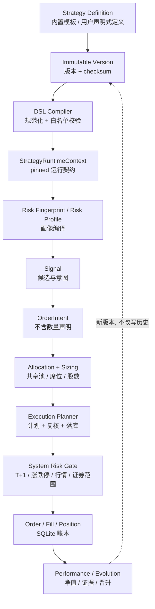

# Architecture notes

本项目是 A 股模拟交易系统（paper-only），核心路径应保持为：

```text
HTTP API / scheduler
        ↓
application services
        ↓
deterministic domain rules
        ↓
paper ledger / read models
```

## 运行时总图

下面这张图是当前仓库的实际调用边界；浏览器和定时器都只能进入 API/应用服务，不能绕过纸盘账本直接写交易数据。

```text
浏览器 Web 看板
      │ HTTP / JSON
      ▼
backend/main.py  FastAPI 应用与生命周期
      ├── /api/paper/*
      │      ▼
      │  backend/api_paper.py  纸盘 HTTP 契约
      │      ▼
      │  backend/paper_trading.py  交易编排、slot、账本写入
      │      ├── strategies / decision_engine / decision_rules
      │      ├── paper_quote_policy / paper_trading_rules
      │      ├── paper_allocation / paper_sizing
      │      ├── risk_center / entry_timing
      │      └── paper_storage / paper_repository / schema_migrations
      │
      ├── /api/adaptive/*
      │      ▼
      │  backend/api_adaptive.py  研究与人工确认 HTTP 契约
      │      ▼
      │  adaptive_engine / adaptive_* / news_learning
      │      └── 只读纸盘或写入独立影子证据；不能提交订单
      │
      └── /api/select、/api/stock_detail、/api/backtest 等
             ▼
         data_fetcher → marketdata_transport/providers/normalizers/cache
             ▼
         universe / factors / strategies / backtest / optimizer

外部调度器（服务器 cron 或容器内可选兜底线程）
      ▼
paper_runner.py --slot <slot>
      ▼
paper_trading.run_slot()
      ▼
SQLite 纸盘账本（订单、成交、持仓、NAV、审计、租约）
      ├── dashboard / risk_dashboard / audit read models
      └── 前端策略模拟、委托记录、风控审计页面
```

### 一次盘中扫描的顺序

```text
调度触发
  → 获取并校验当轮行情（覆盖率、时间戳、双源一致性）
  → 读取当前周期全部 active 账户（由策略注册表界定）
  → 逐策略生成候选车道并做风控退出检查
  → 先执行风险退出，再做入场与盘中事件
  → 共享资金池、席位、行业/单票权重、T+1、整手、涨跌停门禁
  → SQLite 事务写入订单/成交/NAV/审计
  → 前端按缓存代次读取最新只读投影
```

`strategy_registry` 是**下一周期资格**的单一事实来源（`active` ∧ `supports_new_cycle`），注册表里同时存在内置模板（`origin=builtin`，当前五套：`tq_breakout`、`trend_pullback`、`sector_rotation`、`reported_profit_breakout`、`main_force_top10`）与用户自建声明式策略（`origin=user`）。**执行层不再看 Registry**：某一轮实际参与的策略由**周期快照**决定（`paper_cycles.enabled_strategies` ∩ 当期账户，再减去生命周期 `paused`），因此"注册表里仍是 active"不会把策略偷偷拉回一个已经把它摘掉的周期（PR-38）。策略模型与生命周期语义见 [`docs/STRATEGY_PLATFORM.md`](docs/STRATEGY_PLATFORM.md)。

## 领域边界（domain boundaries）

### 执行真实性证据边界

`backend/execution_evidence.py`、`backend/execution_lifecycle.py`、`backend/execution_outcome.py`
共同构成"选出来 ≠ 能成交 ≠ 成交价格可信"的执行真实性层。它建立在 PR149 的
`selection_tradability`（点时可成交性契约）**之上**，不修改后者的任何判定口径：

```text
selection_score        策略认为股票有多好              （决策层）
tradability            那个历史时点能不能执行           （selection_tradability)
execution_evidence     实际有没有成交、成交价是否可信    （execution_evidence）
```

三个模块的职责是分开的：

| 模块 | 负责 | 不负责 |
| --- | --- | --- |
| `execution_evidence` | 12 个执行证据字段的三态契约（`known` / `unknown` / `not_applicable`）、`fill_verdict` 六分类、从 `paper_orders` + `paper_fills` 只读投影证据 | 不撮合、不写账本、不决定买什么、不重建仓库没有的历史数据 |
| `execution_lifecycle` | 九个成交状态与合法边表、非法跳转拒绝、成交数量/价格/时段不变式、stored status → 权威状态的唯一映射 | 不读数据库、不碰资金、不导入 `execution_evidence` |
| `execution_outcome` | `selection_executable` 与 `execution_verified` 两个正交概念、`market_return` / `selection_return` / `execution_return` 三层收益、执行真实性审计报告 | 不改写 selection outcome、不把市场标签当执行收益 |

关键不变量：

- **`None` 不等于零**：`EvidenceField.known` 必须携带非 `None` 值，`unknown` / `not_applicable`
  必须不携带值，构造期即拒绝。"未知"、"已知零"、"没有成交"、"被拒绝"、
  "从未提交"是五种互不相同的表示。
- **没有 submit/accept 证据不能成交**：`CREATED -> FILLED`、`SUBMITTED -> FILLED`
  一律非法。`REJECTED -> FILLED` 只能在**新的**委托生命周期（新 order_id +
  `retry_of_order_id`）里发生，与仓库"终态 order row 永不原地改写"的口径一致。
- **部分成交不得提升为全部成交**：`PARTIAL_FILLED` 要求 `0 < filled_qty < requested_qty`，
  `FILLED` 要求两者相等**且**成交价为正、成交时段非空。
- **`ACCEPTED_STORED_STATUSES` 是空集**：仓库没有券商/交易所客户端，也就没有独立的
  场所受理回报，任何 stored status 都不允许自称受理过。`shadow_q3` 这类影子记录映射到
  `CREATED`，因此永远不能走到 `FILLED`。
- **没有成交就没有执行收益**：`execution_return` 在无成交证据时为 `not_applicable`，
  `market_label_value`（反事实标签）**不得**顶替它；`execution_return` 一旦为
  `known`，来源必须是 `realized_fill_round_trip` 且 `execution_verified` 为真。
- **往返必须被证明**：两腿必须是**同一标的上互补方向**的往返。两笔同向成交、或
  `buy X` 配 `sell Y` 都不构成往返，一律 `execution_verified=False`；方向或标的
  未知时同样 fail closed（"不知道"不是"是"）。等量**部分**成交也不构成干净往返：
  数量恰好相等不等于两腿都完整成交，此时 `execution_return` 为 `unknown`，
  该现场必须能被表达与审计，而不是触发 `MarketLabelSubstitution`。
- **成交流水必须归属于该委托**：`paper_fills` 没有外键，也没有"账户/方向/标的与
  委托一致"的约束，因此 `load_execution_evidence` 必须一并读取身份列并比对。
  身份不符的流水**不是**证据：不聚合、不据以验证成交，只作为
  `fill_identity_mismatch` 上报，宁可判 `unknown` 也不能用别人的流水把委托验证成成交。
- **`selection_executable=True` + `execution_verified=False` 必须允许存在**：
  "选出来但买不进/没成交"正是本层要暴露的现场，不得被静默合并成一种结论。

三个模块都是纯 stdlib、只读、不导入 `paper_trading`；写入与撮合仍由
`execution_planner` / `manual_orders` / `paper_trading` 负责。

### 资金预占 ledger 边界

`backend/paper_capital_reservations.py` 是运行时 BUY 资金预占的唯一实现边界：它负责查询所有 `status='reserved'` 的 BUY 预占、创建/重算预占，以及把预占标记为 `consumed` 或 `released`。预占 ledger 与实际 shared cash、pending slot occupancy、symbol exposure、order lifecycle 和 cycle ownership 各自独立；预占表示尚未最终成交的购买力占用，不是现金扣款、持仓、席位或成交。

Reservation aggregation is intentionally cross-cycle：只要仍为 `reserved`，旧周期手动限价单也继续占用真实共享购买力，因此兼容参数 `cycle_id` 不用于过滤。`paper_trading.py` 只保留 `_pending_buy_reservations`、`_reserve_shared_capital`、`_finish_capital_reservation` 三个调用时注入依赖的兼容 facade。模块不拥有事务，不导入 `paper_trading`，也不负责 schema/DDL。

Recovery exception：`_reconcile_signal_order_states` 仍可直接修复 reservation terminal state，这是跨 signal/order lifecycle 的 crash-recovery 编排；它不是正常 runtime reservation CRUD，故不迁入预占模块。

### 固定周期本金归属边界

`backend/paper_cycle_capital.py` 是固定 cycle 经济本金归属与 late-join 展示参考本金的唯一实现边界。它只读 `paper_accounts.initial_cash`，由调用方在调用时注入权威的 `paper_cycle_ownership` 过滤器、内置账户作用域和数值转换函数；不拥有 schema、事务、审计、共享现金或资金分配。

`paper_trading.py` 保留 `_available_cycle_ledger_capital` 与 `_late_join_reference_capital` 两个兼容 facade，并保持依赖方向 `paper_trading → paper_cycle_capital`；新模块不得反向依赖 `paper_trading`、`paper_cycle_ownership`、`paper_allocation`、`paper_shared_cash` 或 `paper_capital_reservations`。固定 cycle 经济归属不等于动态 allocation engine，late-join reference 也不是真实 pool cash 或资金铸造来源。

### 待成交席位占用 read model 边界

`backend/paper_slot_occupancy.py` 是待成交 BUY 订单“席位占用 read model”的唯一实现边界：
Pending slot occupancy is a read-only capacity projection over caller-provided positions and executable pending BUY orders.

明确职责隔离：
```text
slot occupancy
    != runner slot/preflight service (paper_slot_service.py: 调度器 slot 枚举、验证与 preflight 清理)
    != capital reservation (paper_capital_reservations.py: BUY 购买力预占账本)
    != symbol exposure (portfolio_coordinator.py: 组合标的/行业敞口)
    != order lifecycle (entry_lifecycle.py / execution_dispatch.py)
    != cycle ownership (paper_cycle_ownership.py)
    != execution eligibility (strategy_registry.py)
```

关键不变量：
- `deferred/waitlist markers do not occupy executable position slots`：`deferred_capacity` 与 `entry_frozen_waitlist` 是排队/重试标记，没有真实席位 claim，严禁计入席位占用。
- 只有满足 `origin IN ('manual', 'strategy')`、`side='buy'` 且 `status IN occupying_statuses` 的订单才占用新仓席位。
- 已有完整持仓（`int(qty) >= lot_size`）的 `(account_id, code)` 若有待成交买单，属于对既有持仓加仓，不占用新席位（suppressed）。
- `paper_trading.py` 保留 `_pending_position_slots(conn, positions=None, exclude_order_key=None)` 兼容 facade，负责解析可选持仓并向新模块注入 `ENTRY_SLOT_OCCUPYING_ORDER_STATUSES`、`LOT_SIZE`、`_num` 与 `_rows`。新模块纯 stdlib，无事务控制，不执行写 SQL，不导入 `paper_trading`。

### 持仓运行时风险状态边界

`backend/paper_position_risk_state.py` 是 `paper_position_risk_state` 表的唯一 runtime 状态所有权边界。三张表的权威划分是固定的：

```text
paper_position_lots          数量 / 归属 / 成本权威（唯一）
paper_position_risk_state    cycle-owned 运行时权威：peak_price / take_stage / episode 起点 / 来源买单
paper_positions              仅兼容展示投影，零执行权威
```

缺失风险状态是 fail-safe 而不是"补一个默认值"：peak 锚定成本（与全新 episode 默认一致）、`take_stage=None`（阶梯止盈整体跳过，未知绝不升格为已知），hard stop / max hold 照常工作。投影里被篡改的 peak / take_stage 永不进入执行判定。

**episode 终止只有一个判据**：同 cycle 权威 `paper_position_lots` 剩余量之和为 0。该判据由 `finalize_sell(conn, *, cycle_id, account_id, code, next_take_stage=None)` 自己从权威 lots 读取——不让调用方各写一份 `position_closed`。R20 后，应用层 SELL 路径只能经过唯一 commit primitive；`PPRS.finalize_sell` 只由 `execution_planner.commit_fill` 调用：

| Sell path | 能否整仓退出 | 成交提交 owner | episode finalizer |
| --- | ---: | --- | --- |
| 风控扫描 `paper_trading._monitor_risk_impl` | 是 | `execution_planner.commit_fill` | `PPRS.finalize_sell`（仅 commit_fill 内） |
| 手动/延迟委托 `execution_planner.commit_fill`（SELL 分支） | 是 | `execution_planner.commit_fill` | `PPRS.finalize_sell`（仅 commit_fill 内） |
| 日内高抛 `paper_trading._intraday_sell` | 是（`available == LOT_SIZE` 时高抛即整仓） | `execution_planner.commit_fill` | `PPRS.finalize_sell`（仅 commit_fill 内） |

A trading decision may have many application paths, but a fill has exactly one commit owner.
Decision path != fill commit authority.

模块边界（刻意窄，且必须保持窄）：零项目级 import（只依赖 stdlib 与调用方交进来的 `sqlite connection`）；不拥有事务（绝不 `commit`/`rollback`/`BEGIN`，状态收尾必须与 lot 消耗、订单/成交写入同处调用方事务）；不解析 active cycle（`cycle_id` 一律由调用方显式传入，禁止 `MAX(cycle_id)` / `paper_accounts.cycle_id` / 日期推断）；不拥有 schema（DDL 仍在 `paper_schema_migrations`，注册仍在 `db_migrate`）；不决定成交（只在权威 lot 消耗成功**之后**收尾，状态行的存在与否绝不反过来决定 SELL 是否成立，missing state 的 fail-safe 语义不变）。

依赖方向单向且不可反转：

```text
paper_trading      ──▶ paper_position_risk_state
execution_planner  ──▶ paper_position_risk_state
paper_position_risk_state ──▶ (stdlib only)
```

`paper_trading.py` 不再保留这四个 CRUD helper 的任何转发 wrapper（它们是新 API，没有 legacy compatibility 价值）。回归门禁见 `backend/test_paper_trading_architecture_guard.py`（反向 import、CRUD SQL 回流、`paper_trading.py` 规模基线、service locator、SELL 路径 finalizer 覆盖率）。

R20 进一步把 SELL 成交提交收敛到 `execution_planner.commit_fill`：`paper_trading` 不再 runtime `INSERT INTO paper_fills`、不再 `EV.stamp_order`、不再直接 `PPRS.finalize_sell`，也不得自行 `_consume_available_lots` / `_credit_shared_cash`。回归门禁见 Guard 11a~11f 与 `backend/test_sell_fill_commit_convergence.py`（SF-1 ~ SF-14）。

| 领域 | 代码范围 | 拥有什么 | 不拥有什么 |
| --- | --- | --- | --- |
| Strategy Domain | `strategy_registry`、`strategy_service`、`strategy_dsl_*`、`strategy_runtime`、`strategy_risk_*`、`strategy_policies`、`strategy_clusters`、`strategy_champion` | 策略身份、不可变版本、DSL 编译、运行时就绪、生命周期、风险/执行画像 | 订单、成交、资金池、周期账本 |
| Paper / Cycle Domain | `paper_trading`、`paper_storage`、`paper_repository`、`paper_schema_migrations`、`db_migrate` | 周期生命周期、账本、撮合、NAV、审计、租约与幂等 | 策略规则本身、行情抓取 |
| Allocation | `paper_allocation`、`paper_sizing`、`strategy_clusters`、`portfolio_coordinator` | 共享池席位/预算分配、股数计算、同构归簇与组合协调 | 不放宽系统门禁、不决定方向 |
| Execution | `execution_planner`、`execution_dispatch`、`entry_lifecycle`、`entry_timing`、`order_intent`、`manual_orders` | 能不能下、怎么下（计划/复核/落库）、订单意图契约、分批与 TTL | 不决定买什么（候选来自策略/决策层） |
| Execution Reality | `execution_evidence`、`execution_lifecycle`、`execution_outcome` | 成交证据三态契约（known/unknown/not_applicable）、委托成交状态机、selection executable × execution verified 的连接与收益分层 | 不撮合、不写账本、不决定买什么、不改写 selection outcome |
| Risk | `risk_center`、`paper_trading_rules`、`paper_quote_policy`、`asymmetric_risk`、`strategy_risk_enforcement`、`adaptive_shadow_risk` | 系统硬边界、行情/证券门禁、分层风控状态机、非对称风险门 | 不写订单、不抓行情 |
| Market Data | `data_fetcher`、`marketdata_*`、`universe`、`factors` | 多源抓取、重试/熔断、标准化、缓存、覆盖率与新鲜度 | 不伪造实时价、不写账本 |
| Evolution | `evolution_loop`、`evolution_apply`、`evolution_validation`、`self_evolution`、`strategy_champion`、`adaptive_*` | 证据→提案→验证→晋升、影子账本、参数落地通道 | 不直接改正式账本、不绕过风险门 |
| Web / API | `main.py`、`api_paper`、`api_adaptive`、`api_settings`、`api_strategies`、`*_runner.py` | HTTP 契约、调度入口、静态产物下发 | 不打开数据库、不复刻业务规则 |
| Frontend | `frontend/src/**`、`frontend/styles/**`、`frontend/dist/**` | 只读投影的展示与交互、策略工坊、设置中心 | 不在浏览器决定成交、不实现第二套业务规则 |

依赖方向：`Web/API → Application Service → Domain ← Infrastructure Adapter`。Domain 不直接依赖 FastAPI、SQLite 或具体行情/LLM SDK；`adaptive_*` 属于影子路径，只能读行情与账本，不能进入订单执行入口。

## 策略平台数据流



## 风险层次（risk hierarchy）

```text
System Risk（平台全局，策略不可触碰）
    T+1 · 证券范围 · 涨跌停/停牌 · 行情新鲜度 · 全池敞口 · 系统回撤
        ↓
Portfolio / Strategy Risk（策略画像，只能收紧）
    max_exposure · max_positions · max_weight · industry cap · risk_per_trade
        ↓
Position Risk（单笔，执行前复核）
    hard stop · trailing stop · staged take-profit · holding limit · pyramiding cap
```

- **System Risk 不能被策略削弱**：策略画像里不含系统键，合并与门禁都在平台侧；`strategy_risk_enforcement` 只做 `min(生产现值, 模板值)` 方向的收紧。
- 影子/研究层（`adaptive_*`、`evolution_*`）只能产生证据与候选，不能修改上述任何一层。

## 周期所有权与执行资格（PR-48 / PR-49）

运行时的两条口径必须分开理解：

| | Cycle Ledger Ownership | Execution Participation |
| --- | --- | --- |
| 含义 | 策略在当前周期账本中的资金/净值归属 | 还能否产生新信号与新委托 |
| 依据 | 周期创建时冻结的快照与分配 | 周期快照 ∩ 生命周期未 pause |
| `pause` 后 | **保留**（仍计入共享池合计与 NAV） | **剔除**（不再新开仓） |
| `resume` 后 | 不变（不会凭空放大资本） | 恢复 |

因此"暂停一个策略"不是把它从周期里删掉，而是关闭它的执行资格；经济所有权仍留在周期账本里，直到周期结束归档。回归见 `backend/test_cycle_ledger_ownership.py` 与 `backend/test_cycle_participant_resolver.py`。

PR-49 把这条口径的实现收敛到只读解析器 `backend/paper_cycle_ownership.py`，并显式冻结**四口径互不等价**：

| 口径 | 定义式 | 落点 |
| --- | --- | --- |
| 经济所有权 | `paper_cycles.enabled_strategies`（能力位过滤，**不查** lifecycle）∩ `paper_accounts.cycle_id == 目标周期` | `cycle_ledger_filter` / `cycle_ledger_rows` / `cycle_ledger_ids` |
| 执行资格 | 经济所有权 − `strategy_definitions.lifecycle_status ∈ ('paused',)` | `cycle_participant_resolution` / `current_cycle_participant_ids` / `execution_participant_ids` |
| 注册表 active 作用域 | `SR.active_ids() ∩ 声明键` ∪ `USP.user_participant_ids(conn)` | `paper_trading.ACTIVE_ACCOUNT_IDS` / `_active_account_clause`（**不在**解析器内） |
| 风控退出资格 | 执行资格 ∪ `paper_position_lots.remaining_qty > 0` 的账户 | `paper_risk_exit_eligibility.risk_exit_account_ids`（`paper_trading._risk_exit_account_ids` 兼容 facade） |

锁句：**Cycle owns capital. Lifecycle controls execution permission. Existing exposure still owns risk-exit rights.** 禁止用 `SR.active_ids()` 替代经济所有权，也禁止把风控退出"统一"成执行参与者——否则已 pause / 已退出当前周期的存量持仓会变成无人风控的孤儿敞口。

两条**不得合并**的边界语义：

- **显式 idle 周期**：`enabled_strategies == []` 是合法的零策略周期（`source = "cycle_idle"`，参与者为空，绝不回落内置五套）。
- **未配置周期**：`NULL` 或不可解析才是「未配置」（`source = "cycle_not_configured"`），保留 legacy 回退（内置作用域 + 注册表用户参与者），避免早期/迁移库整轮空转。
- 周期已声明启用集合但账本尚未挂接时走 `cycle_enabled_unbound_fallback`（新建周期首轮 / 迁移窗口），仍剔除 lifecycle pause。

注册表 active 投影（`ACTIVE_ACCOUNT_IDS`）按不变量 #8 留在权威层，由 `paper_trading` 以 `builtin_scope` 参数**在调用时**注入解析器（不得 import 期冻结）。周期选择（`_active_cycle`，可能触发旧库补周期）同样留在权威层，解析器的 `cycle_id` 因此是必填。

## 模块职责速查

| 区域 | 文件/模块 | 负责什么 | 不负责什么 |
| --- | --- | --- | --- |
| 应用入口 | `backend/main.py` | 组装 FastAPI、挂载前端、健康检查、数据更新、选股/回测/个股查询、启动时初始化账本 | 不直接绕过交易服务写订单 |
| 纸盘 API | `backend/api_paper.py` | 纸盘概览、风险概览/审计、委托预览/提交/撤单、周期启停、手动运行 slot | 不实现策略规则和 SQL 账本细节 |
| 影子研究 API | `backend/api_adaptive.py` | 自适应、新闻、AI 顾问、再平衡和人工确认接口 | 不直接下单、不自动放宽风控 |
| 交易编排 | `backend/paper_trading.py` | 周期/账户、候选、开仓证据与闸门、盘中、收盘、风控、NAV、审计和 slot 幂等编排 | 不把研究建议当成成交授权；不直接写成交账本（成交落库唯一归 `execution_planner.commit_fill`） |
| 纸盘只读查询 | `backend/dashboard_queries.py` | dashboard 工作区只读投影（含 activity 门控与防呆分支）；`paper_trading.dashboard` 仅保留转发 facade | 不写订单、不改变交易结论 |
| 手动下单链 | `backend/manual_orders.py` | 手动交易垂直链：风险状态 → 订单计划 → 预览 → 执行/提交（两段确认）→ 撤单 → 待处理单清扫；并持有普通策略 BUY 的成交提交编排（`commit_strategy_entry_fill`）与失败语义（`strategy_fill_failure`）；`paper_trading` 内同名 facade 转发 | 不做周期生命周期管理，不直接暴露 HTTP；成交落库本身仍委托 `execution_planner.commit_fill`，不重写第二套 reserve/cash/lot/fill |
| 调度边界 | `backend/paper_runner.py` | 把一个 slot 运行成一次性进程，并用退出码告诉 cron 是否应重试 | 不常驻、不拥有第二套账本 |
| 策略与决策 | `strategies.py`, `strategy_registry.py`, `strategy_service.py`, `strategy_api_models.py`, `strategy_dsl_schema.py`, `strategy_dsl_evaluator.py`, `strategy_runtime.py`, `strategy_risk_fingerprint.py`, `strategy_risk_profiles.py`, `strategy_risk_enforcement.py`, `strategy_parameter_schema.py`, `strategy_policies.py`, `strategy_clusters.py`, `strategy_champion.py`, `user_strategy_participation.py`, `decision_engine.py`, `decision_context.py`, `decision_rules.py` | 策略身份与不可变版本、DSL 编译、运行时就绪与 RuntimeContext、风险/执行画像、生命周期与治理、候选车道与纯规则评分 | 不读取真实券商账户，不写订单/成交 |
| 订单意图与执行计划 | `order_intent.py`, `execution_planner.py`, `execution_dispatch.py`, `entry_lifecycle.py` | 策略→执行器的意图契约（拒绝数量越权）、计划/复核/落库统一口径、分批与 TTL | 不决定买什么，不计算资金池分配 |
| 执行真实性证据 | `backend/execution_evidence.py`, `backend/execution_lifecycle.py`, `backend/execution_outcome.py` | 执行证据三态契约（`known`/`unknown`/`not_applicable`）、成交六分类、委托成交状态机与非法跳转拒绝、`selection_executable` × `execution_verified` 连接、`market`/`selection`/`execution` 三层收益 | 不撮合、不写订单/成交/资金、不重建仓库没有的历史数据、不改写 PR149 selection outcome、不用市场标签顶替执行收益；不 import `paper_trading` |
| 行情基础设施 | `data_fetcher.py`, `marketdata_transport.py`, `marketdata_providers.py`, `marketdata_normalizers.py`, `marketdata_cache.py` | 多源请求、重试/熔断、解析标准化、缓存、覆盖率和新鲜度元数据 | 不在缓存陈旧时伪造实时价；不判断业务 freshness policy（归 `market_data_contract`） |
| 行情业务权威 | `backend/market_data_contract.py`（纯契约：状态语义 + freshness policy）、`backend/market_data_service.py`（唯一 authority：只读 / 显式刷新两个入口） | 回答"在指定 as-of / freshness policy 下，系统目前拥有什么经过验证的市场事实"；区分 fresh / stale / degraded / unverified / unavailable；显式 network policy；点时可证明性 | contract 零 I/O / 零时钟 / 零项目依赖；service 不拥有事务、不 import `paper_trading`、不在只读模式联网；不重写 provider 实现、不负责 provider 健康（归 `data_fetcher.load_source_health`） |
| 交易门禁 | `paper_trading_rules.py`, `paper_quote_policy.py`, `entry_timing.py` | 交易日、费用、证券权限、T+1、整手、涨跌停、行情新鲜度和入场时机 | 不负责持久化订单 |
| 持仓运行时风险状态 | `backend/paper_position_risk_state.py` | `paper_position_risk_state` 的唯一 runtime 状态所有权：episode 初始化（verified BUY `0 -> >0`）、peak 只升不降吸收、take_stage 推进、full-exit 收尾、以及所有生产 SELL 路径共用的 `finalize_sell`（自行按 cycle 读权威 `paper_position_lots` 判定 episode 是否结束） | 不拥有 schema/DDL（归 `paper_schema_migrations`），不拥有事务（不 commit/rollback/BEGIN），不解析 active cycle（cycle_id 由调用方显式传入），不决定成交；不 import `paper_trading`，零项目级依赖 |
| 卖出风险决策引擎 | `backend/paper_risk_decision.py` | 纯确定性卖出风险状态机：同日新仓识别与峰值口径、硬止损（首段减仓 vs 全清）、移动止损、最长持有、阶梯止盈，并由固定严重度序仲裁；`paper_trading._sell_plan` 仅保留薄 adapter | 不读数据库/网络/文件系统、不读机器时钟（`asof_day` 必须由调用方显式传入，缺失即 fail fast）、无全局缓存、不 import `paper_trading` / `strategy_policies` / `paper_account_specs`（policy 由调用方解析后注入）；不决定成交、不写账本 |
| 风险扫描运行生命周期 | `backend/paper_risk_scan_state.py` | `paper_risk_scan_runs` 的唯一状态所有权：以 `(cycle_id, asof_date, scan_minute)` 为身份的 claim / running / completed / failed、`failed` 可重试且 `attempt` 递增、CAS 精确转换、以及外部 I/O 之后的周期 fence `assert_cycle_active` | 不拥有 schema/DDL（归 `paper_schema_migrations` v21）、不拥有事务（不 commit/rollback/BEGIN/SAVEPOINT）、不读机器时钟（`started_at` / `finished_at` 由调用方显式传入）、不解析持仓、不建周期、不做策略判断；不 import `paper_trading`，零项目级依赖 |
| 持仓复核决策 | `backend/paper_position_review.py` | 纯确定性 position review 领域逻辑：质量评分算术、新仓趋势中性化、grade 边界、以及集中换仓 / 观察 / 持有的 `decide_action` 状态机（quote 陈旧 / T+1 锁定 / 每轮上限 / 紧急择强 / 最短观察期 / 趋势确认 / 绝对淘汰 / 换仓配额 / 替补优势 / 满位升级） | 不读数据库/网络/文件系统、不读机器时钟、不解析账户配置（阈值由 `ReviewPolicy` 注入）、不 import `paper_trading` / `strategy_policies` / 读模型；不决定成交、不写账本 |
| 入场模型 provenance | `backend/paper_position_review_evidence.py` | 当前 position episode 的入场 signal **精确**解析：`paper_position_risk_state.opened_order_id` → 同周期 verified filled BUY order → `paper_orders.signal_id` → 精确 `paper_signals.id`（并校验身份与 `signal_date <= asof_day`）；任何一环不成立即 `unknown` | 不 fallback 到"account+code 的最近一条 signal"（**禁止** `ORDER BY signal_date DESC` / `LIMIT 1` 式搜索）、不解析 active cycle（`cycle_id` / `asof_day` 由调用方显式传入）、不写任何表、不 import `paper_trading`；`verified` 判据复用 `execution_verification.VERIFIED_PREDICATE` |
| 替补候选证据 | `backend/paper_replacement_evidence.py` | replacement 事实的唯一**有界**读取：`load_replacement_candidates` 固定 `intended_date = asof_day`（等式）+ `signal_date <= asof_day`；`latest_position_review` 固定 `cycle_id` + `review_date <= asof_day` | 只读 active `paper_signals`（归档 signal 不是 executable candidate，不得复活）、不读网络/文件系统/机器时钟、不解析 active cycle（`cycle_id` / `asof_day` 显式传入）、找不到即 `None`/空（**禁止** fallback 到别的周期或全库最新）、不 import `paper_trading` |
| 替补与席位决策 | `backend/paper_replacement_decision.py` | 纯确定性替换域：`allocation_version_id`（`slots-vN` token 的唯一解析，借位/回滚据此定位显式周期的版本行）、`score_candidate`（`entry 45% + t_score 35% + rank 20%`，含归一化/clamp/round）、`choose_best_candidate`、`derive_donors`、`decide_slot_upgrade`（借位 → 最弱仓 → T+1 → 最短观察 → 紧急 → 常规/满席 → 优势不足，顺序与阈值不可变） | 不读数据库/网络/文件系统、不读机器时钟、不解析账户配置（阈值由 `ReplacementPolicy` 注入）、不 import `paper_trading` / `paper_position_review` / `strategy_policies`；不负责 security scope、不复制 `_buy_order` 执行门禁 |
| 资金与仓位 | `paper_allocation.py`, `paper_sizing.py`, `paper_portfolio.py`, `paper_performance.py` | 共享池预算、席位、下单股数、持仓 lot 聚合、今日盈亏纯计算 | 不调用外部行情源 |
| 账本与迁移 | `paper_storage.py`, `paper_repository.py`, `paper_schema_migrations.py`, `paper_ledger_reader.py`, `paper_archive_projection.py` | SQLite 连接/WAL/重试、通用行读写、幂等迁移、只读读取端口、历史快照投影 | 不改变交易策略结论 |
| 风控与审计 | `risk_center.py`, `adaptive_risk.py`, `adaptive_shadow_risk.py` | 风险状态机、下行保护、风险仪表盘、影子风控和结构化审计原因 | 影子层不能越权提交订单 |
| 决策审计序列化 | `backend/paper_decision_audit.py` | 决策快照 envelope 的唯一实现（点对点证据序列化、K 线窗口与 future-row 排除、因子贡献）；`paper_trading` 内同名符号仅保留兼容 facade | 不写数据库、不联网、不改变交易规则 |
| 纸盘账户声明 | `backend/paper_account_specs.py` | 纸盘账户的**声明式**配置：内置五套账户 spec、风格声明、风险画像声明、保守回退 spec，以及返回独立副本的只读访问器；`paper_trading` 内同名符号仅保留兼容别名 | 不回答注册表 active / 生命周期 / 运行时就绪、不回答当期周期所有权与参与者、不回答执行资格与执行许可；不连数据库、不联网、不下单、不启动调度 |
| 周期所有权解析 | `backend/paper_cycle_ownership.py` | 当期周期**经济所有权**（`enabled_strategies` ∩ `paper_accounts.cycle_id`）、**执行参与者**（经济所有权 − lifecycle pause）、idle / 未配置 / 未挂接的判定来源元数据；`paper_trading` 内同名符号仅保留兼容 facade（别名 + 委托） | 不建周期、不归档、不开户、不改资金、不改账户状态、不下单、不撮合、不做风险决策、不生成信号、不做分配或 sizing；不拥有注册表 active 作用域与风控退出资格；不 import `paper_trading` |
| 固定周期本金归属 | `backend/paper_cycle_capital.py` | 只读计算固定 cycle 尚未归属的经济本金，以及 funded sleeves 的 late-join 展示/绩效参考本金；过滤器、内置账户作用域和数值转换均由 caller 注入 | 不决定 cycle 所有权或执行资格，不写 shared cash / pool NAV / 账户本金，不做 allocation、sizing、reservation、slot occupancy，不拥有事务；不 import `paper_trading` |
| 共享现金账本 | `backend/paper_shared_cash.py` | 接收调用方已解析的账户行，完成共享现金/初始资本聚合，以及按既有顺序对明确账户执行现金借记/贷记；唯一写入是 `paper_accounts.cash` 与 `updated_at` | 不解析周期所有权、不决定执行资格、不创建账户或周期、不处理预约/敞口/风控退出、不写订单/成交/持仓；不 import `paper_trading` |
| 用户策略账户 provisioning | `backend/paper_user_account_provisioning.py` | 接收 facade 已解析的用户策略 ID，幂等创建缺失的 `paper_accounts` 账本身份并写成功开户审计；不自行判断资格 | 不查询注册表/生命周期/runtime/周期，不分配资金、不挂接周期、不改已有行、不授予执行权限；不 commit/rollback、不 import `paper_trading` |
| 用户策略周期挂接 | `backend/paper_user_cycle_attachment.py` | 接收 facade 已解析的用户账本 ID、enabled 目标和当前周期，幂等执行 `paper_accounts` 的周期挂接/摘除，并在挂接时重置当日 NAV、写参数版本证据和成功审计 | 不选择/创建周期、不解析 enabled/lifecycle/registry、不分配共享现金、不抢绑其他周期、不改变 detach 历史证据；不写 `paper_cycles`/orders/fills/lots、不 commit/rollback、不 import `paper_trading` |
| 自适应/新闻 | `adaptive_engine.py`, `adaptive_runner.py`, `adaptive_learning_*`, `news_learning.py`, `news_runner.py` | 研究样本、奖励、新闻证据和参数候选；通过 outbox/人工确认与正式路径隔离 | 不直接修改正式成交规则 |
| 研究工具 | `backtest.py`, `optimizer.py`, `selection_tracking.py`, `selection_runner.py` | 回测、参数比较、选股跟踪和盘后候选固化 | 不替代正式纸盘撮合 |
| 前端 | `frontend/src/**`（ESM 模块）, `frontend/styles/**`（CSS 片段）, `frontend/build.mjs` | 单页看板、策略模拟、委托、风控审计、数据有效性和研究页面；esbuild 打包到已提交的 `frontend/dist/`（运行时只伺服产物 `/app.js`、`/app.css`） | 不在浏览器本地决定最终成交 |
| 部署 | `Dockerfile`, `docker-compose.yml`, `docker-compose.server.yml`, `deploy/*` | 镜像、数据卷、健康检查、锁、cron/systemd/nginx 部署边界 | 不把运行时数据库、密钥或历史账本提交进仓库 |

## 调度与并发边界

- 服务器 Docker profile 使用宿主机 cron 调 `deploy/run_paper_slot.sh`，脚本先用锁串行化 paper runner，再在 worker 容器中执行单个 slot。
- 单机 clone 可将 `ASTOCK_ENABLE_FALLBACK_THREADS=1` 交给应用内置线程；生产环境应在 cron 与内置线程之间二选一，避免重复扫描。
- `run_slot()` 使用数据库 runtime lease、heartbeat 和 fencing token；`paper_runner.py` 对 `failed`/`blocked`/`partial` 返回非零退出码，使调度器可以重试。
- API 读取模型带短 TTL、账本 generation 和 single-flight；缓存只优化读取，不改变账本事实。

行情提供方、SQLite 和 LLM 属于基础设施，不应被纯决策规则隐式调用。`adaptive_*` 模块是影子学习与审阅路径，只能读取行情和模拟账本，不能依赖订单执行入口。

## 当前边界

- `backend/main.py` 负责 FastAPI 组装、只读查询和生命周期。
- `backend/api_paper.py`、`backend/api_adaptive.py` 负责 HTTP 契约；`confirmed=true` 是防误触确认，不是身份认证。
- `backend/paper_trading.py` 仍是主要交易编排与账本实现，后续按小步拆出 Execution、Portfolio、Risk 和 Scheduler；dashboard 工作区只读投影已迁至 `backend/dashboard_queries.py`，手动下单垂直链已迁至 `backend/manual_orders.py`（两者在 `paper_trading` 内保留兼容 facade，公开导入路径不变）。
- `backend/decision_context.py` 集中定义决策证据快照与兼容加载适配器；`decision_engine.py` 的公开入口暂时保持不变。
- `backend/decision_rules.py` 承载不依赖数据源的评分、买入时机、止盈和止损规则；规则模块不联网、不读缓存、不写账本。
- `backend/paper_risk_decision.py` 承载**持仓卖出风险决策**的纯确定性状态机；`paper_trading._sell_plan` 只保留薄 adapter（解析 spec / hold_days / limit_pct / partial_ratio 后注入，补齐 `exit_profile`、`volatility_shadow` 等编排诊断）。依赖方向单向：`paper_trading` → `paper_risk_decision`，反向禁止。机器当前日期**不得**参与任何卖出判定——`asof_day` 是显式参数，`bought_today(position, *, asof_day)` 与 `position_peak(position, quote, price, *, asof_day)` 缺失 `asof_day` 时直接 `ValueError`，绝无 `asof_day or date.today()` 式回退。
- `backend/marketdata_transport.py` 负责共享 HTTP 连接、重试和源熔断状态；`data_fetcher.py` 继续兼容性导出旧名称，解析与缓存逻辑暂不改变。
- `backend/marketdata_cache.py` 负责可注入的 TTL 内存缓存、全市场快照 single-flight 文件锁和数据源健康文件读写；`data_fetcher.py` 保留旧 `_cached`/锁/健康状态入口。
- `backend/marketdata_providers.py` 负责东财 `clist`、概念成员分页/板块引用解析以及腾讯/新浪实时行情与 K 线响应解析；HTTP 会话、重试和可变主机健康状态由 `data_fetcher.py` 注入，确保完整性元数据和旧入口兼容。
- `backend/marketdata_normalizers.py` 承载行情行、证券代码、时间戳和 K 线 DataFrame 的无副作用标准化；`data_fetcher.py` 保留旧函数包装以兼容现有 provider 调用。
- `backend/paper_trading_rules.py` 承载交易日、费用、证券类型与证券权限等无账本副作用规则；`paper_trading.py` 继续兼容导出旧的下划线函数名。
- `backend/paper_quote_policy.py` 承载行情新鲜度、活跃度和成交核验门禁；`paper_trading.py` 保留 `_quote_is_fresh`、`_is_trading_active`、`_execution_quote_status` 兼容包装。
- `backend/paper_allocation.py` 承载共享池席位分配和策略预算的纯计算；`paper_trading.py` 只负责读取风险/持仓/预约数据并注入常量。
- `backend/paper_sizing.py` 承载按风险、权重、资金、行业和共享池约束计算下单股数；`paper_trading.py` 保留 `_price_aware_qty` 兼容包装。
- `backend/paper_storage.py` 负责 SQLite 连接生命周期、只读连接、WAL 检查点和锁重试；`paper_trading.py` 只保留兼容包装，不把业务查询迁入存储层。
- `backend/paper_portfolio.py` 负责将已读取的持仓 lot 聚合为兼容读模型；数据库查询与交易结算仍由 `paper_trading.py` 编排。
- `backend/paper_archive_projection.py` 负责把不可变历史周期快照投影为只读订单行；损坏快照隔离在投影边界内，不影响当前账本。
- `backend/paper_ledger_reader.py` 是 adaptive 读取 paper ledger 的只读端口；使用 SQLite `mode=ro` 与 `query_only`，补偿恢复等明确写路径不经过该端口。
- `backend/strategy_registry.py` 集中策略 ID、展示名称和 active/legacy 状态；adaptive、adaptive risk、research、selection 和 strategy-center 展示从这里读取，暂不改变交易调度或账户范围。
- `backend/paper_repository.py` 提供通用 ledger 行读取、审计写入、dashboard 账户批量投影和活动订单轻量投影；`paper_trading.py` 保留旧 `_rows`/`_audit`/`_account_metric_inputs` 包装，后续再迁移对象级 SQL。
- `backend/paper_account_specs.py` 承载纸盘账户**声明层**（内置 spec / 风格 / 风险画像 / 保守回退 + 返回独立副本的只读访问器）；`paper_trading.py` 只保留同名兼容别名与唯一解析口 `_spec_for`（内置与回退分支委托给声明层）。注册表投影 `ACTIVE_ACCOUNT_IDS`/`ACTIVE_ACCOUNT_SPECS` 与周期参与者解析仍留在权威层；用户策略账户缺失行的 provisioning 由 `paper_trading` facade 在调用时注入资格/spec/时钟/审计依赖，委托给 `backend/paper_user_account_provisioning.py`。
- `backend/paper_performance.py` 负责今日报价新鲜度、持仓今日盈亏和卖出贡献的纯计算；`paper_trading.py` 保留 `_today_*` 兼容包装。
- `backend/paper_cycle_ownership.py` 承载**当期周期所有权解析**（经济所有权 / 执行参与者 / lifecycle pause 过滤 / 判定来源元数据），是只读解析器：无写 SQL、无网络、无订单、无周期创建与归档、无模块级调用。`paper_trading.py` 只保留同名兼容 facade（`_active_cycle_filter`、`_shared_account_rows`、`cycle_ledger_ids`、`execution_participant_ids`、`current_cycle_participant_ids`、`_cycle_participant_resolution`、`_lifecycle_paused_ids` 与两个版本常量），并以 `builtin_scope=ACTIVE_ACCOUNT_IDS` 在**调用时**注入注册表 active 投影。注册表 active 作用域（`ACTIVE_ACCOUNT_IDS` / `_active_account_clause`）与周期选择（`_active_cycle` / `_ensure_cycle`）**仍留在** `paper_trading.py`；风控退出资格由 `backend/paper_risk_exit_eligibility.py` 承载，`paper_trading._risk_exit_account_ids` 保留为兼容 facade。三个垂直互不越界：`paper_cycle_service`（持久归档/快照/清理）、`paper_account_specs`（账户声明）、`paper_cycle_ownership`（当期所有权）。
- `backend/paper_risk_exit_eligibility.py` 承载**风控退出资格 read model**：模块保持纯 stdlib 与只读，仅计算调用方提供的执行/基础活跃账户名单 ∪（`paper_position_lots` 中 `remaining_qty > 0` 的账户）；不碰周期所有权、生命周期、账户状态、共享资金或订单撮合。`paper_trading` 在调用时动态解析权威的活跃/基础账户作用域，随后委托给只读的风控退出模块。抽取的模块直接从传入的连接读取存量持仓证据，并保持对 `sqlite3.Row` 与裸元组行（`row_factory=None`）的双向兼容；依赖方向单向：`paper_trading` → `paper_risk_exit_eligibility`，反向禁止。
- `backend/paper_shared_cash.py` 承载共享现金的纯聚合与窄写入边界；它只接收调用方已经解析好的账户行，写 `paper_accounts.cash` / `updated_at`，不拥有周期、执行、预约、敞口或风控退出真相。`paper_trading.py` 保留 `_shared_cash`、`_shared_initial_cash`、`_debit_shared_cash`、`_credit_shared_cash` 四个兼容 facade，并在每次调用时注入当前 `_num` / `_now`；依赖方向单向：`paper_trading` → `paper_shared_cash`，反向禁止。
- `backend/paper_user_account_provisioning.py` 承载用户策略账户 provisioning 的单一写入实现；调用方先解析参与资格，再经 `paper_trading` facade 在调用时注入 `_spec_for`、`_now`、`_audit`，模块只幂等 INSERT 缺失 `paper_accounts` 行并记录成功开户审计。流程边界固定为：`registry eligibility → paper_trading facade → paper_user_account_provisioning → paper_accounts INSERT`。**Provisioning creates ledger identity, not economic ownership.** 资金分配、共享现金、周期挂接和执行许可仍由各自权威层负责。
- `backend/paper_user_cycle_attachment.py` 承载用户策略从已存在账本身份到当前周期的 attach/detach 写状态转换；`paper_trading._ensure_cycle` 继续解析 `all_user_ids`、`enabled_ids` 并完成 builtin repair，再按 `version bind → user attachment → version bind → shared cash` 的历史顺序委托。模块只消费调用方注入的周期、目标集合和资金/行情/日期/时间/spec/audit callbacks，不读取 lifecycle 或 registry，不改变其他周期和 detach 留存的 NAV/参数证据。
- `backend/paper_schema_migrations.py` 集中 paper ledger 的增量字段、运行时租约字段和点火影子表迁移；`db_migrate.py` 通过版本号调用这些幂等操作，应用前使用 SQLite backup API 创建一致性副本，运行引擎不再内联 `ALTER TABLE`。
- `backend/adaptive_risk.py` 使用 outbox（跨数据库操作意图表）保证纸盘提交后，adaptive 账本可重放收敛。
- `backend/test_adaptive_dependency_boundary.py` 以 AST（源码语法树）守护 adaptive 不直接导入纸盘订单 API，也不出现订单提交/取消调用。
- `backend/adaptive_genetics.py` 承载 alpha 实验室的基因归一化、交叉、变异和适应度纯计算；`adaptive_engine.py` 保留数据集/训练编排和兼容包装。
- `backend/adaptive_shadow_risk.py` 承载 adaptive 组合影子风控的历史归一化、波动率、集中度和压力测试纯计算；不读账本、不联网、不提交订单。
- `.github/workflows/ci.yml` 覆盖后端测试、编译/前端语法与镜像一致性，并新增独立 Docker 构建和健康端点冒烟检查。
- 前端运行时的 canonical source 是 `frontend/src/`（入口 `src/app.js`：build id + `bridge.js` 全局兼容桥 + `boot.js` 顶层语句），样式是 `frontend/styles/`（`styles/index.css` 按原顺序 `@import`）；模块地图与依赖概览见 `frontend/src/README.md`。

## 不变量

1. 不连接真实券商、不产生真实订单。
2. 证据缺失、行情过期或跨源核验失败时，决策 fail-closed。
3. adaptive 自动流程只能 shadow-only；风控放宽必须人工确认。
4. 迁移和跨账本恢复必须可重复、可审计、可回滚。
5. 任何拆分必须保持公开 API、审计事件和既有交易规则兼容。
6. 学习/研究数据集就绪不授予任何执行权限：不能下单、不能放宽风控、不能自我晋升。
7. 决策审计序列化的实现只有一份（`backend/paper_decision_audit.py`）。`backend/paper_trading.py` 只保留兼容 facade（别名 + 委托，并在调用时注入 runtime 依赖），不得再复制第二套实现；依赖方向单向：`paper_trading` → `paper_decision_audit` → pandas / stdlib，反向禁止。
8. 纸盘账户**声明式**配置的实现只有一份（`backend/paper_account_specs.py`）：内置账户 spec、风格声明、风险画像声明、保守回退 spec，以及只读查询访问器。`backend/paper_trading.py` 只保留兼容别名与唯一解析口 `_spec_for`（内置分支返回独立副本），不得再声明第二张账户表或第二套回退。依赖方向单向：`paper_trading` → `paper_account_specs` → `strategy_policies` / stdlib，反向禁止。声明层**不拥有**任何权威真相：注册表 active 作用域与生命周期（`strategy_registry`）、运行时就绪/版本/checksum（`strategy_runtime`）、当期周期所有权与参与者（`paper_cycles.enabled_strategies` ∩ `paper_accounts.cycle_id`）、执行资格与执行许可（系统风控层）一律不在本模块，也不得被 import 期冻结成常量。四者口径互不等价：`account declarative specs != strategy registry/runtime truth != current cycle ownership != execution eligibility`。
9. 当期**周期所有权 / 执行参与者解析**的实现只有一份（`backend/paper_cycle_ownership.py`），且必须是**只读**的：无 `INSERT`/`UPDATE`/`DELETE`、无网络、无行情、无订单与撮合、无资金或账户状态变更、无周期创建与归档、无模块级调用。`backend/paper_trading.py` 只保留兼容 facade（别名 + 委托），并在调用时注入注册表 active 投影；不得再内联第二套所有权谓词或第二份解析。依赖方向单向：`paper_trading` → `paper_cycle_ownership` → `paper_account_specs` / `user_strategy_participation` / stdlib，反向禁止。四口径互不等价且不得互相替代：`cycle economic ownership != execution eligibility != registry active scope != risk-exit eligibility`；风控退出资格（执行参与者 ∪ 仍有剩余 lots 的账户）留在权威层，不得收窄为执行参与者。`enabled_strategies == []`（合法零策略 idle 周期，零参与者）与 `NULL`/不可解析（未配置，保留 legacy 回退）**不得合并**。

10. 共享现金账本的实现只有一份（`backend/paper_shared_cash.py`）：聚合和借记/贷记算法只处理调用方已解析的账户行，数据库写入严格限制为 `paper_accounts.cash` 与 `updated_at`，不拥有周期所有权、执行资格、预约、敞口或风控退出。`backend/paper_trading.py` 只保留四个兼容 facade，并在调用时注入 runtime 归一化/时钟；依赖方向单向：`paper_trading` → `paper_shared_cash`，反向禁止。口径必须继续分离：`cycle ownership != execution eligibility != shared cash accounting != open-order reservation != position exposure != risk-exit eligibility`。
11. 用户策略账户 provisioning 的实现只有一份（`backend/paper_user_account_provisioning.py`）。它只接收调用方已解析的参与者 ID，只 INSERT 缺失的 `paper_accounts` 账本身份并审计成功创建；已有行完全跳过，且不 commit/rollback。`paper_trading` 只保留 `_ensure_user_strategy_accounts(conn)` 兼容 facade，并在每次调用时注入当前参与资格、`_spec_for`、`_now`、`_audit`。该边界只创建账本身份，不代表经济所有权，不分配资本、不挂接周期、不改变执行资格；依赖方向单向：`paper_trading` → `paper_user_account_provisioning`，反向禁止。
12. 用户策略周期挂接的实现只有一份（`backend/paper_user_cycle_attachment.py`）。它只接收调用方已经解析好的 `user_account_ids`、`enabled_ids` 与当前周期，按既有 contract 幂等写 `paper_accounts`、attach 后重置 `paper_nav` 并写 `paper_parameter_versions`/成功 audit；不选择周期、不解析 registry/lifecycle/enabled、不抢绑其他周期，detach 不删除历史 NAV/参数证据且不写 detach audit。事务仍由 `_ensure_cycle` 外层拥有，任何 callback/SQL/audit 异常原样传播；依赖方向单向：`paper_trading` → `paper_user_cycle_attachment`，反向禁止。
13. 风控退出资格 read model 的实现只有一份（`backend/paper_risk_exit_eligibility.py`）：纯 stdlib、只读查询 `paper_position_lots`，零写 SQL、无事务控制、不导入 `paper_trading`；不决定周期所有权，不解释 `enabled_strategies`，不修改账户或持仓。`paper_trading.py` 保留 `_risk_exit_account_ids(conn, status="running")` 兼容 facade，在调用时解析权威活跃账户作用域并委托给只读模块；模块直接从连接读取持仓证据且兼容 `sqlite3.Row` 与裸元组行（`row_factory=None`）；依赖方向单向：`paper_trading` → `paper_risk_exit_eligibility`，反向禁止。特别冻结：风控退出资格 = 执行资格 ∪ 存量持仓账户，绝不收窄为执行参与者，确保 paused/archived/退出周期的存量持仓始终受风控扫描保护。
14. 风控退出生产链路加固（`backend/test_paper_risk_exit_production_path.py`）：
    风控退出资格与执行资格严格分离：执行资格是受限的入场/开仓能力（受 lifecycle pause、active cycle enabled 集合与 capacity 限制）；而风控退出是无条件的平仓/释放能力（存量持仓只要存在，就无条件享有退出路径直至完全平仓）。
    在生产全链路中：
    - paused、archived、out-of-cycle 账户只要在 `paper_position_lots` 中仍有 `remaining_qty > 0`，就必须持续被风控扫描并能生成/执行平仓卖单；
    - 平仓完成后，存量敞口归零，账户自动退出风控扫描资格，后续扫描绝不重复下达卖单；
    - 风控退出 SELL 委托严格隔离于买入侧容量控制：不占用买入槽位（`pending_position_slots` 仅统计 `side='buy'`），不消耗买入资金预留（`pending_buy_reservations` 仅统计 `side='buy'`），不受 `PAPER_ENTRY_FREEZE` 买入熔断环境变量阻断；
    - 退出执行过程受 savepoint 事务保护：执行失败/异常立即回滚，不产生脏 lot、订单或虚构资金；成功成交后释放的净回款（`amount - fees`）精确归还账户与共享现金池；所有成交流水（seed buy 与 risk sell）严格归属于对应方向与参数的真实订单，禁止错连或对向孤儿；
    - 生产调用链由 `test_paper_risk_exit_production_path.py` 覆盖 A–O 场景与调度入口 `run_slot("risk", ...)`，并经由本地突变套件对真实源码变异 N1–N12 检验（12/12 caught, 0 undetected）。
15. 固定 cycle 本金归属的实现只有一份（`backend/paper_cycle_capital.py`）：`available_cycle_ledger_capital` 读取 ownership scope 内其他账户的 `initial_cash` 并在有 ownership row 时对 cycle capital 做非负剩余计算；无 row 时沿用 `capital / max(len(builtin_account_ids), 1)` fallback。`late_join_reference_capital` 只读取 funded（`initial_cash > 0`）sleeves 的平均初始本金并精确保留两位小数，否则使用同一分母保护的 rounded fallback。模块纯 stdlib、只读、无事务；caller 在调用时注入 ownership predicate、builtin scope 与 num 函数，`paper_trading` 仅保留两个兼容 facade。固定经济归属 != 动态 allocation engine，late-join reference != shared cash / pool NAV / 真实账户本金；依赖方向单向：`paper_trading` → `paper_cycle_capital`，反向禁止。
16. 卖出风险决策状态机的实现只有一份（`backend/paper_risk_decision.py`）：纯 stdlib、零 I/O（无数据库 / 网络 / 文件系统 / 全局缓存 / 模块级状态），**零 wall-clock**——`asof_day` 一律由调用方显式传入，缺参直接 `ValueError`，禁止 `date.today()` / `datetime.now()` 式回退（历史日期回放曾因此让同日新仓吸收买入前的 `quote.high`，凭空产生 trailing_stop）。`paper_trading.py` 不再保留 `_bought_today`、`_position_peak`、`_main_force_intent` 任何转发 wrapper（它们没有 legacy 兼容价值），`_sell_plan` 只做薄 adapter 并在调用时注入 spec、`hold_days`、`limit_pct`、`hard_stop_first_trim_ratio` 与 `risk_version`。口径不得被"简化"：同日新仓 = `qty > 0 ∧ today_acquired_qty >= qty ∧ entry_date == asof_day`；同日新仓峰值 = `max(权威 peak, 当前价)`，隔夜仓 = `max(权威 peak, quote.high, 当前价)`；`take_stage=None` 表示档位不可证明，整体跳过阶梯止盈、绝不升格为 stage 0；退出严重度序固定为 `none < tactical_take_profit < max_hold < trailing_stop < hard_stop`，更严重者胜。`main_force_intent` / `shadow_news_warning_count` / `volatility_shadow` 只提供 explainability，不得反向成为触发器。依赖方向单向：`paper_trading` → `paper_risk_decision` → stdlib，反向禁止。回归门禁见 `backend/test_paper_risk_decision.py`（RD-01 ~ RD-15）与 `backend/test_paper_trading_architecture_guard.py`（零项目级 import / 零 I/O / 零 wall-clock / `asof_day` 关键字-only 必填 / `_sell_plan` 必须把 asof 交给引擎）。

17. 风险扫描**运行生命周期**状态机只有一份（`backend/paper_risk_scan_state.py`），且**不再是 `paper_audit` 的职责**：执行幂等/归属权威是 `paper_risk_scan_runs`（唯一身份 `(cycle_id, asof_date, scan_minute)`，三者缺一不可；`UNIQUE` 含 cycle_id 与 asof_date，因此同分钟翻周期、同分钟不同 asof 各自独立）。`paper_audit` 的 `risk_scan_state` 标记被降级为纯 observability，**不得**再参与"是否执行风险订单"的判断。`paper_trading.monitor_risk` 只解析一次身份（`run_at` 只取一次，绝不重新取时钟），并在任何行情/快讯 I/O **之前**先 claim；`_monitor_risk_impl(..., *, cycle_id)` 用 `PPRM.positions_for_cycle` 把持仓钉死在已认领周期，外部 I/O 之后、正式写 transaction 打开**第一件事** `PRSS.assert_cycle_active` —— 周期变了 fail closed（`RiskScanCycleChanged`），绝不改用新周期继续跑、绝复用旧快照操作新周期；同一身份推进到 `failed`，`failed` 可重试且 `attempt` 递增。新模块零事务所有权、零 wall-clock（时间戳全部由调用方传入）、零项目级 import；迁移 v21 只建空表、**绝不从旧 audit 标记回填**（历史 cycle 归属未知就保持未知），ddl 归 `paper_schema_migrations`。周期归档清理必须覆盖 `paper_risk_scan_runs`。依赖方向单向：`paper_trading` → `paper_risk_scan_state` → stdlib，反向禁止。回归门禁见 `backend/test_paper_risk_scan_state.py`（RS-01 ~ RS-15）、`backend/test_paper_risk_exit_production_path.py`（RISK-SCAN-P1 ~ P7）、`backend/test_paper_trading_architecture_guard.py`（Guard 7：零项目 import / 零 I/O / 零时钟 / 零事务 / `_monitor_risk_impl` 的 `cycle_id` keyword-only 必填 / 显式 `positions_for_cycle` / `paper_audit` 不再控制执行 / scan 表 CRUD 不回流）。

18. 持仓复核的**入场模型 provenance** 与**决策算术**各有唯一实现，且 provenance 只认 episode：
    - `backend/paper_position_review_evidence.py` 负责解析"当前这笔持仓 episode 由哪个 signal 建出来"：`paper_position_risk_state.opened_order_id` → 同周期 `paper_orders`（必须 `cycle_id` 相符、账户/代码相符、`side='buy'`、`status='filled'`、按 `execution_verification.VERIFIED_PREDICATE` 证明成交）→ 精确 `paper_orders.signal_id` → 精确 `paper_signals.id`（再校验账户/代码与 `signal_date <= asof_day`）。精确 id 查找覆盖 `paper_signals` 与 `paper_signals_archive` 两张表：分批建仓首片成交后 signal 仍停在 `deferred_capacity`，`_cleanup_stale_data` 24 小时后会把它搬进归档表（`id` 原样保留），这不是"最新一条"而是**同一行**，因此必须解析；归档读取同样只允许 `WHERE id=?` 形状，身份与 asof 校验一字不减。**任何一环不成立即 `unknown`**，且 `unknown` 保持 unknown —— 绝不 fallback 到"account+code 的最近一条 signal"（`ORDER BY signal_date DESC` / `LIMIT 1` 一律禁止）。
    - `backend/paper_position_review.py` 负责纯决策：`score_quality`（公式逐字等价、`hold_days < 1` 时趋势分中性 50、grade 边界不变）与 `decide_action`（quote 陈旧 / T+1 锁定 / 每轮卖出上限 / 紧急择强 / 最短观察期 / 趋势确认 / 绝对淘汰分 / 每日换仓配额 / 替补优势 / 满位升级 / watch / hold 的**优先级顺序不可变**）。零 I/O、零 wall-clock、零项目级 import；阈值经 `ReviewPolicy` 由调用方注入（`paper_trading.REVIEW_POLICY`）。
    - `paper_trading._position_quality_score(..., *, cycle_id, ...)` 只是证据收集 adapter：`cycle_id` keyword-only 且必填，入场模型分**必须**经 `PREV.resolve_entry_signal`；不得再出现 latest-signal 搜索。`_save_position_review` 的 `review_date` 必须由调用方显式给出，**不得**回落 `date.today()`。依赖方向单向：`paper_trading` → {`paper_position_review`, `paper_position_review_evidence`} → stdlib，反向禁止。回归门禁见 `backend/test_paper_position_review.py`（PR-01 ~ PR-15 + 阈值边界）、`backend/test_position_review_provenance.py`（RP-01 ~ RP-16 + RISK-REVIEW-P1 ~ P10）、`backend/test_paper_trading_architecture_guard.py`（Guard 8）。

19. 替补候选与席位比较必须是 **as-of 与 cycle 有界**的，且比较算术只有一份实现：
    - **不变量**：`A candidate may influence a same-day sell only if candidate.intended_date == asof_day and candidate.signal_date <= asof_day.` 以及 `Slot-upgrade review evidence must be bounded by (cycle_id, review_date <= asof_day).` 两条都是**等式 / 上界**，不是 range、也不是"取最新一行"。
    - 为什么：R18 之前 `_best_replacement_candidate` 用 `intended_date >= today AND intended_date <= next_weekday` 挑今天的替补。于是**明天的**候选可以先用分数优势触发**今天的** `consolidation_exit`（真实卖仓），紧接着 `_rotation_buy_candidate → _buy_order` 又因 `entry_lifecycle.signal_freshness` 要求 `intended_date == asof_day` 把同一个 signal 打成 `expired` —— 今天纯粹为明天的候选卖了仓，而且那个候选还被提前作废。同一批 helper 还会自己 `_active_cycle()`，并读**没有 as-of 上界**的最新 review（`asof=D` 读到 `D+1`）。
    - `backend/paper_replacement_evidence.py` 是 replacement 事实的唯一读取边界：`load_replacement_candidates(conn, *, account_id, asof_day, statuses)` 固定 `intended_date = asof_day`（等式）与 `signal_date <= asof_day`（上界）；`latest_position_review(conn, *, cycle_id, account_id, code, asof_day)` 固定 `cycle_id` 与 `review_date <= asof_day`。两者都**只读**、零 wall clock、不解析 active cycle，找不到就是 `None` / 空列表 —— 绝不 fallback 到别的周期 / 别的日期 / 全库最新。**归档表不参与**：`paper_signals_archive` 是历史 opening 证据，不是 executable candidate，不得复活做 replacement（这与 R17 的 episode provenance 读归档是两件事）。
    - `backend/paper_replacement_decision.py` 是候选评分与席位比较的唯一实现：`score_candidate`（公式逐字保持 `entry 45% + t_score 35% + rank 20%`，含 0..1 / 0..100 归一化、clamp、`round(..., 2)`）、`choose_best_candidate`、`derive_donors`、`decide_slot_upgrade`（优先级 `borrow → weakest → T+1 lock → min hold → urgent → normal/full-slot → edge insufficient` **顺序不可变**；T+1 锁定不得因候选很强被绕过）。零 I/O、零 wall clock、零项目级 import；阈值经 `ReplacementPolicy` 由调用方注入（`paper_trading.REPLACEMENT_POLICY`）。它与 `paper_position_review` **刻意分开**：候选分与持仓分口径不同，合并成"统一评分"会悄悄改变两边语义。
    - **candidate 分 ≠ holding 分**：candidate 是 `entry/t_score/rank` 复合，holding 是 `model/trend/flow/momentum/return/news` 加权。禁止为了"统一"而合并。
    - `paper_trading` 侧：`_best_replacement_candidate` 只做 evidence 读取 + `_security_scope` 过滤 + `PRep.choose_best_candidate`；`_slot_upgrade_context` / `_apply_slot_borrow` / `_rollback_slot_borrow` 的 `cycle_id` 一律 keyword-only 且必填，函数体内**禁止** `_active_cycle()`（借位与回滚必须 `same cycle in → same cycle out`；donor 持仓也读 `PPRM.positions_for_cycle`）。旧 `_replacement_score_from_signal` 已删除且不得回流。
    - **一旦 helper 接收 explicit `cycle_id`，它内部影响决策的 position / order / budget evidence 都不能再回到 current active cycle**：`_pending_position_slots(..., cycle_id=)` 把 `cycle_id=?` 传进 `paper_orders`（否则更新的 active cycle 的在途买单会占掉被请求周期的席位，改写 `occupied_pool` → donor → borrow → upgrade 状态）；`_dynamic_position_limits(conn, *, cycle_id=, asof_day=)` 把两者继续交给 `_strategy_cluster_factors` → `_strategy_cluster_profiles`，后者用 `PPRM.positions_for_cycle(...)`（**不是** current-position facade）并给 signal 查询加 `intended_date <= day` 上界、给成交序列加同周期 + as-of 上界。否则在 cycle 8 名下创建的 allocation version，其 fingerprint / cluster evidence 来自 cycle 9 的持仓。默认 `cycle_id=None` 只保留给冷启动分配 / 容量退出 / 面板读取等 current/live 调用。
    - **开仓主路径 `_buy_order` 是同一原则的另一处 wiring**（不是只有 helper 才需要）：它已经解析并据此拒绝了非本周期账户，因此它自己的两处容量读取也必须用同一个 provenance —— `_pending_position_slots(conn, positions, cycle_id=current_cycle["id"])`（跨周期会把上一个周期的在途单算进本周期承诺席位）与 `_dynamic_position_limits(conn, cycle_id=current_cycle["id"], asof_day=asof_day)`（**初次预算**与**借位后 re-read** 都必须带 as-of；漏传会用"机器今天"的收紧上限无谓触发借位，或让刚借到的席位在重算里消失）。
    - **生产行为边界**：R18 只保证"能触发当天卖出的候选属于当天"，**不保证**候选一定成交 —— 最终 replacement BUY 仍走唯一的 `_buy_order` gate（quote / gap / news / cash / sizing / market policy / execution verification），本层不复制、不削弱任何执行门禁。
    - 依赖方向单向：`paper_trading` → {`paper_replacement_decision`, `paper_replacement_evidence`} → stdlib，反向禁止。回归门禁见 `backend/test_paper_replacement_decision.py`（RD-1 ~ RD-15 + 阈值边界 + 纯模块硬边界）、`backend/test_replacement_asof_provenance.py`（RP2-01 ~ RP2-11 + RPL-P1 ~ RPL-P7 + RPL-P5e/P5f + RPL-P5g/P5h/P5i 驱动真实 `_buy_order`）、`backend/test_paper_trading_architecture_guard.py`（Guard 9a ~ Guard 9o）。

20. Entry Capital Planning 必须是 **cycle / as-of 有界**的，且普通策略 BUY 只能有一个成交提交原语：
    - **两组概念不可混为一谈**：
      - **cycle/as-of bounded evidence**：participant ledgers（周期账本参与者）、adaptive risk overlay、adaptive allocation overlay、cluster 的 positions / signals / returns；
      - **global economic obligations**：当前仍为 `reserved` 的共享现金 —— 旧周期尚未释放的真实购买力占用仍属于**同一个**经济共享资金池。
      把第二组按周期过滤会造成**真实 double-spend**（同一笔钱被两个周期各自当作可用），因此 `pending_buy_reservations` 的 `cycle_id` 是**刻意忽略**的兼容参数，`_pool_allocation_inputs` 传入预占查询时不得带 cycle。
    - **为什么需要**：R19 之前 strategy BUY 的**席位**预算已被 R18 钉在显式 `cycle_id` + `asof_day` 上，但同一决策点下游的**资金**预算（`_strategy_pool_budget`）与正式部署计划（`_allocation_plan`）仍会重新解析 active cycle、读取"机器今天"的簇证据，并让生效日更晚的 adaptive risk / adaptive allocation overlay 改写历史 as-of 的预算与数量。`_strategy_pool_budget` 的输出直接进入 `_price_aware_qty`（`strategy_cap_amount` / `pool_cap_amount`），因此未来证据会真实改变历史 BUY 的 `qty`，甚至让 `qty < LOT_SIZE` 而不成交；`_allocation_plan.allowed == False` 会把候选推进 `waiting_capital` / `deferred_capacity`。两边必须消费**同一份** (cycle, as-of) 证据。
    - `_pool_allocation_inputs(conn, account, nav, positions, quotes, market=None, exclude_reservation_key=None, rows=None, *, cycle_id=None, asof_day=None)` 是资金分配的**唯一输入装配点**（PR-26 的扩展）：`cycle_id` / `asof_day` 是**证据边界**而非展示参数 —— 参与者走 `_shared_account_rows(conn, cycle_id)`，risk profile 两条路径（rows 与 account fallback）都传 `asof_day`，strategy weight 走 `_strategy_pool_weights(..., asof_day=asof_day)`（内部 `_runtime_parameter_active(..., asof_day=...)`），簇证据走 `_strategy_cluster_factors(conn, asof_day, ..., cycle_id=cycle_id)`；explicit cycle 的 cluster DSL 与 allocation runtime 的版本派生字段也一律消费周期 pin；`_dynamic_position_limits` 的 seat budget 同样必须用 `_risk_profile(..., asof_day=, conn=, cycle_id=)` 与 `_strategy_runtimes(..., profiles=, cycle_id=)`；参与者 id 直接取 cycle ledger `rows`（builtin + user 一视同仁），不得再用 `ACCOUNT_SPECS` 反向筛选；explicit idle cycle 不再注入 builtin。`None` 保持既有 current/live 语义（冷启动分配、面板解释），因此不强制所有调用方传参。
    - **单账户兜底只服务于 legacy / live**：显式周期的权威参与者集合就是周期账本本身。`enabled_strategies == []` 的 idle 周期解析出空列表时，注入调用方账户会凭空造出零策略周期本不该有的资金表达，因此「空列表兜底」与「账户补入」两个分支都必须在 `cycle_id is None` 时才生效。
    - **live 口径的编译风险画像必须 as-of 可证明**：`SRE.compiled_profile_for` 解析的是策略**当前**不可变版本，它没有 as-of 参数。没有显式 cycle 时（live / 冷启动）只融合 `SRE.compiled_profile_is_asof_provable(conn, account_id, asof_day)` 为真的画像（要求当前版本 `created_at <= asof`）；无法证明（无版本行 / 无时间戳 / 读取异常）一律 fail closed 跳过融合 —— 否则回放日之后才创建的策略版本会用它更新的编译帽改写历史 weights 与 allocation。**有显式 cycle 时本条不适用**，改由下面的 cycle-pinned 解析负责。
    - **explicit cycle 的策略版本 provenance 必须取周期 pin，不得取 current head**：`paper_cycle_strategy_versions` 在周期启动时就把当时的 `strategy_id / strategy_version / strategy_checksum` 冻结下来（周期自己 pin 自己的版本，使后来的编辑无法再给它的 signal / order / audit 证据换标签）。既然资金预算已显式绑定 `cycle_id`，风险画像就必须消费**同一个**不可变版本：`_risk_profile(account, asof_day=None, conn=None, *, cycle_id=None)` 在 `cycle_id` 非空时走 `SRE.compiled_profile_for_cycle(conn, account_id, cycle_id=...)`，其 authority 是 strict resolver `SR.cycle_version_for_account(conn, account_id, cycle_id=)`：它只读 `paper_cycle_strategy_versions`，再经 `SR.get_version(strategy_id, version, checksum=...)` 校验 exact immutable version；**禁止**在 exact-cycle 分支复用带 legacy/current-head fallback 的 `stamp_for_account()`，也禁止使用 `paper_strategy_version_heads` / `strategy_runtime.get_context` 这类 current-latest 解析。cluster DSL、allocation runtime 的 `max_positions` / 自身敞口帽、以及 `_buy_order` final sizing 的 `_risk_profile` / `SRE.effective_spec_for_cycle` 同样只能从这条 strict pin 链取得；缺 pin 时 DSL 记为 unknown、risk/runtime fail closed。`None` 仍走 live 语义（`compiled_profile_is_asof_provable` + `compiled_profile_for`）。
      - **"current head + `created_at <= asof`" 是另一个 contract，不足以替代它**：cycle 8 可以 pin v1 之后才创建 v2，若 `v2.created_at <= asof`，仅凭时间戳判断会让 cycle 8 的历史预算吃到 v2 的帽 —— 而 cycle 8 的正确事实始终是 v1。
      - **反方向同样必须正确**：head 晚于 asof 时**不是**整体跳过画像。compiled profile 的既有语义是"画像只能收紧"，跳过会让历史风险限制反而比真正的 cycle-pinned 版本**更宽松**，因此继续用 pin 住的版本编译。
      - **缺 binding ≠ 回退 current head，也 ≠ 跳过收紧**：pin 表缺行 / 版本行缺失 / checksum 不符 / 任何异常 ⇒ `composite_compiled_profile()`（Composite 最保守模板，本模块既有约定）。绝不因为 provenance 不可证明而放宽风险。
    - `_strategy_pool_budget(..., *, cycle_id=None, asof_day=None)` 与 `_allocation_plan(..., cycle_id=None, asof_day=None)` 把两者原样下传；三条**生产买入路径**（`_buy_order`、`_intraday_buyback`、`_swing_scale_in`）必须显式传 `cycle_id` + `asof_day`，`_buy_order` 的 `_allocation_plan` 同样。`_intraday_buyback` / `_swing_scale_in` 已持有 `cycle` 与 `asof_day`，不得只修普通开仓而留下两条不同资金口径。
    - **成交提交只有一个原语**：`execution_planner.commit_fill` 是 order-backed fill commit authority；`paper_trading._buy_order` 只是 entry evidence / gate / orchestration。R19 之前普通 strategy BUY 维护着**第二套**写路径（自己 reserve → debit → lot → fill → stamp → risk → audit），且它的 `_reserve_shared_capital` 不传 `expected_cycle_id` —— 于是「订单周期」与「预占周期」可以被拆成两个互相矛盾的持久事实。现在 `_buy_order` 只负责创建 pending order，成交编排（SAVEPOINT → `commit_fill` → 切片账面推进 → 失败处置）落在 `manual_orders.commit_strategy_entry_fill`，**不再出现** `_reserve_shared_capital` / `_debit_shared_cash` / `_record_lot` / `INSERT INTO paper_fills` / `EV.stamp_order`。`commit_fill` 内部完成 reservation → cash → lot → fill → 执行验证 → risk log → audit → position sync，因此成功路径的 risk / audit 事件恰好一次（`_buy_order` 只在**未放行**的分支记一条决策事件）。
    - **预占归属优先取订单周期**：`paper_capital_reservations.reserve_shared_capital` 新建行时，`expected_cycle_id` 非空即用它作为 `cycle_id`（不再重新解析 active cycle）；**已存在**的预占行继续严格校验 `reservation.cycle_id == expected_cycle_id`，不一致抛 `ReservationCycleMismatch`，且**绝不改写** `cycle_id`。所有 order-backed 生产预占（`execution_planner.commit_fill`、手动提单、手动待成交重试、普通策略 BUY）都必须带 `expected_cycle_id`。
    - **冲突的处置与"可重试失败"是两种语义**：`ReservationCycleMismatch` 是 durable provenance conflict，不是临时资金不足。冲突的 reservation **不属于本订单**，因此 `manual_orders.strategy_fill_failure` 与 `manual_orders._terminalize_cycle_stale_order` 在冲突分支**绝不 release 它**（那是处置别人的资产），而是把**当前订单**终态化为 `risk_rejected` / `superseded`；信号留在 `deferred_capacity`，候选意图只能由**新的 order identity** 重试（同一 `order.id` 永远与该 reservation 周期冲突）。只有**订单周期漂移**等"预占属于本订单"的路径才允许释放预占，且释放失败必须浮现给调用方（不得留下"订单终态 + 资金被占用"）。
    - **切片语义不可变**：中间片成交后信号必须留在复试管道（`deferred_capacity`），只有最后一片才标 `filled` —— 否则剩余片被永久丢失。`ET`（纯内存状态机）只在成交落库成功**之后**推进，避免提交失败留下虚假的 "entered"。
    - **不宣称历史 reservation 可重建**：`paper_capital_reservations` 不是 event-sourced（只保留最终状态），本层只关闭**可由现有 cycle/as-of 字段明确约束的** future evidence leakage，不伪造"完整 historical replay determinism"。
    - **无迁移**：现有 schema 已有 `reservation.cycle_id` / `order.cycle_id` / `created_at` / `status`，本层不新增 migration。
    - 依赖方向单向：`paper_trading` → {`manual_orders`, `execution_planner`, `paper_capital_reservations`, `strategy_risk_enforcement`} → stdlib，反向禁止。回归门禁见 `backend/test_entry_capital_asof.py`（EC-1 ~ EC-20c）、`backend/test_strategy_buy_commit_convergence.py`（SB-1 ~ SB-16 + EC-21）、`backend/test_paper_trading_architecture_guard.py`（Guard 10a ~ Guard 10v）、`backend/test_deferred_fill_cycle_binding.py`（预占归属冲突终态化 + 漂移释放失败浮现）、`work/r19_mutation_check.py`（M-ENT1 ~ M-ENT28）。

21. SELL Fill Commit Convergence 必须把**决策路径**与**成交提交 authority**分开（R20）：
    - **成交提交只有一个原语**：`execution_planner.commit_fill` 是 order-backed fill commit authority；`_monitor_risk_impl` 与 `_intraday_sell` 只负责卖出决策、数量、价格、pending order 与失败/重试处理。R20 之前两条路径各自维护 `lot consumption → cash credit → order filled → paper_fills → execution stamp → episode finalize → risk/audit` 的第二套写路径；现在统一为 `decision → create pending order → EP.commit_fill`。
    - **SELL invariants**：`commit_fill` SELL 分支必须保持 `lease → order-cycle provenance → order identity → execution-cycle invariant → ledger mutation` 的顺序；lot 消耗必须显式绑定订单的 durable `cycle_id`，未知 / legacy NULL / 跨周期一律 fail closed。`PPRS.finalize_sell` 只由 `commit_fill` 调用，partial take-profit 通过显式 `sell_next_take_stage` 推进档位，full exit 由 finalizer 从权威 lots 判定。
    - **事务不变量**：一次成交只能是“全部提交成功”或“全部没有发生”；应用层必须在 SAVEPOINT 内创建 pending order 并调用 `commit_fill`，失败时 `ROLLBACK TO` + `RELEASE`，不得留下 lot/cash/fill/order/verification/episode 的部分状态。
    - **回归门禁**：`backend/test_sell_fill_commit_convergence.py`（SF-1 ~ SF-14）、`backend/test_paper_trading_architecture_guard.py`（Guard 11a ~ 11f）、`work/r20_mutation_check.py`（M-EXE1 ~ M-EXE18，要求 18/18 RED、survived=0、字节与 SHA256 还原）。
    - **锁句**：A trading decision may have many application paths, but a fill has exactly one commit owner. Decision path != fill commit authority.

## 学习/研究数据契约（PR-8）

研究层不是训练管线，而是给现有 learning / shadow / research 系统建立一层统一、可复现的证据契约。实现落在 `backend/learning_dataset.py`（小型纯研究模块），并由 `adaptive_engine` 在 learning cycle 中作为一个只读、确定性的阶段调用，`neural_shadow` 的 readiness 消费其审计结论。

```text
raw evidence → PIT eligibility → canonical samples → mature labels
             → chronological split + purge → manifest + SHA-256 fingerprint
             → offline / shadow research consumers
```

契约条文（全部由 `backend/test_learning_dataset.py` 断言）：

- **Learning / research data is read-only evidence.** 数据集层只读已持久化的证据：构建期间不访问行情快照、K 线、HTTP 或任何 LLM 提供方，也不写交易状态、持仓、风控参数或订单。
- **PIT availability is distinct from report/event period.** `feature_asof`（特征描述的时点）与 `feature_available_at`（能证明该特征对研究者可见的时间）绝不混为一个概念；可用性无法证明时记 `legacy_unproven` / `unproven`，严格数据集一律排除，且不 clamp、不回填、不用报告期冒充公告时间。判断逻辑复用 `backend/financial_point_in_time.py`，不另写一套 PIT 引擎。
- **PIT instants share one canonical clock (UTC).** 所有可用性 / cutoff 比较都在**同一个 canonical UTC instant** 上进行，绝不把 UTC 时间去掉 tzinfo 后与交易所本地 naive cutoff 直接比字符串。带 offset 的 ISO8601（`+08:00` / `+00:00` / `Z`）先归一到同一 instant；不带 offset 的历史 `availability` 按**交易所本地时区 Asia/Shanghai（UTC+08:00）**解释，**绝不读运行机器的 local timezone**（否则数据集会依赖在哪台机器上重建）。date-only cutoff 明确表示"中国市场自然日结束"：`2026-09-12` → `2026-09-12T23:59:59+08:00` = UTC `2026-09-12T15:59:59+00:00`，**不是** UTC 日终。provenance 字段 `availability_clock = canonical_utc` 表明存储值已是 canonical UTC（该字段进入 fingerprint，属契约变更，仍满足"同数据 + 同 cutoff ⇒ 同 SHA-256"）。Canonical dataset reserved provenance fields are authoritative and cannot be overridden by raw evidence provenance.
- **Cutoff precision is part of the dataset identity and is never silently widened.** `cutoff` 的精度由调用方决定，`_normalize_cutoff`（公开别名 `normalize_cutoff`）是唯一归一化入口，`_DAY_PRECISION` 用来区分"整串就是一天"与"一天 + 盘中时刻"：**date-only**（`2026-09-12` 或 `2026/09/12`）保持日期精度，语义仍是交易所本地**日末**（`2026-09-12T23:59:59+08:00` = UTC `2026-09-12T15:59:59+00:00`），PR-8 行为不变——日精度调用方的身份不变，日期**不会**被 canonical 化成 timestamp 字符串；**完整时间戳**（`2026-09-12T10:00:00+08:00`）归一到精确 canonical UTC instant（`2026-09-12T02:00:00+00:00`），**绝不回退成它所在自然日的日末**，否则冻结线被悄悄放宽，把 cutoff 之后才产生的证据放进数据集。`Z` / `+08:00` / 不带 offset（按交易所本地 UTC+08:00 解释，不读宿主机时区）/ 已是 canonical 的四种写法折叠为同一字符串，因而 `DatasetBuild.cutoff`、manifest `cutoff`、dataset fingerprint、准入行集合与排除计数完全一致；不同的 instant（`2026-09-12T09:59:59+08:00` vs `2026-09-12T10:00:00+08:00`）必须产生**不同**指纹。时间戳 cutoff 是材料字段，进入 fingerprint；date-only 保持日期精度身份。显式传入但不可解析的 cutoff **fail closed**：`build_dataset` 抛 `ValueError`，`contract_status` 记 `dataset_cutoff_unprovable` 并直接返回，**不**回退到 `_latest_provable_cutoff`（只有完全不传 cutoff 时才使用最新可证日期）；**细于 canonical 时钟秒粒度**的 cutoff 同样被拒绝，绝不四舍五入 / 截断到秒——否则两个不同瞬间会塌成同一 dataset identity 与同一指纹。该判定是**语义的**：先用 `datetime.fromisoformat` 解析（它合法接受的写法远多于任何手写正则，例如 basic ISO `20260102T100000.100000+0800`），再要求「解析结果自身的 `microsecond`」与「经 `_utc_instant` 折算出的**绝对 UTC instant** 的 `microsecond`」**都**为零。亚秒精度可以藏在 **wall clock**（`10:00:00.5+08:00`），也可以藏在 **UTC offset**（`10:00:00+08:00:00.5`：此写法令 `parsed.microsecond == 0`，只有绝对瞬间才暴露它偏离整秒，两个这样的瞬间原本会一起被截断到同一秒 ⇒ 同一指纹）；两处都查是为了 **fail closed**——wall clock 的小数还可能被带小数的 offset **抵消**成整秒（`10:00:00.5-08:00:00.5`），只查绝对瞬间会把它放行。但**纯语义校验仍有一个盲区**：`datetime.fromisoformat` 会把**零小时 / 零分钟** offset 的小数部分**直接丢弃**（`10:00:00+00:00:00.100000` 被解析成普通 `timezone.utc`），于是 wall clock 与绝对瞬间**都**读成整秒 —— 语义层再也看不见调用方写下的那个小数，两个编码了**不同**小数 offset 的写法会被当成同一个整秒 cutoff 接受（同一 dataset identity）。因此再加一道**窄的拼写门禁** `_ZERO_OFFSET_FRACTION`（形状为 `[+-]` 紧跟 `(?:00|00:?00|00:?00:?00)[.,]\d*[1-9]\d*$`，后缀锚定），在**解析之前**专门拒绝「**零** offset + 小数秒」这一种语法 —— 该门禁覆盖零 offset 的**全部三种 ISO 8601 语法**：小时（`±00`）、小时+分钟（`±0000` / `±00:00`）、小时+分钟+秒（`±000000` / `±00:00:00`），`.` 或 `,` 皆可，`$` 锚定在末尾的 offset 上；早期只写了带秒的那一种（`00:?00:?00`），于是 `+00.5` / `+0000.5` / `+00:00.5` 这类**缩写**零 offset 被解析器同样丢数后仍会塌成同一整秒身份，故放宽到整个零 offset 语法。实测只有**零** offset 会被解析器丢数（`+00:00:01.5` / `+00:30:00.5` / `+08:00:00.5` 等非零 offset 都**保留**小数、仍交给语义校验）；它键在**该语法结构**上，而不是像早期 `_SUBSECOND = re.compile(r":\d{2}[.,]\d+")` 那样键在**冒号**上 —— 后者只能匹配 extended 形式（basic ISO 亚秒会漏过去），故已删除。整秒的零 offset（`Z` / `+00:00` / `+00:00:00`）不带小数，不受影响；**全零小数**（`+00:00:00.000000`）同样表示整秒，照常接受（门禁要求小数中至少有**一个非零数字**）。**第四道面（低于解析器自身分辨率，2026-09-12 P2-H）**：`datetime` 只保存微秒，**超出 6 位的小数会被截断**只留前 6 位；当这 6 位恰为 0 时，解析结果就是精确整秒，而调用方写下的却是一个**非零的亚微秒**量（`10:00:00.0000001` 与 `10:00:00.0000009` 都读成整秒并塌成同一身份）。此类形态既不在零 offset 门禁范围内（小数在 wall clock 上，或挂在**非零** offset 上，如 `10:00:00+08:00:00.0000001`），语义校验也无感，故再加**第二道窄拼写门禁** `_SUB_MICROSECOND_FRACTION`：小数点分隔符 + **恰好 6 个 0** + 其后出现过非零数字（`.` 或 `,` 皆可）。它同样刻意窄：**任意长度**的全零小数（`.000000` / `.0000000`）仍是整秒、照常接受；而前 6 位非全零的小数属于解析器**能**表示的精度，仍由语义校验拒绝 —— 两道门禁与语义校验因此**互不架空**。语义校验（覆盖所有**可表示**的小数）+ 两道窄拼写门禁（覆盖被**丢弃**的小数：零 offset 的全部三种书写语法，以及任何**细于微秒**的小数）**合起来**，才使**没有任何 ISO 8601 拼写**能绕过它。`_classify` 对 `feature_asof` 的边界比较改走 canonical instant 时钟（`_instant(feature_asof) > _cutoff_instant(cutoff)`）；`feature_asof` 本身仍是**日精度**，因为它是逻辑 sample 身份（`source + feature_asof + code + horizon`）的一部分，绝不携带盘中细节。
- **Forward labels are unavailable until their observed end date.** 未成熟的标签不生成 0 收益、中性标签或部分前向收益来代替。一个前向标签只有在同时满足下列全部条件时才可进入数据集（`backend/learning_dataset.py::_classify` 是唯一裁决点）：
  1. `label_end_date` 已发生在数据集 cutoff 之前（`label_end_date <= cutoff`）；
  2. 其可用时间戳不晚于 cutoff（`label_available_at <= cutoff`）；
  3. 其可用性被独立证明：`pit_status = verified`（时间戳存在 ≠ provenance 已证明；`legacy_unproven` / `unproven` / `unknown` / `future` / 缺失 / 非法值一律排除）；
  4. 同一逻辑样本身份（`source` + `feature_asof` + `code` + `horizon`）存在多个不同 label endpoint 时全部 fail closed，不按 first / last / MIN / MAX / rowid 任选其一。
  由 `adaptive_engine._mature_alpha_returns` 生成的标签只从**已验证**（`feature_available_at` 非空且 `pit_status='verified'`）的终点样本继承 provenance；未证明的终点只能产出 `legacy_unproven` 标签，绝不升级为 `verified`。cutoff 之后才成熟或才可用的标签一律判为 `future_label` 排除，不 clamp、不回填。
- **Legacy horizon values represent observed profile/close steps unless an exchange-session calendar has independently proven otherwise.** `adaptive_alpha_returns.horizon` 显式记为 `observed_profile_steps`；`paper_research` / `selection_tracking` 的 `holding_days` 在 read model 中显式记为 `recorded_close_observation_count`。历史数值不重写、不删除。
- **Dataset manifests are content-addressed and reproducible.** 同源数据 + 同 cutoff + 同契约 + 同切分 ⇒ 同一个 SHA-256；`created_at` 不属于内容指纹，重复构建走 `INSERT OR IGNORE`，永不改写前一次的记录。有界读取用 `LIMIT max_evidence_rows + 1` 判定截断（恰好等于上限不算截断），截断结论作为显式字段传给 `contract_status()`；截断时追加 `dataset_evidence_read_truncated` blocker。
- **Chronological splits purge overlapping forward labels.** 按 `label_start_date` 时间切分，且 train 中任何 `label_end_date` 触及 validation 起点的样本一律 purge，validation → test 同理。
- **A dataset becoming research-ready grants zero execution authority.** 行数达标不再是科研就绪的充分条件：`neural_shadow.readiness` 还必须通过数据集契约门禁，未通过时 `admitted = false`，但 `mode` 始终 `shadow_only`、`trading_impact` 始终 `none`。

## 学习评估契约（PR-9）

数据集就绪只说明"**能评估**"，不说明"**评估通过了**"。PR-9 在 PR-8 之上再加一层**模型无关、可复现的样本外评估门禁**：实现落在 `backend/learning_evaluation.py`（小型纯研究模块，不做训练，不引入任何 ML 依赖：无 numpy / pandas / scikit-learn / torch），由 `neural_shadow` 的 readiness 消费其结论。当前契约为 **v2**（`learning-evaluation-v2`）：v1 只要求"结论有据可依"，v2 进一步要求**证据完整、来源可证、边界可证**。

```text
availability-proven prediction evidence → dataset-fingerprint + model-artifact binding
    → provable train/test separation → 100% canonical held-out coverage（不许挑样本）
    → per-date cross-sectional Spearman rank IC → confidence lower bound over *date* units
    → chronological tail robustness（tail 取自 canonical held-out 日历） → append-only manifest + SHA-256
    → shadow admission gate（永不赋予执行权）
```

v2 的证据表：`learning_prediction_evidence`（预测证据，含 `model_version` / `model_artifact_fingerprint`）、`learning_model_provenance`（每个模型一行的训练溯源）、`learning_evaluation_manifests`（评估结论）。三者都是主键 + `INSERT OR IGNORE` 的只追加表；`ensure_schema` 只做 `CREATE IF NOT EXISTS` + `ALTER TABLE ADD COLUMN`，绝不删列改列。

契约条文（全部由 `backend/test_learning_evaluation.py` 断言）：

- **An evaluation is bound to exactly one dataset fingerprint.** 预测证据只对构建它的那个数据集成立：fingerprint 缺失或与数据集不一致的行一律记 `unbound_prediction` 并拒绝，绝不因为"分数看起来合理"而接受。数据集绑定进入评估指纹。
- **Prediction evidence is immutable and content-addressed.** `prediction_id = sha256(canonical material evidence)`：绑定 `evaluation contract/schema version`、`dataset_fingerprint`、`model_id`、`model_version`、`model_artifact_fingerprint`、`sample_key`、`code`、`partition`、`label_start_date`、`score`、`prediction_asof`、`source` 全量字段（不再只是 `fingerprint|model|sample|score`）。主键 + `INSERT OR IGNORE`，重放同一预测是幂等 no-op，永不改写既有事实。**逻辑身份 = `(dataset_fingerprint, model_artifact_fingerprint, sample_key)`**；同一逻辑身份出现两个不同的 `prediction_id`（即任一材料字段不同）时，两行**全部** fail closed（不按 first / last / MIN / MAX / rowid 任选其一），保证结论与插入顺序无关。预测自带的 `model_artifact_fingerprint` 必须与已声明溯源中的产物一致，否则记 `unattributed_model_artifact` 并排除——拿着一份溯源去给另一个产物的分数背书是不允许的。
- **Only the chronological held-out partition may be scored — and only `test`.** `SUPPORTED_HOLDOUT_PARTITIONS = ("test",)` 是**闭集**：`train` / `validation` / 任何未知名字（含拼写错误）一律直接记 `evaluation_holdout_partition_unsupported` 并拒绝，不许"train 分区 IC 很漂亮"就变成 contract_ok（那是样本内拟合，不是样本外能力）。预测自称的分区与数据集分区不一致记 `partition_mismatch`；不在 held-out 分区的行记 `not_held_out`。
- **Prediction availability is fail-closed and proven on the exchange clock.** `prediction_asof` 缺失 / 不可解析 ⇒ 该行不可参与（`unproven_prediction_availability`），进而造成覆盖缺口并使整次评估失败——"没写时间"不等于"时间没问题"。可解析时必须在**同一 PIT 时钟**上（naive 输入按交易所本地 UTC+8 解释，与 PR-8 完全一致，不随宿主机时区漂移）证明 `prediction_asof < sample.label_available_at`：分数出现在它所预测的标签可知之后，就是看了答案，记 `future_prediction`；标签自身可用性不可证明时同样 fail closed。
- **A dataset cutoff keeps PR-8's freeze semantics — day-end, not day-start.** 可用时刻与 cutoff 走**两台不同的时钟**，绝不混用：普通 availability 时刻按上述规则解释（date-only = 交易所本地**日首** `00:00`），而 `prediction_asof` 晚于数据集 cutoff 同样记 `future_prediction` 时，date-only cutoff 必须解释为交易所本地**日末** `23:59:59+08:00`（PR-8 `learning_dataset._cutoff_instant` 的定义）。若把 cutoff 也按普通 availability 解读，冻结线会悄悄提前到 cutoff 当日 `00:00`，把当天盘中产生的全部预测误判为 lookahead —— 那是在收紧 PR-8 从未声明过的冻结语义。评估层镜像同一规则，并由 `NormalizationAgreementTests` 断言两者永远一致。在此基础上，**精度本身也不得被放宽**：`contract_status` 解析出的 cutoff 会被评估层按**原精度**重新读出（走数据集层的 `normalize_cutoff`，不再截断为日期），因此 intraday cutoff 在数据层与评估层是同一个冻结 instant——数据集指纹、`future_prediction` 判定与评估结论三者一致；`build_evaluation` 也把 `dataset.cutoff` 读成精确 instant，绝不重新解释成"那一天"。把 cutoff 重新截断成日期会使评估悄悄评判一个**更宽**的数据集，那是同一类泄漏。更进一步，`build_evaluation` 是**公开 API**，不能假设传入的数据集来自正常构造器：当 `dataset.cutoff` **缺失**、不可解析或细于秒粒度时，数据集层已判定该冻结边界不可证明，评估层必须 **fail closed**（记 `evaluation_dataset_cutoff_unprovable` + `evaluation_dataset_contract_failed`），**绝不**把归一化失败退化成 `cutoff=None` —— 那等于"没有冻结边界"，会让冻结之后打分的预测被当成可采信证据，即"不可证明的边界"伪装成"没有边界"。
- **Coverage is 100% — no cherry-picking.** 规范期望集合 `expected_test_keys` 取自数据集自身的 held-out 分区，实际集合 `observed_test_keys` 取自被采纳的预测；两者必须**完全相等**，`coverage_ratio == 1.0`。漏一个样本（更不用说整个日期、或"分数最低的那只"）⇒ `evaluation_missing_predictions`；覆盖率随结论一并记录（`expected_prediction_rows` / `observed_prediction_rows` / `missing_prediction_rows` / `coverage_ratio`）。出现在规范集合之外的行 ⇒ `evaluation_unexpected_predictions`。IC 再完美也不能抵消覆盖缺口。
- **Train/test separation must be provable.** 评估必须携带模型溯源：`model_version`、`model_artifact_fingerprint`、`training_dataset_fingerprint`、`trained_through`、`selection_partition`、`hyperparameters_fingerprint`、`random_seed`。要求 `trained_through < test 分区起点`（违反 ⇒ `evaluation_training_overlaps_test`）；`selection_partition` 只允许 `validation`（选在 held-out 上 ⇒ `evaluation_test_used_for_selection`，其它 ⇒ `evaluation_selection_partition_unproven`）；`trained_through` 缺失/不可解析或产物三要素不全 ⇒ `evaluation_training_boundary_unproven`。**溯源由生产方声明，绝不由评估方从被判数据集里反推**——否则就是自己给自己判卷。同一模型出现两份互不相同的溯源 ⇒ `evaluation_model_ambiguous`；溯源读取触顶截断 ⇒ `evaluation_model_provenance_truncated`。以上字段全部进入评估指纹，因此**换一个产物就不可能继承旧结论**。
- **The recent chronological tail must still carry the edge — and is cut from the canonical calendar.** 尾部窗口先由**数据集自身**的 canonical held-out 日期集合（`sorted({sample.label_start_date})`）切出，**再**检查这段里的每个日期是否都产生了有效 IC；`tail_count = max(MIN_HOLDOUT_DATES, ceil(HOLDOUT_FRACTION × canonical 日数))`。绝不从"产生过 IC 的日期"反推尾部：否则模型可以在真正最近的日期上把预测打成常数（或让标签退化为常数），让尾部窗口自动向过去滑到自己表现更好的日子——那是门禁在改写自己的观测窗口。任何 canonical held-out 日期有预测却形成不了 IC（分数全常数 / 标签全常数 / 截面不足）⇒ 记 `evaluation_undefined_ic_dates`（整窗）与 `evaluation_holdout_incomplete`（尾部之内），**fail closed**，而不是"丢掉这天继续算"。记录 `holdout_start_date` / `holdout_end_date` / `holdout_date_count` / `holdout_valid_date_count` / `holdout_undefined_date_count` / `holdout_undefined_dates`，以及全窗审计 `canonical_test_date_count` / `valid_ic_date_count` / `undefined_ic_date_count` / `undefined_ic_dates`。尾部日期不足 ⇒ `evaluation_holdout_insufficient`；尾部均值非正 ⇒ `evaluation_holdout_mean_not_positive`；尾部只留住了样本均值不到 `HOLDOUT_RETENTION_FLOOR`，或正 IC 日期占比低于 `MIN_HOLDOUT_POSITIVE_RATIO` ⇒ `evaluation_holdout_deterioration`。"早期很强、近期衰减"不能被全样本均值洗白，也**不能靠跳过最近日期来规避**。
- **Rank IC is cross-sectional, per date.** 每个交易日独立计算截面 Spearman rank IC（并列值用**平均秩**，与输入顺序无关）；每日子样本数低于下限的日期丢弃；秩方差为零的退化截面判为 **undefined 并丢弃，绝不记 0**。缺失 / 非有限 / 不可解析的分数一律 `invalid_prediction_score` 审计并排除，不做 0 插补。
- **Rows on the same date are NOT independent.** 置信区间以**日期**为单位：`mean_ic − z · (std / √n_dates)`，其中 n 是有效**日数**而非行数。同一个交易日里的 500 只股票是"该策略截面能力"的**一个**观测，不是 500 个；因此给同日增加标的不会缩小标准误，`min_dates`（默认 5）是纯日期门槛。**正值点估计不构成证据**：下界必须为正（默认 `> 0`）；有效日期不足 2 天时区间不存在，门禁保持关闭，而不是用一个数编出区间。
- **Evaluation manifests are content-addressed and reproducible.** 同一数据集 + 同一预测证据 + 同一评分参数 + 同一模型溯源 ⇒ 同一个 SHA-256；`created_at` 不属于内容指纹，重复评估走 `INSERT OR IGNORE`。指纹显式包含 `prediction_digest`（所判证据的内容摘要）、`model_provenance`（产物与训练边界）、`coverage` 与 `holdout`（尾部稳健性 + **canonical test / tail 审计身份**）五组材料：rank IC 对分数做单调变换不变，若不含证据摘要，两个不同的预测集会共用一个审计记录；若不含溯源，两个不同的产物会共用一个结论；若不含尾部审计身份，"某个最近日期由 valid 变 undefined"这种科学事实变化就无法体现在指纹里。manifest 同时落库这些字段（含 `provenance_fingerprint`、`coverage_ratio`、`holdout_date_count`、`canonical_test_date_count`、`undefined_ic_dates` 等），其中 `undefined_ic_dates` / `holdout_undefined_dates` 以**具体日期数组**落库，便于人工审计直接点名。
- **Scientific readiness grants zero execution authority.** `neural_shadow` 落到 `approved_bounded_shadow` 必须**同时**满足 `dataset_contract_ok AND evaluation_contract_ok AND human_approved`；数据集就绪但样本外证据未达标时停在新增状态 `approval_waiting_evaluation`（缺数据则仍是 `approval_waiting_data`）。任何状态下 `mode` 始终 `shadow_only`、`trading_impact` 与 `execution_authority` 始终 `none`，硬门禁不变。

## 风险应用服务边界（R21）

```text
API / Scheduler
      ↓
paper_trading facade
      ↓
paper_risk_service
      ↓
evidence/read models
      ↓
pure decisions
      ↓
execution_planner
```

职责边界：

- `paper_trading` owns public compatibility entrypoints.
- `paper_risk_service` owns one risk-run application workflow.
- `pure domain modules` own decisions.
- `execution_planner` owns fill commits.
- `A claimed risk cycle never re-resolves "current cycle".`

`paper_trading._monitor_risk_impl` 只保留 thin compatibility adapter：解析显式
`cycle_id` / `asof_day` 后调用 `paper_risk_service.run(context, ports=...)`。
durable scan claim、running/completed/failed 生命周期仍由 `paper_trading.monitor_risk`
公共 facade 持有；`paper_risk_service` 不 import `paper_trading`，只依赖只读
evidence / read model、纯决策模块、`execution_planner` 和明确注入的基础设施 ports。

## Portfolio / Read Model 边界（R22）

```text
verified execution / durable lot facts
              ↓
paper_position_lots / verified fill facts
              ↓
cycle + as-of bounded PortfolioReadContext
              ↓
portfolio metrics / risk / dashboard / research consumers
```

职责边界：

- `backend/paper_portfolio_read_model.py` 是显式 `(cycle_id, asof_day)` 的只读组合读模型；它不 import `paper_trading`，不创建周期，不读取 wall clock。
- 数量由 `paper_position_lots.qty` 减去 as-of 前已验证 SELL fill 重建；当前 `remaining_qty` 只属于 current read，不是历史权威。
- acquisition cost 来自 durable lot `cost`；`display_cost` 只有完整同周期、as-of 前现金流证据时才使用 `verified_cash_flow`。
- realized PnL 只汇总已验证 committed SELL execution facts；pending / rejected / unverified / future fill 不进入历史组合。
- cash 由周期固定资本加 as-of 前已验证 fill 净现金流重建；current `paper_accounts.cash` 不回填历史 cash。
- market value / unrealized PnL / NAV 只使用 caller 显式传入的 bounded valuation evidence；缺失时保持 `None` / `unknown`，绝不回落 current quote。
- `paper_position_risk_state` 仅在 `initialized_at` 和 `updated_at` 都不晚于 `asof_day` 时才注入历史风险读；否则视为缺失（peak 锚定成本、`take_stage=None`），未来 peak / take-stage / re-entry 状态不进入历史回放。
- `source_order_id IS NULL` 的 durable lot 不把 `acquired_at` 当历史权威：未平仓数量为 unknown，严格 cash flow 也保持 unknown；已由 verified SELL 卖光的 lot 不再污染后续风险扫描，但仍参与缺失 acquisition cash 的完整性检查。
- `paper_cycles` 或至少一条匹配 `paper_accounts` 记录才可作为 initial capital 证据；若 cycle 行存在，还要求 `created_at` 日期不晚于 `asof_day`，或 asof 前已有 bounded lot/fill/order 证据。不存在的 cycle/account 或空 pre-cycle 读取保持 unknown，不发明零资本。
- durable lot 的 `source_order_id` 只有在完整匹配同 cycle / account / code / BUY side 的已验证 fill 时才可作为 acquisition evidence；identity/verification 不匹配时 quantity 与 cash 都保持 unknown。
- durable lot 未记录 fill-level allocation 时，来源订单必须恰有一条数量完全匹配的 BUY fill；多笔 fill 或数量不匹配均保持 quantity unknown，避免复用首笔 fill 伪造历史持仓。
- account-specific 的 pre-cycle activity 探测会先确认每张被查询表均具备 `account_id`；迁移中的部分 schema 直接保持 unknown，不拼接不存在的列。
- per-symbol `verified_cash_flow` 要求该订单的全部 fill 行同时通过 identity 与 execution verification；错配 fill 不能因同订单另有合法 fill 而留下部分现金流投影。
- account-specific pre-cycle 的 bounded lot/fill/order 证据必须限定到同一账户；其他账户的历史活动不能为该账户的 initial capital 背书。
- 历史风险扫描先读取 bounded positions，再以这些账户扩充当前风控范围；current eligibility 只能增加扫描对象，不能反向剔除历史回放中仍有仓位的账户。
- source-less durable lot 的不可信 `acquired_at` 晚于 asof 时只能省略该 lot 的交割事实，不能把其不确定性一起省略；quantity 与风险扫描仍保持 unknown。
- 多 fill SELL order 的 order-level `realized_pnl` 只有在全部 fill 都不晚于 `asof_day` 时才能进入历史汇总；部分成交后的快照不得泄露未来 fill 的收益。
- 缺失 authoritative lot/execution schema 时，quantity 与 realized PnL 保持 unknown；account-specific 读取遇到缺 `account_id` 的 order schema 也必须 fail closed，不能触发 SQL 异常。fill reader 的前置校验还要覆盖它真正 `SELECT` 的 `price` / `amount` / `fees`：部分迁移的 `paper_fills` 若缺这些列，portfolio / realized PnL / risk 读取一律回落 unknown，不得抛出 `OperationalError`。
- `source_order_id` 在 schema 上没有唯一约束，因此同一个已验证单 fill 来源订单**不得**为多条 durable lot 背书：一旦某个 `source_order_id` 被多条 lot 引用，它对全部相关 lot 都不再构成 acquisition evidence，quantity 与 cash 保持 unknown（否则复制一条 100 股 lot 就会得到 200 股已验证持仓并摊薄 display cost）。
- `paper_cycles` 缺少 `created_at`（部分迁移 schema）**不是**该周期当时已存在的证据：初始资本仍需 bounded activity 背书，否则保持 unknown；"无法证明"绝不升级成"当时已存在"。
- 任何数值类 ledger 证据（fill amount/fees、order realized_pnl、cycle/account 资本、lot qty/cost）都必须是**有限**数：SQLite REAL 列可以存 `inf` / `-inf` / `nan`，把它当数据发布就会得到 `verified` 的无穷 cash / PnL / NAV / 敞口。`_ledger_num` 与 `_valuation_price` 同口径 —— 非有限值按不可读处理（unknown），绝不作为数字参与决策。**缺失**才可等价于 0（absent fee），"存在但非有限"必须保持 unknown，不能被 default 悄悄吞成 0；同理 lot / sell fill 的 `qty`、lot 的 `cost` 都在进入 FIFO 整数运算与聚合前校验，非有限值 fail closed，不得抛 `OverflowError`。
- 只有 identity 一致的 fill 才能为其 order 提供经济日：错配（另一 account / code / side）的 fill 不得把已成交订单的经济日推到 asof 之后，否则该 fill 与 order 会同时从 bounded 卖出检查里消失，卖前组合被发布成 verified。错配时回落 fill-less 的 `executed_at`，而非采用该 fill 的日期。
- `paper_position_risk_state` 的前置列检查必须包含调用方索引所需的 `account_id` / `code`：部分迁移表若缺 identity 列，历史 runtime 风险状态按不可用处理，不得抛 `KeyError`。
- `paper_position_lots` 的前置列检查必须包含 bounded lot read 实际使用的列（含 `id`，它既是 `ORDER BY` 键也是 FIFO 排序键）：部分迁移表缺列一律保持 quantity unknown，不得抛 `OperationalError`。
- **不确定性只有在该 account/code 仓位完全清空时才算解除**：同一 key 下可能同时存在 source-less lot 与已验证 lot，部分卖出会按**不可信**的 `acquired_at` 排序先吃掉 source-less 行，FIFO 无法证明实际卖出的是哪一条。因此只要该 key 仍有任何未平仓数量，缺失的 acquisition 证据就仍使余量（及其 cost / entry date）不可证明，quantity 必须保持 unknown；完全闭仓才允许消解。
- 一条 filled order 只有在它**被选中的全部 fill** 都 identity 一致且 execution-verified 时才可视为已覆盖：只要其中任何一条错配或未验证，就按该 order 自己的 account/code 计入 incomplete，不得因为"存在一条合法 fill"而发布半份 `verified_cash_flow`。bounded fill reader 因此**不得按 fill 自己声明的 side 过滤**：挂在已成交 order 上的 side 矛盾 fill 属于 execution evidence，必须进入完整性检查并 fail closed。
- 账户级 initial capital 除了"周期已存在"之外，还必须有**账户接入**证据：`paper_cycles.created_at` 只说明周期何时建立，说不出某个账户何时加入（mid-cycle 接入会重绑 `paper_accounts.cycle_id` 并写下更晚的 `paper_parameter_versions.effective_date`）。接入日不晚于 asof 才可发布该账户的资本，否则保持 unknown。
- `paper_positions` 仍是 compatibility projection；projection 不拥有 execution authority。

Invariants：

1. A bounded portfolio read never re-resolves the current cycle.
2. Future executions cannot change a historical as-of portfolio view.
3. Projection state is never promoted to execution authority.
4. Missing historical valuation remains unknown; it is not replaced by a current quote.
5. Portfolio reads do not create or mutate execution facts.

## Market Data Boundary（R24）

### 调用方向

行情相关能力此前分散在 provider 调用、cache、TTL/freshness、双源核验、
fallback、as-of 与页面 read path 之中，上层各自回答"Eastmoney 怎么拿 / cache
有没有 / 要不要 refresh / A 和 B 谁可信 / 多久算 stale"。R24 建立**唯一
business authority**，调用方向单向：

```text
        marketdata_transport / providers / normalizers / cache
                              ↑   （provider mechanics，不知道上面存在）
                       data_fetcher
                              ↑   （provider + cache 存储/投放机制）
        ┌─────────────────────────────────────────────┐
        │  market_data_contract.py   纯契约（零 I/O）  │
        │    status / freshness / verification / as_of │
        │    MarketDataPolicy  唯一的 freshness 来源   │
        ├─────────────────────────────────────────────┤
        │  market_data_service.py    唯一 authority    │
        │    read_snapshot()    只读，绝不联网          │
        │    refresh_snapshot() 显式允许联网            │
        └─────────────────────────────────────────────┘
                              ↓  MarketDataSnapshot / MarketDataReading
        Selection / Signal / Risk / Execution / Read Models / Frontend
```

### 谁负责什么

| 问题 | 唯一 owner |
| --- | --- |
| 谁允许 network | `read_snapshot()`（`ACCESS_READ`，**绝不**联网）与 `refresh_snapshot()`（`ACCESS_REFRESH`，显式允许）。判据只有 `access_mode_allows_network()`；未知模式 fail closed |
| 谁只能 read cache/snapshot | 只读业务路径：`allocation-explain`、runtime view（dashboard）、`/api/hot`、`/api/health`、归因报告。它们只读持久化事实，绝不为此同步刷新 |
| 谁负责 freshness | `market_data_contract.MarketDataPolicy`（`LIVE_MARKET_POLICY` 240s / 竞价 90s / 开盘事件 120s / 名单 300s / 归因 900s / 收盘 0s）。调用层不再各写 `max_age=` |
| 谁负责 provider disagreement | `MarketDataSnapshot.verification` 维度（`verified` / `single_source` / `disagreement` / `unavailable` / `not_attempted`），由 `classify()` 判定。冲突一律报 `unverified`，**绝不**静默挑一个源 |
| `verified` 到底是什么 | 含义固定为"**该 kind 的 verification policy 已通过**"，而"通过的是哪一套"由 `verification_method` 显式表达：`cross_source`（逐票第二源核验）或 `coverage_integrity`（完整性与覆盖）。**只读 `verified` 不得假设多源核验过**；需要双源保证必须调用 `is_cross_source_verified()` |
| 谁负责 stale 与 unavailable 的区分 | 同上的 `classify()`：STALE 保留最后一份可信 rows；UNAVAILABLE 不带 payload。两者**绝不**合并 |
| historical as-of 由谁负责 | `classify(..., asof_day=)`：只能使用该日或更早可证明的观测，`observed_day > requested` 或无法证明一律 fail closed（`asof_mismatch` / `asof_unprovable`），**绝不**用 current snapshot 回填 |
| 谁负责 provider 健康 | `data_fetcher.load_source_health()`（**不**迁移）。与 data fact 并列但互不推导：源红灯不作废最后已验证 snapshot，snapshot 存在也不代表源健康 |
| network 与 DB writer transaction 的隔离 | authority **不拥有也不接受事务**（不 BEGIN/commit/rollback、不 import `paper_trading`）。provider I/O 与账本写入之间是结构性隔离，不是调用方自觉 |

### 不变量

1. Market Data 的**业务权威**只有一份（`backend/market_data_service.py`），状态语义与
   freshness policy 只有一份（`backend/market_data_contract.py`，纯 stdlib、零 I/O、
   零时钟、零项目级 import）。**full-market snapshot 这一类事实**全部经 authority：
   上层调用点从 18 处收敛到 **0** 处（provider 实现本身仍留在 `data_fetcher.py`，
   R24 不重写 provider），且**任何模块都不得按路径裸读** `market_snapshot_full.json`，
   也不得回退到 20 页风险样本 `market_snapshot.json`（约 1/25 个市场，把它当全市场会
   系统性歪曲板块/个股统计）。依赖方向单向：
   `调用方 → market_data_service → data_fetcher → providers/cache`，反向禁止。
   回归门禁：`test_MDG08`（属性名裸读）+ `test_MDG10`（**字面路径**裸读，覆盖
   `adaptive_engine` / `deepseek_advisor` / `ai_analysis` / `trade_attribution` 这类改写）。
2. **只读业务路径绝不为了回答"当前已知事实是什么"而同步发起 provider 网络刷新。**
   这是本边界存在的主要理由：`GET /api/paper/allocation-explain` 曾每次只读请求穿透到
   provider，在网络不可用时每次支付 ~13.8s 连接超时/重试（实机复现：
   `work/r23_round4_nonet_probe.py`）。迁移后同一条件下 ≈0.10s，且 provider 调用数为 0。
   read path 有缓存但过期 → 返回 `stale` **加**最后一份可信 rows；完全没有 → 返回
   `unavailable`。绝不为了"让页面看起来正常"而偷偷联网，也绝不把 stale 标成 fresh，
   也绝不构造 0 / `{}` / 默认指数 / 昨值冒充今值。只读路径必须**保留源元数据**
   （`saved_at` / `expected_rows`）——把它们丢成 `None` / `0` 会让 `/api/health` 的
   `live_snapshot.saved_at` 与年龄口径静默回退（`test_MDPR01`）。
   **声明边界**：`GET /api/hot` 仍会同步取**东财人气榜**（`fetch_hot_rank`，独立
   artifact，非 full-market snapshot）；`POST /api/selection-evaluation/refresh` 与盘后
   归因的 fallback refresh 也允许联网。它们不是 GET 只读路径 —— 本不变量只覆盖
   full-market snapshot 的只读消费（`test_MDG06` 钉住这个事实，避免被表述成
   "整个 read API 都不联网"）。
3. `verified` 的含义固定为"**该 kind 的 verification policy 已通过**"，而"通过的是
   哪一套"由 `verification_method` 显式表达：`cross_source`（逐票第二源核验）或
   `coverage_integrity`（完整性与覆盖）。**只读 `verified` 不得假设多源核验过** ——
   需要双源保证的消费者必须调用 `is_cross_source_verified()`。构造期即拒绝
   `verified` 配 `none`、拒绝 `not_attempted` 配任何真实 method。
4. `MarketDataReading` 保留**正交维度**（`availability` / `freshness` / `verification` /
   `verification_method` / `as_of` / `reason`），**禁止**压成一个 `quality_score`。
   `reason` 复用既有业务术语，同一个失败原因不得在不同 caller 出现 `no_data` /
   `empty` / `provider_error` 等多个名字。API/前端只消费
   `MarketDataReading.projection()`，只渲染、不重算 freshness，也不理解 provider 机制
   （重试/熔断/缓存键不进普通 UI）。
5. **横截面的新鲜度是"多少行够新"，不是"最新那一行够新"。** `MarketDataPolicy` 对全市场
   快照带 `min_fresh_ratio`（默认 90%）。只看最新一条 `quote_at` 会让"3999 条隔夜旧数据 +
   1 条刚更新"因为是完整 payload 且最新一行够新而被判 `fresh`，那不是一个可信的实时
   横截面（`test_MD18`，mutation `M-MD7`）。单点事实（名单构建等）不设比例要求，退化为
   "最新一条在窗口内"。不同消费者用不同 policy：health 的 data-validity 展示用
   `MARKET_HEALTH_POLICY`（1800s），**不**并入实时决策的 `LIVE_MARKET_POLICY`（240s）——
   两者的业务问题不同（"还能不能做实时决策" vs "这份切片还值不值得展示"）。
6. 决策路径（scheduled scan、收盘、竞价、开盘事件、手动下单、selection、归因）显式使用
   `refresh_snapshot` / `refresh_rows`。刷新失败时保留最后一次可信事实并标记 stale；
   对**横截面扫描**则返回空以停止本轮候选扫描（既有语义：不用旧快照冒充实时行情，
   不回落 20 页风险样本）。cache 只是存储/投放机制，**不是** fact authority：
   `cache 有值` 不等于 `一定可信`，仍要过 as_of / freshness / verification。
7. 回归门禁见 `backend/test_market_data_boundary.py`（MD-01 ~ MD-19 契约、
   MDR-01 ~ MDR-07 只读不联网 + stale/unavailable positive control、MDP-01 ~ MDP-10
   refresh/失败/多源 parity、MDPIT-01 ~ MDPIT-04 点时可证明性、
   MDPR-01 ~ MDPR-03 源元数据 parity、MDG-01 ~ MDG-10 架构 guard），
   语义 mutation 见 `work/r24_mutation_check.py`（M-MD1 ~ M-MD9，9/9 CAUGHT、
   0 survived、0 fake），只读路径零网络证明见 `work/r24_readpath_no_network_check.py`
   （9 条只读入口，provider 全部替换为断言失败）。

## Signal Pipeline Boundary（R25）

### 调用方向

"为什么系统在这个 cycle、这个策略版本、这个时间点，对这只股票产生了这一条
signal？"此前需要 reviewer 在 provider / helper / DB 代码里重新推导：
候选获取、行情与 evidence 收集、策略条件、approval / block reason、risk log、
signal INSERT、bootstrap、runtime read 分散在多个路径中。R25 把这条链路收敛成
**单一 authority**，调用方向单向：

```text
Selection Candidate（谁是候选）
        ↓
Signal Evidence（用了什么市场事实）
        ↓
Signal Decision（裁决：approved / blocked + reason）
        ↓
Frozen Signal Context（不可变 cycle / strategy version）
        ↓
Signal Commit —— signal_service.commit_signal（唯一 INSERT 入口）
        ↓
Immutable Signal Ledger（paper_signals）
        ↓
Risk → Order → Fill（各自既有 authority）
```

### 谁负责什么

| 问题 | 唯一 owner |
| --- | --- |
| 哪些股票进入候选集合 | Selection Authority（`_candidate_rows` / selection runner）。**不**决定 signal 是否成立 |
| 市场事实是什么、freshness / verification / as-of | Market Data Authority（R24，见上节）。**不**决定 BUY / SELL / HOLD |
| 基于 frozen candidate + evidence 做 signal-level 裁决 | `paper_trading._signal_approval`（evidence → decision），产出 `SignalDecision` |
| 候选 → evidence → decision → commit 的生命周期与落库 | **`backend/signal_service.py`**：`commit_signal` 独占 `INSERT INTO paper_signals` |
| frozen provenance（cycle / strategy version / checksum） | `strategy_selection_resolver.signal_write_context`（R23）；`commit_signal` 只从 context 取四列 |
| 策略本身的业务逻辑 | strategy registry / DSL（Signal Pipeline **不**复制策略定义，见下"不得成为第二个 Strategy Engine"） |
| signal 是否允许进入受控后续流程 | Risk Authority（R21）。Signal 只能**记录** risk 结果，不能拥有风险规则 |
| 订单是否成交、如何成交 | Execution Authority。R25 不碰 |
| `verified` 是否等价于双源 | **否**。需要双源必须调用 `market_data_contract.is_cross_source_verified`；`SignalEvidence.cross_source_verified` 是它在 signal 侧的显式投影 |

### 不变量

1. `paper_signals` 的**生产写入只有一份**：`signal_service.commit_signal`。
   close 路径（`generate_signals`）与 bootstrap（`_bootstrap_signals_for_today`）
   都经它落库，且都不再内联 SQL。两条路径的冲突语义显式二选一：
   close 用 `INSERT OR IGNORE`（同键重跑幂等、绝不覆盖既有行）；bootstrap 用
   `ON CONFLICT ... DO UPDATE`，SET 子句**只含业务列**，`strategy_id` /
   `strategy_version` / `strategy_checksum` / `cycle_id` 永不出现在其中。
   两种语句由 `signal_service.conflict_statement` **唯一构造** —— 回归测试与
   生产执行读的是同一个函数，因此"测试断言的 SQL"不可能与"生产跑的 SQL"分叉。
2. **Candidate 与 committed Signal 的边界是显式的，且由 writer 强制。**
   候选 dict 不再"加字段加到变成 DB 行"：`commit_signal` **要求**传入
   `SignalDecision`，并从它**独占派生** `status` / `reason` /
   `payload.signal_decision` / `payload.signal_evidence`。调用方在 `row` 里
   提供 `status` / `reason`，或在 payload 里预设这两个裁决键，一律**被拒绝**
   （不是静默忽略——静默忽略会让旁路继续以"能跑"的形式存在）。
   因此"拿到唯一 writer 就能伪造一条正式 signal"这条路径不存在：没有 decision
   就不能 commit（签名层强制），有了 decision 也不能在别处改写它的结论。
   `commit_signal` 返回实际落库的 canonical payload，调用方用它写 risk log，
   避免出现第二处裁决注入点。
3. **evidence 是紧凑投影，不是第二份行情 payload**。`SignalEvidence` 只携带
   `verification` / `verification_method` / `asof_day` / `observed_at` / `policy`
   与少量解释字段，随 `payload.signal_evidence` 落库。逐票双源结论由
   `cross_source_verified` 显式回答，其判据**委托**给 R24 的
   `is_cross_source_verified`（构造一个 `MarketDataSnapshot` 再问它），因此
   `coverage_integrity` 那种"verified 但不是双源"不会被 signal 侧误读。
4. **provider I/O 绝不进入 signal 的 writer transaction**。两条路径都是
   `_db(immediate=True)` ＋ 写锁内零网络：close 路径在开户前预取
   `evidence_quotes` / `evidence_news` / `evidence_sector_flow`；bootstrap 在
   写事务之前按账户预取（并在此之前用只读连接完成候选冷却与 recheck 注入，
   使"为哪些候选取证"与"实际审批哪些候选"是同一集合）。这条不变量同时由 AST
   guard（`SIGG04`）与行为探针（`SIG14`：包住 `_db` 与 provider，写事务内调用
   即失败）两层守住。
5. **一次 signal 一批冻结上下文**。cycle 与 strategy version 在 commit phase
   解析一次，rollover 使整批 stale（审计 `signal_stale_cycle_context`、`created=0`），
   **绝不**把旧周期候选迁移到新周期或贴上 current head。DB 层另有 R23 的
   `trg_paper_signals_cycle_provenance_insert` / `..._strategy_stamp_immutable`
   作第二道门。
6. **历史 signal 是 authority**。读路径只读持久化 stamp，不再调
   `SR.get_version`、不重解 current cycle、不用 current market data 回填。
   signal → order 血缘仍由唯一 owner `strategy_selection_resolver.signal_order_provenance`
   解析（R25 未新建第二套 lineage）。
7. **Signal Pipeline 不是第二个 Strategy Engine，也不是 service locator**。
   `signal_service` 只 import `market_data_contract`（纯契约）与
   `strategy_selection_resolver`（frozen context 契约）；不 import `paper_trading`、
   不 import FastAPI、不取数据、不读时钟、不开事务（guard `SIGG03` 钉住）。
   frontend / API 不得重算 signal 规则：后端投影 `signal_decision`
   （outcome / reason / evidence 状态），前端只渲染。
8. **为 R27 AI 预留的插槽**：AI 以后可以是 **Candidate Producer**，但**不是**
   Signal Persistence Owner / Risk Authority / Promotion Authority。
   `R25 does NOT allow AI to write signals.` R27-A 已落地这条插槽的研究侧契约
   （见「AI Information & Research Contract（R27-A）」），R27-B1 补上真实的 typed
   provider adapter（见「AI Research Provider Adapter（R27-B1）」）：AI 输出是 research，
   且 `commit_signal` 要求真正的 `SignalDecision`，把研究假设当裁决传入会在落库前失败。
9. 回归门禁见 `backend/test_signal_pipeline.py`（SIG01 ~ SIG15 契约 / writer /
   ledger 集成，SIG-WRITER-01 ~ 05 的 Decision→Commit 契约；SIGG01 ~ SIGG05 架构
   guard，含"两条 production 路径必须交入明确 SignalDecision"），语义 mutation 见
   `work/r25_mutation_check.py`（M-SIG1 ~ M-SIG8 + M-SIG-D1，9/9 CAUGHT、
   0 survived、0 fake）。

## Simulation Execution Fidelity（R26）

### 唯一成交权威

R25 的 approved signal 只形成已批准的订单意图，不再等于成交。自动策略买入先持久化
`pending_execution` 委托，后续执行窗口携带新取得的 quote 到唯一成交权威；手动单、
风险退出、日内交易也都把执行行情与日期交给同一入口：

```text
R24 MarketDataSnapshot / R25 approved signal + frozen provenance
                         ↓
                paper_orders intent
                         ↓
       ExecutionContext（quote / as-of / account / lots / tradability）
                         ↓
 execution_planner.evaluate_simulated_execution（纯规则）
                         ↓
            execution_planner.commit_fill（唯一状态与账务提交）
                ├── blocked / working / partial / full / cancelled
                ├── paper_fills（逐笔事件）
                ├── paper_position_lots / position risk state
                └── cash reservations / shared cash / audit
```

`execution_planner.py` 已是现存的订单复核、重验与 fill SQL owner，因此 R26 在此扩展
执行边界，没有新增 `execution_service` 转发层。模块的业务责任是基于一个已批准的
持久订单与冻结上下文，决定本次模拟是否成交及数量、价格、费用、原因；输入是 order、
事务外取得的行情 quote、显式执行日、账户/lot 状态和历史可交易性档案；输出是不可变
`ExecutionDecision`，并由 `commit_fill` 原子写入 `FillEvent` 与账本。依赖方向是
`caller → execution_planner → market_data_contract / paper_trading_rules / ledger ports`；
执行 authority 不访问 provider，不重新裁决策略，也不生成或升级 signal。把这份职责放在
已经拥有唯一 fill writer 的模块，避免第二个服务层与跨层同步账本状态。

**执行不依赖 signal 层。** 行情可信度是**行情边界**的事实，不是信号层的结论，因此
执行只消费 R24 契约：逐票报价 → `MarketDataSnapshot` 的映射由
`market_data_contract.symbol_quote_snapshot` 独占，执行侧不再经 `signal_service`
转一手。依赖方向固定为 `Market Data → Execution`（而不是 `Signal → Execution`），
架构护栏 Guard 15 静态禁止 `execution_planner` import `signal_service`，也禁止它
自行构造 `MarketDataSnapshot` —— 否则"这份行情有多可信"会在两条路径上各自解释。

### 执行事实与状态语义

| 执行问题 | R26 authority 与行为 |
| --- | --- |
| 行情可信与 freshness | 使用 R24 `MarketDataReading` 和 `EXECUTION_QUOTE_POLICY`；缺失、过期、未验证、双源不一致都不成交 |
| 交易日、执行时点、时段 | quote 带显式 `execution_asof`；只允许连续交易时段；历史回放保留 quote 自己的历史观测时间，不替换成当前时钟 |
| suspension / 涨跌停锁定 | 读取 `tradability_archive` 对应交易日与决策时点的 PIT 证据；停牌和方向性封板给出稳定 reason code 并阻断 |
| T+1 | `execution_context_from_facts` 从订单所属周期的 lots 计算当日可卖份额；`_consume_available_lots` 在提交时再次保护，不足即回滚 |
| 整手与数量 | 买入整手；卖出整手，只有清空可卖余股时允许 odd lot；无效数量拒绝，不向下静默取整 |
| 流动性与部分成交 | 可成交数量受行情累计成交额 / price × 1% participation cap 约束并按 lot 取整，再扣掉**本 session 截至 `execution_asof` 已消耗的模拟成交量**（见下）；未成交部分保留在 `remaining_qty`，下次用新的 quote 重试 |
| 同日累计容量 | `consumed_session_quantity(symbol, session_date, execution_asof)` 按 symbol × session 聚合已成交股数，只统计 `quote_at <= execution_asof` 的 FillEvent；缺时间戳的 legacy 流水按"已消耗"处理（fail conservative） |
| 限价委托 | 对确定性滑点后的模拟价比较限价；没触价保持 `pending_limit` |
| 滑点、费用 | `SIMULATED_SLIPPAGE_RATE=0.10%` 按 side 确定性应用；佣金与 SELL 印花税在 authority 统一计算并逐笔持久化 |
| 撤单 | 手动委托只撤未成交份额；已成交 fill 不回滚；CAS 状态更新使终态委托不能继续成交 |
| 幂等与并发 | `_fill_event_key(order_id, quote_at, ruleset_version)` 是唯一事件身份（绑定 order × 行情观测 × ruleset，刻意不含墙上时钟）；数据库唯一键、执行版本 CAS 与账务 writer transaction 共同阻止重复成交、超额成交和资金/持仓不一致 |
| lineage | 执行只消费持久订单上的 signal、cycle、strategy version/checksum；cycle 守卫验证订单和账户归属，不用新策略版本改写历史委托。BUY 成交的 lot 通过 `source_fill_id` 指向**那一笔** FillEvent |

执行证据投影持久化 `execution_asof`、市场 freshness / verification / as-of、tradability
facts、reason codes、pricing basis、slippage、fees、ruleset version，以及**流动性推导**
（观察到多少累计成交量、参与率、本 session 已消耗多少、本次可执行上限）。前端仅按后端
结果展示工作中、部分成交、已成交、拒绝、撤销，以及逐笔成交数量和证据；T+1、时段、封板、
成交量、费用和滑点规则都不在浏览器重新计算。

### "整单是否成交" vs "这笔委托是否已经成交过一部分"

这两个问题的答案**刻意分开**，混用会同时产生两个方向的错误：

| 问题 | 判据 | 部分成交的答案 |
| --- | --- | --- |
| 这张订单**是否被证明完整成交**？ | `execution_verification.VERIFIED_PREDICATE`（`execution_verified=1 AND execution_status='verified'`） | **否**（`status='partial'`，`execution_verified=0`） |
| 这笔委托**是否已经真实成交过一部分**？ | `execution_verification.POSITIVE_EXECUTION_PREDICATE`（`verified` 或 `partial`，两列须一致） | **是** |

用前者回答后者，就会把"已经卖出的 300 股"读成"什么都没发生"，于是风险扫描每轮再发一张
同样的减仓单（300+300+300…）。用后者回答前者，则部分成交会冒充完整成交。因此：

- **风险一次性动作去重**用后者：`execution_verification.has_verified_positive_execution(...)`
  是"这个 risk marker 是否已执行过"的唯一实现，取代了此前散在 `paper_risk_service` 里的
  4 处手写 `status='filled'` SQL。命中即不再新建同样的减仓单；而那张订单自己**剩余的份额**
  仍由执行权威在后续行情事件里继续执行 —— **动作去重 ≠ 订单剩余量执行**，两者必须分开。
- **仓位、成本、已实现盈亏**用后者：部分成交的 300 股是已发生的事实，参与 lot / cash /
  FIFO 重建。
- **胜率、完整成交统计**继续用前者。

读路径选取"可能携带流水的委托"用 `FILL_CARRYING_PREDICATE`（生命周期维度），而不是
硬编码 `status='filled'`：选取与证据是两件事，选取漏行会静默 fail open。

### 本轮收敛修复的四个已确认缺陷

| 缺陷 | 症状 | 修复 |
| --- | --- | --- |
| 部分成交 signal 被对账降级 | 自动 BUY 部分成交后 `signal.status='partially_filled'`，但 `_reconcile_signal_order_states` 又映射回 `pending` | 映射表把 `partially_filled` 映射到自身 |
| 归档丢失同一订单的多笔成交 | `archived_fills = {order_id: fill}` 让后一笔覆盖前一笔，历史接口每单只见 1 笔 | 按 order_id 聚成列表；订单行摘要取该单最大 `fill_date` |
| 风控部分减仓去重失效（merge blocker） | 目标卖 1000 只成交 300 时 `status='partially_filled'`，去重判据看不见 ⇒ 下轮重复减仓 | 4 处去重改用 `has_verified_positive_execution`（正成交口径） |
| 同日累计流动性重复消费 | 行情给出的是**累计**成交额，10:00 吃过 1%，10:05 的 snapshot 仍含前面那部分量，又吃一份 | 容量 = 累计参与额度 − 本 session 截至 `execution_asof` 已消耗量 |

### 迁移范围与核验

- 生产仍有 7 个 `paper_orders` INSERT：其中包括意图创建、人工委托、风险退出和等待标记；
  它们只记录 intent / queue。成交状态、累计/剩余份额和 fill event 由 `commit_fill` 管理。
- `paper_fills` 生产 writer 保持 1 个（R25 之前数量也是 1），但此前调用方可直接请求 full
  fill；现在每一笔必须先通过 R26 的纯执行评估。自动 BUY 的旧同步捷径（approved 即
  `status='filled'` 并预写 full quantity / price）已删除，改为 pending intent 和可重试执行。
- 现金 debit/credit 与 lot 创建/FIFO 消耗仍各有账务原语；R26 把它们限制在唯一成交提交的
  原子事务中。`paper_positions` 继续是兼容投影，不成为持仓执行权威。
- 行情获取在写事务外完成，再把不可变 `ExecutionContext` 传给 authority；writer 内只读
  本地账本与 PIT archive，不联网。
- 回归门禁：`backend/test_execution_planner.py`（规则、状态、费用、滑点与委托 writer），
  `backend/test_production_path_golden_replay.py`（approved signal → 执行 → 部分成交重试、
  T+1、现金与 position parity），`backend/test_strategy_buy_commit_convergence.py`，
  `backend/test_sell_fill_commit_convergence.py`；本轮收敛的永久锚点在
  `backend/test_r26_convergence_regressions.py`（部分成交 signal 对账、归档逐笔保留、
  风控部分减仓去重、同日累计容量、手动剩余量复核、session/时区边界、事件幂等），
  架构边界在 `backend/test_r26_execution_authority_guard.py`（Guard 15~20），
  上一版本兼容性在 `backend/test_r26_previous_version_compatibility.py`。前端展示由
  `frontend/tests/execution-display.test.mjs` 与 `frontend/e2e/specs/execution-display.spec.js`
  覆盖。语义 mutation 在 `work/r26_mutation_check.py`：T+1、stale、liquidity、remaining、
  cancel、historical as-of、duplicate event、fees、slippage、locked limit、部分 signal 对账、
  风控部分去重、归档 collapse、累计容量、手动剩余量、signal 依赖回流、集合竞价时段，
  必须全部 CAUGHT（survived = 0）。

## AI Information & Research Contract（R27-A）

R27-A 只建立 AI 信息/研究层的**最小稳定边界**：让 AI 能读取可信事实并产出研究性
结论，但永远不能成为行情、Signal、Risk、Execution、Promotion 的 authority。
本轮**不**包含 LLM provider、自动选股、自动下单、Signal 写入、策略生成与晋升、
prompt 管理、agent framework、vector DB 与 RAG。

### Authority 边界（AI 是纯消费者）

```text
R24 Market Data Reading ─┐
R25 Signal Evidence      ├─→ typed market evidence ref ─→ explicit hypothesis relation
R26 Execution Evidence   │        （只读、纯契约）              │
历史 strategy/portfolio ─┘                                     ↓
                                                       ResearchHypothesis
                                                       research / advisory only
                                                       ✗ pending signal
                                                       ✗ paper_orders / paper_fills
                                                       ✗ risk decision
                                                       ✗ strategy promotion
```

`ai_research_contract` **只** import `market_data_contract`（R24 纯契约）与标准库。
它不 import `signal_service` / `execution_*` / `paper_*` / `promotion_*`，也不 import
DB、网络、时钟、随机数或任何 LLM SDK 模块。依赖方向单向：
**authority 绝不 import AI 研究层**（guard AIG-02 / AIG-03）。接入生产消费者必须
先把模块登记进 `ALLOWED_AI_CONSUMERS`，使"谁依赖了 AI"是一次有意识的决定而不是静默
扩散；R27-A 时该集合为空，R27-B1 起唯一成员是 `ai_research_provider`（见
「AI Research Provider Adapter（R27-B1）」）。

### 两个正交维度（本契约的核心）

```text
fact verification    事实 owner 回答："这条事实是否通过它自己那套核验？"
hypothesis relation  research reasoning 显式声明："它对当前 thesis 是 supports /
                     contradicts / context？"
```

两者必须分开，且本契约**不做**语义绑定：

```text
✗ verification=verified  →  relation=supports     （verified 事实自动支持 thesis）
✗ disagreement/unavailable →  thesis 被反驳        （只说明 evidence 本身不可靠）
```

一条 cross-source verified 的报价只说明"这个价格事实可信"。它可能是
`relation=context`，对"下一交易日 momentum 会继续"毫无支撑。同理 provider
disagreement / unavailable 只说明**这条 evidence 不能成为可靠依据**，不等于
"thesis 被可信事实反驳" —— 后者才是 `unsupported`。

relation 是最小闭集（`supports` / `contradicts` / `context`），刻意不含
strong/weak/uncertain 等评分档位：本轮不做评分模型，也没有 `quality_score` /
`weighted_support` / Bayesian 合并。

### 四个概念

| 概念 | 回答的问题 | 关键约束 |
| --- | --- | --- |
| `InformationEvent` | AI 看到了什么事实？ | `kind` 由 `evidence_ref.source_type` **派生**，错标无法表达 |
| `ResearchEvidenceRef` | 事实来自哪个 owner 口径、哪一份快照、owner 的核验结论是什么？ | **无公开 raw 构造器**；identity 由 R24 投影派生，调用方不提供 |
| `HypothesisEvidence` | 这条事实对 thesis 是什么关系？ | `relation` 显式传入，**不**从 verification 派生 |
| `ResearchHypothesis` | 基于这些证据提出了什么假设？ | `status` **派生**；`is_authoritative` 恒为 `False` |

`status` / `kind` / `is_authoritative` 都是派生只读属性，**不是**可传参数：若
`status` 可以由调用方给出，那么"给一个没有证据的假设贴上 `supported`"就只是一个
关键字参数 —— 这正是本轮要根除的默认批准。

### 类型化 market evidence（不是 owner-issued provenance）

唯一公开签发入口是 `evidence_ref_from_market_reading(reading)`，它要求一个真正的
`market_data_contract.MarketDataReading`，并**从 reading 本身派生**身份与核验维度：

```text
source_id  ←  policy | kind | subject @ observed_at   （调用方不提供）
as_of      ←  reading 的 as_of / observed_at          （调用方不覆盖）
owner_verification                  ←  market owner factory 归口的 owner-neutral 值对象
                                      （outcome / status / attributes）
content_fingerprint                 ←  snapshot 事实性字段的稳定指纹
```

R27-B2C-2 之前这里是 `verification / verification_method`（逐字复制自 reading 投影）——
一对 **market 形状**的字段。它已被 `owner_verification` 取代，那两个字段降级为**派生
只读的 market 兼容视图**（见下文 "research core 消费 owner-native verification"）。

`source_id` **不接受**调用方传参：一个由调用方命名的 identity 不是 identity，而是
一个能被用来把同一份事实改名成 FACT_A / FACT_B / FACT_C 从而绕过去重与冲突检测的
自由字符串。`ResearchEvidenceRef(...)` 一律抛 `TypeError`；没有可 import 的哨兵，也
没有 `issued=True` 之类的开关（那种"标记位"调用方一样能写）。

**为什么 identity 必须含 kind 与 subject。** 早期版本只有 `policy @ observed_at`，
于是同一时刻的**两只不同股票**得到完全相同的 identity。由于 `fact_state` 当时也不含
内容指纹，它们不只是 identity 相同，**连冲突状态也相同** —— 会被静默去重成一条事实。
这曾经是本 contract 自己的 correctness 缺陷（不是理论性的 provenance 问题），
现在 identity 纳入 `kind` + `subject`（单票 code / 横截面 scope），
`fact_state` 纳入内容指纹，因此：

```text
不同 code、同 policy/时点        → 不同 identity，两条独立事实
同 identity、内容变了            → EvidenceConflict（不再静默去重）
同 identity、内容相同、freshness 不同 → 仍是一条事实（时效不是事实内容）
```

**诚实声明这一层的强度 —— 保证与已知限制分开。** 早期版本把它描述成
"owner-issued provenance"，那是**过度声称**：`MarketDataReading` /
`MarketDataSnapshot` 都是**公开 dataclass**，因此

```text
手工造 MarketDataSnapshot(verified, cross_source)
    → 手工造 MarketDataReading
    → evidence_ref_from_market_reading(...)
```

在本层是**可以通过**的 —— 伪造只是从一步变成两步。本层真正保证的是：

* 调用方**不能提供 identity**，所以同一份事实无法被改名绕过去重 / 冲突检测；
* 本层**没有独立的 `verification` 参数** —— 核验结论来自 supplied reading 的投影，
  并由 **market owner factory** 归口成 `OwnerVerification`（R27-B2C-2 起），R27 无从
  自行发明一个核验结论；
* AI 代码里不再出现自由形式的核验字符串。

准确说法是：**R27 factory 没有独立的 `verification` 参数，它逐字复制 supplied R24
reading projection 的 verification；R27 本身无法证明该 reading 是 owner 产生还是调用方
手工构造。** 所以 `single_source` 不会在**本层**被改写，但一个手工构造的 reading 里写
了什么，本层照样原样复制。不要把这句读成"核验结论可信"。

要真正证明"这份事实由 `market_data_service` 产生"，需要 **R24 自己签发 evidence
token** —— 那是 R24 的职责，不在 R27-A 范围内。这条限制由
`test_AI_TYPED_06_two_step_forgery_is_documented_not_claimed_closed` 作为**已知
限制**断言下来，而不是假装已封堵。

当前 `SUPPORTED_OWNER_ADAPTERS` 是 `{ market_data, execution, portfolio_research }`
（R27-B2C-3 起有 execution，R27-B2C-4B 起有 portfolio_research）。signal / news
等仍在 `EVIDENCE_SOURCE_TYPES` 闭集里作为已声明的未来来源，但没有 factory 可以签发 ——
少支持一个 source 好过允许伪造一个 authority。

这张 registry 表示"研究层已经存在**批准的 owner adapter**"，**不**表示"所有 public factory
都定义在 `ai_research_contract` 里"：execution 的 factory 住在
`ai_research_execution_adapter`，因为它必须同时认识两套词表，而研究契约刻意不 import 任何
execution 模块（见下文 "execution fact adapter"）。

### 证据集合：去重与冲突

identity 是 `(source_type, source_id, as_of)`，其中 `source_id` 由 reading 派生
（`policy | kind | subject @ observed_at`）。

```text
完全相同（同 identity + 同事实内容）   → 安全去重
同 identity 但事实内容不同             → EvidenceConflict
同一条 evidence 同时两种 relation      → EvidenceRelationConflict
```

冲突判定只取**事实维度**（owner 发布的核验结论 + owner-specific 属性 + 内容指纹），
**不含** `status` 那种 reading 级展示判定 —— 同一份快照在不同 `now` 下可能是 fresh 或
stale，那属于时效而非"事实变了"。

两种冲突都**与顺序无关**（先按 identity 分组再判定）：`[A, B]` 与 `[B, A]` 必然
同一结果。first-wins 会让研究结论依赖 collection order，而顺序不是业务语义。
刻意不做"保守合并"：fail closed 更清楚。

### 假设状态

```text
无 evidence                          → insufficient_evidence / no_evidence
有 verified contradicts              → unsupported / evidence_contradicted
有 verified supports 且无 contradicts → supported
有 supports 但该事实未通过核验        → insufficient_evidence / evidence_not_verified
owner 核验源不可用 / 多源否证          → insufficient_evidence / evidence_unavailable
事实可信但无一与 thesis 相关（context）→ insufficient_evidence / no_supporting_evidence
```

`reason` 必须与事实层的核验结论**一致**：一条 verified 的事实若只是
`relation=context`，原因只能是 `no_supporting_evidence`，绝不能报成
`evidence_not_verified` —— 那会把刚拆开的两个维度又混回去（这正是 early 版本的缺陷）。

注意"来源不可用"**不是** `unsupported` —— 它只让证据不足以判断。这与
"可信事实反对结论"是两个结论，因此 reason 也不同。

- `confidence` 是 AI 的自评，**不参与** status 判定 —— 参与就会得到"越自信越强"的环路。
- 研究词汇（`supported` / `insufficient_evidence` / `unsupported`）与
  `paper_signals` 生命周期（`pending` / `approved` / …）**不相交**，因此 AI 结论在
  词汇层面就无法被直接写成一条正式 signal；`commit_signal` 也要求真正的
  `SignalDecision`，把研究假设传进去会在触碰连接前失败。
- PIT：`as_of` 必须显式且可证明（无法证明即构造期拒绝，绝不回落 `today()`）；
  任一证据 `as_of` 晚于假设日即**拒绝构造**（不静默过滤，否则会掩盖"用未来信息
  解释过去"本身）。
- 缺失即缺失：没有可引用的证据 → `insufficient_evidence`，绝不默认 `supported`。
- payload / detail **递归冻结**（Mapping → MappingProxyType、list → tuple、
  set → frozenset）；非 JSON-like 值（任意可变对象）fail closed。只做浅冻结会让
  调用方保留的原始对象继续改写"已冻结"的研究内容。

### freshness 不参与

本契约只引用 R24 的 `verification`，**不**引用 freshness。freshness 回答"对当前时间
是否仍新鲜"，与"来源是否经过核验"是两个维度，本层不把它们压成 `trusted=True`，
也不发明 AI quality score。

### 持久化范围

本轮是**纯契约**：无 DB、无 writer、无前端。仓库里没有既有的
hypothesis / research-ledger owner，为这个 PR 新建一套 AI 数据库体系会提前引入
第二个事实存放点，因此持久化留给 R27-B。

### 回归门禁

`backend/test_ai_research_contract.py`（AI-01 ~ AI-20 契约语义、AI-TYPED-01 ~ 09
identity 派生 / 唯一性 / 冲突与诚实边界、AIG-01 ~ AIG-06 架构 guard、
`GuardIsNotVacuouslyPassing` 非空性）；语义 mutation 在
`work/r27_ai_mutation_check.py`：去掉 future-evidence check、未核验事实当作已核验、
relation 强制成 supports、identity 丢失观测时点、冲突 duplicate first-wins、
deep freeze 退回浅冻结、identity 丢失观测主体、内容指纹退出冲突判定，必须全部 CAUGHT
（survived = 0、fake = 0）。

## AI Research Provider Adapter（R27-B1）

R27-A 只定义了**契约**：没有任何东西能真的去问模型。R27-B1 补上这条链路的第一段实
代码，并把它切成两个职责不同、依赖方向明确的模块。

### 能力变化（不是文件清单）

| 之前（R27-A） | 现在（R27-B1） |
| --- | --- |
| 契约只能被构造，没有真实 provider | 可以把一组 typed 事实真的投给 LLM 并取回研究结论 |
| 网络调用散落在厂商耦合的历史模块里 | AI provider 的 HTTP **收敛成一个 vendor-neutral 边界** |
| `ai_research_contract` 没有生产消费者 | `ai_research_provider` 是**第一个**显式登记的消费者 |

### 依赖方向与两个新模块

```text
R27-A  ai_research_contract        纯契约：无网络、无 DB、无 provider、无时钟
                 ↑
R27-B1  ai_research_provider       contract ↔ LLM 的 typed adapter
                 ↓
R27-B1  ai_provider_transport      provider-neutral OpenAI-compatible HTTP transport
                 ↑
        ai_review_service          继续拥有 ai1 / ai2 配置、审核模式与调参业务
```

`ai_provider_transport` 是**故意**很窄的一层："给定一份已经解析好的 provider config，
执行一次 OpenAI-compatible JSON chat request"。它不认识 market / stock / signal /
research / risk / execution / strategy / account / consensus / tuning —— 因此这里没有
`if provider == "deepseek"`，也没有 `if slot == "ai1"`。`slot` 只出现在错误文案里。
它不读 `os.getenv`、不开 `sqlite3`、不碰 `ai_provider_slots`：配置解析仍由外层负责。

**没有第三套 provider 配置。** R27-B1 复用 `ai_review_service` 已存在的
`ai1` / `ai2` 槽位模型（`api_key` / `base_url` / `model` / `timeout_seconds`），没有
新增 `RESEARCH_API_KEY` / `OPENAI_API_KEY`，也没有第二个网络 owner。`ai_review_service`
的 `build_request_body` / `_call_slot` / `normalize_base_url` / `chat_completions_url`
保留为**薄包装**转发到 transport，因此现有调用方与 `test_ai_review_slots.py` 的行为
逐字不变 —— 这是兼容性迁移，不是重写。

### LLM 能决定什么、不能决定什么

```text
LLM 可以产生    thesis / confidence / evidence relation / narrative / counter_arguments
LLM 无权产生    market fact、verification、verification_method、source_type、source_id、
                as_of、status、reason、authority、signal / order / risk decision
```

准确表述是 **"LLM output is research reasoning mapped onto typed owner evidence"**，
不是 "LLM output is trusted"。这条边界不靠 prompt 语气，而靠三件机械事实：

1. **strict parser** —— 输出协议只认识那五个键。出现 `status` / `reason` /
   `authority` / `is_authoritative` / `verification` / `verification_method` /
   `source_type` / `source_id` / `as_of` 一律 `invalid_provider_response`，
   **不**"忽略这些字段继续运行"。让越权输出明确 RED 比静默忽略更容易审计。
2. **known evidence id** —— provider 返回的每个 `evidence_id` 必须已存在于本次输入。
   未知 id 直接 fail closed，**绝不**新建一条 `ResearchEvidenceRef`，也绝不把未知 id
   当 context。（provider 因此不能伪造一条不存在的证据。）
3. **R27-A constructors** —— `HypothesisEvidence.ref` **直接复用**输入
   `InformationEvent.evidence_ref`（不复制、不重建），`status` / `reason` 由
   `ResearchHypothesis` 自己派生，adapter 不复制那些 if/else。

于是这些结论是**由契约、而不是由 adapter 或 LLM** 决定的：

```text
verified + supports          → supported          （R27-A 派生）
verified + context           → insufficient_evidence / no_supporting_evidence
verified + contradicts       → unsupported
single_source + supports     → insufficient_evidence / evidence_not_verified（禁止升级）
没有任何 evidence            → insufficient_evidence / no_evidence（绝不默认 supported）
```

**provider 不能改写核验维度。** `single_source` 永远是 `single_source`，
`not_attempted` 永远是 `not_attempted`，`coverage_integrity` 的 `verification_method`
逐字保留。adapter 刻意**不**比较 `ref.verification == "verified"` 来推断双源 ——
那条判据属于 R24（`is_cross_source_verified`），需要时必须委托它（见 §「R24
verification_method」）。本 adapter 正常路径甚至不需要这个判断。

### PIT 与输入纪律

调用顺序刻意是"先校验、后付费"：规范 caller 身份 → 类型校验 → PIT 预检 →
去重/冲突检测 → **才**发起网络请求。因此 `event.as_of > 请求 as_of` 在任何请求发出前
就被拒绝（回归断言 `network_calls == 0`），绝不先付费调用一次再在构造 hypothesis 时
才发现 look-ahead。`as_of` 一律由调用方显式传入，adapter 不读墙上时钟。

**PIT 预检刻意作用于全部原始 events，且排在去重之前。** 若把它建立在去重结果之上，
重复判定的任何缺陷都会连带绕过 PIT —— 于是"是否付费调用"变成输入顺序的函数。同理，
重复判定不能只看事实维度：`evidence_id` 只是 `evidence_ref.source_id`，而
`InformationEvent` 自己还带独立的 `as_of` / `source` / `payload`，它们都会被渲染进
provider 看到的投影。因此"安全去重"要求 identity、fact_state、`event.as_of`、
`source` 与 payload **全部**一致；任何一项不同即 `EvidenceConflict`，不 first-wins、
不 last-wins，两种输入顺序结果相同。这两处是**两道独立防线**，各自都能单独拦住
look-ahead，不是同一判定的重复表述。

输入 evidence 必须是 R27-A 的 typed `InformationEvent`；dict 或裸字符串
（`source_id="xxx"`）不得冒充证据。同一 evidence 被声明成两种 relation 时，由 R27-A
的 `EvidenceRelationConflict` 裁决，adapter 不自己挑一条。

provider 输出协议是**严格 schema，嵌套对象同样严格**：顶层只认识那五个键，每个
`evidence_relations` item 的键必须恰好是 `{evidence_id, relation}`。本轮刻意选 strict
parser 而非 tolerant parser，所以"顶层拒绝 authority 字段、嵌套却静默接受"是不自洽的
—— 嵌套里塞 `verification` / `authority` 同样判 `invalid_provider_response`。

`confidence` 语义是 R27-A 的 `[0, 1]` 小数。`73` / `-0.2` / `1.5` / `true` /
`"0.8"` 一律拒绝 —— 刻意**不**自动 `73 / 100`：猜一次就永久引入一个静默语义分支。
输出长度有硬上界（thesis ≤ 2000 字符、narrative ≤ 8000 字符、
counter_arguments ≤ 20 条、每条 ≤ 1000 字符），畸形返回不得无限增长。

**Secret 安全**：API Key 不出现在异常文案、`repr`、日志或返回对象里；HTTP 错误只保留
status code 与稳定 machine reason，绝不把 request headers / `Authorization` / prompt /
response body 拼进异常。

### 本轮仍然 deferred

```text
research persistence / ledger / hypothesis 落库   → R27-B2A 已建立 canonical owner
                                                    （见「Research Persistence Owner（R27-B2A）」）
research UI / API endpoint / frontend              → 未接入，留给 R27-B3
旧 AI 路径迁移（deepseek_research / ai_analysis /
  adaptive_engine / dual_ai_tuner）                → 业务行为本轮不变，留给 R27-B2B
R24 provenance token（证明 reading 真的由 owner 产生）→ 仍然 deferred，本 PR 不解决
```

旧路径（`deepseek_advisor` / `deepseek_research` / `ai_analysis` / `disclosure_timeline`
等）仍有自己的 `urllib` 调用。它们同时牵涉 provider、旧持久化、runtime scheduling 与
API/UI；一次一起迁会让 review 无法区分"provider contract 是否正确"与"持久化迁移是否
正确"，因此刻意留到 R27-B2B。R27-B1 只保证 **R27 的 provider 链路**网络 owner 唯一。

`ai_research_provider` 不是 authority，也没有任何写路径：源码中不存在 `INSERT` /
`UPDATE` / `DELETE` / `paper_signals` / `paper_orders` / `paper_fills` /
`commit_signal` / `apply_tuner_proposals`。authority → AI 的依赖方向仍然为 0。

### 回归门禁

`backend/test_ai_provider_transport.py`：PROVIDER-01 ~ 10（请求体稳定、槽位不影响协议、
配置不全 fail closed、非 object 响应 fail closed、错误不泄漏凭据、旧入口兼容）、
RPROV-01 ~ 22（typed 输入、strict 输出协议、authority 边界、PIT 先于网络、证据去重与
冲突、confidence 语义、长度上界）、RG-01 ~ 08（依赖方向、网络 owner 唯一、无写路径、
guard 非空性）。语义 mutation 在 `work/r27b1_ai_provider_mutation_check.py`：
unknown evidence_id 不再拒绝、relation 强制成 supports、authority 字段被接受、
confidence >1 自动 /100、未来证据不在调用前拒绝、重复 id first-wins、
transport 接受 JSON list、dict 冒充 typed evidence、重复判定只看事实维度（含"加上
PIT 依赖去重结果"的复合形态，精确复现未来观测绕过 PIT）、PIT 依赖去重结果、
嵌套 relation 接受额外字段，必须全部 CAUGHT（survived = 0、fake = 0）。

PIT 与去重是两道独立防线的这一事实由 mutation 结构本身表达：单拆一道不会变红，
故用复合 mutation 复现可观测的失效状态（`network_calls == 0` 不再成立、结果依赖
collection order），并把"两种输入顺序都必须 look_ahead"钉成永久回归 `RPROV-10b`。


## Research Persistence Owner（R27-B2A）

R27-A 定义了契约，R27-B1 打通了 provider 链路，但**研究结论仍然没有正式存放点**。
R27-B2A 只补这一件事：给 typed `ResearchHypothesis` 一个 canonical、append-only 的
持久化 owner。

### 为什么拆成 B2A 与 B2B

旧系统同时存在 `adaptive_advisor_runs` / `adaptive_ai_analysis_runs` 两张表，以及
`deepseek_advisor` / `deepseek_research` / `ai_analysis` 三条 runtime。它们带着旧 provider
语义、旧 persistence schema、runtime scheduling 与历史 API/UI compatibility。若同一轮里
既建 canonical schema、又迁全部旧写路径、还改 provider / scheduler / API/UI，review 将
无法判断**"新 persistence contract 本身是否正确"**还是**"legacy migration 出了问题"**。
因此拆开：

```text
R27-B2A  只建立 canonical persistence owner（本 PR）
R27-B2B  再迁 deepseek_research / ai_analysis / 相关 legacy research writer
R27-B3   才提供 canonical research API / UI
```

### 能力变化（不是文件清单）

| 之前（R27-B1） | 现在（R27-B2A） |
| --- | --- |
| research 结论只在内存里，无法审计 | 有了 canonical append-only ledger `ai_research_runs` |
| 没有人拥有"研究结论怎么落库" | `ai_research_repository` 是**唯一** writer |
| 旧表是唯一的 AI 持久化痕迹 | canonical ledger 与 legacy 表**并存但互不写入** |
| `ai_research_contract` 有一个生产消费者 | 增加第二个：typed research persistence consumer |

```text
R27-A   ai_research_contract        纯契约
                 ↑
R27-B1  ai_research_provider        typed research producer（不是 authority）
                 ↑
R27-B2A ai_research_repository      typed research persistence consumer（不是 authority）
```

repository **可以**访问 DB，但**不做**：联网、调 LLM、读 market / signal / execution、
做 risk decision、做 strategy promotion、生成 research status、修改 hypothesis。它只依赖
stdlib 与 `ai_research_contract`，不 import 任何 authority / orchestration 模块，也不读
墙上时钟。

### Persistence does not re-authorize research

这是本轮最重要的不变量。`ai_research_runs` 是 **audit / persistence layer**，不是
market-data owner、不是 verification owner、不是 signal / risk / promotion authority：

```text
历史 supported 行   ≠  当前 signal
历史 supported 行   ≠  current verified fact
历史 supported 行   ≠  promotion permission
```

数据库里写着 `status='supported'`，只说明**当初**那次研究派生出了这个结论，**不**说明
"现在仍然成立"。要判断当下，必须回到对应 authority（R24 / R25 / R26）取正式事实。
因此 `recent_runs()` / `get_run()` 返回的是 **persisted research projection**，而不是
重新核验过的实时证据。

**不把 DB row 重新抬成 owner evidence。** 读路径**不**把一行记录重建成
`ResearchEvidenceRef` / `InformationEvent` / `ResearchHypothesis` 用于新的业务判定，
也**不**从持久化记录创建 `SignalDecision`。这是一条写进代码的边界，不是注释里的期望：
本模块源码里不存在 `commit_signal` / `paper_signals` / `paper_orders` /
`risk_decision` / `promotion` / `SignalDecision`，读路径也不调用契约的构造函数。

### 派生值只能来自 typed hypothesis

`status` / `reason` / `confidence` / `authority` / `is_authoritative` **全部**在写入时
从 `ResearchHypothesis` 派生。`append_run` 的签名里**根本没有**这些参数 —— 调用方不是
"被禁止"传它们，而是**传不进来**。同理也没有 `verification` / `verification_method`
参数。

"调用方不能自己声明裁决"因此不是口头约定，而是类型与签名上都表达不出来的东西：
若 dict 能冒充 typed hypothesis，调用方就能自述 `status="supported"` /
`authority="signal"`，所以入口先做 `isinstance(..., ResearchHypothesis)` 检查，dict /
裸字符串 / duck-typed 假对象一律 fail closed。

两条不变量同时写进 schema，使其不依赖调用方自觉：

```text
CHECK(authority = 'research')          authority 只能是 research
CHECK(is_authoritative = 0)            研究记录永远不是权威
CHECK(confidence BETWEEN 0 AND 1)      confidence 语义不越界
CHECK(input_tokens/output_tokens/latency_ms >= 0)
```

投影里的 `is_authoritative` **恒为** `false`，不会因为 `status == supported` 变成真。

### 读取时的存储自洽性与完整性

读一条历史记录时做三道检查，**都不重新裁决 research** —— 它们只回答存储层面的问题：

```text
1. storage consistency   行内**重复字段**两份必须一致
2. authority invariant   行不得自称 research 之外的权威
3. integrity fingerprint 内容必须与持久化时的 record_hash 相符
```

第 1 条针对的是一个具体缺口：`status` / `reason` / `confidence` 既是判别列、又在
hypothesis JSON 里各存一份，而 schema 的 `CHECK` 只约束 `authority` /
`is_authoritative`。少了这一步，一条由别的 writer（或更早版本）写出的行完全可以是
"hypothesis JSON 写 `insufficient_evidence`、判别列写 `supported`"，并被正常读成
`supported` —— 数据库事实上就成了第二个 verdict authority。因此读取时逐一比对
`hypothesis_id` / `as_of` / `subject` / `status` / `reason` / `confidence` /
`authority` / `is_authoritative`，缺字段或不一致一律 `corrupt_research_record`。

**这是 storage consistency check，不是第二套 research 判定。** 本层刻意**不**调用、
也不重新实现 R27-A 的 `_derive_status()`：那会造出第二个 authority，正是本轮要根除的
东西。它只问"这一行自己前后是否自洽"。

第 3 条让 `record_hash` 的语义真正成立：没有它，把 `hypothesis` / `purpose` /
`trigger` / `narrative` 任何一项改掉之后历史指纹已经失效，而读路径仍会返回这条记录。
写路径与读路径**共用同一个 hash 输入定义**，避免两边漂移后把全部历史行误判成损坏。

**它只是完整性指纹，不是防篡改签名。** 能写这张表的人可以同时改内容与 hash，那时读取
会成功 —— 本层挡的是"内容与指纹脱节"（意外损坏、半次迁移、旧版本写入），不是敌意
writer；更不构成"数据库能证明这条事实来自 owner"。这条限制由
`test_RPERSIST_28` 的最后一段显式断言下来，而不是靠文档自觉。

### 不重新解释 evidence 维度

`verification` / `verification_method` / `cross_source_verified` / `relation` 只**逐字
记录** R27-A 投影给出的结果，repository **不重算**。尤其**禁止**
`cross_source_verified = (verification == "verified")`：R24 的 `verified` 也可能来自
`coverage_integrity`（快照完整且覆盖达标），那不是逐票第二源。于是：

```text
single_source     落库后仍是 single_source（不升级成 verified）
verified + coverage_integrity  →  cross_source_verified == false（R24 永久不变量）
supports / contradicts / context  逐字保存，不被改写方向
```

### append-only 与 schema

```text
表名            ai_research_runs
                （刻意不叫 deepseek_* / advisor_* / adaptive_ai_*：
                  canonical contract 已与厂商、adaptive tuning 解耦）
写入            CREATE TABLE / CREATE INDEX / INSERT / SELECT —— 只有这些
禁止            UPDATE / DELETE / INSERT OR REPLACE / ON CONFLICT DO UPDATE / upsert
唯一 writer     ai_research_repository（guard 用 AST + SQL 文本扫描锁死 writer count == 1）
索引            (as_of, id DESC) / (subject, as_of, id DESC) / (hypothesis_id, id DESC)
UNIQUE          刻意**没有**（除主键）
```

**刻意不加任何业务幂等键。** R27-A 从未声明"同一个 `hypothesis_id` 只能持久化一次"，
所以持久化层不擅自发明这条规则。append-only 意味着**两次明确执行 → 两条运行记录**，
这不是 bug；真正的幂等键属于未来 orchestration 的 business key。

同一原因，索引只建**实际有意义的读取索引**，`limit` 有硬上界（≤ 200），非法 `limit`
直接拒绝而不是退化成无限查询。

### 持久化的是什么

持久化 `hypothesis.projection()` —— **hypothesis audit projection**，而**不是**
"完整重放模型输入"：R27-A 的 hypothesis 只保存 evidence reference + relation，不保存
原始 `InformationEvent.payload`。本 PR 不偷偷改变这个契约，也不顺手塞 raw prompt /
raw response。完整 provider-visible evidence input persistence 若未来需要，另立明确
contract。

`record_hash` 是实际持久化内容的 SHA-256（stable JSON：`sort_keys` /
`separators` / `allow_nan=False`）。指纹**只排除两项**：`created_at`（operational
persistence time，不是研究产物内容）与 DB `id`（自增主键不是产物身份）。其余**每一个被
持久化的内容字段都参与**，包括 `trigger` —— `cli` 与 `scheduled` 是不同审计来源，必须
得到不同指纹。也不含 api key / `Authorization` / raw HTTP body。

### 事务语义

`append_run` 只做**一次**本地 DB write，**不在 transaction 内发网络请求**（本模块天然
没有网络依赖）。R27-B1 已经完成 provider 调用；未来 orchestration 的顺序必须是：

```text
provider 完成 → 得到 typed result → 短事务 append
```

绝不 `BEGIN transaction → call provider → INSERT`。

### Secret / prompt 边界

本表**绝不**出现 `api_key` / `authorization` / `request_headers` / `raw_prompt` /
`system_prompt` / `user_prompt` / `raw_response`。`provider_config` 整体**不**传进
repository，最多接受 `provider_slot` 与 `provider_model` 两个 audit label。

`provider_slot` 是**纯 audit label**，不具备业务语义：本层刻意识别它时**不**校验
`ai1` / `ai2`，因为那需要 import `ai_review_service` 的槽位定义，等于让持久化 owner
依赖整个 provider orchestration 并造出第二份会漂移的槽位词表。它只做长度上界，且
**不影响** status / authority。

### legacy 与本轮不碰的东西

```text
adaptive_advisor_runs         保持原样，仍是 legacy
adaptive_ai_analysis_runs     保持原样，仍是 legacy
deepseek_research / ai_analysis / adaptive_engine / api_adaptive
                              runtime 行为本轮**一行未改**
frontend / API endpoint       本轮未改
```

**绝不迁移或回填旧行。** 旧记录没有 R27 typed contract 的保证；把历史 free-form 行标成
R27 typed research 会伪造 provenance 与语义。正确策略是 **legacy rows stay legacy**：
从 R27-B2B 完成迁移的那一刻起，新 typed research 才进入 canonical ledger。本轮也**不做**
dual-write —— 未来 B2B 迁某条 runtime 时必须**切换 writer owner**，而不是长期两张表各写
一份。

**R24 provenance token 仍然 deferred。** 本轮不声称"数据库能证明 `MarketDataReading`
真的由 `market_data_owner` 产生"：持久化只记录 typed contract 交给它的东西，契约层那
两层伪造路径（见 R27-A「诚实声明这一层的强度」）在本轮没有被关闭，也不会因为多了一张
表而被关闭。

### 回归门禁

`backend/test_ai_research_repository.py`：RPERSIST-01 ~ 02（schema 幂等、无业务 UNIQUE、
只接受 typed hypothesis）、RPERSIST-03 ~ 06（status / reason / authority 全部派生，
签名里没有裁决参数）、RPERSIST-07 ~ 09（single_source / coverage_integrity / relation
逐字保存）、RPERSIST-10 ~ 13（append-only 真成立、record_hash 覆盖研究内容且不含
`created_at`）、RPERSIST-14（secret / raw prompt 无法到达本层）、RPERSIST-15 ~ 19（损坏
行 fail closed 且报出**哪一类**损坏、`limit` 有界、顺序与过滤确定）、RPERSIST-20 ~ 25
（无时钟、无网络、无 authority import、唯一 canonical writer、无改数据语句、投影恒非
权威）、RPERSIST-26 ~ 28（读路径的存储自洽性、`trigger` 进指纹、内容与 `record_hash`
必须相符），加上 guard 非空性用例。

语义 mutation 在 `work/r27b2a_research_persistence_mutation_check.py`：dict 冒充 typed
hypothesis、`is_authoritative` 恒写 1、`authority` 固定成 `signal`、丢失
`verification_method`、重算 `cross_source_verified`、INSERT 退化成 `INSERT OR REPLACE`、
损坏 JSON 时 `except → {}`、`record_hash` 不再覆盖研究内容、判别列与 JSON 不一致仍被
读出、`trigger` 不影响 hash、内容被改但旧指纹仍被读出，必须全部 CAUGHT
（survived = 0、fake = 0、restore sha256 一致）。

`RPERSIST-15` 刻意断言**报的是哪一类**损坏（JSON 非法 → ``not valid JSON``，而不是被后续
检查顺手报成"缺字段"）。这个细节由 mutation 结构暴露：加上读路径自洽性检查之后，
`except → {}` 这种 fail-open 写法会**被后面的检查掩盖住**，M-B2A-7 因此在第一版里
SURVIVED。让回归具体到"是哪一道防线拦下的"，是它重新变成 CAUGHT 的原因。

其中"唯一 writer"与"无改数据语句"两条 guard 由**扫描器**实现，因此扫描器本身也有非空性
用例：它必须看得见 `f"INSERT INTO {TABLE} ..."` 这种 f-string 形式（真实写入口正是这种），
并且必须忽略 docstring（否则"解释为什么禁止 UPDATE"会让护栏变红）。


## Legacy Research Runtime Convergence（R27-B2B）

R27-A 定义了契约，R27-B1 打通了 provider，R27-B2A 给了 typed hypothesis 一个 append-only
的存放点 —— 但**没有任何一层负责"一次研究运行的生命周期"**，legacy research runtime 仍然
各自调用模型、各自写自己的表。R27-B2B 补上这一层，并迁移**第一条** runtime 路径。

审计产物的完整盘点见 `docs/R27_B2B_RESEARCH_RUNTIME_INVENTORY.md`。

### 能力变化（不是文件清单）

```text
之前（R27-B2A）                          现在（R27-B2B）
------------------------------------    ------------------------------------------
research 没有 orchestration 层           ai_research_service 是唯一 orchestration boundary
「谁发起 / 用谁付费 / 写哪张表」          它一次问清：purpose、trigger、typed events、
  散落在各个 runtime 里                    provider 槽位；网络恰一次、append 恰一次
data_quality 研究写 adaptive_advisor_runs  data_quality 研究写 ai_research_runs
  （legacy provider 直连）                  （经 typed provider，R24 reading 派生证据）
overview / incident_triage 读旧表         读 canonical 台账（唯一读入口）
legacy 表 writer = 2                      legacy 表 writer = 1（deepseek_research 未迁移）
```

模块清单：

```text
R27-A   ai_research_contract         纯契约：无网络、无 DB、无 provider、无时钟
R27-B1  ai_research_provider         typed research producer（不是 authority）
R27-B1  ai_provider_transport        provider-neutral HTTP transport（唯一网络 owner）
R27-B2A ai_research_repository       typed research persistence consumer（不是 authority）
R27-B2B ai_research_service          research orchestration boundary（不是 authority）
```

### 依赖方向不可反转

```text
runtime caller
    ↓
ai_research_service
    ├── ai_research_provider
    └── ai_research_repository
```

`repository → service`、`provider → service`、`contract → service` 都**不存在**：service 在
最上层，不是被下层回调的钩子。`ai_research_service` 因此**不** import
`ai_research_contract` —— provider 交出来的已经是契约对象，repository 会再独立校验一次；多
一个消费者就多一份"两套规则必然漂移"的风险。

### provider 配置权威：canonical research 与 legacy 路径的分界

迁移后的 research runtime 的凭据来自 **canonical 槽位配置**（`ai_review_service`），不是
legacy 的厂商环境变量：

```text
canonical research readiness = ai_review_service.slot_readiness(cfg)
                               （Key + enabled + 可请求地址 + 模型）
legacy tuner / 研究套件         = deepseek_advisor.configured()（厂商环境变量）
```

两者刻意**不共用**判据：它们问的是两个不同的 provider owner 能不能付钱。这条边界由两个方向
的真实缺陷写下来：

- **准入不能用 legacy 环境变量。** 只在 `ai_provider_slots` / UI 里配好的槽位，在没有
  `DEEPSEEK_API_KEY` 时会被 legacy `configured()` 错误判成"未配置"，于是 research 根本跑不起来。
- **就绪必须尊重 `enabled`。** `ai_provider_transport.call_json` 只检查
  `api_key` / `base_url` / `model`，因此"被禁用的槽位"必须在交给它**之前**拦下 —— 否则操作员
  的 disable 只挡住了 UI，挡不住真实付费调用。`enabled=False` 的结果是**零网络、零 canonical
  row、零 legacy row**，并返回 `status='blocked'` + 稳定 `error_code`。

**R27 canonical research runtime 与 provider slot public view 共用同一 readiness predicate**
（`slot_readiness`，`slot_public_view["ready"]` 从它派生）。`ai_review_service` 里既有的
single / dual review 状态机（`test_slot` / `_run_single_review` / `_run_dual_review`）仍保留
自己的 api_key / enabled / base_url / model 兼容检查与各自的 `status` 词汇 —— 本轮**不迁移、
不重构**它们，因此这里不声称"整个模块只有一份就绪判断"。

配置解析失败（槽位映射不存在、读配置抛错）一律映射成声明的 best-effort 返回值，**不**裸异常逃逸。

### 事务与网络边界

顺序是硬约束，不是风格问题：

```text
provider / network call          ← 不在任何事务内
        ↓
typed ResearchHypothesis
        ↓
短 DB transaction                ← 只有 append_run 一次本地写
        ↓
append_run
```

把网络请求放进事务会让一次 LLM 等待持有 SQLite 写锁（并发下整库阻塞），也会让"provider
失败但事务已开始"变成需要靠 rollback 兜底的状态。`connect_factory()` 只在 provider 返回
**之后**才被打开一次。

### 失败语义：失败必须可观测

```text
provider / contract 失败  → provider_failed，canonical row = 0
持久化失败                → persistence_failed
任何一类失败              → 不回落 legacy provider、不写 legacy 表
```

刻意**不**把失败翻译成"AI 没有意见"：把**调用失败**写成**业务结论**会让失败不可观测，并让
下游把一次零产出当成一次成功的复核。任何"新路失败 → 静默改走 legacy LLM → 写 legacy 表 →
调用方以为成功"的 fallback 都会同时制造双 authority、双付费路径与不可审计状态。

### Business idempotency 留在 application 层

service **不**生成 `research_run_key` / job id / cycle id，也**不**把 `hypothesis_id` 当唯一键。
两次明确执行 = 两条 run —— 这与 append-only 台账的语义一致，也与被迁移的 legacy writer 的
既有行为一致（legacy 表同样是每次执行插一行）。真正的 exactly-once 需求若在某条 runtime 上
出现，属于 application 层的 business key，不能污染 append-only 台账的含义。

### 证据来源的现实约束（决定了迁移顺序）

```text
SUPPORTED_OWNER_ADAPTERS = { market_data, execution, portfolio_research }
                           （R27-B2C-3 起有 execution；R27-B2C-4B 起有 portfolio_research）
```

只有已经为该 owner 建好 typed projection + owner 签发核验的 owner 才能被签发，而
`ResearchEvidenceRef` 没有公开构造器。这条约束意味着：**证据不是市场数据的 legacy
research runtime 在本轮不可能迁移**，除非先为它们的真实 owner 新增 adapter（那是契约
工作，不是接线工作）。

R27-B2C-3 之前只有 `market_data`；B2C-3 登记了第二个 owner（`execution`），因此
`deepseek_research` 的 paper 事实族第一次有了**可以合法引用**的 typed 证据来源。但 B2C-3 只交付
**能力**，B2C-4A 只补完该能力需要的事实完整度：`pnl_attribution` 的运行时迁移是 **B2C-4C**，
组合/记账事实是 **B2C-4B**。到 B2C-4A 为止 adapter 在生产里仍然**没有调用点**。

因此本轮迁移的是 `deepseek_advisor.run_review`（`purpose='data_quality'`）—— 它的证据本来就是
R24 Market Data Authority 的全市场快照，是**唯一**证据已经类型化的 legacy research runtime。

`deepseek_research`（paper / adaptive / news 证据）与 `ai_analysis`（业务键 + 生命周期）本轮
**不迁移**，理由与删除条件逐条记录在 inventory 文档里。把它们的事实塞进市场事实的 payload
会伪造 provenance —— 这正是 R27 契约要根除的东西。

### 一处刻意记录的**能力收窄**

legacy 的 `data_quality` 证据里还混着未类型化的事实（模拟盘账本对账等）。它们**不进入**这次
研究：账本事实不是市场事实，写进 payload 就是伪造 provenance。这些确定性检查仍然保留在
`collect_evidence` 中（tuner 门禁与展示仍在使用）。

同时，判定依据从"模型自述的严重度"变成"R27-A 从 R24 核验维度派生的 status"：研究的
`status` 不再由模型宣布，而由契约从 owner 的核验维度派生。

### legacy 与读侧收敛

- **`run_review` 不再是 `adaptive_advisor_runs` 的 writer。** 该 purpose 的旧行继续留在旧表
  （legacy rows stay legacy）：不迁移、不回填、不改写。旧记录没有 typed contract 的保证，
  把它们标成 R27 typed research 会伪造 provenance 与语义。
- writer 迁走之后，两处**读投影**必须收敛，否则展示会停在历史行、下一条研究任务会静默失去
  输入：`deepseek_advisor.overview` 与 `deepseek_research._latest_data_quality` 改读 canonical
  台账。它们只读，不写第二份数据。
- `overview` 的 legacy 形状兼容投影（`_canonical_research_display`）是**唯一**新增的兼容层，
  并且有明确删除条件：R27-B3 提供 canonical research API / UI 时随调用点一起删除。

### 本轮不碰的边界

`dual_ai_tuning_runs` 是 `evolution_apply` 的 **apply 门禁**（`status='consensus'` +
`merged_proposals`），`adaptive_selection_candidates` 是 **proposal** 边界，
`deepseek_advisor.call_json` 仍被 tuner 与成交归因使用。它们都不是 research 迁移的对象：
顺手改会同时改变它们的业务 authority。它们因此继续留在"未迁移"清单里，连同各自的删除条件。

`deepseek_advisor` 的 legacy provider 网络调用（`call_json`）因此**仍然存在**：R27 只保证
**R27 provider 链路**的网络 owner 唯一，而不是假装全仓库只剩一个 HTTP 调用点。

### 回归门禁

`backend/test_ai_research_service.py`：RUNTIME-01 ~ 03（真实 production entrypoint 进入
canonical ledger、provider 恰一次、append 恰一次且无 dual-write）、RUNTIME-04 ~ 06
（provider / contract / persistence 失败都不留 canonical 行，且失败不被降级成成功）、
RUNTIME-07 ~ 08（legacy 历史行不被迁移、迁移路径的 legacy writer = 0，静态 + 运行时两重
证据）、RUNTIME-09 ~ 10（research 不获得 signal / order / risk / promotion 权限；读一条
canonical 行不会被当成重新授权）、RUNTIME-11 ~ 12（网络 owner 仍唯一、网络调用不在任何事务
内，用连接深度计数器而不是读代码）、RUNTIME-13 ~ 14（`as_of` 与 `created_at` 分离、重复执行
= 两条 run 且没有业务键）、RUNTIME-15 ~ 17（canonical 表在首次运行之前不存在时读路径仍可用、
`overview` 以 canonical 为准且旧行仍可见、`purpose` 过滤精确且有界）、RUNTIME-18 ~ 21
（provider 配置权威：DB / UI-only 槽位可用、`enabled=False` 零网络、配置解析失败不裸逃逸、
canonical research 与 slot public view 共用同一 readiness predicate），以及 service 的架构
guard（import 闭集、不 import 契约、无 SQL、无网络、依赖方向不可反转）与扫描器非空性用例。

语义 mutation 在 `work/r27b2b_research_runtime_mutation_check.py`：service 绕过 typed
provider 用 legacy 形状的 dict 充当结论、失败被降级成 `completed`、canonical 之后继续
dual-write legacy 表、`status == supported` 驱动 authority 标记、网络调用被移进事务、legacy
历史行被伪装成 canonical typed 研究、迁移路径又调一次 legacy provider、`as_of` 被运维时间
替换、就绪判据忽略槽位 `enabled`、legacy 环境变量重新成为准入条件、配置解析异常裸逃逸，
必须全部 CAUGHT（survived = 0、fake = 0、restore sha256 一致）。

RUNTIME-18 ~ 21 覆盖 provider 配置权威的四个方向：DB / UI-only 槽位（没有厂商环境变量）必须
能跑完 research、`enabled=False` 的槽位必须零 provider 调用、配置解析失败必须按 best-effort
契约稳定映射、canonical research 的就绪判据必须与 slot public view 一致。前两条来自人工审核
在 exact-head 上发现的**同一个根因**（provider 配置权威只收敛了一半），后两条是它必然伴生的
语义缺口。

`RUNTIME-15` 是一条由**生产缺陷**写下来的回归：canonical 表只有在一次 append 之后才存在，
而 `overview` 是每次刷新概览都会走的路径 —— 少了读路径的 schema 引导，全新库会直接
`no such table: ai_research_runs`。这类缺陷在没有集成测试覆盖读路径时是**静默的**，因此它被
固化成永久回归，而不是靠"记得先跑一次研究"。


## Evidence Ownership Boundary（R27-B2C）

R27-B2B 收敛了唯一一条证据已经类型化的 legacy research runtime。R27-B2C 回答它之后的
问题：**剩下的事实分别归谁拥有？** 盘点产物见
`docs/R27_B2C_EVIDENCE_OWNER_MATRIX.md`。

这里必须把**两层**不变量分清，否则会把"已经证明了什么"与"最终还要证明什么"混为一谈。

### 第 1 层：contract-issued evidence boundary（**已强制、可 CI 化**）

```text
ResearchEvidenceRef 无 public raw constructor
私有 _issue_evidence_ref 的调用者是 (模块, enclosing function) 精确 allowlist
owner → (module, factory) 映射是精确 allowlist，且该模块必须真的导出该符号
owner registry 与 factory registry 双向等值（不许静默漂移）
InformationEvent 运行期只接受真正的 ResearchEvidenceRef
```

它拦住的是：研究层自己发明 `source_id` / `verification` / `verification_method`，或者
新增一个未登记的 legacy-dict adapter（`paper_dict_to_information_event(row)`）。

实现刻意**短且结构化**（`backend/test_ai_research_evidence_ownership_guard.py`）：只做
import 别名解析 + "callable 是否解析到**已登记模块导出的**那个符号" + 模块集合显式登记。
它**不**静态追踪局部变量来源，也**不**自建控制流 / reaching-definition 近似 —— 那类近似
不能可靠证明它声称的不变量，只会把测试拖成一个劣质静态分析器；"传进来的到底是哪个
局部变量"由上面的运行期类型检查与模块集合登记承担。

### 第 2 层：owner-origin provenance（**OPEN / REQUIRED，尚未完成**）

```text
一条 evidence 不只是"经过 contract factory"，
还必须能证明 factory 的**输入本身**来自该 canonical owner，
而不是调用方手工造了一份长得一样的 typed object。
```

今天两条已批准路径都做不到：`MarketDataSnapshot` / `MarketDataReading` 与
`ExecutionEvidence` 都是公开可构造的类型，因此

```text
手工造 MarketDataSnapshot → 手工造 MarketDataReading
    → evidence_ref_from_market_reading(...) → 得到一个 ResearchEvidenceRef

手工造 ExecutionEvidence → fact_projection(...)
    → evidence_ref_from_execution_projection(...) → 得到一个 ResearchEvidenceRef
```

是可以通过的。这两条限制分别由
`AI_TYPED_06_two_step_forgery_is_documented_not_claimed_closed` 与
`EXEC_REF_18_owner_origin_provenance_is_still_open_and_required` 记录。第 1 层因此只是
**必要条件**，不是最终条件 —— B2C-3 新增第二个 adapter 时**没有**顺带宣称关闭它。

**这是 OPEN 架构要求，不是 WONTFIX。** 它必须由 owner/provenance 架构逐个关闭
（execution → news → adaptive/experiment → runtime/incident），在 R27 宣布完成之前
不得被降级、也不得改写为"以后不需要证明"。

### owner-native verification（第 2 层的关键约束）

**B2C-2 之前**，research 契约把 `(verification, verification_method)` 绑定到 R24 的市场
词表（`_owner_verification_pair` 构造 `MarketDataSnapshot` 让 R24 拒绝非法组合）。
**这不能被复制到其它 owner**：给 execution / news / adaptive / runtime 各抄一份
`VERIFICATIONS` / `VERIFICATION_METHODS` / `_VERIFICATION_METHODS_BY_STATE`，
最终只会得到四五套平行契约。

正确方向是让每个 owner 发布**自己语义**的核验闭集（execution 已经有自己的四态
`execution_status` + 证据来源 + `EXECUTION_VERIFICATION_VERSION`），再由 research 契约
消费 **owner-native verification** —— 而不是让所有 owner 伪装成 market_data。

**B2C-1 + B2C-2 + B2C-3 已经走完这条方向的三步**：execution 发布了 owner-native 核验声明
（B2C-1），research 契约的 canonical 存储改为 owner-neutral 的 `OwnerVerification`
（B2C-2，见下文 "research core 消费 owner-native verification"），接缝
（execution → `ResearchEvidenceRef` adapter）由 B2C-3 落地（见下文 "execution fact
adapter"）。

### 第一个 owner contract：execution（R27-B2C-1）

execution owner 已经正式发布了自己的 fact contract（`execution_verification.py`）：

```text
EXECUTION_FACT_CONTRACT_VERSION   owner fact 契约版本
EXECUTION_VERIFICATION_SCOPE      "这条核验是关于什么的"（execution_order_fill_evidence）
verification_contract(status, source)
                                  owner-native 核验声明：四态 + 证据来源 + 状态×来源合法组合表
ExecutionFactProjection           identity / business_day / observed_at / verification
fact_projection(evidence)         唯一发布入口：调用方**不能**提供身份、业务日或核验结论
```

六条刻意的不变量：

* **入口只接受真正 typed 的 evidence**（``type(...) is ExecutionEvidence``，子类也不算）：
  少了这一步，一个普通伪对象只要实现 ``fill_verdict_value()`` / ``inconsistencies()`` 并塞
  一段看起来合法的 ``provenance``，就能让 ``fact_projection`` 发布一条 `verified` 的
  "owner projection"；
* **核验声明必须与 owner 的 canonical 声明精确相等**：范围 → 词表 → 整份 mapping（含
  ``verification_version`` / ``is_verified``，且不接受额外字段）。只校验词表是不够的 ——
  同一个对象可以同时说 ``status='verified'`` 与 ``is_verified=False``；
* **identity 由 owner 派生**：有完整 `event_key` 就是逐次成交身份，多个成交是**成交集合**
  身份（`identity_kind` 写明），只有部分行带 event_key 时退成 `order:<id>` 并标注
  `fill_event_key_incomplete`；**没有可用 order id 时 fail closed**
  （`identity_unavailable`）—— 绝不产出 `order:None` 这种会把多条事实撞成同一条的占位身份；
* **业务日不编造**：多个不同业务日 → `unknown` 并把集合写进 `detail`，绝不挑一个代表值；
  被拒/被撤的委托今天没有 owner 记录的业务日，因此如实报 `unknown`，**不**拿
  `created_at` 的墙钟日期冒充。逐行**完整性**也参与判定：可空列意味着"部分行有" ≠ "这条事实有"；
* **PIT 值必须格式可证明**：`business_day` 必须是 `YYYY-MM-DD`（真实日历，不是只看形状），
  `observed_at` 必须是**带时区**的可解析时间戳。数据库列是 TEXT，"非空"不等于"可证明"，
  脏值在 owner 这一侧就报 `unknown`，不推给下游 adapter；
* **核验是 owner-native 的**：`(状态, 来源)` 有穷尽合法组合表，market 的词
  （`cross_source` / `coverage_integrity` / `single_source`）进不来；且 **只有一份判定** ——
  `fact_projection` 委托既有的 `verification_from_evidence`，自己不算 verdict。

### 两层 provenance 在 execution 上的现状（不许含糊）

```text
contract-issued execution projection = CLOSED
      伪对象 / 非 canonical 声明 / 占位身份 / 脏 PIT 值一律被拒

owner-origin provenance              = OPEN / REQUIRED
      ExecutionEvidence 本身仍是公开可构造的，因此
      "手工造 evidence → fact_projection(...)" 仍是一条**两步伪造**路径，
      与 MarketDataReading 在 R27-A 的情况相同（AI_TYPED_06 记录）。
```

第 1 层是必要条件，第 2 层是 R27 完成的前置条件，由 owner/provenance 架构（B2C-2 起）
继续关闭。**不得**把第 2 层写成"以后不需要证明"。

它**不**改 `ResearchEvidenceRef`、**不**加 adapter、**不**让 research 层读 execution：
`verification_from_evidence` 的结论要进入 research，仍然需要 B2C-2（research 契约学会
消费 owner-native 核验）与 B2C-3（adapter）。路线没有缩短。

### research core 消费 owner-native verification（R27-B2C-2）

B2C-1 让 execution 发布了 owner-native 核验声明，但 research 契约当时**还认不出**它：
`ResearchEvidenceRef` 直接携带 `verification` / `verification_method`（一对 **market
形状**的字段），而 `_owner_verification_pair()` 实际只会问 `MarketDataSnapshot` 是否合法。
于是 execution / news / adaptive / runtime 想进入 research 时只剩两个错误选择：

```text
1. 假装自己是 market_data；
2. 把自己的核验结论**翻译**成 market 词 —— 由非 owner 发明核验结论。
```

B2C-2 消除这个结构性耦合：canonical 存储不再是那一对 market 字段，而是 owner 自己发布的
`OwnerVerification`。

```text
OwnerVerification
    outcome      三态，owner-neutral，research **唯一**消费的判据
                 verified / unverified / source_unusable
    status       owner 自己的状态词，逐字保留；research **不解释**、不比较
    attributes   owner-specific 不可变维度（research 只保存 / 投影 / 参与冲突检测）

ResearchEvidenceRef
    canonical:      owner_verification（不是 verification + verification_method）
    compatibility:  verification / verification_method / cross_source_verified（派生只读）
```

关键边界：

* **research core 不解释 owner 的状态字符串。** `HypothesisEvidence.is_verified` 读的是
  `ref.is_verified`（→ `OwnerVerification.outcome`），**不是**
  `verification == MDC.VERIFICATION_VERIFIED`。因此 market 与 execution 可以各自使用
  `"verified"` 而互不干扰，也不需要任何一方翻译成对方的词。
* **market 的核验 authority 仍然完全在 R24。** `(verification, verification_method)`
  的合法性问 R24；`cross_source_verified` 问 R24 的 `is_cross_source_verified`
  （`coverage_integrity` 的 `verified` **不是**逐票双源）。本层只把 R24 的状态词**归口**
  到中性三态，不替代它的判定。
* **market 校验器诚实命名。** 原来的 `_owner_verification_pair()` 实际只认识 R24 词表，
  已改名为 `_market_verification_pair()`，market 的归口函数是
  `_market_owner_verification()`。把 market 专属校验叫作"owner verification"会重新
  制造一个假的通用抽象。
* **归口是显式穷尽表，不是 catch-all。** `_MARKET_OUTCOME_BY_VERIFICATION` 必须**恰好**
  覆盖 `MDC.VERIFICATIONS`，且 `_market_owner_verification()` 在每次归口前做**双向**
  一致性检查（缺一个已知状态 / 多一个未知状态都拒绝）。因此 R24 未来新增一个合法状态
  时，research 层会 **fail closed** 并要求人工决定它归哪一态，而**不是**让新状态静默落进
  `else` 被当成 `unverified` —— 后者等于 research 替 owner 决定它自己的词是什么意思。
  这条保证由 `RVERIFY-11` 锁定（含"模拟 R24 新增状态必须拒绝"的行为用例）。
* **market 兼容面逐字不变。** `verification` / `verification_method` /
  `cross_source_verified` 三个读法对 `source_type == market_data` 的行为与 B2C-2 之前
  完全一致；投影只做 additive（新增 `is_verified` / `verification_attributes`）。
  对非 market 事实，`verification_method` 是 `None`（明确的"不适用"）而**不是**
  `MDC.VERIFICATION_METHOD_NONE` —— 后者本身属于 market 词表，用它表示"非 market
  owner"会把别的 owner 重新塞回 market 坐标系。`cross_source_verified` 为 `False`，
  含义是"这不是一条 market cross-source claim"，**不是**"那条事实核验失败"。
* **冲突检测 owner-neutral。** `fact_state` 取 `OwnerVerification.canonical()`（三态 +
  owner 状态词 + attributes）与内容指纹。于是 market 的
  `verified + cross_source` vs `verified + coverage_integrity` 仍然算冲突（attributes
  参与 canonical form），而"同一 identity + owner 核验状态不同 → `EvidenceConflict`"
  对任何 owner 都成立。freshness 依旧**不**进入事实冲突（R27-A 的永久不变量）。
* **签发边界不放宽。** `_issue_evidence_ref` 现在**要求**一个真正的 `OwnerVerification`
  （duck-typed 对象被拒），`ResearchEvidenceRef` 仍无公开构造器；B2C-2 的那一轮公开
  evidence factory 仍然**只有** `market_data` 一个（execution adapter 属于 B2C-3，见下文）。

**owner-origin provenance 仍然 OPEN / REQUIRED**：owner-neutral 化让"能携带谁的核验"
变成能力问题，但**没有**证明输入对象真的由该 owner 产生。`MarketDataReading` /
`ExecutionEvidence` 都仍是公开可构造的，两步伪造路径照旧，必须由 owner/provenance
架构继续关闭。

### execution fact adapter（R27-B2C-3）

B2C-1 让 execution 发布了自己的 fact contract，B2C-2 让 research 能携带 owner-native
核验。B2C-3 是这两者之间**唯一**的接缝：

```text
execution_verification                  （owner：事实 / 身份 / 业务日 / 核验结论的 authority）
        ↓
ai_research_execution_adapter           （唯一同时认识两套词表的 production 模块）
        ↓
ai_research_contract                    （research core；继续**不** import execution）
```

**为什么这是一个真实的 boundary，而不是 wrapper 债。** `execution_verification` 同时承担
owner fact contract（纯 value type）与 SQLite 读路径 / 回填 / 闸门谓词。让 research domain
contract 直接 import 它会把手写研究契约绑到 execution 的 DB 读实现上；反过来让
`execution_verification` import research 又会反转依赖方向（AIG-02 / RG-04 已禁止）。
本模块是 roadmap 本身要求的那一个接缝，不是 forwarding layer。它刻意不新增 registry
framework / `BaseAdapter` / service / manager / repository / facade；公开面只有一个函数。

#### 两个不同的问题（本节的要点）

```text
execution verification["is_verified"]     "**整张订单**是否被证明完整成交？"
OwnerVerification.is_verified             "这个 owner-native 结论是否可作为 research fact 依赖？"
```

两者**不是**同一个问题。execution owner 明确区分四态，其中两种是**可以依赖的事实结论**：

```text
partial        账本证明**发生过真实的部分成交**，只是整单没有成交完
not_executed   owner 有肯定性证据确认"没有执行"
```

因此**禁止** `outcome = VERIFIED if verification["is_verified"] else UNVERIFIED`：那会把
"部分成交是真的"与"确认没有执行"一律降级成"不可信事实"，研究层再也引用不到它们。

```text
status = partial        execution is_verified = False   research outcome = verified
                        ⇔ 完整成交？NO；"部分成交"这个事实可信？YES
status = not_executed   execution is_verified = False   research outcome = verified
                        ⇔ 完整成交？NO；确认没有执行？YES
```

owner 原来的整单布尔位不丢，只是换了一个**准确**的 key 进入 research attributes：
`execution_fully_verified`。刻意不沿用 `is_verified` —— 那样同一份对象上会同时出现
`ref.is_verified = True` 与 `verification_attributes["is_verified"] = False`，而两者对
`partial` 的取值本来就不同，极易被误读。

#### status × source → owner-neutral outcome

映射是**显式穷尽表**，不是 catch-all：

```text
verified       + ledger        → verified          完整成交
partial        + ledger        → verified          可信的"部分成交"事实
not_executed   + ledger        → verified          可信的"确认未执行"事实
unknown        + ledger        → unverified        核验做了，但得不出明确 execution fact

evidence_inconsistent    （四种状态都可配）  → source_unusable
legacy_row_without_fill_evidence            → source_unusable
no_evidence_available                       → source_unusable
```

最后三条是**来源**层面的判定，与结论内容无关：`not_executed + legacy` 归 `source_unusable`
并不是说"确认未执行"这个结论不可信，而是说**证据基础**是一条 owner 不愿背书的旧行。因此
研究层给的原因是 `evidence_unavailable`（去修数据），而 `unknown + ledger` 给的是
`evidence_not_verified`（这条事实还不够好）。两者必须分开。

合法组合集合**由 owner 公开的** `verification_contract(status, source)` 推导（遍历
`EXECUTION_STATUSES × EVIDENCE_SOURCES`），并断言映射与它**精确相等**；刻意**不缓存**，
因此 owner 增删状态 / 来源 / 组合时 adapter 在**下一次调用**就 fail closed。与 B2C-2 的
`_MARKET_OUTCOME_BY_VERIFICATION` 同一手法。

#### PIT：只有 owner 记录的业务日能进

`ResearchEvidenceRef.as_of` 取自 `projection.business_day`，且必须 `is_known`；否则**拒绝
签发**，绝不 fallback 到 `created_at` / `observed_at` 的日期 / `order_time` / 墙钟。

已知且**故意保留**的缺口：被拒 / 被撤等部分 execution facts 今天在 `paper_orders` 上
没有 owner 记录的交易日列，因此

```text
execution fact without owner business_day
    → NOT ADAPTABLE YET（owner data prerequisite 未满足）
    → owner data gap = OPEN
```

这不是删能力：owner 一旦记录业务日，同一条事实立刻可签发（`EXEC-REF-09` 用 owner 自己的
签发口断言了这一点）。

#### identity 与内容指纹

```text
source_id  ←  <identity_kind>|<identity>     完全由 owner 投影派生
```

adapter **不**重算 event key、不接受 `order_id`：identity authority 是 execution owner。
fact contract 版本刻意**不**进入 identity —— 版本升级不应该把同一条事实变成另一条事实。

内容指纹覆盖 factual projection（version / identity_kind / order_id / lifecycle_state /
fill_verdict / code / action / requested_qty / filled_qty / fill_price / fees /
business_day / observed_at / inconsistencies），用
`json.dumps(sort_keys=True)` + sha256 的确定性编码；刻意不用 `hash()`（跨进程不稳定）/
`repr(object)` / 内存地址 / 当前时间 / 随机数。verification statement 不重复进指纹：它已经由
`OwnerVerification.canonical()` 单独进入 `fact_state`。

六个成交事实字段（`code` / `action` / `requested_qty` / `filled_qty` / `fill_price` /
`fees`）由 **B2C-4A** 追加（见下文 "execution attribution facts"）：同一条 execution
identity 下数量 / 价格 / 费用 / 标的被改写 → `fact_state` 不同 → `EvidenceConflict`。
它们以 `EvidenceField.as_dict()` 入指纹而**不是** `maybe()` —— 后者会把 `unknown` 与
`not_applicable` 一起压成 `None`，让两种不同的"没有值"在冲突检测里撞成同一个值。

#### 签发边界的收紧（B2C-3 的可执行不变量）

`_issue_evidence_ref` 的调用者从"契约外零调用"升级成 **(模块, enclosing function) 精确
allowlist**：

```text
ai_research_contract.evidence_ref_from_market_reading
ai_research_execution_adapter.evidence_ref_from_execution_projection
```

同时 owner→factory registry 从 `{owner: factory}` 升级成
`{owner: (module, factory)}`，授权判据是 **(module, symbol) 对** —— 因此
"在已登记模块里借用另一个 owner 的工厂名"不再算授权。只需 module + enclosing function
这一层结构信息，**不做** CFG / reaching definition / dominance / branch / try-flow 分析。

#### 本轮没有 production consumer（刻意）

B2C-3 的交付物是**能力 + 契约 + 回归**：factory 存在、research contract 支持 execution、
测试覆盖它。B2C-4A 只让 execution 投影**足以承载** `pnl_attribution` 需要的成交事实；
production runtime 仍然**没有**调用本 factory —— `pnl_attribution` 的迁移是 B2C-4C，
portfolio/accounting 事实是 B2C-4B。因此"本模块今天零调用点"是预期状态，不是空转。

**owner-origin provenance 仍然 OPEN / REQUIRED**：`ExecutionEvidence` 仍是公开可构造的，
`手工造 evidence → fact_projection → adapter` 仍是一条两步伪造路径。adapter 关闭的是
"调用方不能自述身份 / 业务日 / 核验结论"，**不是**"输入对象确实由 owner 产生"。B2C-3 不
宣称关闭 two-step forgery。

#### 回归门禁

`backend/test_ai_research_execution_adapter.py`：EXEC-REF-01 ~ 06（真投影才可签发、dict /
伪对象 / 子类拒绝、`source_type` / `kind` 派生、`source_id` 完全由 owner identity 派生、
业务日 known 才签发、unknown 时 fail closed 且**不** fallback）、EXEC-REF-07 ~ 11
（status × source → outcome 全表逐个断言，含 `partial` / `not_executed` 两个**永久回归**：
它们是可信事实，`execution_fully_verified=False` 不得被误读成"不可信"）、EXEC-REF-12
（映射与 owner 公开契约双向穷尽，两个方向都能红，并**模拟 owner 侧契约变更**验证 fail
closed）、EXEC-REF-13 ~ 14（非 market 不携带 market 核验维度、owner attributes 深冻结）、
EXEC-REF-15 ~ 16（同 identity 内容变了 → `EvidenceConflict`；同内容 → 安全去重、指纹确定）、
EXEC-REF-17（签名不给调用方任何自述入口）、EXEC-REF-18 ~ 20（owner-origin provenance 仍
OPEN、依赖方向单向且 adapter 是唯一接缝、execution 词表只出现在 adapter 且映射只有一份）。

语义 mutation 在 `work/r27b2c3_execution_adapter_mutation_check.py`：`partial + ledger`
被降级、`not_executed + ledger` 被降级、`unknown + ledger` 被升级、`evidence_inconsistent`
被当成已核验、业务日 unknown 时 fallback 到 `observed_at`、`source_id` 丢掉 owner identity、
内容指纹被常量化、adapter 接受 duck-typed 投影、status × source 映射退回 catch-all、出现
第三个未批准的私有签发调用、取消与 owner 契约的双向穷尽检查 —— 必须全部 CAUGHT
（survived = 0、fake = 0、restore sha256 一致）。

`backend/test_ai_research_evidence_ownership_guard.py` 的 EVIDENCE-03 从"契约外零调用"升级为
issuer caller **精确 allowlist** 等值，`FactoryOriginNonVacuityTests` 增加了
"已登记模块不得借用另一个 owner 的工厂名"与"同一模块里的第二个签发 helper"两组反例。

#### 为什么新增这一个 production 模块是合理的

按本文 "拆分与抽象的纪律" 的四条：

```text
business responsibility  execution owner fact → typed research evidence 的唯一映射
authority                它不拥有任何事实；owner 语义仍归 execution_verification
dependency direction     execution_verification → ai_research_execution_adapter → ai_research_contract
为什么认知复杂度下降      把"两套词表 + 一个归口表"收在一个有名字的接缝里；
                         研究契约因此可以继续不 import 带 DB 读路径的 execution 模块
```

它**不是** forwarding layer：调用链上没有多出一个只转发的中间层，而是把一条原本不可表达的
能力（execution 事实进入研究）变成可表达，并且这个接缝是 roadmap 明确要求的。同步新增的
只有这一个 production 模块 —— 没有 service / manager / repository / facade / registry
framework / `BaseAdapter`。

### execution attribution facts（R27-B2C-4A）

#### 为什么原 B2C-4 被拆成三段

动手前复核源码发现：**不能**把 `pnl_attribution` 直接迁到 execution 上。

```text
deepseek_research._pnl_evidence() 同时读四张表
    paper_accounts / paper_nav / paper_orders / paper_positions
其语义包括：NAV 变化、daily return、成交、fees、realized PnL、position cost / exposure
```

今天只有 execution 具备 typed owner contract + research adapter。因此：

```text
把整个 legacy _pnl_evidence dict 塞进一个 execution InformationEvent.payload
    → NAV / position cost / realized PnL / account state 冒充 execution owner 事实（禁止）

为了现在就迁移而删掉这些能力
    → 删除 roadmap 能力（同样禁止）
```

所以最终目标不变，只调整**实现顺序**：

```text
B2C-4A  execution attribution fact completeness                  ← 已完成
B2C-4B  portfolio/accounting owner facts required by pnl_attribution
B2C-4C  migrate pnl_attribution runtime to canonical typed research
```

这是实现顺序调整，**不是** roadmap 缩减。

#### B2C-4C 之后的硬不变量（pnl_attribution 是跨 owner 组合）

```text
execution owner / portfolio-accounting owner / R24 market owner
        各自仍是事实 owner，各自保留 identity
                ↓
        research composition（不是第四个 owner）
                ↓
        InformationEvent（一条事件引多个 owner ref）
                ↓
        pnl_attribution prompt projection（展示层，非 authority）
```

- `pnl_attribution` 是**跨 owner research 组合**，不签发新的 `ResearchEvidenceRef`；
  组合结论不是新的底层 owner fact。
- research 层**不能**把一个裸 valuation mapping 升级成"已验证的市场证据"：valuation 只能由
  组合层自己从 `MarketDataReading.snapshot.rows` 构造，组合入口不接受调用方的
  `Mapping` / current quote / latest 兜底。
- `portfolio_for_context(...).nav_status == verified` **不是**市场核验（它只说明"账本可重建 +
  拿到了完整 numeric valuations"）。跨 owner 派生事实的可信度必须同时满足它声明需要的
  **所有** owner legs，且市场侧的 `verification` / `verification_method` 必须一起发布。
  `verification == "verified"` 也不等于多源：需要双源保证的判据只能问
  `market_data_contract.is_cross_source_verified`。
- `paper_nav` 与 `paper_positions` **不是** canonical research authority：`paper_nav` 是 legacy
  表（它自己的 `quote_status` 尤其不得进入 market 的 owner 核验），`paper_positions` 只是
  兼容展示投影。
- PIT context 是**显式**的：归因业务日、`(account_id, cycle_id)`、市场观测时刻都必须由编排
  边界声明；collector 不得用 `max(paper_nav.nav_date)` / `today()` / 墙钟 / current cycle /
  current active account 推断任何一项。缺 context 即 fail closed。
  更具体地说：生产里唯一的 attribution context 签发口是
  `adaptive_engine._post_close_attribution_request(now=…)` —— 它**必填**一个显式观测
  instant（不读墙钟，无参即 `TypeError`），签名里**没有**业务日参数。
  业务日必须满足两个条件才允许签发：① 由**交易日历**判定为完成交易日；② 它就是调用方声明的
  那个**本日历日**。任一不满足即 fail closed（返回 `None`，collector 记 `_collection_error`），
  而**不是**退到"最近已完成交易日" —— 那个回退会给出"上一交易日 asof + 当前
  `paper_accounts.cycle_id` 绑定"这一组合。
  它只回答"当日 post-close"这一种归因：`targets` 来自 `paper_accounts.cycle_id`
  （**当前**绑定），签发后是不可变快照，且只有 `adaptive_engine` 能构造
  `AttributionRequest`。
  **历史归因不得借用当前绑定**（账户后来解绑/换周期后，用当前绑定解释历史日即
  current-state leak）；本轮不提供该路径。
  `OPEN PREREQUISITE: owner-provable historical cycle membership for back-dated attribution`
  —— 届时应由调用方**显式给出 targets**，而不是自动发现。
- typed 迁移之后**没有** legacy fallback：typed 路径抛错不得回落 SQL。
  `load_execution_evidence` → `fact_projection` → adapter 是唯一执行事实入口。
- owner 证明不了的事实**永远**保持 unknown / unavailable（带 reason）：不补零、不回落成本价
  或当前报价，也不从 schema 里悄悄删掉字段位置。


#### 本段只做一件事：让投影足以承载 attribution 需要的成交事实

B2C-1 的 `ExecutionFactProjection` 只有 identity / lifecycle / verdict / PIT / verification，
因此 B2C-3 能证明"发生了 `partial` / `verified` / `not_executed`"，却拿不出
`pnl_attribution` 真正需要的**成交数量 / 成交价格 / 费用 / 方向 / 股票代码**。

扩展方式刻意是**加字段**而不是**加一层**：

```text
ExecutionFactProjection 新增（顺序即 EXECUTION_FACTUAL_FIELDS）
    code · action · requested_qty · filled_qty · fill_price · fees

ExecutionFactProjection 新增（顺序即 EXECUTION_OWNER_FACT_FIELDS）
    account_id · cycle_id                 （与既有 business_day / observed_at 同组）
```

#### 为什么 `account_id` / `cycle_id` 归 execution，而不是 portfolio

它们是**跨 owner 的 join identity**，也是最容易被顺手推给下一步的一对字段：

```text
Execution owner:   这笔 order / fill 属于哪个 account / cycle
Portfolio owner:   这个 account / cycle 在 D 日的 cash / positions / realized pnl / NAV
```

`execution_planner` 早已把"订单归属哪个 account、属于哪个 cycle"当成写入与成交的
不变量，所以它属于 execution。若不在投影里发布，B2C-4C 只剩两条错路：

```text
order_id → 重新查 paper_orders → account_id / cycle_id
    或
依赖调用方"记得自己刚才按哪个 account 过滤"
```

两条都在 typed owner projection 之外重建一条事实来源。而旧 `_pnl_evidence()` 明确按账户
归因、B2C-4B 的 portfolio fact 也以 `cycle_id / account_id / asof_day` 为上下文 ——
缺了这两项，未来的跨 owner PnL join 无法完全由 typed facts 证明。

读取路径也一并补齐：`execution_evidence.load_execution_evidence` 只读探测
`paper_orders` 是否已有 `cycle_id` 列（它是后续迁移补上的），**没有就不请求它** ——
选一个不存在的列会直接 `OperationalError`，而"owner 没有记录这条事实的周期归属"是应当
如实发布的 `unknown`，不是读路径崩溃。也**不**回填：升级前的订单属于哪个周期无法从任何
当前状态反推，该列的历史 NULL 正是诚实的 legacy provenance 状态。

八条形态约束：

```text
1. 唯一 authority     仍只有 ExecutionEvidence → ExecutionFactProjection。
                      刻意没有 ExecutionAttributionEvidence / TradeResearchEvidence /
                      PnLExecutionEvidence / ExecutionResearchFact。
2. 逐字派生           六个成交事实直接复制 evidence 的同名 EvidenceField。不查 DB、
                      不重算价格/费用、不从 paper_orders 的兼容列补值。
                      回归用 assertIs 锁死"同一个对象"，因此"顺手重算一遍"会立刻变红。
3. 归属身份也由 owner 派生  account_id / cycle_id 取自订单行（provenance），同样三态、
                      同样不由 caller 自述。缺失 / 不可证明 → unknown，
                      **绝不**取"当前 active cycle / 当前账户 / 0 / None"做 fallback。
4. 真三态字段         __post_init__ 要求 isinstance + name 精确匹配（八个字段逐一校验）；
                      裸数字 / 裸字符串 / None / dict / duck-typed / 名字错位的真
                      EvidenceField 一律 fail closed。known(0) 不退化成 0 也不变成 unknown。
5. 不压平语义         as_dict() 写 EvidenceField.as_dict()，不写 maybe()。
6. 指纹跟着扩展       adapter 的 _content_fingerprint 纳入这八个字段 →
                      同一 identity 下事实被改写（含被搬到另一个 account / cycle）
                      即 EvidenceConflict，不再静默去重。
7. detail 不膨胀      ResearchEvidenceRef.detail 仍只放 identity / 核验 / 指纹 /
                      最小审计元数据；八个字段都不复制进去。职责三分：
                          ExecutionFactProjection    owner factual truth
                          InformationEvent.payload   一次 research observation 投影（B2C-4C）
                          ResearchEvidenceRef        identity + verification + fingerprint
8. execution_evidence.py 只改两处   provenance 带出 account_id / cycle_id；
                      读路径探测 cycle_id 列。字段集、判定、核验结论**零改动**
                      （这正是它仍只认识 orders + fills 的原因，见该模块的只读护栏）。
```

#### 硬边界：`realized_pnl` / `NAV` / position cost 不进来

```text
realized_pnl                依赖 position cost basis / sell quantity / portfolio accounting
NAV · daily_pnl             这些属于 B2C-4B 的 portfolio/accounting owner
daily_return · position_cost
market_value · unrealized_pnl
benchmark · account cash
```

legacy `pnl_attribution` 确实读 `paper_orders.realized_pnl`，但它**不是纯 execution fact**。
本段没有为了方便把它塞进 execution contract，也没有把改动扩大成"复制整份
`ExecutionEvidence`"：`order_time` / `reject_reason` / `cancel_reason` / `available_qty` /
`commission` / `slippage` 都**没有**加进投影。

同样**没有**加进去的还有 market valuation 一侧的任何东西（市值 / NAV 的估值腿）：那属于
R24 typed market fact，不是 portfolio owner 也不是 execution owner 能自述的事实。

#### 核验语义与 PIT 语义零改动

```text
verified + ledger       → verified
partial + ledger        → verified
not_executed + ledger   → verified
unknown + ledger        → unverified
legacy / absent / inconsistent → source_unusable
```

逐字不变。B2C-4A 只增加**事实内容**，不重新讨论**核验语义** —— 这两件事必须分开。
`business_day` / `observed_at` / identity 的派生方式同样不变。

#### B2C-4B 的剩余 owner gap（提前写清，避免下一步走错）

legacy `pnl_attribution` 仍依赖、且**不能**由 execution adapter 冒充的事实：

```text
latest / prior NAV · daily PnL · daily return
realized PnL · position cost summary · account / cycle context
```

优先复用**已经存在**的 `paper_portfolio_read_model.py`（R22 已建立 cycle/as-of bounded
portfolio read model：`PortfolioReadContext` / `positions_for_context_with_status` /
`realized_pnl` / `cash` / `portfolio_for_context` / `STATUS_VERIFIED` / `STATUS_UNKNOWN`），
而不是新增 `new_pnl_repository` / `pnl_fact_manager` / `pnl_owner_service`。

必须提前守住的一条限制：`portfolio_for_context(... valuations=...)` 今天仍接受**调用方提供**
的 valuation Mapping。因此 B2C-4B **不得**把"调用了 `portfolio_for_context`"当成
"market valuation 的 owner provenance 已成立" —— market valuation 仍必须来自 R24 typed
market fact。两种 authority 必须继续分开：

```text
portfolio ledger authority   持仓数量 / 成本 / 已实现盈亏 / 现金
market valuation authority   市值 / 未实现盈亏 / NAV 的估值腿
```

#### 回归门禁（B2C-4A）

`backend/test_execution_fact_contract.py`：EXFACT-20（六个字段逐个发布且与 owner 的
`EvidenceField` **同一对象**、没有组合/记账事实混入）、EXFACT-21（**每个**已发布字段都是真
`EvidenceField` + name 精确匹配，裸值 / dict / duck-typed / 名字错位一律 fail closed，且没有
发明新 evidence 词表）、EXFACT-22（`known` / `unknown` / `not_applicable` 三态逐字保留）、
EXFACT-23（部分成交保留真实数量 / 加权价 / 费用）、EXFACT-24（确认未执行时 owner 的肯定性零
与"不适用"各自保留，不互相伪装）、EXFACT-25（`as_dict` 保留完整三态，不用 `maybe()`）、
EXFACT-26（归属身份 `account_id` / `cycle_id` 由 owner 订单行发布；与 `EE.FACT_FIELDS`
逐字一致；没有变成 `ExecutionEvidence` 的证据字段）、EXFACT-27（缺 account / cycle 时如实报
`unknown`；`0` / `True` / `8.5` / `"8"` 等不可证明值同样 unknown；缺一个不影响另一个）。

`backend/test_ai_research_execution_adapter.py`：EXEC-REF-21 ~ 23（同一 identity 下
`filled_qty` / `fill_price` / `fees` 被改写 → `EvidenceConflict`；每对投影只差那**一个**
字段，夹具自带隔离自检）、EXEC-REF-24（新增事实**不**参与核验语义：`canonical()` 逐字相同，
`fact_state` 的差异只来自内容指纹）、EXEC-REF-25（`load_execution_evidence` 的只读口 →
`fact_projection` → adapter 全链路，且 `detail` 不复制事实 payload）、EXEC-REF-26 ~ 27
（同一 identity 下 `account_id` / `cycle_id` 被改写 → `EvidenceConflict`）、EXEC-REF-28
（真实读路径保留 account / cycle provenance；**没有** `cycle_id` 列的 legacy 账本照常可读
且如实报 `unknown`）。

语义 mutation 在 `work/r27b2c4a_execution_attribution_mutation_check.py`：投影丢弃
`filled_qty` / `fees` / `account_id`、`as_dict` 用 `maybe()` 压平三态、指纹忽略 `filled_qty` /
`fill_price` / `fees` / `cycle_id`、owner 的 `known(0)` 被降级成 `unknown`、owner 的
`not_applicable` 被伪造成 `known(0)` —— 必须全部 CAUGHT（survived = 0、fake = 0、
restore sha256 一致）。矩阵用 `--non-vacuity` 跑：每条先跑 baseline，因此**目标用例路径写错
会被报成 BASELINE-RED 而不是静默通过**。

#### 架构面：中性

```text
Production modules added / removed:              0 / 0
New service / manager / repository / facade:     0
New owner:                                       0
Execution fact authorities:                      1 → 1
Execution research adapters:                     1 → 1
Execution verification semantics changed:        NO
PIT semantics changed:                           NO
Runtime migrations:                              0
Legacy pnl writer changed:                       NO
Net architecture surface:                        NEUTRAL
```

**owner-origin provenance 仍是 OPEN / REQUIRED。** 本段增加字段**不等于**关闭
`ExecutionEvidence 公开构造 → fact_projection → adapter` 这条两步伪造路径。

### portfolio / accounting owner facts（R27-B2C-4A → 4B 的第二个 owner）

#### 四个模块的分工（事实 ownership，不是文件清单）

```text
paper_portfolio_read_model      portfolio/accounting **factual owner**
                                事实（现金 / 已实现盈亏 / 持仓成本）、身份、业务日、
                                核验结论全部由它发布；读路径 cycle/as-of bounded

ai_research_portfolio_adapter   owner → research 的**唯一翻译层**
                                只把 owner 已发布的投影编码成 ResearchEvidenceRef，
                                不判定、不重算、不补值、不发明状态语义

ai_research_contract            owner-neutral 的 evidence carrier
                                不 import 任何 owner / adapter，不解释任何 owner 状态词

deepseek_research               仍然是 legacy consumer（直到 B2C-4C 迁移）
                                `_pnl_evidence()` 继续直接读账本，本段一行未改
```

依赖方向单向：

```text
paper_portfolio_read_model → ai_research_portfolio_adapter → ai_research_contract
```

owner 不得 import research，research 契约不得 import DB-backed owner。因此
`ai_research_portfolio_adapter` 是**唯一**同时认识两套词表的 production 模块，并且
`SUPPORTED_OWNER_ADAPTERS` 从此是 `{market_data, execution, portfolio_research}`。

#### 发布面：只有 owner 能证明的记账事实

```text
PORTFOLIO_FACT_CONTRACT_VERSION   = "portfolio-fact-v1"
PORTFOLIO_FACT_VERIFICATION_SCOPE = "cycle_account_asof_accounting"
PORTFOLIO_FACT_KINDS              = cash / realized_pnl / position_cost_summary
PORTFOLIO_FACT_STATUSES           = verified / unknown
PortfolioFactProjection           无 public raw 构造器（私有签发口）
accounting_fact_projections(conn, context, *, account_id)   唯一 public 入口
```

三条事实全部以 `cycle_id` + `account_id` + `asof_day` 定界，顺序固定
（cash → realized_pnl → position_cost_summary）。关键 fail-closed 规则：

* **归属先被证明**：先要求既有 bounded owner logic（`_cycle_initial`，内部即
  `paper_accounts` 的 cycle 绑定 + `_account_attached_by`）能证明 account 属于该 cycle 且在
  asof 前已挂载；证明不了时三条事实全部 `unknown` / `value=None` —— **绝不**退化成
  "这个账户没有卖出，所以已实现盈亏 = verified 0"。
* `status == unknown` 时 `value` **必须**为 `None`（构造期强制）。未证明的事实没有值，
  消费者无法忽略 status 偷用数字。
* 数值事实必须是有限浮点数；`position_cost_summary` 必须是 typed `PositionCostSummary`。
  `verified 0.0` 与 `unknown` 必须分开：前者是肯定性的零。

事实来源收敛在既有 owner 读路径上：现金用 bounded 重建（**不是**
`paper_accounts.cash` 当前可变状态），已实现盈亏用 cycle/as-of bounded、只认已验证 SELL、
incomplete sell fail closed 的 `realized_pnl`，持仓成本用 durable lots
（`bounded_lots_with_status`），**不读** `paper_positions`。

#### 禁止的 authority shortcut：NAV 不是 portfolio-only 事实

`portfolio_for_context(...)` 允许调用方显式传入 `valuations: Mapping`。这只是"caller 显式
给了价格"，**不能**证明价格来自 R24 owner、通过了哪套 verification、对应哪个真实 market
snapshot。因此：

```text
portfolio ledger authority    现金 / 已实现盈亏 / 持仓成本 / cycle·account·asof 身份
market valuation authority    估值价格 / market 核验 / market observation 的 as-of
cross-owner composition       NAV / 市值 / 未实现盈亏 / 日 PnL / 日收益  （B2C-4C）
```

typed projection **禁止包含** `nav` / `latest_nav` / `prior_nav` / `daily_pnl` /
`daily_return` / `market_value` / `unrealized_pnl` / `benchmark` / 估值价格 /
`quote_status`，fact factory 也**禁止接受** `valuations` / `MarketDataReading` /
current quote / latest quote。把 caller 提供的裸价格升级成"owner 已证明的估值"，就是伪造
provenance。

`paper_nav` 本轮仍是 legacy / compatibility：它的 `quote_status="verified"` 不是 R24 的
`OwnerVerification`，也没有 typed market evidence identity，因此不得被读来签发 typed
evidence，本轮也不删 / 不迁它的 writer。B2C-4C 拿不到能证明对应业务日的 R24 valuation 时，
结论必须是 `unknown`，而不是 current quote fallback / cost fallback 冒充 canonical market
provenance。

#### research 侧：显式穷尽映射 + 唯一 identity

```text
STATUS_VERIFIED → OWNER_OUTCOME_VERIFIED
STATUS_UNKNOWN  → OWNER_OUTCOME_UNVERIFIED
```

刻意**不**产生 `source_unusable` —— 本 owner 没有发布"证据源不可用"这个独立状态，research
侧不得替它猜一个。映射是完整表，每次签发前做**双向**一致性检查（`mapping keys ==
PORTFOLIO_FACT_STATUSES`，不缓存）；owner 新增状态即 fail closed，**禁止** catch-all
`else`。adapter 只接受 `type(projection) is PortfolioFactProjection`（dict / Mapping /
duck-typed / 子类拒绝），`source_id = <fact_kind>|cycle=<cycle_id>|account=<account_id>`，
`as_of` 只能来自 owner context（无 `created_at` / `today()` fallback），内容指纹覆盖 fact
contract 版本 / kind / cycle / account / asof / **canonical value**（sha256 over
`json.dumps(sort_keys=True)`）。`detail` 不复制 owner payload。

`verification_method` / `cross_source_verified` 对非 market owner 保持"不适用"
（`None` / `False`）—— 它们是 market-only 问题，不是"核验失败"。

#### provenance：诚实声明

```text
contract-issued portfolio projection:                    CLOSED
caller self-declared identity / status / as_of:          CLOSED
physical database origin / trusted database provenance:  OPEN / REQUIRED
```

调用方仍可自造 SQLite connection / fixture 调 owner 的 public read 拿到投影。本段**不**声称
已关闭 owner-origin provenance，R27 的总目标也不因此降低。

#### production consumer：本轮为 0（刻意）

```text
evidence_ref_from_portfolio_projection   production callers = 0
EXPECTED_EVENT_CONSTRUCTORS              不变
deepseek_research / paper_trading        未改动
```

B2C-4B 交付的是**能力 + 契约 + 回归**；`pnl_attribution` 的 runtime 迁移、以及三类 typed
fact（execution / portfolio accounting / R24 market）的跨 owner 组合属于 B2C-4C。

#### 回归门禁（B2C-4B）

`backend/test_portfolio_fact_contract.py`：PFACT-01 ~ 15（public 构造器被拒、kind/status
闭集、身份由 context 派生、现金来自 bounded 重建、只认已验证 SELL、不存在/未挂载账户绝不
变成 verified zero、持仓成本来自 durable lots、数量未证明即 unknown、未来成交不进事实、
archived/不可证明 context fail closed、非有限账本值不得成为 verified fact、已验证的零与
unknown 分开、固定顺序、**没有** NAV / 市值表面、factory 不接受 valuations / current quote）。

`backend/test_ai_research_portfolio_adapter.py`：PORT-REF-01 ~ 18（只接受真投影、复用既有
source type、identity / as_of 完全由 owner 派生、verified/unknown 归口、映射双向穷尽、
模拟 owner 新增状态 fail closed、内容改写报 `EvidenceConflict`、不同 account/cycle/kind 是
不同 identity、detail 不复制 payload、不引入 market 词汇、event kind 派生、production 调用点
为 0、签名不给自述入口、依赖方向单向且 provenance 仍 OPEN）。

`backend/test_ai_research_evidence_ownership_guard.py`：`EXPECTED_OWNER_FACTORIES` 与
`APPROVED_ISSUER_CALLERS` 各增加一行，最终 caller set 恰好三个 owner factory；负向用例覆盖
本地同名 / 其它模块同名 / 跨 adapter 借用 / contract 偷导出 portfolio factory。

语义 mutation 在 `work/r27b2c4b_portfolio_accounting_mutation_check.py`（M-PFACT-1 ~ 10）：
移除归属证明、现金改读 `paper_accounts.cash`、成本改读 `paper_positions`、数量未知仍发
summary、去掉 as-of 边界、`realized_pnl` 绕过 verified 口径、unknown 映成 verified、
`source_id` 丢掉 account、指纹忽略 factual value、adapter 接受 duck-typed —— 必须全部
CAUGHT（survived = 0、fake = 0、restore sha256 一致），并且每条都指定了由哪条**永久**
回归捕获。

#### 架构面：增大，且有理由

```text
Production modules added / removed:               1 / 0（ai_research_portfolio_adapter）
New service / manager / repository / facade:      0
New owner:                                        0（仍是 paper_portfolio_read_model）
Registry framework / BaseAdapter:                 0
NAV / market_value published as owner fact:       0
paper_nav used to issue typed evidence:           NO
paper_positions used as typed fact authority:     NO
Runtime migrations / DB migration / API / UI:     0
Production adapter callers:                       0
Net architecture surface:                         INCREASED
```

理由：`ai_research_contract` 不得 import DB-backed 的 `paper_portfolio_read_model`，而
portfolio owner 也不得 import research。这条接缝在 B2C-4C 的跨 owner 组合之前必须存在，
而且**只能有一条**。


### news owner readiness（R27-B2C-5）

news owner 是 `news_learning` 的 durable event ledger（`news_events` /
`market_major_events`）。本轮的交付物是 **owner typed 事实 + 唯一 adapter + 回归**，
**不是** runtime 迁移。

```text
news_learning.news_fact_projections(conn, as_of=…)      owner 的 typed 历史读（纯读 ledger）
              ↓
        NewsFactProjection                              owner factual truth（identity / PIT / 核验）
              ↓
ai_research_news_adapter.evidence_ref_from_news_projection
              ↓
        ARC.ResearchEvidenceRef(source_type="news")     research 侧唯一认识的形状
```

**这就是 Family C 的可迁移部分，而且是全部。** 本轮**没有**：删 `_event_evidence`、
改 deepseek runtime、消灭 live fallback —— 那些属于后续 event_evidence convergence。
因此 `evidence_ref_from_news_projection` 的 production 调用点是 **0**（预期状态）。

#### 四条被刻意关掉的"看起来像核验"的表面

本 owner 的 ledger 里有四个很容易被误当核验维度使用的表面：

```text
evidence_grade            A/B/C/D 是来源可追溯性分级（官方原文 / 可定位披露聚合 /
                          带链接媒体 / 无链接），不是核验结论
verification_status       只表达"有没有 source_url"（唯一 writer 的内联二值）
news_source_reputation    来源级聚合统计（credibility_score 是确定性公式）
market_event_candidate_links  启发式相关性映射（confidence 0.95 / 0.72）
```

前两者由 owner 自己归口成闭集（`single_source` / `unverified` / `source_unusable`），
**没有 verified**：审计证明整个仓库只有一处 `verification_status` writer，没有任何
UPDATE / 第二 writer / 多源复算路径能升级一行，`news_events` 连核验列都没有。于是：

```text
CURRENT NEWS OWNER HAS NO VERIFIED STATE     （事实，不是缺陷）
```

后两者**根本不在读路径里**：`news_fact_projections` 只 SELECT 两张事件账本，
projection 不携带任何 confidence / score 字段，adapter 不碰 DB。所以
"credibility_score 高 → verified"、"link.confidence=0.95 → verified" 这两件事在本层是
**结构上不可表达**的，而不是"记得别这么写"。

#### 本轮被 mutation 逼出来的一处 production 修正

`M-NEWS-04`（"未知 ledger 状态被静默默认"）第一次跑出来是 **SURVIVED**：因为
`NewsFactProjection.__post_init__` 当时**重复**了一遍与 `_major_event_owner_status`
等价的闭集检查，把这次退化挡住了。两处等价的 fail-closed 互相掩盖，使两条路径中的一条
实际上不受回归保护。修正不是放宽变异，而是**去掉重复** —— 闭集合法性现在只有
`_major_event_owner_status` 一处判定（与 `paper_portfolio_read_model` 的
"校验逻辑只有一份"一致），它因此既被回归打红，也仍然对所有构造路径生效。

#### 回归门禁（B2C-5）

`backend/test_news_fact_contract.py`：NEWS-01 ~ 30（identity 来自 durable `event_key`、
availability 只由 `first_seen_at` 决定、`published_at` 不能把可用性提前、`created_at`
两个方向都不能改变可用性、PIT 不可证明即 fail closed（无任何 fallback）、
不可追溯 → `source_unusable`、未知 `verification_status` hard error、reputation /
candidate-link 不影响核验且**不在读路径**、`raw_payload` 不覆盖 normalized 列、
typed read 不联网 / 不写库（只读连接可跑通、空库不建表）、writer 闭集是审计产物
（直接扫描 writer 源码）、`first_seen_at` 跨重抓不可变、同 identity 读 durable 行）。

`backend/test_ai_research_news_adapter.py`：NEWS-03 / 04 / 09 / 10 / 12 / 17 / 18 / 19 /
20 / 21 / 22 / 25 / 26 / 31 / 32 / 33 / 34（复用 `EVIDENCE_SOURCE_NEWS`、kind 自动为
`news_observed`、grade A/B/C 都不升级、`single_source_linked` → `unverified`、
dict / 子类 / duck type 全部拒绝、指纹确定性与敏感性、payload 不能覆盖核验、
未来证据不能进入更早事件、registry 三方双向一致、production 调用点 = 0、
签名只接受 owner 投影、adapter 是纯的（不 import DB / 网络 / 时钟）、
`availability_day` 归一到 owner 时区（跨 UTC 午夜与 +14:00 对照））。

`backend/test_ai_research_evidence_ownership_guard.py`：`EXPECTED_OWNER_FACTORIES` 与
`APPROVED_ISSUER_CALLERS` 各增加 news 一行，最终 caller set 恰好四个 owner factory。

`backend/ai_research_contract.py`：`SUPPORTED_OWNER_ADAPTERS` 加入
`EVIDENCE_SOURCE_NEWS`；`_issue_evidence_ref` 的批准 caller 增加
`ai_research_news_adapter.evidence_ref_from_news_projection`。

`backend/test_ai_provider_transport.py`：`NETWORK_FREE_SEAMS` / RG-04 / RG-05 登记新接缝，
且 RG-03b 的非空性证明改成**对闭集里每一条**接缝各做一次 in-memory mutation —— 只证明
最新那条正是让旧接缝静默失效的形状。注意 news owner（`news_learning`）本身是 ingestion
writer，**允许**在写路径联网，因此它刻意不在网络闭集里；被登记的是它的 typed 读接缝。

语义 mutation 在 `work/r27b2c5_news_owner_mutation_check.py`（M-NEWS-01 ~ 18）必须全部
CAUGHT（baseline GREEN、survived = 0、fake = 0、timeout = 0、三个被改写文件的 restore
sha256 一致），并且每条都指定了由哪条**永久**回归捕获。


### adaptive / experiment owner readiness（R27-B2C-6）

Family B（adaptive / experiment）在此之前**整族不可迁移**，两个硬原因：`adaptive_selection_candidates`
有**两个**生产 writer（`adaptive_selection._upsert` 与 `deepseek_advisor` 的裸 INSERT），
且**没有任何** owner 发布过核验闭集。B2C-6 先收敛 writer，再让三个 owner 各自发布 typed
事实 + 极小核验闭集，最后由**唯一** adapter 归口。

#### writer 收敛（先决条件）

```text
before  adaptive_selection._upsert   +   deepseek_advisor 的裸 INSERT      → 2 个生产 writer
after   adaptive_selection（含新窄接口 record_shadow_proposal）             → 1 个 owner
```

`deepseek_advisor.run_realtime_tuning` 变成 **producer / caller**。owner 窄接口只做持久化：
`status` / `tier` 由 owner 独占决定（`shadow_proposal` / `ai_realtime`），`candidate_params`
必须是纯因子权重补丁且单因子 ≤ ±3pp，`(run_date, account_id, regime)` 已存在时返回既有 id
且**绝不**改写其生命周期。因为 `shadow_proposal` 不在 `apply_candidate` 的资格集合里，
"AI 提案直接生效"结构性不可表达 —— **human apply 边界、`selection_auto_apply_bounded`、
outbox 语义与 paper account 参数写权限逐字未变。**

#### 三个 owner 各发一个 typed 投影 + 极小核验闭集

```text
adaptive_risk        AdaptiveRiskFactProjection       risk_candidate|<id>@<updated_at>
adaptive_selection   AdaptiveSelectionFactProjection  selection_candidate|<id>@<updated_at>
learning_evaluation  ExperimentEvaluationProjection   experiment_evaluation|<evaluation_fingerprint>
```

核验闭集每家两态、三家**互不重叠**：`<owner>_recorded → OWNER_OUTCOME_VERIFIED`、
`<owner>_unproven → OWNER_OUTCOME_UNVERIFIED`。`recorded` 的含义**仅**是"这是一条 owner
自洽签发、identity / 必要归一列 / revision 可用性都成立的可靠事实"——**不是**"候选通过了
晋级验证"、**不是**"策略为真"、**不是**"值得 apply"。

三条 PIT 语义是本轮的核心修正，每条都可以被 mutation 打红：

```text
candidate availability_day ← updated_at（owner 时区归一）   绝不来自 run_date
evaluation availability_day ← evaluation manifest created_at  绝不来自 dataset cutoff
updated_at > as_of           → UNAVAILABLE（返回 None）       绝不倒填当前行
```

历史 read 因此是 fail-closed 的：旧 revision 已被覆盖就不复存在，正确的答复是"拿不到"。
代价是无法做真正的历史 candidate 回溯 —— 那需要 owner 新增 additive append-only revision
台账（DB migration），本轮刻意**不**静默新增第二套 ledger，而是记为 OPEN PREREQUISITE。

#### 唯一 adapter

```text
backend/ai_research_strategy_adapter.py
    evidence_ref_from_strategy_projection(projection)   ← 公开面只有这一个
```

入口只做 `type(projection) is …` 精确类型判定（dict / `Mapping` / duck-typed / 子类一律
`TypeError`），且不读 DB、不读墙钟、不联网、不调 LLM，也不重算任何 owner 的业务量。复用既有
`EVIDENCE_SOURCE_STRATEGY_RESEARCH`，**不新增** source type；risk / selection / evaluation 的
细分放在 `record_kind` 与 `detail` 里，因此 `InformationEvent.kind` 自动仍是
`strategy_research_observed`。

依赖方向与既有三条接缝一致，且是**单向**的：

```text
adaptive_risk / adaptive_selection / learning_evaluation    （owner：identity / 可用性 / 核验）
        ↓
ai_research_strategy_adapter                                （唯一同时认识两套词表的接缝）
        ↓
ai_research_contract                                        （不 import 任何 owner / DB 模块）
```

`learning_evaluation` 既有的 `forbidden_dependencies()` 把 `adaptive_risk` /
`adaptive_selection` 列为禁用前缀 —— 这条依赖约束本轮**没有**放宽，因此 experiment 投影
住在 `learning_evaluation` 内部而不是新模块。

#### 回归门禁（B2C-6）

```text
backend/test_adaptive_experiment_evidence_ownership.py   EXP-01 ~ EXP-18（owner 侧）
    selection ledger 只有一个生产 writer；deepseek_advisor 不再提到该表；
    AI 提案仍不能自动 apply（且提案追加而非改写生命周期）；
    lifecycle status 与核验闭集零交集（遍历 owner 的**每一个**状态）；
    未知词汇 → unproven 而不是"照样可信"；application_mode 不参与来源证明；
    identity 由 owner 派生且随 revision 移动；updated_at > as_of → None；
    run_date 不能替代可用性；跨 offset 归一（含 +14:00 对照）；
    坏 JSON / naive 时间戳 / 缺归一列 fail closed；as_of 缺失即错误且无 latest 回落；
    dataset cutoff ≠ evaluation availability（9/21 的结果不得出现在 9/20）；
    评估结果晚于 as_of → None；dataset manifest 缺失 → unproven；
    evaluation_admitted 不是策略为真、False 仍是已核验事实；
    promotable 不是核验定义、False 也不是 source_unusable；
    learning pit_status 与核验词表不相交。

backend/test_ai_research_strategy_adapter.py             EXP-19 ~ EXP-28（接缝侧）
    只接受三个已批准类型的本类型（dict / Mapping / 伪对象 / **子类**全拒）；
    复用既有 strategy_research 而不新增 source type；签名不接受 source_id / as_of；
    指纹确定性且随事实与 revision 移动；adapter 不 import DB / 网络 / 时钟；
    registry 与真实 factory 双向一致（漂移函数两个方向都会红）；
    production 调用点 = 0；detail 不复制 owner payload；
    candidate_challenge / overfit_watch 的 legacy 直读 runtime 仍在且仍被记为 deferred。
```

`backend/test_ai_research_evidence_ownership_guard.py`：`EXPECTED_OWNER_FACTORIES` 与
`APPROVED_ISSUER_CALLERS` 各增加 strategy_research 一行，最终 caller set 恰好五个 owner
factory。`backend/ai_research_contract.py`：`SUPPORTED_OWNER_ADAPTERS` 加入
`EVIDENCE_SOURCE_STRATEGY_RESEARCH`；`backend/test_ai_research_contract.py` 的
`ALLOWED_AI_CONSUMERS` 登记新接缝（谁依赖了 AI 必须是一次有意识的决定）。

语义 mutation 在 `work/r27b2c6_adaptive_experiment_mutation_check.py`（M-EXP-01 ~ 15）必须
全部 CAUGHT（baseline GREEN、survived = 0、fake = 0、timeout = 0、五个被改写文件的 restore
sha256 一致）。`M-EXP-14` 第一版**存活**过：当时的断言同时改动了 `availability_day`，于是
"业务日变了"掩盖了"指纹忽略了 revision identity"；修正后断言只在**同一业务日内**换一个瞬间，
把一条看起来合理、实则空转的断言变成了可执行的缺口。

**本轮的 runtime 迁移是 DEFERRED，不是 REMOVED**：`deepseek_research._candidate_evidence` /
`_overfit_evidence` 仍直读 ledger，且**不**做 dual run（legacy + typed 同时跑），也不让 typed
provider 多调一次。`candidate_challenge` / `overfit_watch` 的 runtime convergence 留给后续一轮。


## 目标依赖方向

```text
API → Service → Domain
                 ↑
        Infrastructure adapters
```

Domain 不直接依赖 FastAPI、SQLite、Eastmoney、Tencent、Sina 或具体 LLM SDK。这个目标会通过渐进拆分实现，不做一次性重写。

## 验证与架构护栏（guard policy）

护栏只 hard fail **语义不变量**，不 hard fail **规模指标**。这条分界本身是架构决定：
规模指标（单文件 LOC / 模块级 def 数 / 函数行数 / 模块数量）不是架构性质，
把它们设成 CI 门槛会逼出错误优化 —— 一个"确实需要新增一个有业务意义的
orchestration wiring"的改动会先撞上 def 上限，然后被迫把另一个无关函数机械搬到
新文件，结果多出一个 wrapper / helper / import，调用链更长，可维护性反而下降。

### CI hard fail（语义所有权与依赖不变量）

```text
重复 authority（同一 capability 出现第二份实现）
旧 authority 回流（已迁出的实现被搬回 god module）
新增直接 DB write owner
provider bypass（绕过 Market Data authority 直连/裸读缓存）
跨 capability dependency violation（pure domain 反向 import 编排层）
historical current-fill（历史请求用当前快照回填）
implicit current-state re-resolution（调用方自己重解 active cycle / current head）
frontend 业务规则重复（前端重算后端 policy）
network I/O 进入 DB writer transaction
新模块成为 service locator（零项目级 import 才能是纯边界）
零 I/O / 零 wall-clock / 零事务所有权边界被破坏
第二套 signal persistence owner（R25：`paper_signals` 写入只允许 signal_service）
signal 侧自带"什么算双源"的判据（R25：必须委托 is_cross_source_verified）
绕过 Decision→Commit 边界写 signal（R25：commit_signal 必须消费 SignalDecision，
调用方不得自述 status/reason/裁决 payload）
AI provider 网络 owner 不唯一（R27-B1：AI provider 的 urlopen 只允许在
ai_provider_transport；research contract / typed adapter / persistence owner
不得直接联网）
LLM 输出声明事实身份或裁决字段（R27-B1：status / reason / authority /
verification / verification_method / source_type / source_id / as_of 一律
invalid_provider_response，禁止"忽略后继续运行"）
canonical research 持久化出现第二个 writer（R27-B2A：INSERT INTO
ai_research_runs 只允许出现在 ai_research_repository，且该 INSERT 必须真的存在）
canonical research 台账出现改数据语句（R27-B2A：引用 ai_research_runs 的 SQL
不得出现 UPDATE / DELETE / REPLACE / upsert / ON CONFLICT / DROP / ALTER）
数据库 row 成为 research authority（R27-B2A：读投影 is_authoritative 恒为
false；status / reason / authority 只能从 typed ResearchHypothesis 派生，
调用方传不进来；行内重复字段与 hypothesis JSON 不一致即 fail closed）
research 台账内容与完整性指纹脱节（R27-B2A：读取时重算 record_hash 并与存储值
比较，不一致即 corrupt_research_record —— 完整性指纹，不是防篡改签名）
research 持久化层读墙上时钟或持有网络依赖（R27-B2A：created_at 必须由调用方
显式提供，as_of 与 created_at 必须分离）
research orchestration 出现第二个 boundary 或绕过 typed provider
（R27-B2B：服务自己造结论 = 第二个 research authority；迁移路径不得直接消费
legacy provider 结果）
迁移路径保留 legacy writer 或 dual-write（R27-B2B：canonical 之后写 legacy 表
即两条审计链；迁移路径对应的 legacy writer 计数必须为 0，且必须有静态扫描
证明，而不是只靠运行时观察）
研究失败被降级成成功（R27-B2B：provider / contract / persistence 任一失败都
不得回落 legacy provider、不得写 legacy 表、不得报 completed）
legacy 历史行被抬成 canonical typed 研究（R27-B2B：只有 legacy 行时 canonical
读入口必须返回「没有」，而不是把 free-form 旧行伪装成 typed 结论）
provider 网络调用进入 DB transaction（R27-B2B：一次 LLM 等待不得持有 SQLite
写锁；用 connect_factory 的连接深度可观测，而不是靠读代码）
canonical 读路径在台账尚不存在时崩溃（R27-B2B：overview 是每次刷新概览都会走
的路径，读入口必须先保证 schema 已建；「首次运行之前读不到」必须表现为空，
而不是 no such table）
canonical research 的就绪判据被绕过或分叉（R27-B2B：canonical research 与 slot
public view 共用 ai_review_service.slot_readiness；忽略槽位 enabled 等于让操作员的
disable 挡不住真实付费调用，而用 legacy 环境变量当准入条件会让 DB/UI-only 槽位永远
跑不起来。legacy single/dual review 状态机的兼容检查本轮不迁移，不在本 guard 内）
provider 配置解析异常裸逃逸（R27-B2B：槽位映射不存在或读配置失败必须映射成声明的
best-effort 返回值，而不是把异常抛给调用方）
未登记的 evidence factory / 未登记的 event 构造模块（R27-B2C：`ResearchEvidenceRef`
无 public raw constructor，私有签发口在契约外零调用，owner→factory 映射是**精确
allowlist** 且必须真的解析到 `ai_research_contract`（本地同名函数 / 其它对象的同名
方法 / 其它模块的同名工厂一律拒绝），owner registry 与契约导出的 factory registry
**双向等值**，生产里构造 `InformationEvent` 的模块集合显式登记）
owner fact contract 被降级为 market 语义、缺少 owner 发布或被冒充（R27-B2C-1：
execution 的核验词表是它自己的四态 + 证据来源，`(状态, 来源)` 有穷尽合法组合表，
market 的词不得进入；核验声明必须与 `verification_contract` 的产出**精确相等**
（含 version / is_verified，且不接受额外字段）；发布入口只接受真正 typed 的
`ExecutionEvidence`，duck-typed 伪对象不得签发投影；identity 必须由 owner 派生并在
`identity_kind` 里说明来源，只有部分成交行带 event_key 时不得冒充完整身份，
没有可用 order id 时必须 fail closed（不得产出 `order:None` 占位身份）；多个业务日 /
观测时点时不得挑代表值，没有 owner 记录的业务日必须报 `unknown` 而不是用墙钟日期
冒充；`business_day` / `observed_at` 必须格式可证明（真实日历日、带时区时间戳）；
verdict 只有 `verification_from_evidence` 一份实现）
owner 事实的两个不同问题被混同（R27-B2C-3：execution 的
`verification["is_verified"]` 回答"整张订单是否完整成交"，research 的
`OwnerVerification.is_verified` 回答"这个结论是否可作为事实依赖"。`partial + ledger` 与
`not_executed + ledger` 是**可信的事实结论**，必须归 `verified`；整单布尔位不得被当成
research 判据 —— 那会把真实发生的部分成交与确认未执行降级成"不可信事实"。整单布尔位必须以
`execution_fully_verified` 这个**不同**的名字暴露，避免与 `ref.is_verified` 混淆）
research adapter 静默发明或升级 owner 语义（R27-B2C-3：adapter 不得接受
dict / Mapping / duck-typed / 子类投影（`type(projection) is ExecutionFactProjection`）；
`source_id` 必须由 owner 的 `identity_kind` + `identity` 派生，fact contract 版本不得进入
identity；`owner_verification.status` 必须逐字保留 execution 自己的状态词，不得翻译成 market
词；status × source 映射必须与 owner 公开的 `verification_contract` **精确相等**（双向穷尽、
不缓存，owner 词表漂移即 fail closed），不得退化成 catch-all；来源不可用必须归
`source_unusable` 而不是 `unverified`；必须派生确定性的 content fingerprint，不得用 `hash()`
/ `repr(object)` / 地址 / 时间 / 随机数）
execution 事实被凭空赋予业务日（R27-B2C-3：`as_of` 只能来自
`projection.business_day` 且必须 `is_known`；unknown 时必须**拒绝签发**，
不得 fallback 到 `created_at` / `observed_at` 的日期 / `order_time` / 墙钟）
私有签发口出现未批准的调用者（R27-B2C-3：`_issue_evidence_ref` 的调用者是
`(模块, enclosing function)` **精确 allowlist** —— 契约外零调用、契约内只能由已批准的
owner factory 调用；adapter 里出现第二个 helper 调签发口同样 RED。只做 module + enclosing
function 结构扫描，不做 CFG）
owner factory registry 允许借用同名工厂（R27-B2C-3：已批准 owner → factory 映射是
`{owner: (module, factory)}`，授权判据是 **(module, symbol) 对**且该模块必须**真的导出**该
符号 —— 本地同名函数、其它对象的同名方法、以及"在另一个已登记模块里借用同一个名字"全部
拒绝；registry 与 `SUPPORTED_OWNER_ADAPTERS` 双向等值）
portfolio 事实被 caller 提供的裸估值升级成 owner 事实（R27-B2C-4B：
portfolio/accounting owner 只能发布它 bounded 重建得出的记账事实。typed projection 不得
包含 `nav` / `latest_nav` / `prior_nav` / `daily_pnl` / `daily_return` / `market_value` /
`unrealized_pnl` / `benchmark` / 估值价格 / `quote_status`，fact factory 不得接受
`valuations` / `MarketDataReading` / current quote / latest quote —— 那些是跨 owner 组合
事实，属于 B2C-4C。NAV **不是** portfolio-only authority）
portfolio 事实绕过 bounded owner 读路径（R27-B2C-4B：现金必须来自 bounded 重建
（`cash`），不得改读 `paper_accounts.cash` 当前可变状态；已实现盈亏必须来自
cycle/as-of bounded、只认已验证 SELL 的 `realized_pnl`，不得直接
`SUM(paper_orders.realized_pnl)`；持仓成本必须来自 durable lots
（`bounded_lots_with_status`），不得改读 compatibility-only 的 `paper_positions`）
不存在的账户被发布成 verified zero（R27-B2C-4B：`accounting_fact_projections` 必须先证明
account 属于该 cycle 且在 `asof_day` 前已挂载（复用 `_cycle_initial` /
`_account_attached_by`），证明不了时三条事实全部 `unknown` 且 `value=None`；
`status=unknown` 携带任何值必须在构造期被拒绝，`verified 0.0` 也不得被降级成 `unknown`）
portfolio 事实的 identity / 业务日 / 核验结论被 caller 自述（R27-B2C-4B：adapter 只接受
`type(projection) is PortfolioFactProjection`；`source_id` 必须由
`fact_kind` / `cycle_id` / `account_id` 派生，`as_of` 只能来自 owner context（无
`created_at` / `today()` / latest NAV date fallback）；status → owner-neutral outcome 必须是
与 owner 公开闭集**双向精确一致**的显式穷尽表（不缓存、不得 catch-all、不得替 owner 猜
`source_unusable`）；内容指纹必须覆盖 canonical value 且必须是确定性的 sha256，
不得用 `hash()` / `repr(object)` / 地址 / 时间 / 随机数）
news 事实的历史可用性被发布时间提前（R27-B2C-5：news 的 availability authority 只有
`first_seen_at`（系统第一次观测到它的时刻）。`published_at`（来源**声称**的发布时间）与
`created_at`（行写入时刻）在任何方向上都不得改变可用性 —— published=9/20 而
first_seen=9/21 的事件在 `as_of=9/20` 必须不可见，created_at 更晚也不得把它推出窗口。
PIT 不可证明（缺失 / 畸形 / naive）时整次读取 fail closed，**没有** `published_at` /
`created_at` / `now()` fallback。边界比较在 Python 侧逐行解析完成，不把 ISO 文本交给
SQL 字典序 —— 那等于假设每一行的 offset 都和 owner 一样。**owner instant 必须归一到
owner 时区**（Asia/Shanghai）之后才派生业务日：`first_seen_at` 允许带任意 offset，
`2026-09-20T16:30+00:00` 在上海已经是 9/21 00:30，它的业务日必须是 9/21。若照抄原始
offset 的 `.date()`，projection 会声明一个**比真实可用日更早**的业务日，于是
`InformationEvent` 的 look-ahead guard 被绕过 —— read 的日边界（`as_of + 23:59:59+08:00`）
与 projection 的 `availability_day` 必须是**同一套**日历口径。绝对时刻的比较与时区无关，
受影响的是**由它派生的日历日**）
live provider fetch 被当成历史证据读（R27-B2C-5：typed news 读只发 SELECT、不建表、
不联网；ledger 不可读时 fail closed 成 `ledger_unavailable`，**不得**触发
`capture_events` / `capture_major_events` 的 ingestion fetch 或 backfill。这条边界是
**不对称**的：ingestion writer 允许联网，typed owner read 与 adapter 不允许 —— 把 owner
的写路径也纳入"永不联网"会让真正的采集 owner 无法工作，把写路径的联网当成读路径的许可是
PIT blocker）
news 事实的来源可追溯性 / 热度被当成核验结论（R27-B2C-5：`evidence_grade`（A/B/C/D）是
来源可追溯性分级，`verification_status` 只表达"有没有 source_url"，
`news_source_reputation.credibility_score` 是来源级聚合统计，
`market_event_candidate_links.confidence` 是启发式相关性映射 —— 四者都**不得**升级任何
核验结论。typed 读的 SELECT 里不出现 reputation / candidate-link 表，projection 不携带
任何 confidence / score 字段。可追溯单源归 `unverified`，不可追溯归 `source_unusable`；
本 owner **今天没有 verified 状态**，因此归口表刻意不产生 `OWNER_OUTCOME_VERIFIED` ——
宁可让所有现存单源事件保持中性未核验，也不造一个假的已核验）
news writer 的新状态被静默吞掉（R27-B2C-5：`market_major_events.verification_status` 的
合法值是**审计产物** —— 回归直接扫描 writer 源码，要求它能写出的字面量与 owner 登记
（`NEWS_MAJOR_EVENT_WRITER_STATUSES`）逐字一致；未知状态 hard error，不得
`else: unverified`。闭集合法性只由 `_major_event_owner_status` **一处**判定：两处等价的
fail-closed 会互相掩盖，让"某个状态被静默默认"逃过一次单点变异）
news 事实的 identity / PIT / 核验结论被 caller 自述（R27-B2C-5：adapter 只接受
`type(projection) is NewsFactProjection`（dict / Mapping / duck-typed / 子类一律拒绝），
签名只接受 owner 投影 —— 没有 `source_id` / `as_of` / `verification` 入口；`source_id`
由 `record_kind|event_key` 派生，`as_of` 只能来自 owner 从 `first_seen_at` 派生的
`availability_day`；归口映射与 owner 公开闭集双向穷尽、不缓存、不得 catch-all；
reputation / candidate-link 不参与核验；内容指纹必须是确定性 sha256，不得用 `hash()` /
`repr(object)` / 地址 / 时间 / 随机数）
news 证据绕过唯一 typed 接缝（R27-B2C-5：research 只通过
`ai_research_news_adapter.evidence_ref_from_news_projection` 消费 news；该 adapter 必须
是**纯的** —— 不 import `sqlite3` / `data_fetcher` / 网络 / 时钟 / 文件系统，只 import
`ai_research_contract` 与 `news_learning`。依赖方向单向：news owner 不得 import research，
research 契约也不得 import news owner 或 adapter）
legacy news runtime 被当成已迁移（R27-B2C-5：
`deepseek_research._event_evidence` 仍然直读 ledger、并在没有 durable events 时回退去抓
live news。这条 legacy 路径**明确保持 OPEN**，直到后续 event_evidence convergence；
"news owner readiness = COMPLETE" 不等于"news runtime 已完全迁移"，
adapter 的 production 调用点 = 0 是本轮的预期状态而不是空转）
selection candidate ledger 重新长出第二个生产 writer（R27-B2C-6：写
`adaptive_selection_candidates` 的模块集合必须恰好是 owner 一个；`deepseek_advisor` 连该表
名字都不得出现 —— 它只能是 proposal **producer**，通过 owner 窄接口持久化。提案是追加的：
已存在的行（含已 applied / rolled_back 的）逐字节不变）
candidate 的 lifecycle status 被当成 owner verification（R27-B2C-6：
`waiting_data` / `shadow_candidate` / `eligible_*` / `applied` / `rolled_back` 是生命周期与
资格词，与核验闭集**零交集**；遍历 owner 的每一个状态，核验结论都必须不变。同理
`evaluation_admitted` / `evaluation_contract_ok` 是契约门禁结果、`promotion_science.promotable`
是晋升结论 —— 三者都不得进入任何核验维度，也不得写进
`OwnerVerification.attributes`（键集被精确断言为三个事实性审计维度））
adaptive / experiment 事实的可用性被 run_date 或 dataset cutoff 顶替（R27-B2C-6：candidate 的
`availability_day` 只能由 `updated_at` 按 owner 时区派生，evaluation 的只能由
`learning_evaluation_manifests.created_at`（结果产生瞬间）派生；`run_date` 是标签、`cutoff`
是内容冻结边界，二者都只作事实字段。`updated_at > as_of` 时读侧必须返回 UNAVAILABLE，绝不
拿当前行倒填更早的 `as_of`）
typed adaptive fact 的读侧出现宽松回落（R27-B2C-6：坏 JSON / 缺必需归一列 / naive 时间戳
一律 fail closed —— 绝不 `_loads(..., {})`、绝不 `run_date` / `created_at` / `now()` 兜底；
`as_of` 必须显式，没有 `None → latest`、没有 `today()`、不按 `run_date` 找最近一行，
也不回落到"当前 active candidate"。legacy `overview` 可以继续宽松，typed evidence path 不行）
learning PIT 可用性词被当成 owner 核验（R27-B2C-6：`learning_dataset` 的
`verified` / `unproven` / `legacy_unproven` / `unknown` / `future` 表达的是 PIT 可用性与资格，
与 strategy 归口表及 owner 核验闭集**双向不相交**；`pit_status == verified` 不得变成
owner verified）
adaptive / experiment 事实绕过唯一 typed 接缝（R27-B2C-6：research 只通过
`ai_research_strategy_adapter.evidence_ref_from_strategy_projection` 消费这三个 owner；该
adapter 必须是**纯的** —— 不 import `sqlite3` / 网络 / 时钟 / 文件系统 / 随机源，只 import
契约与三个 owner，也不得 import promotion_science。入口只接受
`type(projection) is …` 精确类型，签名里没有 `source_id` / `as_of`。依赖方向单向：三个 owner
不得 import research，research 契约也不得 import 任何 owner 或 adapter，且
`SUPPORTED_OWNER_ADAPTERS` 必须与真实 factory 双向等值）
legacy adaptive / experiment runtime 被当成已迁移（R27-B2C-6：
`deepseek_research._candidate_evidence` / `_overfit_evidence` 仍然直读
`adaptive_risk_candidates` / `adaptive_selection_candidates` / `adaptive_rewards` /
`adaptive_alpha_candidates`。这条 legacy 路径**明确保持 OPEN 且 DEFERRED**；本轮不做 dual run、
不让 typed provider 多调一次，adapter 的 production 调用点 = 0 是预期状态而不是空转）
```

### 仅作 review signal（不进入 CI gate）

```text
单文件 LOC
单文件模块级 def 数
单个函数行数上限
模块数量
```

**R24 收尾已移除** `paper_trading.py` 的 LOC / top-level-def hard gate
（`test_paper_trading_architecture_guard.py` 的 Guard 3 及其两个断言与
`PAPER_TRADING_LOC_BASELINE` / `PAPER_TRADING_DEF_BASELINE` 常量）。
未用新阈值替代，也未引入 soft/warning 阈值或 growth budget —— size-based gate
整体取消。需要趋势数字时临时统计即可（`wc -l` / 一次性 AST `sum(isinstance(...))`），
不新增永久工具。

### 拆分与抽象的纪律

新增模块必须说明四件事，否则不构成架构改进：

```text
business responsibility
authority（它拥有什么唯一真相）
dependency direction（依赖谁、谁依赖它）
为什么认知复杂度真的下降
```

禁止为了降低单文件 LOC 而机械拆分。也禁止为了减少 `if` 数量而机械抽象：
简单 guard / 少量直接分支允许保留；只有**重复规则、长 if/elif 链、深层嵌套、
状态硬编码分派**才考虑 pure business predicate / policy table / handler dispatch /
transition table / rule pipeline。

### 分层验证模型（L0 → L3）

证据是否需要重跑由**修改内容**决定，而不是每次都重跑全量：

```text
L0  快速静态      ruff check + compileall 修改涉及的文件
L1  定向验证      受影响模块的 test module / architecture guard
L2  子系统验证    相关 targeted tests + 相关 mutations + consumer regression
L3  最终全量      backend full + frontend + E2E + security + full mutation
```

- **docs-only**（`*.md` / 注释 / PR 描述）：本地不重跑任何 production 验证，
  等 exact-head CI 即可。
- **test-only**（`test_*.py` / guard / work 验证脚本）：L0 + 相关 test module。
- **production subsystem**：L0 → 相关 targeted → 相关 mutations → consumer regression，
  **不要立刻 full backend**。
- **最终 production head**：production 修改真正结束后才做一次 L3，然后 push。

merge authority 永远是**当前 PR HEAD 的 exact-head CI**，不是文档里写下的某个旧 SHA。
因此 PR body 不再记录 `HEAD = <sha>` 快照（那会导致"为更新 SHA 再 commit → SHA 又变"的
循环）；改为写 "GitHub Actions checks on current PR HEAD"，人工审核时从 GitHub API 读取。

## 架构演进记录（历史批次：模块化与边界固化）

> 下面这段是**当时**的变更记录，保留原样以追溯判断依据；当前领域边界与策略平台视图见本文上半部分与 [`docs/STRATEGY_PLATFORM.md`](docs/STRATEGY_PLATFORM.md)。

本次先同步服务器工作区并修复三个可验证边界：前端缓存版本/运行时镜像一致性、活动页风控审计请求上限，以及风险 outbox 在纸盘已提交后的 adaptive 侧重放收敛。随后新增 `decision_context.py` 集中证据读取、`decision_rules.py` 承载纯规则、`marketdata_transport.py` 承载 HTTP 传输、`marketdata_cache.py` 承载缓存与快照锁、`marketdata_providers.py` 承载东财分页与概念成员适配及腾讯/新浪实时与 K 线响应解析、`marketdata_normalizers.py` 承载行情标准化、`paper_trading_rules.py` 承载交易日/费用/证券权限规则、`paper_quote_policy.py` 承载行情新鲜度/活跃度/成交核验门禁、`paper_allocation.py` 承载共享池席位与策略预算纯计算、`paper_sizing.py` 承载下单股数纯计算、`paper_storage.py` 隔离 SQLite 连接生命周期、`paper_portfolio.py` 承载持仓 lot 聚合、`paper_archive_projection.py` 承载历史归档订单只读投影、`paper_performance.py` 承载今日盈亏纯计算、`adaptive_genetics.py` 承载 adaptive alpha 纯遗传计算、`adaptive_shadow_risk.py` 承载影子组合风控纯计算、`paper_ledger_reader.py` 为 adaptive 提供只读 paper ledger 端口、`strategy_registry.py` 集中策略身份口径，并以 `paper_repository.py` 建立 ledger 通用仓储薄接口和 dashboard 账户批量投影；本阶段再以 `paper_schema_migrations.py` 集中增量 schema 变更，`db_migrate.py` 提供事务化、可回滚的 v1-v4 迁移入口。兼容导出和回归测试守住现有行为。更大范围的对象级仓储、provider 分层和模块拆分仍按 `docs/PRD-architecture-hardening.md` 分阶段推进。
