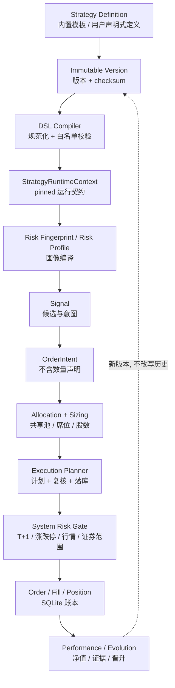

# Architecture notes

本项目是 A 股模拟交易系统（paper-only），核心路径应保持为：

```text
HTTP API / scheduler
        ↓
application services
        ↓
deterministic domain rules
        ↓
paper ledger / read models
```

## 运行时总图

下面这张图是当前仓库的实际调用边界；浏览器和定时器都只能进入 API/应用服务，不能绕过纸盘账本直接写交易数据。

```text
浏览器 Web 看板
      │ HTTP / JSON
      ▼
backend/main.py  FastAPI 应用与生命周期
      ├── /api/paper/*
      │      ▼
      │  backend/api_paper.py  纸盘 HTTP 契约
      │      ▼
      │  backend/paper_trading.py  交易编排、slot、账本写入
      │      ├── strategies / decision_engine / decision_rules
      │      ├── paper_quote_policy / paper_trading_rules
      │      ├── paper_allocation / paper_sizing
      │      ├── risk_center / entry_timing
      │      └── paper_storage / paper_repository / schema_migrations
      │
      ├── /api/adaptive/*
      │      ▼
      │  backend/api_adaptive.py  研究与人工确认 HTTP 契约
      │      ▼
      │  adaptive_engine / adaptive_* / news_learning
      │      └── 只读纸盘或写入独立影子证据；不能提交订单
      │
      └── /api/select、/api/stock_detail、/api/backtest 等
             ▼
         data_fetcher → marketdata_transport/providers/normalizers/cache
             ▼
         universe / factors / strategies / backtest / optimizer

外部调度器（服务器 cron 或容器内可选兜底线程）
      ▼
paper_runner.py --slot <slot>
      ▼
paper_trading.run_slot()
      ▼
SQLite 纸盘账本（订单、成交、持仓、NAV、审计、租约）
      ├── dashboard / risk_dashboard / audit read models
      └── 前端策略模拟、委托记录、风控审计页面
```

### 一次盘中扫描的顺序

```text
调度触发
  → 获取并校验当轮行情（覆盖率、时间戳、双源一致性）
  → 读取当前周期全部 active 账户（由策略注册表界定）
  → 逐策略生成候选车道并做风控退出检查
  → 先执行风险退出，再做入场与盘中事件
  → 共享资金池、席位、行业/单票权重、T+1、整手、涨跌停门禁
  → SQLite 事务写入订单/成交/NAV/审计
  → 前端按缓存代次读取最新只读投影
```

`strategy_registry` 是**下一周期资格**的单一事实来源（`active` ∧ `supports_new_cycle`），注册表里同时存在内置模板（`origin=builtin`，当前五套：`tq_breakout`、`trend_pullback`、`sector_rotation`、`reported_profit_breakout`、`main_force_top10`）与用户自建声明式策略（`origin=user`）。**执行层不再看 Registry**：某一轮实际参与的策略由**周期快照**决定（`paper_cycles.enabled_strategies` ∩ 当期账户，再减去生命周期 `paused`），因此"注册表里仍是 active"不会把策略偷偷拉回一个已经把它摘掉的周期（PR-38）。策略模型与生命周期语义见 [`docs/STRATEGY_PLATFORM.md`](docs/STRATEGY_PLATFORM.md)。

## 领域边界（domain boundaries）

| 领域 | 代码范围 | 拥有什么 | 不拥有什么 |
| --- | --- | --- | --- |
| Strategy Domain | `strategy_registry`、`strategy_service`、`strategy_dsl_*`、`strategy_runtime`、`strategy_risk_*`、`strategy_policies`、`strategy_clusters`、`strategy_champion` | 策略身份、不可变版本、DSL 编译、运行时就绪、生命周期、风险/执行画像 | 订单、成交、资金池、周期账本 |
| Paper / Cycle Domain | `paper_trading`、`paper_storage`、`paper_repository`、`paper_schema_migrations`、`db_migrate` | 周期生命周期、账本、撮合、NAV、审计、租约与幂等 | 策略规则本身、行情抓取 |
| Allocation | `paper_allocation`、`paper_sizing`、`strategy_clusters`、`portfolio_coordinator` | 共享池席位/预算分配、股数计算、同构归簇与组合协调 | 不放宽系统门禁、不决定方向 |
| Execution | `execution_planner`、`execution_dispatch`、`entry_lifecycle`、`entry_timing`、`order_intent`、`manual_orders` | 能不能下、怎么下（计划/复核/落库）、订单意图契约、分批与 TTL | 不决定买什么（候选来自策略/决策层） |
| Risk | `risk_center`、`paper_trading_rules`、`paper_quote_policy`、`asymmetric_risk`、`strategy_risk_enforcement`、`adaptive_shadow_risk` | 系统硬边界、行情/证券门禁、分层风控状态机、非对称风险门 | 不写订单、不抓行情 |
| Market Data | `data_fetcher`、`marketdata_*`、`universe`、`factors` | 多源抓取、重试/熔断、标准化、缓存、覆盖率与新鲜度 | 不伪造实时价、不写账本 |
| Evolution | `evolution_loop`、`evolution_apply`、`evolution_validation`、`self_evolution`、`strategy_champion`、`adaptive_*` | 证据→提案→验证→晋升、影子账本、参数落地通道 | 不直接改正式账本、不绕过风险门 |
| Web / API | `main.py`、`api_paper`、`api_adaptive`、`api_settings`、`api_strategies`、`*_runner.py` | HTTP 契约、调度入口、静态产物下发 | 不打开数据库、不复刻业务规则 |
| Frontend | `frontend/src/**`、`frontend/styles/**`、`frontend/dist/**` | 只读投影的展示与交互、策略工坊、设置中心 | 不在浏览器决定成交、不实现第二套业务规则 |

依赖方向：`Web/API → Application Service → Domain ← Infrastructure Adapter`。Domain 不直接依赖 FastAPI、SQLite 或具体行情/LLM SDK；`adaptive_*` 属于影子路径，只能读行情与账本，不能进入订单执行入口。

## 策略平台数据流



## 风险层次（risk hierarchy）

```text
System Risk（平台全局，策略不可触碰）
    T+1 · 证券范围 · 涨跌停/停牌 · 行情新鲜度 · 全池敞口 · 系统回撤
        ↓
Portfolio / Strategy Risk（策略画像，只能收紧）
    max_exposure · max_positions · max_weight · industry cap · risk_per_trade
        ↓
Position Risk（单笔，执行前复核）
    hard stop · trailing stop · staged take-profit · holding limit · pyramiding cap
```

- **System Risk 不能被策略削弱**：策略画像里不含系统键，合并与门禁都在平台侧；`strategy_risk_enforcement` 只做 `min(生产现值, 模板值)` 方向的收紧。
- 影子/研究层（`adaptive_*`、`evolution_*`）只能产生证据与候选，不能修改上述任何一层。

## 周期所有权与执行资格（PR-48）

运行时的两条口径必须分开理解：

| | Cycle Ledger Ownership | Execution Participation |
| --- | --- | --- |
| 含义 | 策略在当前周期账本中的资金/净值归属 | 还能否产生新信号与新委托 |
| 依据 | 周期创建时冻结的快照与分配 | 周期快照 ∩ 生命周期未 pause |
| `pause` 后 | **保留**（仍计入共享池合计与 NAV） | **剔除**（不再新开仓） |
| `resume` 后 | 不变（不会凭空放大资本） | 恢复 |

因此"暂停一个策略"不是把它从周期里删掉，而是关闭它的执行资格；经济所有权仍留在周期账本里，直到周期结束归档。回归见 `backend/test_cycle_ledger_ownership.py` 与 `backend/test_cycle_participant_resolver.py`。

## 模块职责速查

| 区域 | 文件/模块 | 负责什么 | 不负责什么 |
| --- | --- | --- | --- |
| 应用入口 | `backend/main.py` | 组装 FastAPI、挂载前端、健康检查、数据更新、选股/回测/个股查询、启动时初始化账本 | 不直接绕过交易服务写订单 |
| 纸盘 API | `backend/api_paper.py` | 纸盘概览、风险概览/审计、委托预览/提交/撤单、周期启停、手动运行 slot | 不实现策略规则和 SQL 账本细节 |
| 影子研究 API | `backend/api_adaptive.py` | 自适应、新闻、AI 顾问、再平衡和人工确认接口 | 不直接下单、不自动放宽风控 |
| 交易编排 | `backend/paper_trading.py` | 周期/账户、候选、开仓、盘中、收盘、风控、NAV、审计和 slot 幂等编排 | 不把研究建议当成成交授权 |
| 纸盘只读查询 | `backend/dashboard_queries.py` | dashboard 工作区只读投影（含 activity 门控与防呆分支）；`paper_trading.dashboard` 仅保留转发 facade | 不写订单、不改变交易结论 |
| 手动下单链 | `backend/manual_orders.py` | 手动交易垂直链：风险状态 → 订单计划 → 预览 → 执行/提交（两段确认）→ 撤单 → 待处理单清扫；`paper_trading` 内同名 facade 转发 | 不做周期生命周期管理，不直接暴露 HTTP |
| 调度边界 | `backend/paper_runner.py` | 把一个 slot 运行成一次性进程，并用退出码告诉 cron 是否应重试 | 不常驻、不拥有第二套账本 |
| 策略与决策 | `strategies.py`, `strategy_registry.py`, `strategy_service.py`, `strategy_api_models.py`, `strategy_dsl_schema.py`, `strategy_dsl_evaluator.py`, `strategy_runtime.py`, `strategy_risk_fingerprint.py`, `strategy_risk_profiles.py`, `strategy_risk_enforcement.py`, `strategy_parameter_schema.py`, `strategy_policies.py`, `strategy_clusters.py`, `strategy_champion.py`, `user_strategy_participation.py`, `decision_engine.py`, `decision_context.py`, `decision_rules.py` | 策略身份与不可变版本、DSL 编译、运行时就绪与 RuntimeContext、风险/执行画像、生命周期与治理、候选车道与纯规则评分 | 不读取真实券商账户，不写订单/成交 |
| 订单意图与执行计划 | `order_intent.py`, `execution_planner.py`, `execution_dispatch.py`, `entry_lifecycle.py` | 策略→执行器的意图契约（拒绝数量越权）、计划/复核/落库统一口径、分批与 TTL | 不决定买什么，不计算资金池分配 |
| 行情基础设施 | `data_fetcher.py`, `marketdata_transport.py`, `marketdata_providers.py`, `marketdata_normalizers.py`, `marketdata_cache.py` | 多源请求、重试/熔断、解析标准化、缓存、覆盖率和新鲜度元数据 | 不在缓存陈旧时伪造实时价 |
| 交易门禁 | `paper_trading_rules.py`, `paper_quote_policy.py`, `entry_timing.py` | 交易日、费用、证券权限、T+1、整手、涨跌停、行情新鲜度和入场时机 | 不负责持久化订单 |
| 资金与仓位 | `paper_allocation.py`, `paper_sizing.py`, `paper_portfolio.py`, `paper_performance.py` | 共享池预算、席位、下单股数、持仓 lot 聚合、今日盈亏纯计算 | 不调用外部行情源 |
| 账本与迁移 | `paper_storage.py`, `paper_repository.py`, `paper_schema_migrations.py`, `paper_ledger_reader.py`, `paper_archive_projection.py` | SQLite 连接/WAL/重试、通用行读写、幂等迁移、只读读取端口、历史快照投影 | 不改变交易策略结论 |
| 风控与审计 | `risk_center.py`, `adaptive_risk.py`, `adaptive_shadow_risk.py` | 风险状态机、下行保护、风险仪表盘、影子风控和结构化审计原因 | 影子层不能越权提交订单 |
| 自适应/新闻 | `adaptive_engine.py`, `adaptive_runner.py`, `adaptive_learning_*`, `news_learning.py`, `news_runner.py` | 研究样本、奖励、新闻证据和参数候选；通过 outbox/人工确认与正式路径隔离 | 不直接修改正式成交规则 |
| 研究工具 | `backtest.py`, `optimizer.py`, `selection_tracking.py`, `selection_runner.py` | 回测、参数比较、选股跟踪和盘后候选固化 | 不替代正式纸盘撮合 |
| 前端 | `frontend/src/**`（ESM 模块）, `frontend/styles/**`（CSS 片段）, `frontend/build.mjs` | 单页看板、策略模拟、委托、风控审计、数据有效性和研究页面；esbuild 打包到已提交的 `frontend/dist/`（运行时只伺服产物 `/app.js`、`/app.css`） | 不在浏览器本地决定最终成交 |
| 部署 | `Dockerfile`, `docker-compose.yml`, `docker-compose.server.yml`, `deploy/*` | 镜像、数据卷、健康检查、锁、cron/systemd/nginx 部署边界 | 不把运行时数据库、密钥或历史账本提交进仓库 |

## 调度与并发边界

- 服务器 Docker profile 使用宿主机 cron 调 `deploy/run_paper_slot.sh`，脚本先用锁串行化 paper runner，再在 worker 容器中执行单个 slot。
- 单机 clone 可将 `ASTOCK_ENABLE_FALLBACK_THREADS=1` 交给应用内置线程；生产环境应在 cron 与内置线程之间二选一，避免重复扫描。
- `run_slot()` 使用数据库 runtime lease、heartbeat 和 fencing token；`paper_runner.py` 对 `failed`/`blocked`/`partial` 返回非零退出码，使调度器可以重试。
- API 读取模型带短 TTL、账本 generation 和 single-flight；缓存只优化读取，不改变账本事实。

行情提供方、SQLite 和 LLM 属于基础设施，不应被纯决策规则隐式调用。`adaptive_*` 模块是影子学习与审阅路径，只能读取行情和模拟账本，不能依赖订单执行入口。

## 当前边界

- `backend/main.py` 负责 FastAPI 组装、只读查询和生命周期。
- `backend/api_paper.py`、`backend/api_adaptive.py` 负责 HTTP 契约；`confirmed=true` 是防误触确认，不是身份认证。
- `backend/paper_trading.py` 仍是主要交易编排与账本实现，后续按小步拆出 Execution、Portfolio、Risk 和 Scheduler；dashboard 工作区只读投影已迁至 `backend/dashboard_queries.py`，手动下单垂直链已迁至 `backend/manual_orders.py`（两者在 `paper_trading` 内保留兼容 facade，公开导入路径不变）。
- `backend/decision_context.py` 集中定义决策证据快照与兼容加载适配器；`decision_engine.py` 的公开入口暂时保持不变。
- `backend/decision_rules.py` 承载不依赖数据源的评分、买入时机、止盈和止损规则；规则模块不联网、不读缓存、不写账本。
- `backend/marketdata_transport.py` 负责共享 HTTP 连接、重试和源熔断状态；`data_fetcher.py` 继续兼容性导出旧名称，解析与缓存逻辑暂不改变。
- `backend/marketdata_cache.py` 负责可注入的 TTL 内存缓存、全市场快照 single-flight 文件锁和数据源健康文件读写；`data_fetcher.py` 保留旧 `_cached`/锁/健康状态入口。
- `backend/marketdata_providers.py` 负责东财 `clist`、概念成员分页/板块引用解析以及腾讯/新浪实时行情与 K 线响应解析；HTTP 会话、重试和可变主机健康状态由 `data_fetcher.py` 注入，确保完整性元数据和旧入口兼容。
- `backend/marketdata_normalizers.py` 承载行情行、证券代码、时间戳和 K 线 DataFrame 的无副作用标准化；`data_fetcher.py` 保留旧函数包装以兼容现有 provider 调用。
- `backend/paper_trading_rules.py` 承载交易日、费用、证券类型与证券权限等无账本副作用规则；`paper_trading.py` 继续兼容导出旧的下划线函数名。
- `backend/paper_quote_policy.py` 承载行情新鲜度、活跃度和成交核验门禁；`paper_trading.py` 保留 `_quote_is_fresh`、`_is_trading_active`、`_execution_quote_status` 兼容包装。
- `backend/paper_allocation.py` 承载共享池席位分配和策略预算的纯计算；`paper_trading.py` 只负责读取风险/持仓/预约数据并注入常量。
- `backend/paper_sizing.py` 承载按风险、权重、资金、行业和共享池约束计算下单股数；`paper_trading.py` 保留 `_price_aware_qty` 兼容包装。
- `backend/paper_storage.py` 负责 SQLite 连接生命周期、只读连接、WAL 检查点和锁重试；`paper_trading.py` 只保留兼容包装，不把业务查询迁入存储层。
- `backend/paper_portfolio.py` 负责将已读取的持仓 lot 聚合为兼容读模型；数据库查询与交易结算仍由 `paper_trading.py` 编排。
- `backend/paper_archive_projection.py` 负责把不可变历史周期快照投影为只读订单行；损坏快照隔离在投影边界内，不影响当前账本。
- `backend/paper_ledger_reader.py` 是 adaptive 读取 paper ledger 的只读端口；使用 SQLite `mode=ro` 与 `query_only`，补偿恢复等明确写路径不经过该端口。
- `backend/strategy_registry.py` 集中策略 ID、展示名称和 active/legacy 状态；adaptive、adaptive risk、research、selection 和 strategy-center 展示从这里读取，暂不改变交易调度或账户范围。
- `backend/paper_repository.py` 提供通用 ledger 行读取、审计写入、dashboard 账户批量投影和活动订单轻量投影；`paper_trading.py` 保留旧 `_rows`/`_audit`/`_account_metric_inputs` 包装，后续再迁移对象级 SQL。
- `backend/paper_performance.py` 负责今日报价新鲜度、持仓今日盈亏和卖出贡献的纯计算；`paper_trading.py` 保留 `_today_*` 兼容包装。
- `backend/paper_schema_migrations.py` 集中 paper ledger 的增量字段、运行时租约字段和点火影子表迁移；`db_migrate.py` 通过版本号调用这些幂等操作，应用前使用 SQLite backup API 创建一致性副本，运行引擎不再内联 `ALTER TABLE`。
- `backend/adaptive_risk.py` 使用 outbox（跨数据库操作意图表）保证纸盘提交后，adaptive 账本可重放收敛。
- `backend/test_adaptive_dependency_boundary.py` 以 AST（源码语法树）守护 adaptive 不直接导入纸盘订单 API，也不出现订单提交/取消调用。
- `backend/adaptive_genetics.py` 承载 alpha 实验室的基因归一化、交叉、变异和适应度纯计算；`adaptive_engine.py` 保留数据集/训练编排和兼容包装。
- `backend/adaptive_shadow_risk.py` 承载 adaptive 组合影子风控的历史归一化、波动率、集中度和压力测试纯计算；不读账本、不联网、不提交订单。
- `.github/workflows/ci.yml` 覆盖后端测试、编译/前端语法与镜像一致性，并新增独立 Docker 构建和健康端点冒烟检查。
- 前端运行时的 canonical source 是 `frontend/src/`（入口 `src/app.js`：build id + `bridge.js` 全局兼容桥 + `boot.js` 顶层语句），样式是 `frontend/styles/`（`styles/index.css` 按原顺序 `@import`）；模块地图与依赖概览见 `frontend/src/README.md`。

## 不变量

1. 不连接真实券商、不产生真实订单。
2. 证据缺失、行情过期或跨源核验失败时，决策 fail-closed。
3. adaptive 自动流程只能 shadow-only；风控放宽必须人工确认。
4. 迁移和跨账本恢复必须可重复、可审计、可回滚。
5. 任何拆分必须保持公开 API、审计事件和既有交易规则兼容。
6. 学习/研究数据集就绪不授予任何执行权限：不能下单、不能放宽风控、不能自我晋升。

## 学习/研究数据契约（PR-8）

研究层不是训练管线，而是给现有 learning / shadow / research 系统建立一层统一、可复现的证据契约。实现落在 `backend/learning_dataset.py`（小型纯研究模块），并由 `adaptive_engine` 在 learning cycle 中作为一个只读、确定性的阶段调用，`neural_shadow` 的 readiness 消费其审计结论。

```text
raw evidence → PIT eligibility → canonical samples → mature labels
             → chronological split + purge → manifest + SHA-256 fingerprint
             → offline / shadow research consumers
```

契约条文（全部由 `backend/test_learning_dataset.py` 断言）：

- **Learning / research data is read-only evidence.** 数据集层只读已持久化的证据：构建期间不访问行情快照、K 线、HTTP 或任何 LLM 提供方，也不写交易状态、持仓、风控参数或订单。
- **PIT availability is distinct from report/event period.** `feature_asof`（特征描述的时点）与 `feature_available_at`（能证明该特征对研究者可见的时间）绝不混为一个概念；可用性无法证明时记 `legacy_unproven` / `unproven`，严格数据集一律排除，且不 clamp、不回填、不用报告期冒充公告时间。判断逻辑复用 `backend/financial_point_in_time.py`，不另写一套 PIT 引擎。
- **PIT instants share one canonical clock (UTC).** 所有可用性 / cutoff 比较都在**同一个 canonical UTC instant** 上进行，绝不把 UTC 时间去掉 tzinfo 后与交易所本地 naive cutoff 直接比字符串。带 offset 的 ISO8601（`+08:00` / `+00:00` / `Z`）先归一到同一 instant；不带 offset 的历史 `availability` 按**交易所本地时区 Asia/Shanghai（UTC+08:00）**解释，**绝不读运行机器的 local timezone**（否则数据集会依赖在哪台机器上重建）。date-only cutoff 明确表示"中国市场自然日结束"：`2026-09-12` → `2026-09-12T23:59:59+08:00` = UTC `2026-09-12T15:59:59+00:00`，**不是** UTC 日终。provenance 字段 `availability_clock = canonical_utc` 表明存储值已是 canonical UTC（该字段进入 fingerprint，属契约变更，仍满足"同数据 + 同 cutoff ⇒ 同 SHA-256"）。Canonical dataset reserved provenance fields are authoritative and cannot be overridden by raw evidence provenance.
- **Forward labels are unavailable until their observed end date.** 未成熟的标签不生成 0 收益、中性标签或部分前向收益来代替。一个前向标签只有在同时满足下列全部条件时才可进入数据集（`backend/learning_dataset.py::_classify` 是唯一裁决点）：
  1. `label_end_date` 已发生在数据集 cutoff 之前（`label_end_date <= cutoff`）；
  2. 其可用时间戳不晚于 cutoff（`label_available_at <= cutoff`）；
  3. 其可用性被独立证明：`pit_status = verified`（时间戳存在 ≠ provenance 已证明；`legacy_unproven` / `unproven` / `unknown` / `future` / 缺失 / 非法值一律排除）；
  4. 同一逻辑样本身份（`source` + `feature_asof` + `code` + `horizon`）存在多个不同 label endpoint 时全部 fail closed，不按 first / last / MIN / MAX / rowid 任选其一。
  由 `adaptive_engine._mature_alpha_returns` 生成的标签只从**已验证**（`feature_available_at` 非空且 `pit_status='verified'`）的终点样本继承 provenance；未证明的终点只能产出 `legacy_unproven` 标签，绝不升级为 `verified`。cutoff 之后才成熟或才可用的标签一律判为 `future_label` 排除，不 clamp、不回填。
- **Legacy horizon values represent observed profile/close steps unless an exchange-session calendar has independently proven otherwise.** `adaptive_alpha_returns.horizon` 显式记为 `observed_profile_steps`；`paper_research` / `selection_tracking` 的 `holding_days` 在 read model 中显式记为 `recorded_close_observation_count`。历史数值不重写、不删除。
- **Dataset manifests are content-addressed and reproducible.** 同源数据 + 同 cutoff + 同契约 + 同切分 ⇒ 同一个 SHA-256；`created_at` 不属于内容指纹，重复构建走 `INSERT OR IGNORE`，永不改写前一次的记录。有界读取用 `LIMIT max_evidence_rows + 1` 判定截断（恰好等于上限不算截断），截断结论作为显式字段传给 `contract_status()`；截断时追加 `dataset_evidence_read_truncated` blocker。
- **Chronological splits purge overlapping forward labels.** 按 `label_start_date` 时间切分，且 train 中任何 `label_end_date` 触及 validation 起点的样本一律 purge，validation → test 同理。
- **A dataset becoming research-ready grants zero execution authority.** 行数达标不再是科研就绪的充分条件：`neural_shadow.readiness` 还必须通过数据集契约门禁，未通过时 `admitted = false`，但 `mode` 始终 `shadow_only`、`trading_impact` 始终 `none`。

## 目标依赖方向

```text
API → Service → Domain
                 ↑
        Infrastructure adapters
```

Domain 不直接依赖 FastAPI、SQLite、Eastmoney、Tencent、Sina 或具体 LLM SDK。这个目标会通过渐进拆分实现，不做一次性重写。

## 架构演进记录（历史批次：模块化与边界固化）

> 下面这段是**当时**的变更记录，保留原样以追溯判断依据；当前领域边界与策略平台视图见本文上半部分与 [`docs/STRATEGY_PLATFORM.md`](docs/STRATEGY_PLATFORM.md)。

本次先同步服务器工作区并修复三个可验证边界：前端缓存版本/运行时镜像一致性、活动页风控审计请求上限，以及风险 outbox 在纸盘已提交后的 adaptive 侧重放收敛。随后新增 `decision_context.py` 集中证据读取、`decision_rules.py` 承载纯规则、`marketdata_transport.py` 承载 HTTP 传输、`marketdata_cache.py` 承载缓存与快照锁、`marketdata_providers.py` 承载东财分页与概念成员适配及腾讯/新浪实时与 K 线响应解析、`marketdata_normalizers.py` 承载行情标准化、`paper_trading_rules.py` 承载交易日/费用/证券权限规则、`paper_quote_policy.py` 承载行情新鲜度/活跃度/成交核验门禁、`paper_allocation.py` 承载共享池席位与策略预算纯计算、`paper_sizing.py` 承载下单股数纯计算、`paper_storage.py` 隔离 SQLite 连接生命周期、`paper_portfolio.py` 承载持仓 lot 聚合、`paper_archive_projection.py` 承载历史归档订单只读投影、`paper_performance.py` 承载今日盈亏纯计算、`adaptive_genetics.py` 承载 adaptive alpha 纯遗传计算、`adaptive_shadow_risk.py` 承载影子组合风控纯计算、`paper_ledger_reader.py` 为 adaptive 提供只读 paper ledger 端口、`strategy_registry.py` 集中策略身份口径，并以 `paper_repository.py` 建立 ledger 通用仓储薄接口和 dashboard 账户批量投影；本阶段再以 `paper_schema_migrations.py` 集中增量 schema 变更，`db_migrate.py` 提供事务化、可回滚的 v1-v4 迁移入口。兼容导出和回归测试守住现有行为。更大范围的对象级仓储、provider 分层和模块拆分仍按 `docs/PRD-architecture-hardening.md` 分阶段推进。
