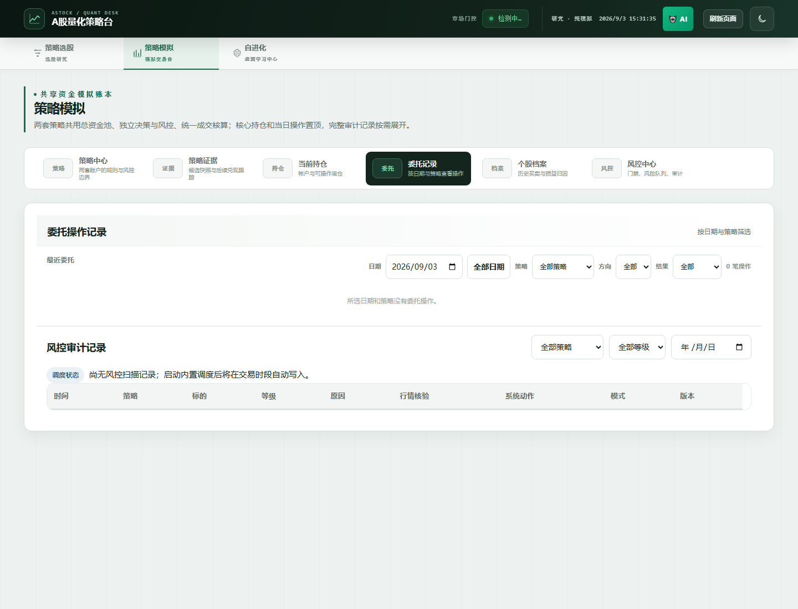

# A 股量化模拟盘引擎

[English](README_EN.md) · 中文

[](https://github.com/daviesjoin-afk/astock-paper-trading/actions/workflows/ci.yml)
[](LICENSE)
[](https://www.python.org/)

> **Local-first A-share paper-trading research infrastructure with T+1-aware execution, multi-source quote validation, layered risk controls and replayable audit trails.**

一个面向中国 A 股微观交易规则的、本地优先的**模拟盘与量化研究基础设施**。项目把 T+1、整手、涨跌停、停牌、行情时效、费用/滑点、风险决策与审计回放直接放进撮合路径，而不是在回测结束后再做近似修正。

系统**不连接券商、不触碰真实资金**。公开仓库只包含源码、容器配置和脱敏文档，不包含真实持仓、运行时数据库、服务器凭据或 API Key。

## Dashboard 预览



截图来自全新公开克隆的空账本，展示可视化看板、委托记录和风控审计入口；运行时数据库与历史记录不会随仓库发布。

## 为什么做这个项目

很多通用 backtesting / paper-trading 框架默认“信号出现后就能成交”，但 A 股的实际可交易性受市场规则和数据质量强约束。这个项目的目标不是再做一个选股脚本，而是提供一套**可以复现、拒绝错误成交、事后可审计**的 A 股研究执行层。

- **A 股规则是一等约束**：股票 T+1、100 股整手、涨跌停、停牌、佣金、印花税和滑点都进入下单校验。
- **行情默认 fail-closed**：陈旧、缺失或覆盖率不足的行情不会被静默拼接成“实时价格”；证据不足时宁可拒绝模拟成交。
- **决策链可回放**：信号 → 风控 → 订单 → 成交 → NAV → 扫描结果全部留痕，可定位历史行为偏差。
- **并发写入有明确语义**：运行时租约、heartbeat、fencing token 与 CAS 防止重复订单、僵尸写者和并发覆盖。
- **研究与正式撮合隔离**：自适应、新闻和 LLM 相关能力首先作为影子证据流，不因为研究模块异常而放宽正式交易门禁。

## 当前公开范围

仓库完整保留五套策略定义，并统一纳入策略注册表、自适应研究、历史回放和审计展示。当前新周期的五套正式模拟账户均正常启用，按共享资金池独立分配预算、候选车道、风控和调度时间。

| 策略 | 状态 | 风格 | 主要用途 |
|---|---|---|---|
| `tq_breakout` | active | 强势突破 | 放量、资金共振后的短周期突破候选 |
| `trend_pullback` | active | 趋势回调 | 中期上行趋势中的缩量回调观察与正式模拟 |
| `sector_rotation` | active | 板块轮动 | 热点板块排名、资金共振与个股相对强度轮动模拟 |
| `reported_profit_breakout` | active | 质量突破 | 财报/预告驱动的业绩突破评分与正式模拟 |
| `main_force_top10` | active | 主力资金 | 跟踪主力净流入靠前、通过实时确认的候选 |

五套 active 策略共用撮合、共享资金池、风控与审计基础设施，但拥有独立的候选车道、仓位席位和退出规则；五套定义都不会被自动删除、重命名或隐式替换。已有历史周期不会被启动迁移强行重分配，新建或重置周期按五套策略重新均衡分配本金。

**明确不做：** 实盘路由、杠杆、做空，以及普通股票的 T+0 当日买卖回转。

## 核心能力

### 1. 撮合与资金模型

- 共享资金池按策略做预算归因，包含席位上限、单票预算、公平性保护和资金硬上限。
- 最小建仓金额按 `周期本金 × 共享池敞口上限 ÷ 股票持仓上限 × 60%` 动态计算，并向下取整到 100 元；例如 10 万周期、82% 敞口、15 席上限时为 ¥3,200。剩余 40% 由风控机制根据趋势确认、回撤保护和追加仓位条件动态决定，不再固定使用 ¥10,000。
- 资金预留与正式扣款分离，配合 SQLite savepoint，避免并发扫描下重复占用资金。
- 下单前校验证券权限、行情新鲜度、涨跌停/停牌、整手、滑点和可买数量。

### 2. 分层风险状态机

- 每笔买卖先经过独立风控层，产生结构化的 `approved`、`rejected`、`deferred_capacity`、`downside_warning` 等结果。
- 下行保护采用分段减仓 → 独立扫描确认 → 全清的状态机，避免同一理由反复卖出。
- 支持硬止损、移动止损、阶梯止盈、质量轮换、容量压缩和集中度守卫。
- 风控原因使用稳定标记和审计台账，避免仅依赖人类可读文案做历史归因。

### 3. 多源行情与数据质量

- 公开行情源采用多源抓取和独立核验。
- 实时价格具有明确时间戳和来源；缓存旧价不会伪装成实时行情。
- 全市场快照设置覆盖率门禁，数据不完整时阻断依赖全市场截面的正式路径。
- 数据源故障优先降级信号丰富度或阻断对应路径，而不是降低风险门槛。

### 4. 并发与调度

引擎统一支持：

`auction / open / risk / intraday / close / weekly-review`

六类 slot。

一键启动默认启用内置的 **3 分钟盘中模拟盘调度器**；如果部署侧已经有完整宿主机计划任务，可关闭内置调度，避免重复执行。运行时租约 + heartbeat + fencing token 保证同一批次只由有效写者推进。

### 5. 审计与研究

信号、候选、风险决策、订单、成交、持仓、NAV 和逐轮扫描结果都会形成可追踪证据。`adaptive_*`、`news_learning`、`neural_shadow`、`dual_ai_tuner` 等研究模块保存独立影子观测，不直接绕过正式撮合路径。

## 项目结构

```text
backend/
  paper_trading.py      撮合 / 风控 / 审计 / 资金 / slot 调度主引擎
  paper_runner.py       auction/open/risk/intraday/close/weekly-review CLI
  data_fetcher.py       行情、快照、公告与数据质量
  entry_timing.py       入场时机状态机
  decision_engine.py    候选车道、因子判定与实时确认
  strategies.py         策略定义
  adaptive_*.py         影子观测与参数研究
  news_learning.py      新闻证据研究
  api_*.py              HTTP API
  main.py               FastAPI + Web 看板入口
  test_*.py             回归测试
frontend/               Web 看板与审计界面
.github/workflows/       GitHub Actions CI
Dockerfile              应用镜像
docker-compose.yml      本地/单机容器运行
```

## 一键启动

要求：**Python 3.11+**。Docker 可选。

### Windows

```powershell
.\start.ps1                 # 自动选择 Docker；失败后回退本地模式
.\start.ps1 -Local          # 强制本地 Python
.\start.ps1 -Docker         # 强制 Docker Compose
.\start.ps1 -Port 8601      # 自定义端口
.\start.ps1 -NoBrowser      # 不自动打开浏览器
.\start.ps1 -NoScheduler    # 已有外部调度器时关闭内置调度
```

也可以直接双击 `start.bat`。

### Linux / macOS

```bash
chmod +x start.sh
./start.sh
./start.sh --local --port 8601 --no-browser
./start.sh --no-scheduler
```

启动 Web/API 后访问 `http://localhost:8600`。启动服务本身不会自动创建新的模拟交易周期。

### 设置中心

打开看板顶部的“设置中心”即可调整四类运行参数：

- **模拟盘与资金**：默认启动金额、15/30/60/90/180 个交易日或长期的周期长度、下一周期启用的策略。
- **仓位与风控**：共享池席位/敞口、单票最大金额（0 为按策略权重自动计算）、动态最小建仓席位利用率。
- **策略参数**：五套策略各自的风格、最大席位、单票权重和策略敞口。
- **AI 与自进化**：供应商、审阅/有界调参开关、掩码 Key 状态和收盘学习间隔。

默认值与生效时机见 [`docs/SETTINGS_PRD.md`](docs/SETTINGS_PRD.md)。资金、周期和策略集合在下个新周期初始化；共享池风控在下一次扫描读取。每次保存都会经过后端白名单校验并写入设置审计，AI Key 不会在页面、日志或仓库中回显明文。

完整的 **clone → 安装依赖 → 看板 → 数据准备 → 手动扫描** 流程见 [`docs/RUNBOOK.md`](docs/RUNBOOK.md)。

## 本地开发与验证

```bash
python -m venv .venv
# 激活对应平台的虚拟环境后：
python -m pip install -r requirements.txt

python -m uvicorn backend.main:app --port 8600
python -m unittest discover -s backend -p "test_*.py" -v
```

手动运行一个 slot：

```bash
cd backend
python paper_runner.py --slot open
```

GitHub Actions 会在 **Python 3.11 / 3.12** 上执行后端回归测试。测试覆盖撮合门禁、point-in-time 数据、行情新鲜度、风险审计、并发租约、策略入场、共享资金与回放相关行为。

## Docker

```bash
docker compose up -d --build
docker compose logs -f app
```

停止但保留模拟盘数据：

```bash
docker compose down
```

重置当前容器实例的模拟盘数据：

```bash
docker compose down -v
```

Docker 使用仓库专用命名卷，不会自动连接其他实例的私有运行时数据库。

## 开源维护

项目使用 **MIT License**，欢迎可复现的 bug、边界条件、数据源适配和小范围 PR。

当前公开 roadmap：

- [#1 扩展行情数据源适配与故障降级](https://github.com/daviesjoin-afk/astock-paper-trading/issues/1)
- [#2 设计可插拔策略接口与策略回放规范](https://github.com/daviesjoin-afk/astock-paper-trading/issues/2)
- [#3 补充回测、纸面撮合与审计回放验证](https://github.com/daviesjoin-afk/astock-paper-trading/issues/3)

提交代码前请阅读 [`CONTRIBUTING.md`](CONTRIBUTING.md)。版本变化见 [`CHANGELOG.md`](CHANGELOG.md) 和 [GitHub Releases](https://github.com/daviesjoin-afk/astock-paper-trading/releases)。

## 可选 LLM 研究能力

基础模拟盘**不依赖 LLM**。如果需要启用可选顾问/影子研究能力，可复制 `.env.example` 为 `.env` 并配置文档中的环境变量。真实密钥不会进入仓库。

LLM 输出属于研究证据，不被当作确定事实或收益保证，也不会绕过正式交易风控。

## 安全与隐私边界

请勿在 Issue / PR 中提交：

- API key、token、Cookie 或 `.env`；
- 服务器地址、SSH 凭据或账户密码；
- 真实证券账户、真实持仓或未脱敏运行数据库；
- 含私人信息的日志或截图。

`.env`、`data_cache/`、`reports/` 等运行时内容均应保留在本机或部署环境。

## 风险声明

本项目仅用于**模拟交易和量化研究**。实时行情来自公开接口，不代表交易所完整盘口；撮合包含滑点和成交假设。模拟盘、回测、影子观测和历史结果均不能视为未来收益保证，也不构成投资建议。

## License

MIT，详见 [`LICENSE`](LICENSE)。
